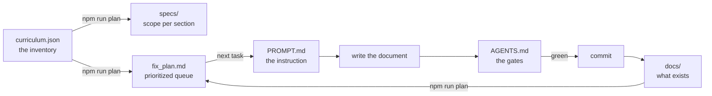

<div align="center">

# Software Architecture Mastery

**A learning path for Software Engineers who want to think like Architects.**

Not a catalog of patterns. The reasoning that decides when *not* to use them.

[](https://github.com/oadcavalcante/software-architecture-mastery/actions/workflows/ci.yml)
[](https://software-architecture-mastery.vercel.app)
<!-- BADGES:PROGRESS -->


<!-- /BADGES:PROGRESS -->


[Português (Brasil)](README.md) · **English**

</div>

---

> **Note on languages.** Portuguese is the canonical language of this material.
> English is translated progressively, section by section. Untranslated pages fall
> back to Portuguese with a notice. Per-document status is in the
> [ROADMAP](ROADMAP.md).

## The problem this material addresses

Most architecture material teaches **shapes**: layers, microservices, queues,
CQRS. That produces engineers who recognize structures but cannot choose between
them — because they never learned to articulate what they are optimizing for.

Here the question is never *"what is the right architecture?"*. It is *"right for
what, under which constraints?"*.

```text
Understand the problem  →  Identify constraints  →  Evaluate alternatives
        →  Reason about trade-offs  →  Decide  →  Communicate  →  Evolve
```

## What makes this different

**No pattern is presented without discussing when NOT to use it.** Not as a
formality — as the most useful part of each document, with concrete conditions.

Some of what that rule produced:

> **Singleton** couples two independent decisions — uniqueness and global access —
> and you almost always need only the first.

> **Visitor** picks a side of the expression problem. If it is the *types* that
> grow, it is the most expensive mistake in the catalog.

> **Event Sourcing** imposes event versioning **forever**. The question before
> adopting is not whether it solves your problem — it is whether you accept that
> permanent commitment.

> **Tactical DDD** applied outside the core domain costs more than it returns.
> Adopting two of the eight building blocks is often the correct call.

And every decision ends conditioned on constraints, not as a recommendation.

## The seven levels

```text
LEVEL 01 — Foundation               Why does architecture exist?
        ↓
LEVEL 02 — Software Design          How to structure code and domain?
        ↓
LEVEL 03 — System Design            How to go from requirements to a system?
        ↓
LEVEL 04 — Distributed Systems      Why are distributed systems hard?
        ↓
LEVEL 05 — Architecture             How do the disciplines combine?
        ↓
LEVEL 06 — Enterprise Architecture  How to architect above a single system?
        ↓
LEVEL 07 — Architecture Leadership  How to decide and influence?
```

The corresponding progression of capability:

```text
code → design → systems → distributed systems → architecture → enterprise → strategy
```

## Progress

<!-- PROGRESS:TABLE -->
| Level | Section | Status |
|---|---|:-:|
| 01 | Foundation | 🟩 22 topics |
| 02 | Software Design | 🟩 22 topics |
| 02 | Design Patterns | 🟩 30 topics |
| 02 | Domain-Driven Design | 🟩 19 topics |
| 03 | System Design | 🟩 23 topics |
| 04 | Distributed Systems | 🟩 35 topics |
| 05 | Architecture (11 sections) | 🟨 in progress |
| 06 | Enterprise Architecture | ⬜ |
| 07 | Architecture Leadership | ⬜ |
| — | Case Studies · Interviews | ⬜ |
<!-- /PROGRESS:TABLE -->

Per-document status is in **[ROADMAP.md](ROADMAP.md)**, generated from front
matter.

## Who it is for

A Software Engineer with 3+ years, comfortable with a backend language, a
relational database and HTTP APIs, who has shipped to production and now needs to
reason about systems larger than their own service.

**Not** material for people learning to program. It assumes fluency in code.

## Where to start

| If you… | Start at |
|---|---|
| Ship features and want to understand structural decisions | Level 01 |
| Structure code well but never designed a whole system | Level 02 |
| Have designed systems, but only monolithic ones | Level 03 |
| Work with distributed systems and want to close gaps | Level 04 |
| Are preparing for system design interviews | Level 03 → section 22 |
| Are an architect moving above the system | Levels 06 and 07 |

Details in **[how to use](docs/how-to-use.md)**. To locate yourself by
**capability** rather than by content read, see the
**[maturity model](docs/maturity-model.md)** — six stages defined by the decision
you make on your own.

## Running locally

```bash
npm install
npm start                     # pt-BR at http://localhost:3000
npm start -- --locale en-US   # en-US
npm run build                 # production, both locales
```

## Quality is verified, not promised

Content is validated automatically on every PR. These are not formatting linters —
they are rules about the material itself:

```bash
npm test          # 59 tests of the validators themselves
npm run validate  # the five content validators
```

| Validator | What it prevents |
|---|---|
| **frontmatter** | Schema, duplicate `id`, cycle in the prerequisite graph, two documents claiming the same concept |
| **links** | Broken link or anchor, invalid Mermaid diagram |
| **parity** | Translation ahead of the canonical, orphan translation |
| **terminology** | Alternating between "acoplamento" and "coupling" in one document; translating what must stay in English |
| **placeholders** | `status: complete` without *When Not to Use*, empty section, thin content |

The validators have their own tests because a linter with false positives blocks
legitimate contributions, and one with false negatives lets through what it should
stop. Every bug found in them entered as a regression test before being fixed.

## How this project is built

The material is large — 409 topics across 23 sections — so construction is
organized as a **loop**: each iteration writes **one** document and leaves it
verified.



### The four files

| File | What it is |
|---|---|
| **[PROMPT.md](PROMPT.md)** | The instruction for one iteration. What to do, in order, and when to stop and ask |
| **[AGENTS.md](AGENTS.md)** | How to build, test and validate. Commands, schema, required sections per type, and an error → cause table |
| **[specs/](specs/)** | One spec per section: scope, planned topics, completion criteria |
| **[fix_plan.md](fix_plan.md)** | The queue of what remains, in prerequisite order |

### What is generated and what is written

This distinction is what keeps the plan from lying:

| Written by hand | Generated |
|---|---|
| `docs/**` — the content | `specs/**` |
| `SPEC.md`, `PROMPT.md`, `AGENTS.md` | `fix_plan.md` |
| `scripts/curriculum.json` — the inventory | `ROADMAP.md` |
| | README badges and progress table |
| | `docs/i18n-terminology.md` |

Everything on the right comes from `npm run plan` and `npm run roadmap`, derived
from the curriculum crossed with the real state of `docs/`. **CI fails if any of
them is stale** — so no number in this repository can quietly go out of date.

### One iteration, in practice

```bash
npm run plan          # what is the next task?
                      # → 05-system-design/request-response.md

# read specs/05-system-design.md and two neighboring documents
# write docs/05-system-design/request-response.md

npm test              # the validators are correct
npm run validate      # content passes — no errors AND no warnings
npm run plan          # the task leaves the queue
npm run roadmap       # progress updated
npm run build         # the site builds in both locales

git add -A && git commit && git push
```

The five middle commands are the **gates**. No commit passes without them, and CI
runs the same ones.

## Contributing

See **[CONTRIBUTING.md](CONTRIBUTING.md)** (Portuguese) for the writing standard,
front matter schema, terminology policy and translation workflow.

The rule that governs everything: **the material teaches architectural reasoning,
not memorization.** A contribution that presents a solution without its problem, or
a pattern without discussing when not to use it, is rejected.

## Project documents

| | |
|---|---|
| **[SPEC.md](SPEC.md)** | The full specification: quality standard, translation policy, completion criteria (Portuguese) |
| **[AGENTS.md](AGENTS.md)** | How to build, test and validate — the quality gates |
| **[PROMPT.md](PROMPT.md)** | The instruction for one work iteration |
| **[fix_plan.md](fix_plan.md)** | Prioritized queue of what remains, generated from the curriculum |
| **[ROADMAP.md](ROADMAP.md)** | Per-document status, generated from front matter |
| **[CONTRIBUTING.md](CONTRIBUTING.md)** | How to write, review and translate |
| **[Glossary](docs/glossary.md)** | Terminology with operational definitions |

## License

Content under **[CC BY-SA 4.0](LICENSE)** · Code under **[MIT](LICENSE-CODE)**
