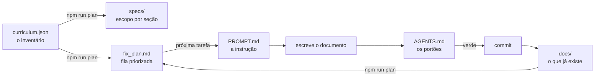

<div align="center">

# Software Architecture Mastery

**Um percurso para Engenheiros de Software que querem pensar como Arquitetos.**

Não é um catálogo de padrões. É o raciocínio que decide quando *não* usá-los.

[](https://github.com/oadcavalcante/software-architecture-mastery/actions/workflows/ci.yml)
[](https://software-architecture-mastery.vercel.app)
<!-- BADGES:PROGRESS -->


<!-- /BADGES:PROGRESS -->


**Português (Brasil)** · [English](README.en-US.md)

</div>

---

## O problema que este material resolve

A maior parte do material sobre arquitetura ensina **formas**: camadas,
microsserviços, filas, CQRS. Isso produz profissionais que reconhecem estruturas e
não sabem escolher entre elas — porque nunca aprenderam a articular o que estão
tentando otimizar.

Aqui a pergunta nunca é *"qual é a arquitetura certa?"*. É *"certa para quê, sob
quais restrições?"*.

```text
Entender o problema  →  Identificar restrições  →  Avaliar alternativas
        →  Raciocinar sobre trade-offs  →  Decidir  →  Comunicar  →  Evoluir
```

## O que torna este material diferente

**Nenhum padrão é apresentado sem a discussão de quando NÃO usá-lo.** Não como
formalidade — como a parte mais útil de cada documento, com condições concretas.

Alguns exemplos do que essa regra produziu:

> **Singleton** acopla duas decisões independentes — unicidade e acesso global — e
> quase sempre você só precisa da primeira.

> **Visitor** escolhe um lado do dilema da expressão. Se os *tipos* é que crescem,
> ele é o erro mais caro do catálogo.

> **Event Sourcing** impõe versionamento de evento **para sempre**. A pergunta antes
> de adotar não é se resolve seu problema — é se você aceita esse compromisso
> permanente.

> **DDD tático** aplicado fora do core domain custa mais do que rende. Adotar dois
> dos oito blocos é frequentemente a decisão correta.

E toda decisão termina condicionada a restrições, não em recomendação.

## Os sete níveis

```text
NÍVEL 01 — Fundamentos              Por que arquitetura existe?
        ↓
NÍVEL 02 — Design de Software       Como estruturar código e domínio?
        ↓
NÍVEL 03 — Design de Sistemas       Como ir de requisitos a um sistema?
        ↓
NÍVEL 04 — Sistemas Distribuídos    Por que sistemas distribuídos são difíceis?
        ↓
NÍVEL 05 — Arquitetura              Como as disciplinas se combinam?
        ↓
NÍVEL 06 — Arquitetura Corporativa  Como arquitetar acima de um sistema?
        ↓
NÍVEL 07 — Liderança em Arquitetura Como decidir e influenciar?
```

A progressão de competência correspondente:

```text
código → design → sistemas → sistemas distribuídos → arquitetura → corporativo → estratégia
```

## Progresso

<!-- PROGRESS:TABLE -->
| Nível | Seção | Estado |
|---|---|:-:|
| 01 | Fundamentos | 🟩 23 tópicos |
| 02 | Design de Software | 🟩 23 tópicos |
| 02 | Design Patterns | 🟩 30 tópicos |
| 02 | Domain-Driven Design | 🟩 19 tópicos |
| 03 | Design de Sistemas | 🟩 24 tópicos |
| 04 | Sistemas Distribuídos | 🟩 38 tópicos |
| 05 | Arquitetura (11 seções) | 🟩 167 tópicos |
| 06 | Arquitetura Corporativa | 🟩 43 tópicos |
| 07 | Liderança em Arquitetura | 🟩 24 tópicos |
| — | Case Studies · Entrevistas | 🟩 27 tópicos |
<!-- /PROGRESS:TABLE -->

O estado documento a documento está em **[ROADMAP.md](ROADMAP.md)**, gerado
automaticamente a partir do front matter.

## Para quem é

Engenheiro de Software com 3+ anos, confortável com backend, banco relacional e
APIs HTTP, que já entregou em produção e agora precisa raciocinar sobre sistemas
maiores que o próprio serviço.

**Não é** material para quem está aprendendo a programar. Assume fluência em código.

## Por onde começar

| Se você… | Comece em |
|---|---|
| Entrega features e quer entender decisões de estrutura | Nível 01 |
| Estrutura código bem, nunca projetou um sistema inteiro | Nível 02 |
| Já projetou sistemas, mas só monolíticos | Nível 03 |
| Trabalha com distribuídos e quer fechar lacunas | Nível 04 |
| Vai fazer entrevistas de system design | Nível 03 → seção 22 |
| É arquiteto e quer atuar acima do sistema | Níveis 06 e 07 |

Detalhes em **[como usar](docs/how-to-use.md)**. Para se localizar por
**capacidade** em vez de conteúdo lido, veja o
**[modelo de maturidade](docs/maturity-model.md)** — seis estágios definidos pela
decisão que você toma sozinho.

## Idiomas

**pt-BR é canônico.** en-US é traduzido progressivamente e nunca bloqueia conteúdo
novo — páginas não traduzidas recaem no português com aviso. O estado por documento
está no [ROADMAP](ROADMAP.md).

## Rodando localmente

```bash
npm install
npm start                     # pt-BR em http://localhost:3000
npm run start:en              # en-US, também em http://localhost:3000
npm run build && npm run serve  # ambas as locales, cada uma no seu caminho
```

O servidor de desenvolvimento serve **um locale por vez**, sempre na raiz. Rodando
`npm start`, o caminho `/en-US/` não existe e responde 404 — isso é do Docusaurus,
não do projeto. Para ver as duas locales lado a lado, use o build.

## Qualidade não é promessa, é verificação

O conteúdo é validado automaticamente a cada PR. Não são lint de formatação — são
regras sobre o material:

```bash
npm test          # testes dos próprios validadores
npm run validate  # os cinco validadores de conteúdo
```

| Validador | O que impede |
|---|---|
| **frontmatter** | Schema, `id` duplicado, ciclo no grafo de pré-requisitos, dois documentos reivindicando o mesmo conceito |
| **links** | Link ou âncora quebrada, diagrama Mermaid inválido |
| **parity** | Tradução à frente do canônico, tradução órfã |
| **terminology** | Alternar entre "acoplamento" e "coupling" no mesmo documento; traduzir o que deve ficar em inglês |
| **placeholders** | `status: complete` sem *Quando Não Usar*, seção vazia, conteúdo raso |

Os validadores têm testes próprios porque um linter com falso positivo trava
contribuição legítima, e um com falso negativo deixa passar o que deveria barrar.
Todo bug encontrado neles entrou como teste de regressão antes da correção.

## Como este projeto é construído

O material é grande — centenas de documentos em 23 seções — e por isso a construção é
organizada como um **loop**: cada iteração escreve **um** documento e o deixa
verificado.



### Os quatro arquivos

| Arquivo | O que é |
|---|---|
| **[PROMPT.md](PROMPT.md)** | A instrução de uma iteração. O que fazer, nessa ordem, e quando parar e perguntar |
| **[AGENTS.md](AGENTS.md)** | Como construir, testar e validar. Comandos, schema, seções obrigatórias por tipo, e a tabela de erro → causa |
| **[specs/](specs/)** | Uma spec por seção: escopo, tópicos previstos e critério de conclusão |
| **[fix_plan.md](fix_plan.md)** | A fila do que falta, na ordem dos pré-requisitos |

### O que é gerado e o que é escrito

Esta distinção é o que impede o plano de mentir:

| Escrito à mão | Gerado |
|---|---|
| `docs/**` — o conteúdo | `specs/**` |
| `SPEC.md`, `PROMPT.md`, `AGENTS.md` | `fix_plan.md` |
| `scripts/curriculum.json` — o inventário | `ROADMAP.md` |
| | Badges e tabela de progresso dos READMEs |
| | `docs/i18n-terminology.md` |

Tudo da coluna direita sai de `npm run plan` e `npm run roadmap`, a partir do
currículo cruzado com o estado real de `docs/`. **O CI falha se qualquer um
estiver defasado** — então nenhum número deste repositório pode envelhecer em
silêncio.

Quando um documento é escrito, a tarefa sai da fila sozinha. Quando o escopo
muda, ele muda em `curriculum.json` e se propaga.

### Uma iteração, na prática

```bash
npm run plan          # qual é a próxima tarefa?
                      # → 05-system-design/request-response.md

# leia specs/05-system-design.md e dois documentos vizinhos
# escreva docs/05-system-design/request-response.md

npm test              # os validadores estão corretos
npm run validate      # o conteúdo passa — sem erro E sem aviso
npm run plan          # a tarefa sai da fila
npm run roadmap       # progresso atualizado
npm run build         # o site constrói nas duas locales

git add -A && git commit && git push
```

Os cinco comandos do meio são os **portões**. Nenhum commit passa sem eles, e o
CI roda os mesmos.

## Contribuir

Veja **[CONTRIBUTING.md](CONTRIBUTING.md)** para padrão de escrita, schema de front
matter, política terminológica e fluxo de tradução.

A regra que governa tudo: **o material ensina raciocínio arquitetural, não
memorização.** Contribuição que apresenta solução sem o problema, ou padrão sem
discutir quando não usá-lo, é rejeitada.

## Documentos do projeto

| | |
|---|---|
| **[SPEC.md](SPEC.md)** | A especificação completa: padrão de qualidade, política de tradução, critérios de conclusão |
| **[AGENTS.md](AGENTS.md)** | Como construir, testar e validar — os portões de qualidade |
| **[PROMPT.md](PROMPT.md)** | A instrução de uma iteração de trabalho |
| **[fix_plan.md](fix_plan.md)** | Fila priorizada do que falta, gerada do currículo |
| **[ROADMAP.md](ROADMAP.md)** | Estado por documento, gerado do front matter |
| **[CONTRIBUTING.md](CONTRIBUTING.md)** | Como escrever, revisar e traduzir |
| **[Glossário](docs/glossary.md)** | Terminologia com definições operacionais |

## Licença

Conteúdo sob **[CC BY-SA 4.0](LICENSE)** · Código sob **[MIT](LICENSE-CODE)**
