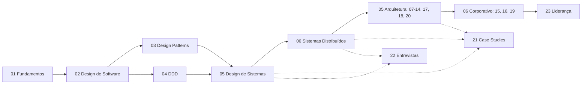

# Software Architecture Mastery — Especificação do Projeto

> Documento normativo. Define o que o repositório é, como o conteúdo é estruturado,
> qual o padrão de qualidade exigido e como o projeto é construído e validado.
> Em caso de conflito entre esta spec e qualquer outro documento do repositório,
> esta spec prevalece — ou é corrigida explicitamente.

| Campo | Valor |
|---|---|
| Versão da spec | 1.0 |
| Data | 2026-08-26 |
| Status | Aprovada para execução |
| Idioma canônico | pt-BR |
| Idioma secundário | en-US (progressivo) |

---

## 1. Objetivo

Construir um percurso de aprendizado completo, estruturado e de qualidade de produção,
que leve um **Engenheiro de Software experiente** a pensar como um **Arquiteto de Software**,
preparado para atuar em empresas, domínios, stacks e níveis de senioridade diferentes.

O objetivo **não** é ensinar padrões, frameworks ou serviços de nuvem. É desenvolver
raciocínio arquitetural:

```text
Entender o problema
        ↓
Identificar restrições
        ↓
Avaliar alternativas
        ↓
Raciocinar sobre trade-offs
        ↓
Tomar decisões arquiteturais
        ↓
Comunicar e defender essas decisões
        ↓
Evoluir a arquitetura ao longo do tempo
```

### 1.1 Teste de aceitação final

O material está cumprindo seu objetivo quando um leitor que concluiu o percurso, ao receber
*"Projete a arquitetura de uma plataforma de pagamentos de alto volume"*, não começa
desenhando caixas — começa perguntando qual é o problema de negócio, quais atributos de
qualidade importam e quais restrições existem.

### 1.2 Não-objetivos

Declarados explicitamente para evitar deriva de escopo:

- **Não** é um tutorial de tecnologia. Nenhuma seção existe para ensinar uma ferramenta específica.
- **Não** é um curso de programação. Código aparece apenas para ilustrar uma ideia de design.
- **Não** é uma coletânea de respostas prontas para entrevistas.
- **Não** é uma enciclopédia. Cobertura serve à progressão do aprendizado, não à completude.
- **Não** persegue volume. Um repositório menor e correto vence um maior e diluído.

---

## 2. Princípios do conteúdo

Todo o material obedece a estes princípios. Eles são critério de revisão, não decoração.

1. Arquitetura é sobre decisões e trade-offs.
2. Não existe arquitetura universalmente "melhor".
3. Requisitos e restrições dirigem as decisões arquiteturais.
4. Requisitos de negócio pesam tanto quanto os técnicos.
5. Toda escolha arquitetural tem consequências.
6. Complexidade precisa ser justificada.
7. Prefira simplicidade quando ela satisfaz os requisitos.
8. Introduza complexidade de sistemas distribuídos apenas quando necessário.
9. Tecnologia serve à arquitetura; não a define.
10. Arquitetura evolui continuamente.
11. Documentação de arquitetura explica **por quê**, não apenas **o quê**.
12. O leitor precisa estudar decisões bem-sucedidas **e** fracassadas.
13. Todo conceito relevante conecta teoria a um sistema realista.
14. Evite raciocínio preso a framework quando existe explicação agnóstica.
15. Ao falar de tecnologia, explique antes o princípio arquitetural subjacente.

---

## 3. Público-alvo

**Leitor primário.** Engenheiro de Software com 3+ anos de experiência, confortável com uma
linguagem de backend, banco de dados relacional e APIs HTTP, que já entregou software em
produção e agora precisa raciocinar sobre sistemas maiores que o próprio serviço.

**Leitores secundários.** Tech Leads assumindo responsabilidade arquitetural; arquitetos em
transição de solução para corporativo; engenheiros preparando entrevistas de system design.

**Fora do público.** Iniciantes em programação. O material assume fluência em código e
não ensina fundamentos de linguagem.

**Pré-requisitos assumidos e nunca reensinados:** sintaxe de linguagem, controle de versão,
HTTP, SQL básico, conceitos de rede de nível TCP/IP, containers em nível de uso.

---

## 4. Arquitetura da informação

### 4.1 Os sete níveis

```text
NÍVEL 01 — Fundamentos
        ↓
NÍVEL 02 — Design de Software
        ↓
NÍVEL 03 — Design de Sistemas
        ↓
NÍVEL 04 — Sistemas Distribuídos
        ↓
NÍVEL 05 — Arquitetura
        ↓
NÍVEL 06 — Arquitetura Corporativa
        ↓
NÍVEL 07 — Liderança em Arquitetura
```

Progressão de competência correspondente:

```text
código → design → sistemas → sistemas distribuídos → arquitetura → corporativo → estratégia
```

**Regra de precedência.** Nenhum tópico avançado aparece antes de seus pré-requisitos
conceituais, salvo se marcado explicitamente como *preview* com link para o tópico completo.

### 4.2 Mapeamento nível → seção

| Nível | Seções | Pergunta central do nível |
|---|---|---|
| 01 — Fundamentos | `01-fundamentals` | Por que arquitetura existe? |
| 02 — Design de Software | `02-software-design`, `03-design-patterns`, `04-domain-driven-design` | Como estruturar código e domínio para que a arquitetura seja possível? |
| 03 — Design de Sistemas | `05-system-design` | Como ir de requisitos a um sistema em execução? |
| 04 — Sistemas Distribuídos | `06-distributed-systems` | Por que sistemas distribuídos são difíceis? |
| 05 — Arquitetura | `07-data-architecture`, `08-integration-architecture`, `09-cloud-architecture`, `10-security`, `11-scalability`, `12-reliability`, `13-observability`, `14-devops-and-platform`, `17-architecture-documentation`, `18-architecture-decisions`, `20-trade-offs` | Como as disciplinas de arquitetura se combinam sob restrições reais? |
| 06 — Arquitetura Corporativa | `15-enterprise-architecture`, `16-legacy-modernization`, `19-architecture-governance` | Como arquitetar acima do limite de um sistema? |
| 07 — Liderança em Arquitetura | `23-architecture-leadership` | Como decidir, influenciar e sustentar arquitetura numa organização? |
| Transversal | `21-case-studies`, `22-system-design-interviews` | Aplicação e avaliação do raciocínio adquirido |

### 4.3 Lacunas do briefing resolvidas nesta spec

O briefing original continha ambiguidades. Resolvidas assim, e registradas para rastreabilidade:

| # | Ambiguidade | Resolução |
|---|---|---|
| L1 | O Nível 07 (Liderança) é descrito, mas nenhum diretório foi atribuído a ele nas 22 seções listadas | Criada a seção **`23-architecture-leadership/`**. Dobrar liderança dentro de `19-architecture-governance` enterraria o nível final do percurso. As "22 seções" tornam-se 23. |
| L2 | `03-design-patterns` aparece rotulado como "LEVEL 02" numa seção posterior do briefing, fora de ordem | Confirmado como **Nível 02**. A ordem de leitura é `02` → `03` → `04`. |
| L3 | `04-domain-driven-design` não recebeu nível | Atribuído ao **Nível 02**. DDD é design estratégico e tático; o DDD estratégico é referenciado de novo no Nível 06. |
| L4 | `21-case-studies` e `22-system-design-interviews` não pertencem a um único nível | Declarados **transversais**. Cada case study declara em front matter o nível mínimo necessário para consumi-lo. |
| L5 | "Separation of Concerns" e "Architecture Principles" aparecem em duas seções | Canônico no Nível 01; no Nível 02 apenas referenciado. Ver §7.4 (regra antiduplicação). |

### 4.4 Grafo de pré-requisitos

Cada documento declara `prerequisites` em front matter, apontando para `id`s existentes.
O grafo resultante precisa ser um DAG. CI falha em ciclo ou em referência a `id` inexistente.



---

## 5. Internacionalização

### 5.1 Modelo

Duas locales: **`pt-BR`** (padrão e canônica) e **`en-US`** (secundária, progressiva).

O Docusaurus trata a locale padrão de forma assimétrica: o conteúdo canônico vive em `docs/`,
e as traduções vivem sob `i18n/<locale>/`. Essa assimetria é aceita deliberadamente em vez de
combatida — ver **ADR-R002** (§11).

```text
docs/01-fundamentals/coupling.md
        ↑ canônico, pt-BR

i18n/en-US/docusaurus-plugin-content-docs/current/01-fundamentals/coupling.md
        ↑ tradução, caminho espelhado exatamente
```

Roteamento publicado:

| Locale | URL base | Origem do conteúdo |
|---|---|---|
| `pt-BR` | `/` | `docs/` |
| `en-US` | `/en-US/` | `i18n/en-US/docusaurus-plugin-content-docs/current/` |

Um seletor de idioma no header permite alternar. Página sem tradução recai no conteúdo pt-BR,
exibindo um aviso de "ainda não traduzido".

### 5.2 Nomenclatura de arquivos e slugs

**Slugs sempre em inglês, nos dois idiomas.** `docs/01-fundamentals/coupling.md` contém texto
em português; sua tradução ocupa o caminho idêntico sob `i18n/en-US/`. Justificativa:

- O Docusaurus exige espelhamento exato de caminho para casar tradução com original.
- Alternar idioma vira substituição de prefixo de URL — sem mapa de tradução de rotas.
- Verificação de paridade vira um `diff` de listas de caminhos.
- A terminologia técnica de arquitetura já é anglófona; o slug não perde nada.

O **título** exibido é traduzido normalmente (`title: Acoplamento` / `title: Coupling`).

### 5.3 Política de tradução

pt-BR é a fonte da verdade e **sempre avança primeiro**. en-US é traduzido depois, por seção,
e nunca bloqueia a produção de conteúdo novo.

Ordem de prioridade da tradução, quando a fase de tradução começar:
`README` e páginas de entrada → `GLOSSARY` → Nível 01 → Nível 02 → `20-trade-offs` →
`22-system-design-interviews` → demais níveis → case studies.

Racional: quem chega em inglês precisa primeiro entender o que o projeto é, depois o vocabulário,
depois os fundamentos. Case studies são os textos mais longos e o menor retorno por palavra traduzida.

### 5.4 Rastreamento de paridade

Cada arquivo canônico carrega `content_version` (inteiro). Cada tradução carrega
`translated_from_version`. O estado da tradução é derivado, não declarado à mão:

| Condição | Estado | Marcador |
|---|---|---|
| Arquivo en-US ausente | Não traduzido | ⬜ |
| `translated_from_version` < `content_version` | Defasado | 🟨 |
| `translated_from_version` == `content_version` | Em dia | 🟩 |
| `translated_from_version` > `content_version` | Erro de integridade | ❌ CI falha |

`content_version` é incrementado a cada edição **substantiva** do canônico — não por correção de
typo ou ajuste de formatação. CI emite aviso (não erro) quando um arquivo canônico muda num PR
sem incremento de versão, para forçar a decisão consciente.

O relatório de paridade é gerado por script e incorporado ao `ROADMAP.md`. Nunca é mantido à mão.

### 5.5 Política terminológica

Tradução técnica inconsistente destrói material de arquitetura. A regra é fixada por termo,
numa tabela versionada em `docs/i18n-terminology.md`, e aplicada por linter.

Três categorias:

**A — Traduzir sempre.** O termo tem equivalente estabelecido em português técnico.
`coupling` → acoplamento · `cohesion` → coesão · `availability` → disponibilidade ·
`reliability` → confiabilidade · `scalability` → escalabilidade · `layer` → camada ·
`eventual consistency` → consistência eventual · `technical debt` → dívida técnica ·
`bottleneck` → gargalo · `constraint` → restrição · `trade-off analysis` → análise de trade-offs.

**B — Manter em inglês.** Traduzir prejudica reconhecimento ou não há equivalente aceito.
`trade-off` · `bounded context` · `ubiquitous language` · `aggregate root` · `event sourcing` ·
`CQRS` · `sidecar` · `service mesh` · `circuit breaker` · `bulkhead` · `backpressure` ·
`sharding` · `feature flag` · `blue/green` · `canary` · `strangler fig` · `deploy` · `commit`.

**C — Inglês com glosa na primeira ocorrência do documento.** Formato:
*"circuit breaker (disjuntor)"*, depois apenas o termo em inglês.

Nomes próprios de padrões nunca são traduzidos: *Strategy*, *Observer*, *Strangler Fig*,
*Ports and Adapters*.

Regra final: **sem meio-termo.** Um documento nunca alterna entre "acoplamento" e "coupling".
O linter de terminologia falha o build nesse caso.

### 5.6 Escopo de tradução dos meta-documentos

`README.md` e `GLOSSARY.md` são bilíngues obrigatórios. `SPEC.md`, `CONTRIBUTING.md` e
`ROADMAP.md` são pt-BR-first; tradução opcional e de baixa prioridade.

---

## 6. Estrutura do repositório

```text
software-architecture-mastery/
│
├── README.md                    # entrada do repositório (bilíngue: PT + link EN)
├── README.en-US.md
├── SPEC.md                      # este documento
├── ROADMAP.md                   # estado de cada tópico + paridade de tradução
├── CONTRIBUTING.md              # como escrever, revisar e traduzir
├── GLOSSARY.md                  # aponta para docs/glossary.md (fonte única)
├── LICENSE
│
├── docusaurus.config.ts         # configuração do site, i18n, Mermaid
├── sidebars.ts                  # navegação derivada da estrutura de níveis
├── package.json
│
├── docs/                        # ── CONTEÚDO CANÔNICO (pt-BR) ──
│   ├── intro.md
│   ├── how-to-use.md
│   ├── maturity-model.md
│   ├── glossary.md
│   ├── i18n-terminology.md
│   │
│   ├── 01-fundamentals/
│   ├── 02-software-design/
│   ├── 03-design-patterns/
│   ├── 04-domain-driven-design/
│   ├── 05-system-design/
│   ├── 06-distributed-systems/
│   ├── 07-data-architecture/
│   ├── 08-integration-architecture/
│   ├── 09-cloud-architecture/
│   ├── 10-security/
│   ├── 11-scalability/
│   ├── 12-reliability/
│   ├── 13-observability/
│   ├── 14-devops-and-platform/
│   ├── 15-enterprise-architecture/
│   ├── 16-legacy-modernization/
│   ├── 17-architecture-documentation/
│   ├── 18-architecture-decisions/
│   ├── 19-architecture-governance/
│   ├── 20-trade-offs/
│   ├── 21-case-studies/
│   ├── 22-system-design-interviews/
│   └── 23-architecture-leadership/
│
├── i18n/
│   └── en-US/
│       ├── docusaurus-plugin-content-docs/current/   # espelho exato de docs/
│       ├── docusaurus-theme-classic/                 # strings de UI
│       └── code.json                                 # strings da aplicação
│
├── src/                         # componentes e páginas customizadas do site
├── static/                      # imagens e assets
│
└── scripts/
    ├── check-links.mjs          # links internos e âncoras
    ├── check-frontmatter.mjs    # schema, ids únicos, DAG de pré-requisitos
    ├── check-parity.mjs         # relatório pt-BR ↔ en-US
    ├── check-terminology.mjs    # política terminológica §5.5
    ├── check-placeholders.mjs   # TODO não declarado, seções vazias
    └── gen-roadmap.mjs          # regenera as tabelas do ROADMAP.md
```

### 6.1 Anatomia de uma seção

Toda seção segue o mesmo formato interno:

```text
docs/06-distributed-systems/
├── index.md                 # visão da seção: escopo, ordem de leitura, o que se ganha
├── partial-failure.md       # um tópico por arquivo
├── idempotency.md
├── ...
└── exercises/
    ├── index.md
    └── 01-<slug>.md
```

`index.md` de seção é obrigatório e nunca é um sumário de links autogerado. Ele responde:
que problema esta seção resolve, em que ordem ler, o que o leitor sabe fazer ao terminar.

### 6.2 Convenção de nomes

- Diretórios de seção: `NN-kebab-case-em-ingles/`
- Arquivos de tópico: `kebab-case-em-ingles.md`, sem prefixo numérico
- Ordem de leitura vem de `sidebar_position` no front matter, **não** do nome do arquivo
  (renumerar arquivos quebra links externos; renumerar front matter não)
- ADRs: `adr-NNN-slug.md`
- Exercícios: `NN-slug.md` dentro de `exercises/`
- Case studies: `NN-slug.md`

---

## 7. Padrão de conteúdo

### 7.1 As dezesseis perguntas

Todo tópico conceitual precisa responder — de forma integrada ao texto, não como checklist visível:

1. O que é?
2. Por que existe?
3. Que problema resolve?
4. Que problemas introduz?
5. Quando usar?
6. Quando **não** usar?
7. Quais são as alternativas?
8. Que trade-offs existem?
9. Como afeta escalabilidade?
10. Como afeta confiabilidade?
11. Como afeta manutenibilidade?
12. Como afeta complexidade operacional?
13. Como afeta custo?
14. Como interage com outras decisões arquiteturais?
15. Que erros os engenheiros cometem com frequência?
16. Como isso aparece num sistema real?

As perguntas 4, 6, 12 e 15 são as mais frequentemente omitidas em material de arquitetura,
e são justamente as que separam conteúdo sério de tutorial. Revisão presta atenção especial nelas.

### 7.2 Tipos de documento

Nem todo documento usa o mesmo template. Cinco tipos, cada um com seu esqueleto e tamanho-alvo.

| Tipo | `doc_type` | Tamanho-alvo | Onde ocorre |
|---|---|---|---|
| Conceito | `concept` | 1.200 – 2.500 palavras | Níveis 01–07 |
| Fundamento | `foundation` | 900 – 2.200 palavras | Documentos definicionais, sobretudo no Nível 01 |
| Padrão | `pattern` | 1.000 – 2.000 palavras | `03-design-patterns`, padrões em outras seções |
| Trade-off | `tradeoff` | 1.200 – 2.200 palavras | `20-trade-offs` |
| Case study | `case-study` | 3.000 – 6.000 palavras | `21-case-studies` |
| Exercício | `exercise` | 600 – 1.500 palavras | `*/exercises/` |
| ADR | `adr` | 500 – 1.200 palavras | `18-architecture-decisions` |
| Índice de seção | `index` | 400 – 900 palavras | `*/index.md` |
| Referência | `reference` | 500 – 12.000 palavras | `glossary`, `i18n-terminology` |

Tamanho-alvo é orientação de densidade, não meta a atingir. Um documento abaixo da faixa
provavelmente está raso; acima da faixa, provavelmente inflado ou deveria ser dividido.
CI reporta desvios como aviso, nunca como erro.

### 7.3 Template — Conceito

```markdown
# Título

## Visão Geral
O que é, em 3–5 frases. Sem preâmbulo motivacional.

## Problema
Que situação concreta torna esse conceito necessário. Começa pelo problema, não pela solução.

## Conceitos Centrais
As ideias que compõem o tópico. Definições precisas.

## Modelo Mental
A forma de pensar que o leitor deve levar embora. Uma analogia ou um enquadramento — não mais.

## Quando Usar
Condições concretas, não "quando fizer sentido".

## Quando Não Usar
Obrigatório. Condições sob as quais aplicar isso é um erro.

## Alternativas
O que mais resolve esse problema, e sob que condições cada alternativa vence.

## Trade-offs
O que se ganha e o que se perde. Preferencialmente em tabela, com o eixo de comparação explícito.

## Modos de Falha
Como isso quebra em produção. Sintoma observável, não só causa.

## Erros Comuns
Erros que engenheiros de fato cometem — não erros de manual.

## Exemplo Real
Um sistema concreto, com números plausíveis e restrições explícitas.

## Diagrama
Mermaid. Só se acrescentar informação que o texto não carrega bem.

## Decisão de Exemplo
Um cenário com restrições, a decisão tomada e a justificativa.

## Conceitos Relacionados
Links internos. Nunca redefine o que está definido em outro lugar.

## Exercício Prático
Força raciocínio arquitetural, não recall.

## Perguntas de Entrevista
Perguntas que testam raciocínio.

## Para Aprofundar
Referências reais, verificáveis, com autor e ano.
```

**Seções não são obrigatórias em bloco.** A estrutura guia o conteúdo; não o torna repetitivo.
Omitir uma seção que não faz sentido é correto. Preenchê-la com texto vazio é violação da spec.

**Exceção: cada tipo tem seções que nunca podem ser omitidas.** A regra existe para forçar
justamente a parte que aquele tipo de documento mais frequentemente omite.

| `doc_type` | Seções obrigatórias | O que a regra protege |
|---|---|---|
| `concept`, `pattern`, `tradeoff` | Quando Não Usar · Trade-offs | O limite de aplicação — a parte que a literatura de padrões quase sempre pula |
| `foundation` | Por Que Isso Importa · Erros Comuns | A consequência prática da distinção, sem a qual o documento vira verbete |
| demais | — | — |

O tipo `foundation` existe porque exigir "Quando Não Usar" de um documento definicional é
incoerente: não há o que aplicar em "Arquitetura vs. Design". Forçar a seção produziria
exatamente o filler que esta spec proíbe. O que um documento definicional omite não é o
limite de aplicação — é por que a distinção muda alguma decisão.

### 7.4 Regra antiduplicação

Um conceito tem **um único documento canônico**. Onde reaparecer, é referenciado por link,
não redefinido. Quando a reincidência exige contexto novo (ex.: consistência no Nível 04
vs. no Nível 07), o documento posterior abre com:

```markdown
> Pré-requisito: [Consistência Eventual](/06-distributed-systems/eventual-consistency.md).
> Aqui o foco é o impacto em modelagem de dados, não a mecânica do protocolo.
```

Front matter declara `canonical_for: [lista de termos]`. CI detecta dois documentos
reivindicando o mesmo termo.

#### Forma do link interno

**Todo link para outro documento parte da raiz do conteúdo: `/06-distributed-systems/eventual-consistency.md`.**
Nunca `./x.md` nem `../secao/x.md`. `check-links.mjs` recusa a forma relativa.

A razão é a tradução progressiva. O Docusaurus resolve `./` e `../` só a partir do
diretório do arquivo, e o documento que responde por um id migra de `docs/` para o
diretório do locale assim que é traduzido. Um link relativo quebra o build quando
qualquer das duas pontas é traduzida — de traduzido para não traduzido, o alvo não existe
no locale; de não traduzido para traduzido, o alvo saiu de `docs/` no mapa de rotas.

A forma com barra percorre os content paths na ordem do plugin — locale primeiro, `docs/`
depois — e por isso funciona nos dois locales antes e depois da tradução. O custo é que
esses links não resolvem na visualização de arquivo do GitHub; o site é o produto.

### 7.5 Padrões — regra específica

**Nenhum padrão é apresentado sem a discussão de quando NÃO usá-lo.** Isso vale para os
23 GoF e para todos os padrões arquiteturais. Um documento de padrão sem "Quando Não Usar"
substantivo (mais de um parágrafo, com condições concretas) falha a revisão.

### 7.6 Template — Case study

```text
Contexto de Negócio
        ↓
Requisitos Funcionais
        ↓
Requisitos Não-Funcionais
        ↓
Restrições
        ↓
Estimativas de Capacidade
        ↓
Opções de Arquitetura          ← no mínimo três, genuinamente viáveis
        ↓
Análise de Trade-offs          ← matriz de decisão com critérios ponderados
        ↓
Decisão de Arquitetura
        ↓
Design de Componentes
        ↓
Arquitetura de Dados
        ↓
Integração
        ↓
Segurança
        ↓
Escalabilidade
        ↓
Confiabilidade
        ↓
Observabilidade
        ↓
Implantação
        ↓
Estratégia de Evolução
```

**Regra crítica.** O case study nunca apresenta uma arquitetura como *a resposta*. Ele expõe o
raciocínio que leva até ela, incluindo as opções descartadas e sob que mudança de restrição
cada opção descartada passaria a vencer. Toda opção rejeitada precisa ter uma condição
declarada que a tornaria a escolha correta — caso contrário, não era uma opção real.

### 7.7 Template — Exercício

```markdown
# Exercício NN — Título

## Contexto
## Requisitos
## Restrições
## Sua Tarefa
## Perguntas que Você Deveria Fazer
## Critérios de Avaliação          ← como saber se a resposta é boa
## Discussão                        ← :::details colapsado, lido só depois de tentar
```

### 7.8 Template — Revisão de arquitetura

Exercícios em que o leitor recebe uma arquitetura deliberadamente problemática e precisa produzir:

```text
Problemas → Causas Raiz → Riscos → Alternativas → Mudanças Recomendadas
```

Cenários mínimos: microsserviços superdimensionados; monolito com acoplamento extremo;
sistema distribuído sem idempotência; gargalo de banco de dados; arquitetura síncrona com
falhas em cascata; Kafka introduzido sem justificativa; complexidade de nuvem excessiva;
fronteiras de segurança mal desenhadas.

### 7.9 Front matter

Schema obrigatório, validado em CI.

```yaml
---
# --- Docusaurus ---
id: coupling                          # único no repositório, igual ao nome do arquivo
title: Acoplamento
sidebar_position: 8
description: Grau de dependência entre módulos e por que ele determina o custo de mudança.

# --- Metadados de aprendizado ---
doc_type: concept                     # concept | pattern | tradeoff | case-study | exercise | adr | index
level: 1                              # 1..7, ou 0 para transversal
difficulty: iniciante                 # iniciante | intermediário | avançado
status: complete                      # not-started | in-progress | complete
objective: >
  Ao terminar, o leitor identifica tipos de acoplamento num sistema real e
  justifica quando acoplamento maior é a escolha correta.
prerequisites: [modularity, separation-of-concerns]
related: [cohesion, dependency-management, technical-debt]
canonical_for: [acoplamento, coupling, afferent coupling, efferent coupling]

# --- Controle de tradução ---
content_version: 1
last_reviewed: 2026-08-26
---
```

Tradução en-US usa o mesmo schema, com `title`/`description`/`objective` traduzidos e
`translated_from_version: 1` no lugar de `content_version`.

---

## 8. Padrão de escrita

### 8.1 Voz

O material deve ler como documentação escrita por um arquiteto experiente — preciso,
direto, sem entusiasmo performático.

**Proibido:**

- Filler motivacional ("Arquitetura é importante porque...")
- Definições genéricas de tutorial
- Listas de tecnologias sem análise
- "Prós e contras" sem eixo de comparação declarado
- Repetição de explicações já dadas
- Seções infladas artificialmente
- Emojis no corpo do texto (permitidos apenas como marcadores de status em tabelas)
- Linguagem de marketing
- Afirmações absolutas: "X é sempre melhor", "nunca use Y"
- Conteúdo cujo único propósito é aumentar o tamanho do repositório

**Exigido:**

- Definições precisas
- Exemplos **e** contraexemplos
- Análise de trade-offs com critério explícito
- Matrizes de decisão
- Cenários com restrições realistas
- Números plausíveis quando se fala de escala
- Reconhecimento explícito de interpretações divergentes de um mesmo conceito

### 8.2 Precisão factual

Afirmações técnicas verificáveis (garantias de protocolo, semântica de bancos, limites de
serviços gerenciados, resultados teóricos) precisam ser conferidas contra fonte primária
antes de entrar no material. Quando houver incerteza, o texto declara a incerteza em vez de
adivinhar.

Números de exemplo em case studies são explicitamente rotulados como ilustrativos.
Números atribuídos a sistemas reais precisam de fonte com autor e ano.

### 8.3 Neutralidade tecnológica

Conceitos permanecem agnósticos. Exemplos podem usar Java, Python, Go, TypeScript,
PostgreSQL, Redis, Kafka, RabbitMQ, Docker, Kubernetes, AWS, Azure, GCP.

Regra: **o princípio arquitetural vem primeiro; a tecnologia ilustra.** Um documento que
só faz sentido para uma stack específica está no lugar errado.

Exemplos de código são ilustrativos e curtos. Não existem projetos de exemplo executáveis
neste repositório — ver §1.2.

---

## 9. Diagramas

**Mermaid é o formato padrão**, porque fica versionado, revisável em diff e é renderizado
nativamente pelo Docusaurus via `@docusaurus/theme-mermaid`.

Regras:

1. **Todo diagrama comunica algo que o texto não comunica bem.** Diagrama decorativo é removido.
2. Todo diagrama tem uma frase antes dele dizendo o que observar.
3. Máximo ~12 nós por diagrama. Acima disso, decomponha.
4. Rótulos de nós seguem a política terminológica (§5.5) e são traduzidos junto com o conteúdo.
5. Direção consistente: fluxo de requisição da esquerda para a direita; hierarquia de cima para baixo.
6. Imagens raster (`.png`) apenas quando Mermaid genuinamente não dá conta; sempre com `alt` descritivo.

Tipos usados: `graph` (contexto/componentes), `sequenceDiagram` (protocolos e falhas),
`erDiagram` (modelagem de dados), `stateDiagram-v2` (ciclos de vida), `flowchart` (árvores de decisão).

Para C4 (`17-architecture-documentation`), usar Mermaid `graph` com convenção de estilo
documentada na própria seção, em vez de dependência externa de renderização.

---

## 10. Stack técnica e publicação

| Item | Escolha | Motivo |
|---|---|---|
| Gerador | Docusaurus 3.x | i18n de primeira classe, Mermaid oficial, MDX, ecossistema maduro |
| Linguagem de config | TypeScript | Erro de config detectado em build |
| Diagramas | `@docusaurus/theme-mermaid` | Versionável, sem asset binário |
| Busca | `@easyops-cn/docusaurus-search-local` | Funciona offline e por locale, sem depender de aprovação do Algolia DocSearch |
| Hospedagem | Vercel | Preview por PR, build de todas as locales, domínio na raiz (`baseUrl: '/'`); a URL canônica vem de `SITE_URL` ou `VERCEL_PROJECT_PRODUCTION_URL` |
| CI | GitHub Actions | Build + validadores em cada PR |

Versões exatas são fixadas no `package.json` no momento do scaffold, não nesta spec.

### 10.1 Progresso de leitura

O percurso tem mais de 400 documentos. Sem marcação de progresso, o leitor que
volta depois de uma semana não sabe onde parou — e um currículo de que não se
consegue acompanhar o avanço é abandonado.

**Comportamento.** Cada documento de conteúdo exibe um controle "marcar como
lido". Índices de seção e o roadmap do site exibem o progresso agregado. Nada
disso altera o conteúdo em si.

**Armazenamento — primeira fase.** `localStorage` do navegador, sem backend e sem
autenticação. Isso entrega a funcionalidade imediatamente, não obriga a decidir
sobre contas de usuário, e não cria responsabilidade sobre dado pessoal — o
progresso nunca sai da máquina do leitor.

Limitações aceitas explicitamente: o progresso não atravessa dispositivos nem
navegadores, e some se o leitor limpar os dados do site. Para a fase atual do
projeto — sem leitores autenticados — a troca é claramente favorável.

**Chave de armazenamento.** O identificador do documento, não a URL. Isso faz o
progresso ser compartilhado entre as locales: quem lê `idempotency` em português
e depois abre a versão em inglês vê o documento já marcado, porque `docs/` e
`i18n/en-US/` são espelhados.

O identificador usado é o do Docusaurus — `<seção>/<id>`, como
`distributed-systems/idempotency` — e não o `id` cru do front matter. O motivo é
prático: é o que a barra lateral expõe, e o progresso agregado da seção lê dali.
Usar o `id` cru no botão e o do Docusaurus no agregado criaria dois espaços de
chave para o mesmo fato.

**Requisitos de implementação:**

| Requisito | Motivo |
|---|---|
| Seguro em renderização estática | O Docusaurus pré-renderiza no build, onde `localStorage` não existe. O controle só lê o armazenamento depois da hidratação. |
| Tolerante a exceção | Navegação privada e bloqueio de dados de site fazem o acesso lançar. Toda leitura e escrita é protegida; o pior caso é o controle aparecer sempre desmarcado. |
| Sem salto de layout | O estado inicial é o desmarcado; a marcação aparece na hidratação sem deslocar o texto. |
| Formato versionado | O valor guardado carrega uma versão de esquema, para que uma mudança futura de formato possa migrar em vez de descartar. |
| Acesso por abstração única | Todo acesso passa por um módulo dedicado, para que a troca por backend não se espalhe pelos componentes. |
| Exportável | O leitor pode exportar e importar o próprio progresso, o que cobre a troca de máquina sem backend e serve de caminho de migração. |

**Caminho para backend — segunda fase, não agendada.** A abstração de
armazenamento é a costura: trocá-la por uma implementação que sincroniza com um
serviço não deve exigir mudança nos componentes. Quando houver autenticação, a
migração de um leitor existente é a importação do seu progresso local.

Enquanto essa fase não existir, o repositório **não** ganha backend, banco nem
autenticação — ver [§1.2](#12-não-objetivos).


**Comandos de desenvolvimento:**

```bash
npm start                          # dev server, locale padrão (pt-BR)
npm start -- --locale en-US        # dev server em inglês (dev serve uma locale por vez)
npm run build                      # build de produção, todas as locales
npm run write-translations -- --locale en-US   # gera JSON de strings de UI
npm run validate                   # roda todos os scripts de scripts/
```

Nota: o servidor de desenvolvimento do Docusaurus constrói **uma locale por vez**;
o build de produção gera todas. Isso é comportamento do framework, não limitação do projeto.

---

## 11. Decisões registradas do próprio repositório

O repositório pratica o que ensina: suas decisões estruturais são ADRs, em
`docs/18-architecture-decisions/repo-adrs/`.

| ADR | Decisão | Consequência principal |
|---|---|---|
| ADR-R001 | Docusaurus em vez de Markdown puro ou MkDocs | Ganha i18n nativo, busca e navegação; assume dependência de Node e um build. Alternativa MkDocs Material descartada por i18n ser via plugin, não nativo. Markdown puro descartado pelo requisito de publicar site. |
| ADR-R002 | Aceitar a assimetria `docs/` (pt-BR) vs `i18n/en-US/` | Nenhuma luta contra o framework; custo é que o caminho da locale canônica difere. Alternativa (`i18n/pt-BR/` simétrico) exigiria locale padrão artificial e quebraria convenções da ferramenta. |
| ADR-R003 | Slugs em inglês nos dois idiomas | Paridade verificável por diff de caminhos; troca de idioma por prefixo de URL. Custo: caminho não é traduzido para o leitor pt-BR. |
| ADR-R004 | `content_version` inteiro em vez de hash de conteúdo | Sinaliza intenção humana de "mudou de forma relevante"; typo não marca 400 traduções como defasadas. Custo: depende de disciplina, mitigado por aviso de CI. |
| ADR-R005 | Ordem por `sidebar_position`, não por prefixo numérico de arquivo | Reordenar não quebra URLs nem links externos. Custo: ordem não é visível no `ls`. |
| ADR-R006 | Criar `23-architecture-leadership` em vez de dobrar no Nível 06 | O nível final do percurso ganha lugar próprio. Custo: são 23 seções, não 22 como no briefing. |
| ADR-R007 | Progresso de leitura em `localStorage`, sem backend | Funcionalidade entregue sem autenticação, sem banco e sem responsabilidade sobre dado pessoal. Custo: o progresso não atravessa dispositivos, e some se o leitor limpar os dados do site — mitigado por exportar/importar. Ver [§10.1](#101-progresso-de-leitura). |

Além desses, `18-architecture-decisions` contém ADRs **didáticos** de sistemas fictícios,
que é o conteúdo de ensino da seção:

```text
ADR-001  Escolher Monolito Modular em vez de Microsserviços
ADR-002  Introduzir Processamento Assíncrono
ADR-003  Escolher PostgreSQL como Banco Primário
ADR-004  Introduzir Kafka
ADR-005  Adotar Arquitetura Hexagonal
```

Cada um enfatiza raciocínio e trade-off, incluindo a decisão de **não** fazer algo,
e pelo menos um ADR superado (`status: superseded`) para ensinar a mecânica de superação.

---

## 12. Modelo de maturidade

Publicado em `docs/maturity-model.md` e referenciado pelo README. Define o que o leitor
consegue fazer em cada estágio — capacidade observável, não conhecimento declarado.

```text
Nível 1 — Orientado a Código
Nível 2 — Orientado a Design
Nível 3 — Orientado a Sistemas
Nível 4 — Orientado a Arquitetura
Nível 5 — Orientado ao Corporativo
Nível 6 — Orientado a Estratégia
```

Cada estágio declara: escopo de responsabilidade, tipo de decisão que toma, horizonte de
tempo que considera, com quem negocia, e o sinal típico de que a pessoa está pronta para o próximo.

Esse modelo mede **capacidade**; os sete níveis (§4.1) organizam **conteúdo**. São eixos
distintos e a relação entre eles é explicada no documento.

---

## 13. Qualidade e validação

### 13.1 Verificações automatizadas

Executadas em cada PR. Falha bloqueia merge.

| Verificação | Script | Severidade |
|---|---|---|
| Build do site nas duas locales | `npm run build` | Erro |
| Links internos e âncoras resolvem | `check-links.mjs` | Erro |
| Front matter válido contra schema | `check-frontmatter.mjs` | Erro |
| `id` único no repositório | `check-frontmatter.mjs` | Erro |
| `prerequisites` e `related` apontam para `id` existente | `check-frontmatter.mjs` | Erro |
| Grafo de pré-requisitos é DAG | `check-frontmatter.mjs` | Erro |
| Dois documentos com o mesmo `canonical_for` | `check-frontmatter.mjs` | Erro |
| `translated_from_version` > `content_version` | `check-parity.mjs` | Erro |
| Consistência terminológica (§5.5) | `check-terminology.mjs` | Erro |
| TODO/placeholder não declarado em front matter | `check-placeholders.mjs` | Erro |
| Sintaxe Mermaid | `check-links.mjs` | Erro |
| `status: complete` sem "Quando Não Usar" ou "Trade-offs" | `check-placeholders.mjs` | Erro |
| Canônico alterado sem incremento de `content_version` | `check-parity.mjs` | Aviso |
| Tamanho fora da faixa do `doc_type` | `check-placeholders.mjs` | Aviso |

### 13.2 Testes dos validadores

Os validadores são código que decide o que entra no repositório. Um validador
com falso positivo trava contribuição legítima; um com falso negativo deixa
passar o que deveria barrar. Ambos custam mais do que o problema que evitam.

Por isso cada validador tem testes (`npm test`), rodando o script real contra
árvores de documentos temporárias via a variável `SAM_ROOT`. Os testes cobrem o
caminho de aceitação e o de rejeição de cada regra.

Todo bug encontrado num validador entra como teste de regressão antes de ser
corrigido. Os que motivaram a suíte:

| Bug | Efeito |
|---|---|
| `/TODO/i` casava com a palavra portuguesa "todo" | Falharia praticamente todo documento do repositório |
| Termo composto da categoria B contendo palavra da categoria A | "anti-corruption layer" acusado por conter "layer" |
| Espaço literal no regex não casa com quebra de linha do markdown | Termo composto quebrado em duas linhas escapava da regra |
| Slugificação de âncora reimplementada removia acentos | Rejeitava links válidos para cabeçalhos em português |

O terceiro e o quarto são o mesmo tipo de erro: reimplementar comportamento que
outra ferramenta já define. A regra que sai daí — **delegar ao `github-slugger`
em vez de replicar sua lógica** — vale para qualquer verificação futura que
precise reproduzir o que o Docusaurus faz.

### 13.3 Revisão humana

Automação não detecta conteúdo raso. Todo documento passa por revisão contra este checklist:

1. Responde às perguntas de §7.1 que se aplicam, com profundidade real?
2. "Quando Não Usar" traz condições concretas ou é hedge genérico?
3. Trade-offs declaram o eixo de comparação?
4. Alguma afirmação absoluta escapou?
5. Os erros comuns são erros que gente de verdade comete?
6. O exemplo real tem restrições e números plausíveis?
7. Algo aqui já está definido em outro documento? Deveria virar link?
8. O diagrama acrescenta informação?
9. Alguma afirmação técnica precisa de verificação contra fonte primária?
10. Alguma seção existe só para preencher o template?

### 13.4 Uso de IA

IA pode acelerar a construção, mas o material final é revisado quanto a: correção factual,
consistência conceitual, contradições entre seções, conteúdo duplicado, afirmações
arquiteturais incorretas e simplificações enganosas.

**Não gerar conteúdo cegamente.** Diante de incerteza sobre uma afirmação técnica,
investigar e validar antes de incorporar o material.

---

## 14. Escopo estimado

Contagem por seção, para dimensionar o esforço honestamente. Números são estimativa de
documentos de tópico, excluindo `index.md` e exercícios.

| Seção | Docs | Seção | Docs |
|---|---:|---|---:|
| 01-fundamentals | 22 | 13-observability | 11 |
| 02-software-design | 22 | 14-devops-and-platform | 13 |
| 03-design-patterns | 34 | 15-enterprise-architecture | 20 |
| 04-domain-driven-design | 19 | 16-legacy-modernization | 12 |
| 05-system-design | 23 | 17-architecture-documentation | 13 |
| 06-distributed-systems | 35 | 18-architecture-decisions | 14 |
| 07-data-architecture | 20 | 19-architecture-governance | 10 |
| 08-integration-architecture | 14 | 20-trade-offs | 15 |
| 09-cloud-architecture | 18 | 21-case-studies | 14 |
| 10-security | 17 | 22-system-design-interviews | 13 |
| 11-scalability | 13 | 23-architecture-leadership | 23 |
| 12-reliability | 17 | | |

**Total ≈ 412 documentos de tópico em pt-BR**, mais ~23 índices de seção, 9 exercícios,
6 ADRs de repositório e 5 ADRs didáticos. Dobrar para tradução completa en-US.

Isso é um projeto grande. A §15 o divide em fases entregáveis, cada uma com valor
independente — o site é publicável e útil ao fim de cada fase.

---

## 15. Plano de execução

| Fase | Entrega | Critério de conclusão |
|---|---|---|
| **F0 — Fundação** | Scaffold Docusaurus, i18n configurado, Mermaid, busca, CI, os 6 scripts de validação, deploy funcionando | Site publica em `/` e `/en-US/` com página placeholder; `npm run validate` passa |
| **F1 — Espinha dorsal** | `README` (PT+EN), `ROADMAP`, `CONTRIBUTING`, `GLOSSARY`, `maturity-model`, `i18n-terminology`, os 23 `index.md` de seção | Navegação completa e coerente; leitor entende o percurso inteiro sem que os tópicos existam |
| **F2 — Nível 01–02** | `01-fundamentals`, `02-software-design`, `03-design-patterns`, `04-domain-driven-design` + exercícios | 97 tópicos `status: complete` |
| **F3 — Nível 03–04** | `05-system-design`, `06-distributed-systems` + exercícios | 58 tópicos; Nível 04 é o mais profundo do repositório |
| **F4 — Nível 05** | `07`–`14`, `17`, `18`, `20` + ADRs didáticos | 152 tópicos; disciplinas cruzadas com referência mútua |
| **F5 — Nível 06–07** | `15`, `16`, `19`, `23` | 65 tópicos; inclui a distinção Software/Sistema/Solução/Corporativa |
| **F6 — Aplicação** | `21-case-studies`, `22-system-design-interviews`, exercícios de revisão de arquitetura | 14 case studies end-to-end; exercícios de entrevista |
| **F7 — Tradução** | en-US na ordem de prioridade de §5.3 | Relatório de paridade no ROADMAP; ⬜ é estado válido |
| **F8 — Consolidação** | Passagem de revisão cruzada: contradições, duplicações, links, densidade, verificação factual | Checklist de §13.3 aplicado a 100% dos documentos `complete` |

Ordem dentro de cada fase segue o grafo de pré-requisitos (§4.4). Um tópico não é escrito
antes dos seus pré-requisitos, porque escrever fora de ordem produz redefinição e duplicação.

---

## 16. Definition of Done

O projeto está completo quando:

1. Os sete níveis estão representados.
2. As 23 seções existem, com `index.md` substantivo.
3. Toda seção contém material educacional real — nenhuma é filler.
4. A progressão de aprendizado é coerente e sem pré-requisito violado.
5. Todo conceito relevante tem exemplo prático.
6. Toda decisão arquitetural relevante tem análise de trade-off.
7. Os case studies demonstram raciocínio end-to-end, com opções descartadas e suas condições.
8. Diagramas existem onde acrescentam informação, e apenas aí.
9. Exemplos de ADR existem, incluindo pelo menos um superado.
10. Exercícios existem em todos os níveis, progredindo de simples a complexo.
11. Preparação para entrevista existe, sem respostas memorizadas.
12. `README` explica o projeto inteiro nos dois idiomas.
13. `ROADMAP` torna a jornada visível, com estado e paridade de tradução.
14. `GLOSSARY` cobre a terminologia principal.
15. Todos os links internos funcionam; CI verde.
16. Nenhuma seção é filler.
17. O material ensina raciocínio arquitetural, não memorização.
18. O repositório é capaz de levar um Engenheiro de Software forte a pensar como Arquiteto.
19. Todo arquivo `status: complete` passou pela revisão humana de §13.3.
20. Nenhum placeholder não declarado; todo TODO é rastreado em `ROADMAP`.

---

## 17. Riscos

| Risco | Impacto | Mitigação |
|---|---|---|
| Volume gera diluição de qualidade | Alto — destrói o objetivo do projeto | Faixas de densidade (§7.2), revisão humana obrigatória (§13.3), fases entregáveis |
| Duplicação entre seções interconectadas | Alto — material fica repetitivo e contraditório | `canonical_for` validado em CI, regra antiduplicação (§7.4), ordem por pré-requisito |
| Tradução defasa e engana o leitor | Médio | Estado derivado (§5.4), aviso de "não traduzido" na UI, fallback pt-BR |
| Terminologia inconsistente entre PT e EN | Médio | Política terminológica (§5.5) aplicada por linter |
| Afirmações técnicas incorretas | Alto — destrói credibilidade | §8.2 e item 9 do checklist de §13.3 |
| Conteúdo envelhece (nuvem, ferramentas) | Médio | Neutralidade tecnológica (§8.3) limita a superfície perecível; `last_reviewed` em front matter |
| Projeto para no meio | Médio | Cada fase entrega um site publicável e útil por si só |

---

## 18. Aberto para decisão futura

Itens deliberadamente não decididos agora, porque a decisão pode esperar sem gerar retrabalho:

- **Licença.** Sugestão: CC BY-SA 4.0 para o conteúdo, MIT para os scripts. Decidir em F0.
- **Domínio próprio.** GitHub Pages em subdomínio padrão até haver motivo para mudar.
- **Versionamento de conteúdo.** Docusaurus suporta versões; sem valor antes de haver leitores.
- **Terceira locale.** A estrutura suporta; não há plano.
- **Diagramas C4 com ferramenta dedicada** (Structurizr) em vez de Mermaid. Reavaliar em F4,
  quando `17-architecture-documentation` for escrito.

---

## Apêndice A — Cobertura de tópicos por seção

Lista mínima. Seções podem crescer; não podem encolher sem alteração desta spec.

**01-fundamentals** — O que é arquitetura de software · Arquitetura vs. Design ·
Arquitetura vs. Implementação · Requisitos funcionais · Requisitos não-funcionais ·
Atributos de qualidade · Restrições · Acoplamento · Coesão · Complexidade · Abstração ·
Modularidade · Separação de responsabilidades · Gestão de dependências · Dívida técnica ·
Princípios de arquitetura · Características arquiteturais · Contexto de negócio ·
Domínio e espaço do problema · Espaço da solução · Arquitetura como conjunto de decisões ·
Evolução da arquitetura

**02-software-design** — SOLID · DRY · KISS · YAGNI · Separação de responsabilidades ·
Inversão de dependência · Composição vs. Herança · Encapsulamento · Interfaces · Fronteiras ·
Camadas · Design modular · Design de pacotes · Direção de dependência · Clean Code ·
Clean Architecture · Arquitetura Hexagonal · Arquitetura Onion · Ports and Adapters ·
Design de componentes · Refatoração · Code smells · Heurísticas de design

**03-design-patterns** — *Criacionais:* Factory Method · Abstract Factory · Builder ·
Prototype · Singleton. *Estruturais:* Adapter · Bridge · Composite · Decorator · Facade ·
Flyweight · Proxy. *Comportamentais:* Chain of Responsibility · Command · Iterator ·
Mediator · Memento · Observer · State · Strategy · Template Method · Visitor.
*Arquiteturais:* Layered · Monolito Modular · Microsserviços · Event-Driven · Hexagonal ·
Clean Architecture · CQRS · Event Sourcing · Pipes and Filters · Space-Based Architecture ·
SOA

**04-domain-driven-design** — Domínio · Subdomínio · Core domain · Supporting domain ·
Generic domain · Bounded Context · Ubiquitous Language · Entity · Value Object · Aggregate ·
Aggregate Root · Domain Service · Application Service · Domain Event · Repository · Factory ·
Anti-Corruption Layer · Context Mapping · DDD estratégico · DDD tático

**05-system-design** — Decomposição de sistemas · Componentes · Serviços · APIs ·
Sistemas request/response · Gestão de estado · Stateless vs. stateful · Balanceamento de carga ·
Cache · CDNs · Filas · Processamento em background · Rate limiting · Paginação · Busca ·
Armazenamento de arquivos · Autenticação · Autorização · Configuração · Fronteiras de serviço ·
Planejamento de capacidade · Análise de gargalos · Estratégias básicas de escalabilidade

**06-distributed-systems** — Fundamentos · Falha de rede · Falha parcial · Latência ·
Timeouts · Retries · Backoff · Idempotência · Consistência · Disponibilidade · CAP · PACELC ·
Replicação · Particionamento · Sharding · Eleição de líder · Consenso · Locks distribuídos ·
Mensageria · Sistemas orientados a eventos · Event sourcing · CQRS · Sagas ·
Transações distribuídas · Exactly-once vs. at-least-once vs. at-most-once · Ordenação ·
Mensagens duplicadas · Poison messages · Dead-letter queues · Backpressure ·
Consistência eventual · Consistência forte · Resolução de conflitos

**07-data-architecture** — Bancos relacionais · NoSQL · Document · Key-value · Column stores ·
Graph · OLTP · OLAP · Data warehouses · Data lakes · Data lakehouses · Modelagem de dados ·
Normalização · Desnormalização · Indexação · Replicação · Particionamento · Consistência ·
Transações · Propriedade de dados · Ciclo de vida de dados

**08-integration-architecture** — REST · GraphQL · gRPC · Mensageria ·
Arquitetura orientada a eventos · Webhooks · Integração batch · Integração por arquivo ·
API gateways · Service mesh · Enterprise integration patterns · Anti-corruption layer ·
Contratos de integração · Evolução de schema

**09-cloud-architecture** — IaaS · PaaS · SaaS · Containers · Kubernetes · Serverless ·
Serviços gerenciados · Regiões · Zonas de disponibilidade · Rede · Identidade · Storage ·
Compute · Arquitetura de custo · Multi-região · Disaster recovery · Cloud-native ·
Vendor lock-in

**10-security** — Autenticação · Autorização · Identidade · OAuth2 · OIDC · JWT · Secrets ·
Criptografia · Gestão de chaves · Segurança de rede · Zero Trust · Threat modeling ·
Fronteiras seguras · Menor privilégio · Auditabilidade · Proteção de dados ·
Modos de falha de segurança

**11-scalability** — Escala vertical · Escala horizontal · Statelessness · Cache ·
Particionamento · Replicação · Balanceamento de carga · Processamento assíncrono ·
Escala baseada em fila · Escala de banco de dados · Hotspots · Planejamento de capacidade ·
Performance vs. escalabilidade

**12-reliability** — Disponibilidade · Confiabilidade · Tolerância a falhas · Resiliência ·
Redundância · Failover · Disaster recovery · RTO · RPO · SLI · SLO · SLA ·
Degradação graciosa · Circuit breakers · Bulkheads · Retry storms · Chaos engineering

**13-observability** — Logs · Métricas · Traces · Tracing distribuído · Correlation IDs ·
Telemetria · Alertas · Dashboards · Conceitos de SRE · Golden signals · Depurabilidade

**14-devops-and-platform** — CI/CD · Infrastructure as Code · Containers ·
Estratégias de deploy · Blue/Green · Canary · Rolling · Feature flags · Gestão de ambientes ·
Platform engineering · Internal developer platforms · Supply chain security

**15-enterprise-architecture** — Arquitetura corporativa · Arquitetura de negócio ·
Arquitetura de aplicação · Arquitetura de dados · Arquitetura de tecnologia ·
Mapeamento de capacidades · Capacidades de negócio · Portfólio de aplicações ·
Landscape de integração · Princípios · Padrões · Governança · Revisão de arquitetura ·
Technology radar · Estratégia técnica · Arquitetura-alvo · Arquitetura atual ·
Arquitetura de transição · Roadmaps · **Software vs. Sistema vs. Solução vs. Corporativa**

**16-legacy-modernization** — Sistemas legados · Modernização · Strangler Fig ·
Modernização incremental · Replatforming · Refactoring · Rebuilding · Replacing ·
Estratégias de migração · Gestão de risco · Restrições organizacionais

**17-architecture-documentation** — Princípios de documentação · Modelo C4 ·
Diagramas de contexto · Container · Componente · Deployment · Sequência · Fluxo de dados ·
Views de arquitetura · Descrições de arquitetura · Padrões de documentação ·
Documentação viva · Qualidade de diagramas

**18-architecture-decisions** — O que é um ADR · Por que ADRs importam · Estrutura ·
Contexto · Decisão · Alternativas · Consequências · Status · Superação · + 5 ADRs didáticos
+ ADRs do próprio repositório

**19-architecture-governance** — Governança · Revisão de arquitetura · Princípios · Padrões ·
Conformidade · Exceções · Fitness functions como governança · Governança federada ·
Governança que não vira burocracia

**20-trade-offs** — Simplicidade vs. flexibilidade · Consistência vs. disponibilidade ·
Performance vs. manutenibilidade · Custo vs. confiabilidade ·
Velocidade de entrega vs. qualidade técnica · Acoplamento vs. duplicação ·
Centralização vs. descentralização · Monolito vs. microsserviços · Síncrono vs. assíncrono ·
SQL vs. NoSQL · Build vs. buy · Consistência forte vs. eventual ·
Serviço gerenciado vs. self-hosted · Cloud-native vs. portável · Abstração vs. complexidade

**21-case-studies** — E-commerce · Sistema bancário · Plataforma de pagamentos ·
Delivery de comida · Rede social · Streaming de vídeo · Mensageria · Ride-sharing ·
Logística · Saúde · SaaS · Sistema corporativo multi-tenant · Modernização de legado ·
Processamento de eventos de alto volume

**22-system-design-interviews** — Clarificação de requisitos ·
Funcionais vs. não-funcionais · Estimativa de capacidade · Cálculos de guardanapo ·
Design de API · Modelagem de dados · Arquitetura de alto nível · Identificação de gargalos ·
Escala · Tratamento de falhas · Comunicação de trade-offs · Estrutura da entrevista ·
Erros comuns · Exercícios realistas

**23-architecture-leadership** — Liderança em arquitetura · Estratégia técnica ·
Visão de arquitetura · Tomada de decisão · Gestão de stakeholders · Comunicação ·
Apresentações de arquitetura · Negociação de trade-offs · Influência técnica ·
Arquitetura entre times · Governança · Princípios · Padrões · Roadmaps técnicos ·
Gestão de risco · Gestão de custo · Arquitetura organizacional · Lei de Conway ·
Team Topologies · Propriedade de arquitetura · Arquitetura evolutiva ·
Fitness functions · Medição de resultados de arquitetura

---

## Apêndice B — Progressão de exercícios

Exercícios progridem de simples a complexo, atravessando os níveis:

```text
Exercício 01  Recuar um pedido até o problema                        (Nível 01)
Exercício 02  Projetar um sistema simples de biblioteca              (Nível 02)
Exercício 03  Projetar um backend de e-commerce                      (Nível 03)
Exercício 04  Escalar o e-commerce para milhões de usuários          (Nível 03–04)
Exercício 05  Introduzir processamento assíncrono                    (Nível 04)
Exercício 06  Lidar com falhas parciais                              (Nível 04)
Exercício 07  Projetar para disponibilidade multi-região             (Nível 05)
Exercício 08  Modernizar uma arquitetura legada existente            (Nível 06)
Exercício 09  Apresentar e defender a arquitetura para stakeholders  (Nível 07)
```

Os exercícios 02 a 06 compartilham o mesmo sistema, evoluindo-o — o leitor sente
o custo de decisões tomadas cedo, que é a lição central.

---

*Fim da especificação.*
