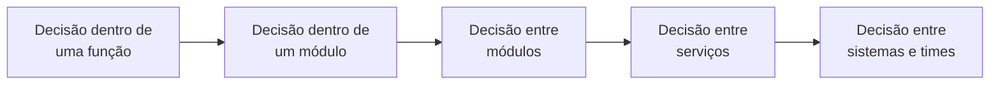

# Arquitetura vs. Design

## Visão Geral

Arquitetura e design são a mesma atividade — estruturar software — operando em
escalas diferentes de consequência.

A distinção útil não é de assunto nem de artefato. É de **alcance**: quantas
partes do sistema uma decisão restringe, e quem precisa concordar com ela para
que funcione.

## O Problema

A separação costuma ser ensinada como se fosse categórica: arquitetura trata de
componentes e comunicação entre eles; design trata do interior de cada
componente. Arquitetura é o desenho; design é o código.

Essa fronteira quebra na primeira aplicação real.

A escolha de que um repositório devolva uma coleção materializada em vez de um
fluxo preguiçoso parece design — está inteiramente dentro de um componente. Mas
se essa coleção pode ter dez milhões de registros, a escolha determina o perfil
de memória do serviço inteiro, e portanto sua topologia de implantação. Ela se
comporta como decisão arquitetural.

Inversamente: num sistema de trinta usuários internos, a escolha entre dois
serviços separados e um só módulo — que parece a decisão arquitetural
arquetípica — é revertida numa semana. Ela se comporta como design.

Tratar a fronteira como categórica leva a dois erros simétricos: escalar para o
arquiteto decisões que o time resolve melhor, e deixar passar sem revisão
decisões locais de consequência global.

## Conceitos Centrais

### O eixo é alcance, não assunto

Uma decisão é mais arquitetural quanto mais partes do sistema ela restringe.

Não há um ponto de corte objetivo nesse gradiente. Há uma direção: quanto mais à
direita, mais cedo a decisão precisa ser tomada, mais gente precisa concordar, e
mais cara ela é de reverter.

### Design errado é local; arquitetura errada é sistêmica

Essa é a diferença prática que mais importa.

Uma classe mal desenhada é um problema contido: quem mexer nela sofre, e
refatorar não afeta mais ninguém. Uma fronteira mal desenhada entre módulos é
um problema distribuído: toda mudança que a atravessa paga um imposto, e o custo
se manifesta longe de onde a decisão foi tomada.

Por isso arquitetura recebe mais cerimônia. Não por ser mais importante em
abstrato — por errar de forma mais difícil de conter.

### A fronteira se move com o contexto

O mesmo tipo de decisão muda de lado conforme o sistema.

| Decisão | Sistema pequeno | Sistema grande |
|---|---|---|
| Escolha de ORM | Design — troca-se em dias | Arquitetural — permeia milhares de consultas |
| Separar em dois serviços | Design — junta-se de volta numa semana | Arquitetural — dois times, dois deploys, um contrato |
| Formato de data numa API interna | Design | Arquitetural se há consumidores externos |

O que muda não é a natureza da decisão. É quantas coisas passaram a depender
dela.

### Arquitetura restringe design; design realiza arquitetura

A relação entre as duas é de restrição, não de sequência.

Arquitetura estabelece as fronteiras dentro das quais o design opera livremente.
Se a arquitetura definiu que o módulo de cobrança não acessa o banco de usuários
diretamente, o design decide tudo o mais sobre como a cobrança funciona — mas
não isso.

E design é o que torna a arquitetura real. Uma fronteira que existe no diagrama
e não é imposta no código não existe. É por isso que
[arquitetura sem bom design é ficção](../02-software-design/index.md).

## Modelo Mental

Pergunte: **quem precisa saber desta decisão para fazer o próprio trabalho?**

- Só quem mexe nesta função → design.
- Quem mexe neste módulo → design com alcance.
- Quem mexe em qualquer módulo que fale com este → arquitetural.
- Outro time → arquitetural, e precisa de contrato.

A pergunta funciona porque captura o que de fato distingue as duas: o número de
pessoas cuja liberdade a decisão restringe.

## Por Que Isso Importa

**Determina o que precisa de acordo prévio.** Decisões de design podem ser
tomadas e revistas dentro do time, no ritmo do time. Decisões arquiteturais
precisam de concordância antes, porque revertê-las depois envolve renegociar com
todos que já dependem delas. Confundir os dois lados produz ou paralisia — tudo
vira comitê — ou surpresa — decisões de alcance amplo aparecem prontas.

**Determina o que se registra.** Decisão de design fica no código: um leitor
atento reconstrói o raciocínio. Decisão arquitetural precisa de registro
explícito, porque o contexto que a justificou não está visível em lugar nenhum
do código. É a base dos [ADRs](../18-architecture-decisions/index.md).

**Determina onde a revisão vale a pena.** Revisar todo design exaustivamente não
escala. Revisar arquitetura sempre vale, porque o erro se espalha.

## Erros Comuns

**Tratar a fronteira como fixa.** É o erro que gera os dois seguintes.

**Escalar design para arquitetura.** Quando toda decisão de estrutura interna
precisa de aprovação, o time para de decidir e passa a pedir. O custo aparece
como lentidão, e a causa raramente é diagnosticada como excesso de cerimônia.

**Rebaixar arquitetura a design.** Mais silencioso e mais caro. Uma decisão de
alcance amplo é tomada localmente, por quem tinha contexto local, e o custo
aparece meses depois em outro módulo — onde ninguém liga o efeito à causa.

**Achar que arquitetura é feita por arquitetos e design por desenvolvedores.**
Isso descreve uma divisão de cargos, não uma divisão de decisões. Quem escreve o
código toma decisões arquiteturais o tempo todo; o que muda é se sabe disso.

**Usar "isso é design, não arquitetura" para encerrar discussão.** Quase sempre
significa "não quero discutir isso agora". Se a decisão restringe outros, ela é
arquitetural independentemente do rótulo que recebe.

## Exemplo Real

Um time discute se o serviço de pedidos deve expor o status como um enum fechado
(`criado`, `pago`, `enviado`, `entregue`) ou como string livre.

Enquadrado como design, o argumento é sobre validação e legibilidade de código, e
o enum vence facilmente.

Enquadrado pela pergunta de alcance — quem precisa saber disso? — o quadro muda.
Três consumidores externos vão ler esse campo. Um enum fechado significa que
adicionar `em_separação` é uma mudança de contrato: cada consumidor precisa
tratar um valor que antes não existia, e alguns vão quebrar ao encontrá-lo.

A decisão não é sobre tipagem. É sobre quem paga o custo de o negócio inventar
um novo estado de pedido — o que vai acontecer, porque negócios inventam estados.

O time acabou escolhendo o enum, mas com duas decisões que só apareceram porque
o enquadramento mudou: documentar explicitamente que consumidores devem tolerar
valores desconhecidos, e versionar o contrato.

O enquadramento não mudou a escolha. Mudou o que veio junto com ela.

## Conceitos Relacionados

- [O que é Arquitetura de Software](what-is-software-architecture.md) — o
  critério de custo de reversão, que é o outro lado desta distinção.
- [Arquitetura vs. Implementação](architecture-vs-implementation.md) — a outra
  fronteira, e a mais mal compreendida das duas.
- [Acoplamento](coupling.md) — a métrica com que alcance se mede na prática.

## Exercício Prático

Na última revisão de código de que você participou, escolha três comentários que
propunham mudança estrutural.

Para cada um, responda: quem precisaria saber dessa decisão para fazer o próprio
trabalho? Só o autor? O time? Outro time?

Depois compare com quanta discussão cada um recebeu. O desalinhamento entre
alcance e atenção é o que este documento serve para corrigir.

## Perguntas de Entrevista

- Onde termina arquitetura e começa design?
- Dê um exemplo de decisão que é design num sistema e arquitetura em outro.
- Como você decide se uma escolha precisa de acordo antes de ser implementada?

## Para Aprofundar

- Fowler, Martin. *Who Needs an Architect?* IEEE Software, 2003.
- Martin, Robert C. *Clean Architecture*. Prentice Hall, 2017 — capítulo sobre a
  relação entre políticas e detalhes.
