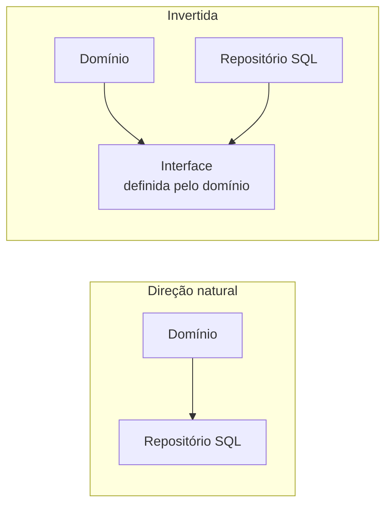

# Gestão de Dependências

## Visão Geral

Uma dependência é uma direção: A depende de B significa que mudanças em B podem
quebrar A, e não o contrário.

Gerir dependências é decidir essas direções deliberadamente. A afirmação central:
**a direção em que as dependências apontam determina o que você consegue mudar
sem quebrar o resto.**

## Problema

Dependências se acumulam sem que ninguém decida. Cada import é uma decisão
pequena, tomada por quem está resolvendo um problema imediato, e o grafo
resultante é a soma de centenas dessas decisões locais.

O resultado típico tem três patologias. Regra de negócio dependendo de detalhe de
infraestrutura, o que significa que trocar o banco toca o domínio. Ciclos entre
módulos, o que significa que nenhum dos dois pode ser entendido, testado ou
implantado sem o outro. E um módulo do qual tudo depende, que vira o gargalo por
onde toda mudança passa.

Nenhuma dessas foi decidida. Todas são caras de desfazer.

## Conceitos Centrais

### Estabilidade e direção

A regra que organiza o assunto:

> **Dependa na direção da estabilidade.**

Um componente é estável quando muda pouco — porque muitos dependem dele, ou
porque representa algo que não varia. Um componente instável muda com frequência.

Se o estável depende do instável, cada mudança no instável quebra o estável. A
seta precisa apontar ao contrário.

Regra de negócio é estável — muda por decisão da empresa, o que é raro. Detalhe
de infraestrutura é instável — versões, provedores, protocolos mudam. Logo, o
detalhe deve depender da regra, não o inverso.

### Inversão de dependência

Quando a direção natural do fluxo é oposta à direção desejada da dependência,
inverte-se com uma abstração.

O detalhe crucial, e o que mais se erra: **a interface pertence ao lado
estável**. Se a interface `RepositorioDePedidos` mora no pacote de
infraestrutura, nada foi invertido — o domínio continua dependendo da
infraestrutura, só que através de um arquivo a mais.

### Ciclos

Um ciclo de dependências significa que os módulos envolvidos são, na prática, um
só: não podem ser compilados, testados, entendidos ou implantados
separadamente.

Ciclos raramente são criados de propósito. Aparecem por acúmulo, e ficam
invisíveis porque nenhuma ferramenta reclama por padrão.

Detectá-los é barato — análise estática resolve — e o valor é alto, porque um
ciclo é sempre um sinal de que uma fronteira está no lugar errado.

### Dependências externas

Bibliotecas de terceiros são dependências com uma propriedade adicional: você não
controla quando elas mudam, nem quando param de ser mantidas.

O custo real de uma dependência externa não é o que ela faz; é a superfície que
o seu código expõe a ela. Uma biblioteca usada em um adaptador é substituível.
A mesma biblioteca com tipos espalhados por toda a base é uma decisão
arquitetural permanente.

## Modelo Mental

**Siga a seta e pergunte quem quebra.**

Se A depende de B, mudanças em B podem quebrar A. Percorra o grafo perguntando
isso em cada aresta. Onde a resposta for "algo estável e importante quebra por
causa de algo volátil", a seta está errada.

## Quando Usar

Inverter uma dependência vale quando:

- O lado que muda mais está sendo dependido pelo que muda menos.
- Você precisa testar o lado estável sem o instável.
- Existe expectativa real de substituir a implementação.
- A dependência atravessa uma fronteira que você quer manter — de módulo, de
  time, de sistema.

## Quando Não Usar

**Quando os dois lados são igualmente estáveis.** Inverter uma dependência entre
dois módulos de domínio que mudam na mesma cadência adiciona indireção sem
comprar nada.

**Quando a inversão exige uma abstração que não se sustenta.** Ver
[abstração](/01-fundamentals/abstraction.md). Se a interface precisa expor detalhes do
implementador para ser útil, a inversão é nominal.

**Quando a dependência é trivialmente substituível.** Uma biblioteca de
formatação de data usada em três lugares não precisa de camada de isolamento; o
custo de trocá-la direto é menor que o de mantê-la abstraída.

**Em sistemas pequenos com implementação única.** A inversão de dependência é um
investimento em mudança. Onde a mudança não é esperada e o sistema é pequeno, é
custo puro.

## Alternativas

- **Aceitar a direção e isolar o ponto de contato** — deixar a dependência
  direta, mas concentrá-la em um lugar. Mais barato que inverter e resolve o
  caso comum.
- **Adaptador na fronteira** — traduzir na entrada em vez de abstrair no meio.
- **Duplicar o tipo** — definir o próprio tipo em vez de depender do da
  biblioteca. Barato, e evita que o tipo externo se espalhe.

## Trade-offs

O eixo é **liberdade de mudar um lado versus indireção a manter**.

| Inverter a dependência | Manter a direção natural |
|---|---|
| Lado estável fica protegido | Mudança no detalhe alcança o núcleo |
| Testável sem a implementação real | Teste carrega infraestrutura |
| Implementação substituível | Substituir toca consumidores |
| Uma interface a manter e evoluir | Sem contrato intermediário |
| Fluxo mais difícil de seguir | Fluxo direto |

## Modos de Falha

**Inversão nominal.** A interface existe, mas mora no lado errado, ou expõe tipos
do implementador. O domínio continua acoplado.

**Ciclo não detectado.** Dois módulos que se referenciam mutuamente. Testes de um
exigem o outro; nenhuma extração é possível.

**Módulo pivô.** Um módulo com dependência de entrada muito alta. Toda mudança
nele afeta o sistema, o que congela sua evolução e vira fonte de conflito.

**Tipo externo espalhado.** O tipo de uma biblioteca aparece em assinaturas por
toda a base. A biblioteca virou parte da arquitetura sem decisão.

**Dependência transitiva surpresa.** O módulo A não depende diretamente de C, mas
uma mudança em C o quebra através de B. Sem visibilidade do fecho transitivo,
isso é impossível de antecipar.

## Erros Comuns

**Colocar a interface no lado do implementador.** O erro mais frequente ao
aplicar inversão de dependência, e o que a torna inútil.

**Confundir inversão de dependência com injeção de dependência.** Injeção é um
mecanismo de fornecimento; inversão é uma decisão de direção. É perfeitamente
possível injetar mantendo a direção errada.

**Não medir o grafo.** A maioria dos times não sabe qual é o grafo real de
dependências do próprio sistema. É mensurável em minutos com ferramenta e
raramente é medido.

**Tratar dependência externa como decisão de biblioteca.** Uma dependência cujos
tipos se espalham é decisão arquitetural, com custo de reversão alto.

**Inverter tudo.** Aplicar inversão por princípio, sem perguntar qual lado é
estável, produz um sistema de interfaces em que ninguém acha o código que
executa.

## Exemplo Real

Um serviço de precificação tinha a regra de negócio dependendo diretamente do
cliente do provedor de taxas de câmbio — o tipo `ExchangeRateResponse` da
biblioteca aparecia em quinze assinaturas de método no domínio.

Quando o provedor foi descontinuado, a migração tocou os quinze pontos, os testes
de todos eles, e revelou que parte da regra de arredondamento estava implícita no
formato do provedor antigo.

A correção posterior não foi criar uma interface genérica de provedor de câmbio.
Foi mais simples: definir um tipo próprio, `Cotacao`, no domínio, e um adaptador
que traduz a resposta do provedor para ele.

Duas observações. A abstração ficou no ponto de contato — um arquivo — em vez de
uma interface atravessando o sistema. E o domínio passou a depender de um
conceito seu, não de um formato de terceiro.

Na migração seguinte, dois anos depois, um arquivo mudou.

## Conceitos Relacionados

- [Acoplamento](/01-fundamentals/coupling.md) — do que as dependências são feitas.
- [Abstração](/01-fundamentals/abstraction.md) — o mecanismo da inversão, e seu custo.
- [Arquitetura vs. Implementação](/01-fundamentals/architecture-vs-implementation.md) — como
  impor a direção decidida.

## Exercício Prático

Rode uma ferramenta de análise de dependências no seu sistema e responda: existem
ciclos? Qual módulo tem mais dependências de entrada? Qual tipo de terceiro
aparece em mais assinaturas?

Para o tipo externo mais espalhado, estime quantos arquivos uma troca de
biblioteca tocaria.

## Perguntas de Entrevista

- O que significa "depender na direção da estabilidade"?
- Qual a diferença entre inversão e injeção de dependência?
- Por que um ciclo de dependências é um problema, e como ele aparece?

## Para Aprofundar

- Martin, Robert C. *Clean Architecture*. Prentice Hall, 2017 — princípios de
  acoplamento e estabilidade de componentes.
- Documentação de `jdeps`, `dependency-cruiser`, `import-linter` — ferramentas de
  análise de grafo por linguagem.
