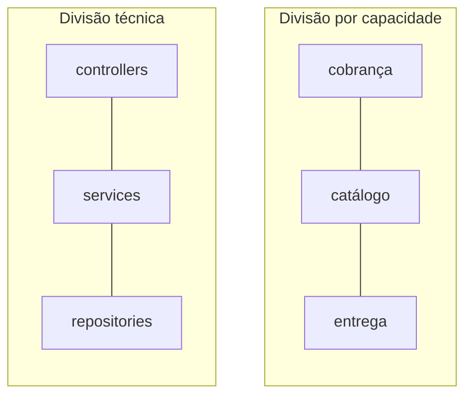

# Modularidade

## Visão Geral

Modularidade é a divisão de um sistema em partes com fronteiras explícitas, cada
uma compreensível e alterável sem que seja necessário entender as demais.

É a propriedade da qual quase todas as outras dependem. Sem ela, não há como
raciocinar sobre uma parte do sistema isoladamente — e um sistema sobre o qual
não se pode raciocinar em partes é um sistema que só cabe inteiro na cabeça de
alguém.

## Problema

Sistemas crescem. A capacidade humana de manter contexto não.

Sem divisão, o custo de mudar cresce mais que linearmente com o tamanho: cada
alteração exige verificar mais lugares, e a chance de efeito colateral aumenta a
cada linha adicionada. Chega um ponto em que mudanças simples levam semanas
porque ninguém consegue afirmar o que mais será afetado.

Modularidade limita o alcance da mudança. O objetivo não é ter partes pequenas —
é que uma mudança típica caiba dentro de uma delas.

Essa formulação é a que importa, e é diferente da usual. A pergunta não é "esse
módulo é pequeno o suficiente?", e sim "as mudanças que de fato acontecem cabem
dentro de um módulo?".

## Conceitos Centrais

### Um módulo tem interface e segredo

Um módulo é definido por duas coisas: o que ele expõe e o que ele esconde.

O que expõe é o contrato — outros módulos podem depender disso. O que esconde é
o que pode mudar sem que ninguém precise saber. Um módulo que expõe tudo não é
módulo; é um agrupamento de arquivos.

A ideia central, formulada por Parnas em 1972 e ainda mal aplicada: **módulos
devem ser divididos pelo que escondem, não pelas etapas do processamento.**

### O eixo de divisão

A pergunta que decide onde traçar a fronteira: **o que muda junto?**

Coisas que mudam pela mesma razão pertencem ao mesmo módulo. Coisas que mudam por
razões independentes pertencem a módulos diferentes.

Isso leva a um resultado contraintuitivo. A divisão técnica comum — controladores
num lugar, serviços em outro, repositórios num terceiro — agrupa coisas que
mudam por razões diferentes e separa coisas que mudam juntas. Adicionar um campo
a um cadastro toca os três diretórios.

Uma divisão por capacidade de negócio — cobrança, catálogo, entrega — agrupa o
que muda junto. A mesma alteração toca um lugar.

### Fronteira nominal não é fronteira

Um diretório chamado `cobranca` não impede nada. Modularidade real exige que a
fronteira seja imposta — por módulo de linguagem, análise estática ou teste de
arquitetura. Ver
[arquitetura vs. implementação](/01-fundamentals/architecture-vs-implementation.md).

### Modularidade tem níveis

Função, classe, módulo, pacote, serviço, sistema. O mesmo raciocínio se aplica em
cada nível, com custos de fronteira crescentes: separar duas classes é barato;
separar dois serviços custa rede, implantação e operação.

Subir de nível sem necessidade é a origem de boa parte da complexidade acidental
em sistemas distribuídos.

## Modelo Mental

**Um módulo é uma promessa: você não precisa olhar aqui dentro.**

Se para usar um módulo é necessário entender sua implementação, a promessa foi
quebrada e o módulo não está entregando o que módulos existem para entregar.

## Quando Usar

- Quando partes do sistema mudam por razões independentes e em ritmos diferentes.
- Quando o sistema já não cabe no contexto de uma pessoa.
- Quando pessoas ou times diferentes trabalham em partes diferentes e conflitam.
- Quando uma parte precisa ser substituída ou testada isoladamente.
- Quando uma parte tem requisito de qualidade distinto — algo que precisa escalar
  ou falhar separadamente.

## Quando Não Usar

**Quando o sistema é pequeno o suficiente para caber inteiro na cabeça.** Módulos
têm custo de navegação e indireção. Num sistema de dois mil linhas, esse custo é
maior que o benefício.

**Quando você ainda não sabe onde as fronteiras ficam.** Modularizar cedo demais,
antes de entender o domínio, congela fronteiras erradas — e fronteira errada é
mais cara que fronteira ausente, porque cada mudança paga imposto para
atravessá-la.

O caminho mais seguro num domínio novo é começar com fronteiras internas fracas
e endurecê-las conforme os eixos de mudança se revelarem.

**Quando a divisão proposta não corresponde a nenhum eixo de mudança real.**
Módulos criados por simetria estética — "temos um para cada camada" — adicionam
indireção sem limitar alcance de mudança.

**Quando o custo da fronteira excede o benefício naquele nível.** Separar em dois
serviços o que poderiam ser dois módulos do mesmo processo troca uma chamada de
função por rede, serialização, tratamento de falha parcial e mais um pipeline de
implantação.

## Alternativas

- **Monolito coeso sem módulos internos** — viável em sistemas pequenos e times
  de até três ou quatro pessoas.
- **Modularidade por convenção** — mais barata, e vale enquanto a equipe é
  estável e pequena; degrada com rotatividade.
- **Separação por processo** — modularidade máxima, custo máximo. Ver
  [microsserviços](/03-design-patterns/microservices.md).

## Trade-offs

O eixo real é **custo de mudança local versus custo de navegação e indireção**.

| Mais modularidade | Menos modularidade |
|---|---|
| Mudança fica contida | Mudança se espalha |
| Partes testáveis isoladamente | Teste exige o sistema |
| Times trabalham em paralelo | Conflito constante |
| Mais indireção para seguir um fluxo | Fluxo direto e legível |
| Fronteira errada custa caro | Sem fronteira para errar |
| Custo de manter contratos internos | Sem contratos a manter |

O ponto ótimo depende do tamanho do sistema, da estabilidade do domínio e do
número de pessoas. Não é uma constante.

## Modos de Falha

**Módulo que vaza.** Expõe estrutura interna no contrato — devolve o objeto de
persistência, aceita o tipo do framework. Consumidores acabam dependendo do
segredo, e a fronteira deixa de proteger.

**Módulo que depende de todos.** Frequentemente chamado `common`, `utils` ou
`shared`. Vira ponto de acoplamento universal: mudar nele afeta tudo.

**Fronteira no eixo errado.** Toda mudança de negócio atravessa três módulos. O
sintoma é o pull request que sempre toca os mesmos três diretórios juntos.

**Módulos demais.** Seguir um fluxo simples exige abrir nove arquivos. A
indireção deixou de esconder complexidade e passou a ser a complexidade.

## Erros Comuns

**Dividir por camada técnica em vez de por eixo de mudança.** O erro mais comum,
e o que mais silenciosamente degrada a manutenibilidade.

**Confundir diretório com módulo.** Sem imposição, é organização visual.

**Criar `shared` como depósito.** O que não tem dono claro vai para lá, e o
módulo vira dependência de todos.

**Modularizar antes de entender o domínio.** Ver "quando não usar".

**Achar que módulo pequeno é módulo bom.** Tamanho é consequência, não meta. Um
módulo grande e coeso é melhor que cinco pequenos que sempre mudam juntos.

## Exemplo Real

Um sistema de e-commerce organizado em `controllers`, `services`, `repositories`
e `models`. Quatro diretórios, cada um com quarenta arquivos.

Uma análise de commits ao longo de seis meses mostrou que 80% deles tocavam
três dos quatro diretórios. A modularidade era nominal: não havia mudança que
coubesse dentro de um módulo, porque os módulos não correspondiam a nenhum eixo
de mudança.

A reorganização por capacidade — `catalogo`, `carrinho`, `pedido`, `pagamento`,
`entrega`, cada uma com sua estrutura interna — levou 70% dos commits a tocar um
único diretório.

Duas observações sobre o resultado. Primeira: nenhuma linha de lógica de negócio
mudou; só a distribuição de arquivos e as fronteiras impostas. Segunda: os 30%
restantes revelaram um acoplamento real entre `pedido` e `pagamento` que a
estrutura antiga escondia — e que virou uma decisão explícita a tomar, em vez de
ruído.

## Conceitos Relacionados

- [Acoplamento](/01-fundamentals/coupling.md) e [Coesão](/01-fundamentals/cohesion.md) — como se mede se a
  divisão está boa.
- [Separação de Responsabilidades](/01-fundamentals/separation-of-concerns.md) — o princípio que
  orienta onde dividir.
- [Design Modular](/02-software-design/modular-design.md) — a aplicação prática.

## Exercício Prático

Rode `git log` sobre os últimos seis meses do seu sistema e conte, para cada
commit, quantos diretórios de primeiro nível ele tocou.

Se a maioria toca mais de um, seus módulos não estão no eixo de mudança. Os
diretórios que aparecem juntos com frequência são candidatos a ser um só módulo.

## Perguntas de Entrevista

- Como você decide onde traçar a fronteira de um módulo?
- Por que dividir por camada técnica costuma ser um erro?
- Quando modularizar mais piora o sistema?

## Para Aprofundar

- Parnas, David. *On the Criteria To Be Used in Decomposing Systems into
  Modules*. CACM, 1972 — o artigo fundador, ainda o melhor texto sobre o assunto.
- Martin, Robert C. *Clean Architecture*. Prentice Hall, 2017 — princípios de
  coesão de componentes.
