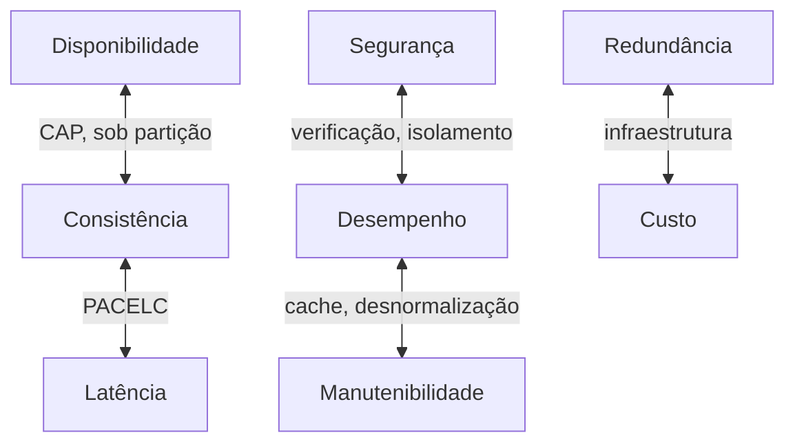

# Atributos de Qualidade

## Visão Geral

Atributos de qualidade são as propriedades pelas quais um sistema é julgado além
de fazer o que deveria: disponibilidade, desempenho, segurança, manutenibilidade,
escalabilidade, custo operacional, e outras.

A propriedade central deles, e a razão de existirem como conceito: **competem
entre si**. Não existe sistema que maximize todos. Arquitetar é escolher quais
priorizar e aceitar o que isso custa nos demais.

## O Problema

Times listam atributos de qualidade como se fossem uma lista de compras — tudo
desejável, tudo perseguível. O documento diz que o sistema deve ser altamente
disponível, altamente consistente, de baixa latência, seguro, barato e fácil de
manter.

Nenhuma arquitetura satisfaz esse conjunto, porque vários dos itens se opõem
diretamente. Consistência forte custa latência e disponibilidade durante
partição. Segurança custa desempenho e conveniência. Baixo custo custa
redundância.

O resultado de não priorizar não é conseguir tudo. É que a priorização acontece
implicitamente, tomada por quem implementa, sem que ninguém saiba qual foi.

## Conceitos Centrais

### Os principais atributos e o que cada um custa

| Atributo | O que é | Custa tipicamente |
|---|---|---|
| Disponibilidade | Fração do tempo respondendo corretamente | Redundância, complexidade operacional, custo |
| Desempenho | Tempo de resposta sob carga dada | Cache e desnormalização, ao custo de consistência e manutenibilidade |
| Escalabilidade | Absorver crescimento adicionando recursos | Ausência de estado, particionamento, complexidade distribuída |
| Consistência | Todas as leituras observam a escrita mais recente | Latência e disponibilidade sob partição |
| Segurança | Resistência a uso indevido | Desempenho, conveniência, atrito operacional |
| Manutenibilidade | Custo de mudar | Indireção, que custa desempenho e simplicidade imediata |
| Observabilidade | Capacidade de responder perguntas novas | Custo de armazenamento e processamento de telemetria |
| Custo operacional | O que custa manter em pé | Todos os anteriores, direta ou indiretamente |

A última linha é a que mais frequentemente falta nos documentos e a que mais
frequentemente decide.

### Os conflitos que mais aparecem

Alguns pares se opõem de forma estrutural, não circunstancial:



Reconhecer que um par é estruturalmente oposto muda a conversa: deixa de ser
"como conseguimos os dois?" e passa a ser "quanto de um trocamos por quanto do
outro?".

### Cenários tornam o atributo verificável

Um atributo nomeado é vago. Um atributo em cenário é testável. A estrutura de
cenário — vinda da prática de análise arquitetural — tem seis partes:

```text
Fonte      Um usuário autenticado
Estímulo   solicita o histórico de pedidos
Ambiente   durante pico de Black Friday
Artefato   no serviço de pedidos
Resposta   o sistema retorna a primeira página
Medida     em menos de 800 ms no percentil 95
```

Escrever cinco ou seis cenários assim para os atributos priorizados produz mais
clareza arquitetural do que dez páginas de prosa sobre qualidade.

### Nem todo atributo importa em todo sistema

Um sistema de relatórios internos não precisa de baixa latência. Um sistema de
apoio à decisão médica não pode trocar consistência por disponibilidade. Um
protótipo descartável não precisa de manutenibilidade — e investir nela é
desperdício.

A pergunta não é qual atributo é mais importante em abstrato. É qual, se
falhar neste sistema, causa o dano maior.

## Modelo Mental

**Atributos de qualidade são um orçamento, não uma lista de desejos.**

Você tem uma quantidade finita de complexidade, dinheiro e tempo para alocar.
Gastar em disponibilidade significa não gastar em outra coisa. Um documento que
prioriza tudo não alocou nada.

## Por Que Isso Importa

**Porque são o critério de escolha entre arquiteturas.** Duas arquiteturas que
atendem aos mesmos requisitos funcionais se distinguem exatamente pelo perfil de
atributos que oferecem. Sem prioridade declarada, não há como compará-las.

**Porque tornam o conflito explícito antes de ele custar caro.** Descobrir na
produção que a escolha por consistência forte custou a latência prometida é o
caminho caro. A tabela de conflitos custa uma reunião.

**Porque a priorização é decisão de negócio.** Engenharia informa o custo de cada
opção; o negócio decide o que vale. Quando a engenharia decide sozinha, escolhe
tipicamente pureza técnica — que raramente é o que a empresa precisava.

## Erros Comuns

**Priorizar tudo.** Equivale a não priorizar. O teste: se você tivesse que
sacrificar um atributo da lista para ganhar em outro, qual sacrificaria? Se não
há resposta, a lista não é uma priorização.

**Ignorar custo operacional como atributo.** É o que elimina mais arquiteturas na
prática e o menos presente nos documentos.

**Confundir desempenho com escalabilidade.** São atributos distintos e às vezes
opostos. Um sistema pode ser rápido e não escalar; otimizações que aumentam
desempenho de instância única às vezes impedem distribuição.

**Perseguir atributo que ninguém mede.** Se não há instrumentação para verificar,
o atributo é aspiracional. E atributos aspiracionais degradam sem que ninguém
perceba.

**Deixar a priorização implícita.** Ela sempre acontece. A escolha é entre ser
decidida por quem tem contexto de negócio ou por quem está escrevendo a função
naquele momento.

## Exemplo Real

Duas equipes da mesma empresa constroem serviços que gravam dados de sensores.

**Equipe A — monitoramento industrial.** Perder uma leitura significa não
detectar uma condição de falha em equipamento. Prioridade: durabilidade e
consistência acima de latência e custo. Arquitetura: escrita síncrona replicada,
confirmação só após persistência em duas zonas, custo por leitura mais alto.

**Equipe B — telemetria de aplicativo.** Perder algumas leituras entre milhões
não muda nenhuma conclusão. Prioridade: custo e vazão acima de durabilidade.
Arquitetura: escrita em lote, buffer em memória com descarte sob pressão, custo
por leitura uma ordem de grandeza menor.

Os requisitos funcionais são quase idênticos: receber leitura, armazenar,
consultar por período. As arquiteturas não compartilham nenhuma decisão
significativa.

Se a equipe B tivesse copiado a arquitetura da A — o que foi proposto, por
consistência interna — o custo teria inviabilizado o produto. Se a A tivesse
copiado a B, o sistema teria perdido leituras que ninguém pode perder.

O que separa as duas não está em nenhum documento de requisitos funcionais.

## Conceitos Relacionados

- [Requisitos Não-Funcionais](/01-fundamentals/non-functional-requirements.md) — como expressá-los
  de forma verificável.
- [Características Arquiteturais](/01-fundamentals/architecture-characteristics.md) — a
  formulação alternativa do mesmo conceito.
- [Trade-offs](/20-trade-offs/index.md) — a análise dos conflitos, em detalhe.

## Exercício Prático

Liste os atributos de qualidade do seu sistema e ordene-os. Ordenação estrita:
sem empates.

Depois, para os três primeiros, escreva um cenário de seis partes.

Por fim, para cada um dos três, responda: o que no sistema atual mede isso hoje?
Os que não têm resposta são atributos aspiracionais.

## Perguntas de Entrevista

- Quais atributos de qualidade competem entre si, e por quê?
- Como você conduz a priorização com stakeholders que querem tudo?
- Dê um exemplo de sistema em que otimizar um atributo degradou outro.

## Para Aprofundar

- Bass, Len; Clements, Paul; Kazman, Rick. *Software Architecture in Practice*.
  4ª ed., Addison-Wesley, 2021 — a referência sobre cenários de atributo.
- Ford, Neal; Richards, Mark. *Fundamentals of Software Architecture*. O'Reilly,
  2020 — características arquiteturais e sua priorização.
