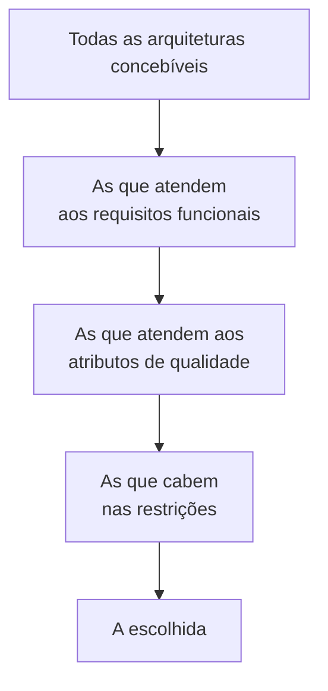

# Espaço da Solução

## Visão Geral

O espaço da solução é o conjunto de arquiteturas que resolveriam o problema
declarado. Arquitetar é percorrer esse espaço, reduzi-lo com restrições e
escolher um ponto — sabendo o que os outros pontos ofereciam.

A qualidade de uma decisão arquitetural depende menos da opção escolhida do que
de quantas opções foram genuinamente consideradas.

## O Problema

Na prática, o espaço da solução quase nunca é percorrido. A primeira alternativa
plausível vira a escolhida, e o restante do trabalho é justificá-la.

Isso não acontece por preguiça. Acontece porque a primeira solução é fácil de
gerar e as demais exigem esforço deliberado, e porque uma vez que uma opção está
na mesa, ela vira o padrão contra o qual as outras precisam se provar — em vez de
ser comparada em igualdade.

O custo é invisível: ninguém sabe o que a alternativa não considerada teria
oferecido. O sistema entregue funciona, então a decisão parece boa. O que não
aparece é que uma opção que ninguém enumerou teria custado metade.

## Conceitos Centrais

### Restrições reduzem o espaço; requisitos o definem

O espaço começa amplo. Requisitos dizem o que precisa ser verdade; restrições
eliminam regiões inteiras.

O trabalho útil está nos três primeiros filtros. Se o último conjunto tem uma
única opção, o problema estava sobre-restringido — e vale conferir se alguma
restrição era de fato negociável.

### Uma opção só conta se for viável

Listar alternativas que ninguém consideraria é teatro. Um documento com três
opções, das quais duas são espantalhos, é pior que um com uma opção honesta,
porque simula rigor.

O teste: **para cada opção descartada, sob qual mudança de restrição ela
venceria?** Se não existe tal mudança, não era opção.

Essa exigência aparece como regra nos
[case studies](/21-case-studies/index.md) deste material justamente porque é o
que separa análise de justificativa retroativa.

### O custo de abandonar decide os empates

Duas opções raramente empatam em todos os critérios. Quando empatam nos que
importam, o critério de desempate mais útil é assimétrico: **qual é mais barata
de abandonar?**

Você vai errar algumas dessas decisões. O que distingue um sistema recuperável
de um travado não é acertar mais — é que os erros custem menos.

### Enumerar antes de avaliar

Gerar e julgar ao mesmo tempo mata o espaço. A primeira opção com um defeito
aparente é descartada antes de a segunda existir, e o processo converge para a
primeira sem defeito óbvio — que raramente é a melhor.

A ordem que funciona: enumerar tudo o que é plausível, sem julgar; só então
avaliar contra os critérios.

## Modelo Mental

**Você não escolhe uma arquitetura. Você elimina as que não cabem e escolhe entre
as que sobram.**

Isso reposiciona o trabalho. A pergunta deixa de ser "qual é a melhor?" — que não
tem resposta — e passa a ser "o que elimina opções aqui?", que tem.

## Por Que Isso Importa

**Porque torna a decisão defensável.** Uma escolha apresentada com as
alternativas e o critério pode ser contestada ponto a ponto. Uma escolha
apresentada sozinha só pode ser aceita ou rejeitada em bloco — que é como
discussões arquiteturais viram disputa de autoridade.

**Porque preserva a informação para depois.** Quando o contexto mudar, alguém vai
querer reavaliar. Se as alternativas e suas condições foram registradas, a
reavaliação é barata. Se não, começa do zero — e frequentemente reproduz a mesma
análise com o mesmo resultado, meses depois.

**Porque expõe restrição falsa.** Percorrer o espaço frequentemente revela que
uma restrição tida como fixa era preferência. "Não podemos usar serviço
gerenciado" costuma virar "ninguém perguntou".

## Erros Comuns

**Parar na primeira opção viável.** O erro central. Viável não é sinônimo de
adequada, e a primeira que aparece é a mais disponível na memória de quem
propôs — não a melhor.

**Listar espantalhos.** Alternativas incluídas para preencher a seção, sem
condição de vitória declarada.

**Confundir familiaridade com adequação.** A tecnologia que o time domina tem
vantagem legítima — reduz risco de execução. Mas essa vantagem precisa ser
declarada como critério, não embutida silenciosamente na avaliação.

**Não incluir "não fazer nada".** É uma opção real, com custo e benefício, e
frequentemente vence em problemas cuja consequência é menor do que a solução.

**Reabrir o espaço indefinidamente.** O erro oposto. Existe ponto em que mais
análise custa mais do que o erro que evitaria — especialmente para decisões
baratas de reverter. Decisões reversíveis merecem menos deliberação, não a mesma.

## Exemplo Real

Problema declarado: relatórios pesados degradam o banco transacional em horário
comercial.

Espaço enumerado antes de qualquer avaliação:

| Opção | Vence quando |
|---|---|
| Réplica de leitura | O volume de relatórios cabe numa réplica e atraso de segundos é aceitável |
| Data warehouse separado | Há análise de múltiplas fontes ou histórico longo |
| Materializar agregados no transacional | Os relatórios são poucos, conhecidos e estáveis |
| Restringir horário de execução | Os relatórios não são urgentes e a operação aceita janela |
| Otimizar as consultas existentes | O problema é de consulta específica, não de carga agregada |
| Não fazer nada | A degradação é tolerável e o custo de qualquer opção não se paga |

A quinta e a sexta são as que normalmente não aparecem, e são as mais baratas.
Neste caso, a investigação mostrou que duas consultas respondiam por 80% da
carga, ambas sem índice adequado.

A solução foi a quinta. As outras continuam registradas com suas condições — e a
primeira acabou sendo adotada dois anos depois, quando o volume mudou e a
condição declarada passou a valer.

Esse é o retorno de enumerar: a decisão posterior custou uma tarde em vez de um
mês de reanálise.

## Conceitos Relacionados

- [Espaço do Problema](/01-fundamentals/problem-space.md) — o que precede.
- [Restrições](/01-fundamentals/constraints.md) — o que reduz o espaço.
- [Trade-offs](/20-trade-offs/index.md) — o critério de comparação.

## Exercício Prático

Pegue uma decisão arquitetural tomada no seu sistema no último ano.

Reconstrua o espaço de solução como ele era na época: liste quatro alternativas,
incluindo "não fazer nada". Para cada descartada, declare sob qual mudança de
restrição ela venceria.

Depois pergunte: alguma dessas condições passou a valer desde então?

## Perguntas de Entrevista

- Como você garante que considerou alternativas suficientes?
- O que faz de uma alternativa uma opção real e não um espantalho?
- Como decide entre duas opções que empatam nos critérios que importam?

## Para Aprofundar

- Ford, Neal; Richards, Mark. *Fundamentals of Software Architecture*. O'Reilly,
  2020 — capítulo sobre análise de trade-offs.
- Nygard, Michael. *Documenting Architecture Decisions*, 2011 — o formato que
  torna o espaço de solução registrável.
