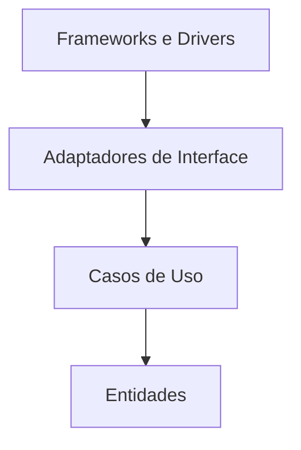

# Clean Architecture

## Visão Geral

Clean Architecture, de Robert Martin, é a síntese de Ports and Adapters, Onion e
outras formulações num único enunciado — a **Regra da Dependência**:

> Dependências de código apontam apenas para dentro, na direção de políticas de
> nível mais alto.

O que ela acrescenta às anteriores é ênfase: os **casos de uso** ganham lugar
próprio, e a orientação sobre o que atravessa as fronteiras é explícita.

## Problema

Os quatro padrões respondem ao mesmo problema — o núcleo amarrado a detalhes.
Clean Architecture ataca especificamente a formulação de que **a arquitetura deve
gritar o domínio, não o framework**.

Martin observa que a estrutura de diretórios da maioria dos sistemas revela a
ferramenta usada, não o negócio. Abrir o repositório mostra `controllers`,
`models`, `migrations` — e nada sobre o que a empresa faz.

## Conceitos Centrais

### Os círculos

**Entidades** — regras de negócio corporativas, as que valeriam mesmo sem
software.

**Casos de uso** — regras específicas da aplicação. Orquestram entidades para
realizar uma operação.

**Adaptadores de interface** — controladores, apresentadores, gateways. Traduzem
entre o formato conveniente para os casos de uso e o formato externo.

**Frameworks e drivers** — web, banco, UI. Martin insiste que este anel é
"detalhe".

O número de círculos não é prescrito; a regra é.

### O que atravessa a fronteira

A orientação mais específica de Clean Architecture, e a que mais gera cerimônia:
**estruturas de dados simples**, definidas pelo círculo interno.

Não a entidade. Não o objeto do ORM. Um tipo simples que o caso de uso define.

Isso significa mapeamento em cada travessia. É onde o padrão cobra mais caro, e
onde a maioria das adoções desvia.

### A dependência aponta contra o fluxo de controle

Quando o fluxo vai de dentro para fora — o caso de uso precisa apresentar um
resultado — a dependência ainda precisa apontar para dentro. A solução é a mesma
[inversão de dependência](/02-software-design/dependency-inversion.md): o caso de uso define a
interface de saída, e o apresentador a implementa.

É o ponto mais elaborado do padrão e o menos adotado na prática.

## Quando Usar

- Em sistemas com lógica de negócio substancial e vida longa.
- Quando o domínio precisa sobreviver a trocas de framework.
- Quando testar regras sem infraestrutura tem valor recorrente.
- Quando a estrutura precisa comunicar o negócio a quem chega.

## Quando Não Usar

**Em aplicações CRUD.** A cerimônia — casos de uso, tipos de entrada e saída,
mapeamento em cada borda — domina completamente o valor.

**Quando o framework é a aplicação.** Alguns sistemas são, honestamente,
configuração de framework com pouca lógica. Isolá-lo custa muito e protege pouco.

**Quando a maior parte dos casos de uso é CRUD.** São seis artefatos por caso, e no CRUD
cinco deles só repassam — como no Exemplo Real, em que nove dos vinte e três casos não
tinham regra a proteger.

**Quando adotada parcialmente sem decidir o que fica de fora.** Este é o caso mais
comum: times adotam os diretórios e o vocabulário, e mantêm entidades do ORM
atravessando fronteiras. Custo pago, propriedade não obtida.

**Quando o time não sustenta o mapeamento.** Sem disciplina e verificação, os
tipos internos vazam em meses.

## Alternativas

- **[Hexagonal](/02-software-design/hexagonal-architecture.md) ou [Onion](/02-software-design/onion-architecture.md)** —
  a mesma tese com menos prescrição sobre o que atravessa.
- **Camadas com inversão só na persistência** — o arranjo pragmático que captura a
  maior parte do valor.
- **Adoção parcial declarada** — aplicar a Regra da Dependência e dispensar a
  separação estrita de tipos, sabendo o que se está abrindo mão.

## Trade-offs

| Clean Architecture completa | Adoção parcial | Sem padrão |
|---|---|---|
| Domínio isolado de tudo | Isolado da persistência | Acoplado |
| Framework substituível | Persistência substituível | Troca toca tudo |
| Muitos artefatos por caso de uso | Poucos a mais | Mínimo |
| Mapeamento em cada borda | Só na persistência | Nenhum |
| Estrutura comunica o negócio | Parcialmente | Comunica o framework |

A coluna do meio é onde a maioria dos sistemas deveria estar, e é a menos
discutida — porque não tem nome próprio.

## Modos de Falha

**Adoção decorativa.** Diretórios e vocabulário, sem a regra imposta: o custo da
estrutura sem a garantia que ela deveria comprar.

**Entidade do ORM atravessando.** A anotação de persistência na entidade de
domínio é o sinal.

**Explosão de artefatos.** Seis por caso de uso, e no CRUD cinco deles só repassam —
sobra o repositório.

**Apresentador ignorado.** O caso de uso devolve o tipo diretamente, sem inverter a
saída. Só cobra preço quando a mesma saída tem mais de um formato, quando a apresentação
tem regra própria, ou quando ela é progressiva — nesses casos a formatação migra para o
caso de uso e leva a regra junto. Fora deles é adoção parcial legítima, não defeito.

**Regra sem verificação.** Ver
[arquitetura vs. implementação](/01-fundamentals/architecture-vs-implementation.md).

## Erros Comuns

**Aplicar integralmente por default.** A pergunta é quanto do padrão o sistema
justifica.

**Adotar os diretórios sem a regra.** Custo sem benefício.

**Tratar como distinto de Hexagonal e Onion.** A tese é a mesma; a diferença é
ênfase e prescrição.

**Confundir com [camadas](/02-software-design/layering.md).** Camadas não têm a Regra da Dependência.

**Não decidir explicitamente o que fica de fora.** A adoção parcial é legítima —
desde que declarada, e não resultado de erosão.

## Exemplo Real

Uma equipe adotou Clean Architecture integralmente num sistema de agendamento com
onze casos de uso. Cada um recebeu: interface de entrada, tipo de requisição,
interator, tipo de resposta, interface de saída e apresentador. Seis artefatos por
caso de uso, mais os adaptadores.

Nove dos onze casos de uso eram CRUD sobre agendamentos.

Depois de um ano, a equipe simplificou de forma seletiva. Os dois casos com regra
substancial — cálculo de disponibilidade com restrições de recurso, e realocação
em cascata — mantiveram a estrutura completa. Os nove CRUD passaram a controlador
chamando repositório diretamente.

A Regra da Dependência continuou valendo para os dois casos complexos, imposta por
teste de arquitetura.

O resultado não é Clean Architecture pura, e a equipe registrou isso num ADR com
a razão. O que importa é que a decisão passou a ser deliberada: a cerimônia existe
onde protege algo, e não existe onde não protegia nada.

## Conceitos Relacionados

- [Ports and Adapters](/02-software-design/ports-and-adapters.md) — a formulação original.
- [Hexagonal](/02-software-design/hexagonal-architecture.md) e
  [Onion](/02-software-design/onion-architecture.md) — as variações.
- [Camadas](/02-software-design/layering.md) — o contraste.
- [Inversão de Dependência](/02-software-design/dependency-inversion.md) — o mecanismo central.

## Exercício Prático

Liste os casos de uso do seu sistema e classifique cada um: tem regra de negócio
substancial, ou é CRUD com validação?

Para os CRUD, conte quantos artefatos a estrutura atual exige. Estime o que
custaria mantê-los simples e aplicar a estrutura completa só aos demais.

## Perguntas de Entrevista

- O que é a Regra da Dependência?
- O que deve atravessar as fronteiras entre círculos, e por quê?
- Quando aplicar Clean Architecture integralmente é um erro?

## Para Aprofundar

- Martin, Robert C. *Clean Architecture*. Prentice Hall, 2017.
- Martin, Robert C. *The Clean Architecture*, 2012 — o artigo original.
- Cockburn, Alistair. *Hexagonal Architecture*, 2005 — a formulação anterior.
