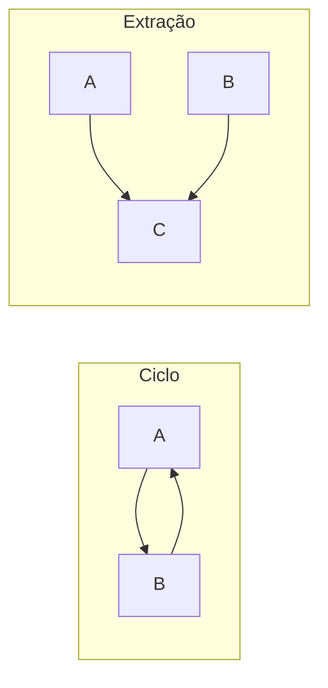

# Direção de Dependência

> Pré-requisito: [Gestão de Dependências](/01-fundamentals/dependency-management.md)
> estabelece a regra de depender na direção da estabilidade. Aqui o foco é a
> aplicação em nível de pacote: como detectar ciclos, como quebrá-los, e as
> métricas que dizem se a direção está certa.

## Visão Geral

Num sistema com muitos pacotes, o grafo de dependências entre eles precisa
satisfazer duas propriedades: ser acíclico, e ter as setas apontando dos pacotes
voláteis para os estáveis.

A primeira é binária — ou há ciclo ou não há. A segunda é gradual e mensurável.

## Problema

O grafo de pacotes de um sistema de porte médio tem dezenas de nós e centenas de
arestas, e quase nenhum time o conhece.

Isso produz dois problemas que só aparecem quando alguém tenta mudar algo.

**Ciclos.** Pacotes que se referenciam mutuamente não podem ser compilados,
testados, versionados ou extraídos separadamente. Um ciclo entre três pacotes
transforma os três num só, e ninguém decidiu isso.

**Direção invertida.** Um pacote estável — do qual muitos dependem — que depende
de um volátil herda a instabilidade dele. Cada mudança no volátil se propaga para
tudo que depende do estável, num efeito que ninguém antecipa porque o caminho é
transitivo.

## Conceitos Centrais

### O princípio das dependências acíclicas

> O grafo de dependências entre pacotes não pode conter ciclos.

Um ciclo significa que os pacotes envolvidos são, na prática, um único
componente. Não há ordem de build possível, não há como testar um sem o outro, e
não há como extrair nenhum deles.

Ciclos raramente são criados de propósito. Aparecem por uma aresta de cada vez, e
ficam invisíveis porque nada reclama por padrão.

### Como quebrar um ciclo

Duas técnicas, e a escolha entre elas revela o que estava errado.

**Inversão.** Introduzir uma abstração num dos pacotes e fazer o outro
implementá-la. Ver [inversão de dependência](/02-software-design/dependency-inversion.md).

**Extração.** Se A e B dependem um do outro por causa de um conjunto de elementos
comuns, extrair esses elementos para um pacote C do qual ambos dependem.

A extração costuma ser a resposta certa, porque um ciclo geralmente significa que
existe um conceito comum que não tinha nome.

### Estabilidade e abstração

Duas métricas de Martin, úteis como diagnóstico:

**Instabilidade** `I = Ce / (Ca + Ce)`, entre 0 e 1. Um pacote do qual muitos
dependem e que depende de poucos tem I próximo de 0 — é estável, e mudá-lo é caro.
O inverso tem I próximo de 1 — é volátil, e mudá-lo é barato.

**Abstração** `A = classes abstratas / classes totais`, entre 0 e 1.

A regra que liga as duas: **um pacote estável deve ser abstrato.** Se muita coisa
depende dele, ele precisa ser difícil de tornar obsoleto — e abstrações são mais
estáveis que implementações.

Isso define duas zonas problemáticas:

| Zona | Perfil | Problema |
|---|---|---|
| Dor | Estável e concreto | Muitos dependem, difícil de mudar, cheio de detalhe |
| Inutilidade | Instável e abstrato | Abstrações que ninguém usa |

A zona da dor é onde mora o utilitário concreto do qual tudo depende. A da
inutilidade, a hierarquia de interfaces criada especulativamente.

Essas métricas são instrumentos de diagnóstico, não metas. Perseguir um número
produz abstração pela abstração.

## Modelo Mental

**Desenhe o grafo e procure setas apontando para cima.** Se um pacote de alto
nível aponta para um de baixo nível, ou se duas setas formam um ciclo, há
trabalho a fazer.

## Quando Usar

- Sempre que o sistema tem mais de meia dúzia de pacotes.
- Ao integrar código novo, para não introduzir ciclo.
- Antes de tentar extrair um módulo para serviço — o ciclo impede.
- Quando o tempo de build cresce sem que o código cresça na mesma proporção.

## Quando Não Usar

**Como meta numérica.** Perseguir um valor de instabilidade ou abstração produz
código pior. As métricas diagnosticam; não prescrevem.

**Em sistemas de poucos pacotes.** Com três ou quatro, o grafo cabe na cabeça e
formalizar é cerimônia.

**Quando quebrar o ciclo custa mais que conviver.** Um ciclo entre dois pacotes
que sempre são implantados juntos e nunca serão separados é um problema teórico.
Vale registrar e seguir.

**Quando a inversão produz abstração artificial.** Quebrar um ciclo criando uma
interface que ninguém mais implementará troca um problema estrutural por
indireção.

## Alternativas

- **Fundir os pacotes** — se dois pacotes formam ciclo e sempre mudam juntos,
  eles eram um só.
- **Extrair o conceito comum** — normalmente a resposta certa.
- **Aceitar e documentar** — quando o custo de correção não se paga.

## Trade-offs

| Grafo acíclico e ordenado | Grafo livre |
|---|---|
| Build incremental possível | Tudo recompila |
| Testar um pacote isoladamente | Teste carrega o ciclo |
| Extração para serviço viável | Extração impossível |
| Exige disciplina e verificação | Sem atrito ao adicionar import |
| Às vezes exige abstração extra | Sem indireção |

## Modos de Falha

**Ciclo transitivo.** A→B→C→A. Nenhuma aresta parece errada isoladamente.

**Pacote na zona da dor.** Um `core` ou `common` concreto do qual tudo depende.
Toda mudança nele afeta o sistema.

**Dependência para cima.** Um pacote de domínio importando de infraestrutura.

**Grafo desconhecido.** O modo de falha mais comum: ninguém sabe qual é.

## Erros Comuns

**Não medir.** O grafo é extraível em minutos e quase nunca é extraído.

**Quebrar ciclo com interface sem pensar.** Às vezes fundir é a resposta.

**Tratar as métricas como meta.** Diagnóstico, não prescrição.

**Ignorar dependências transitivas.** O caminho de propagação não é visível nas
arestas diretas.

**Criar `common` como saída fácil.** É como pacotes entram na zona da dor.

## Exemplo Real

Um sistema com dezoito pacotes tinha um ciclo entre `pedido`, `cliente` e
`faturamento`. Ninguém sabia — o build era monolítico e nada reclamava.

O ciclo impedia a extração de `faturamento` para um serviço, que era o objetivo
declarado do trimestre.

Analisando as arestas: `pedido` precisava de `Cliente` para validar; `cliente`
precisava de `HistoricoDeFaturas` para calcular limite; `faturamento` precisava
de `Pedido` para emitir.

A resposta não foi inverter nenhuma das três. Foi notar que os três dependiam de
um conceito sem nome: a identidade e os dados básicos do cliente, distintos da
lógica de crédito.

Extraído `cliente-identidade`, do qual os três passaram a depender, o ciclo
desapareceu — e `cliente` ficou com o que de fato lhe pertencia, a lógica de
crédito.

O ciclo era sintoma de um conceito faltando, não de uma seta errada. É o caso mais
comum, e o que a técnica de inversão sozinha não resolveria bem.

## Como introduzir isso num sistema existente

Um sistema com anos de acúmulo tem ciclos e direções erradas que não se corrigem
num esforço único. A sequência que funciona:

**Meça e publique.** Extraia o grafo e torne-o visível. Um diagrama de ciclos na
parede muda mais comportamento do que qualquer norma escrita.

**Congele a degradação antes de melhorar.** Adicione uma verificação que falha
apenas para **novos** ciclos, aceitando os existentes como linha de base. Isso
impede que a situação piore enquanto a correção é planejada, e custa uma tarde.

**Corrija na ordem do que bloqueia.** Não todos os ciclos — os que impedem algo
concreto: extrair um módulo, paralelizar o build, testar um pacote isoladamente.

**Reduza a linha de base a cada correção.** A verificação aperta sozinha, e a
melhoria fica registrada.

Times que tentam a ordem inversa — corrigir tudo antes de verificar — corrigem
metade, param por prioridade, e a metade corrigida degrada de volta em um ano.

## Conceitos Relacionados

- [Gestão de Dependências](/01-fundamentals/dependency-management.md) — a regra
  geral de direção.
- [Design de Pacotes](/02-software-design/package-design.md) — como agrupar antes de conectar.
- [Inversão de Dependência](/02-software-design/dependency-inversion.md) — uma das técnicas.
- [Fronteiras](/02-software-design/boundaries.md) — o que a direção atravessa.

## Exercício Prático

Extraia o grafo de dependências entre pacotes do seu sistema com uma ferramenta
de análise estática.

Responda: há ciclos? Qual pacote tem mais dependências de entrada? Ele é abstrato
ou concreto?

Para cada ciclo encontrado, pergunte antes de inverter: existe aqui um conceito
que não tem nome?

## Perguntas de Entrevista

- Por que ciclos entre pacotes são um problema concreto?
- Quais são as formas de quebrar um ciclo, e como escolher?
- O que significa um pacote estável e concreto?

## Para Aprofundar

- Martin, Robert C. *Clean Architecture*. Prentice Hall, 2017 — princípios de
  acoplamento de componentes e as métricas.
- Documentação de `jdeps`, `dependency-cruiser`, `import-linter`, `ArchUnit`.
