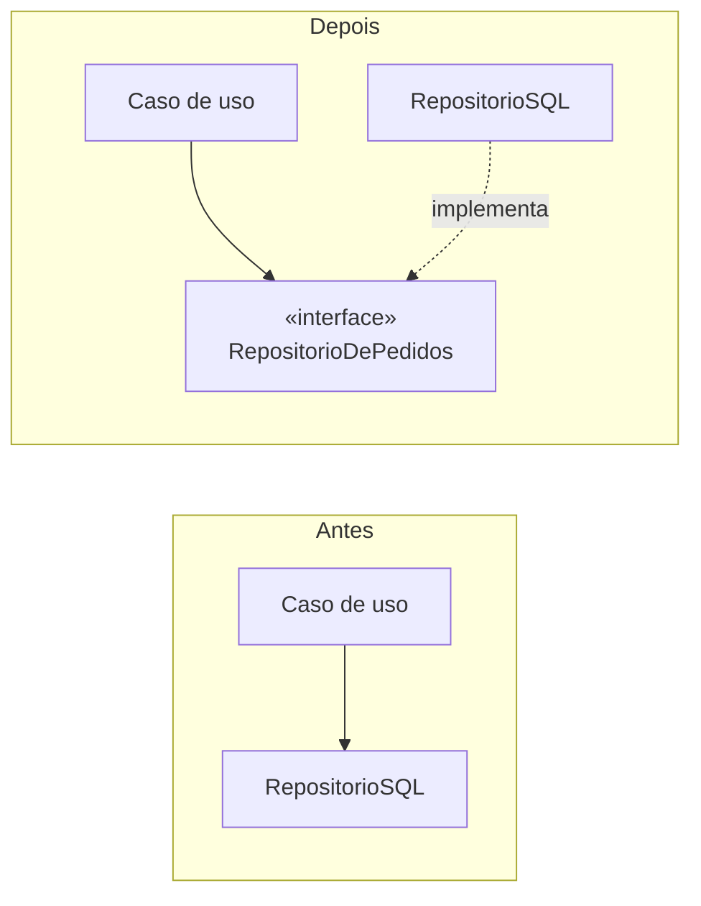

# Inversão de Dependência

## Visão Geral

Inversão de dependência é a técnica de fazer a seta apontar contra o fluxo de
controle, usando uma abstração.

O enunciado clássico:

> Módulos de alto nível não devem depender de módulos de baixo nível. Ambos devem
> depender de abstrações.
>
> Abstrações não devem depender de detalhes. Detalhes devem depender de
> abstrações.

O detalhe que decide se a técnica funciona: **a abstração pertence ao lado de
alto nível.** Se a interface mora com o implementador, nada foi invertido.

## Problema

O fluxo natural de controle vai da política para o detalhe. O caso de uso "criar
pedido" precisa gravar o pedido, então chama o repositório, que fala com o banco.

Se essa chamada for direta, a dependência acompanha o fluxo: a regra de negócio
depende do repositório, que depende do driver, que depende do banco.

As consequências são conhecidas. Testar a regra exige um banco. Trocar de banco
toca a regra. E o mais instável — a tecnologia — é dependido pelo mais estável —
a política.

Isso inverte a regra que
[gestão de dependências](/01-fundamentals/dependency-management.md) estabelece:
dependa na direção da estabilidade.

## Conceitos Centrais

### A mecânica



O fluxo de controle continua indo do caso de uso para o SQL. A **dependência de
código** passou a ir do SQL para a interface. É essa inversão que dá nome à
técnica.

### Onde a interface mora

O ponto que mais se erra.

```text
❌  dominio/CasoDeUso.java
    infra/RepositorioDePedidos.java   ← interface
    infra/RepositorioSQL.java

    O domínio importa de infra. Nada foi invertido.

✅  dominio/CasoDeUso.java
    dominio/RepositorioDePedidos.java  ← interface
    infra/RepositorioSQL.java

    Infra importa do domínio. A seta aponta para dentro.
```

A verificação é objetiva: **o pacote de alto nível importa algo do de baixo
nível?** Se sim, a inversão é nominal.

### A interface fala o vocabulário do consumidor

Se a interface tem `findByStatusIn` e devolve o tipo do ORM, ela é o repositório
com outro nome. O domínio continua acoplado às decisões da persistência, agora
com um arquivo a mais.

Ver [interfaces](/02-software-design/interfaces.md): quem define é o consumidor.

### Inversão não é injeção

Confusão frequente e consequente.

**Injeção de dependência** é um mecanismo de fornecimento: a dependência é passada
em vez de construída internamente. É possível injetar mantendo a direção errada —
injetar `RepositorioSQL` concreto no caso de uso é injeção sem inversão.

**Inversão** é uma decisão de direção. Injeção é uma forma comum de implementá-la,
não a definição dela.

## Modelo Mental

**Aponte a seta para o que muda menos.** A abstração fica com quem é estável;
quem é volátil a implementa.

## Quando Usar

- Quando a política precisa ser testada sem infraestrutura.
- Quando o detalhe é volátil — provedor externo, biblioteca, protocolo.
- Quando a dependência atravessa uma fronteira que se quer manter.
- Quando existe mais de uma implementação real, agora ou com prazo.

## Quando Não Usar

**Quando os dois lados são igualmente estáveis.** Inverter entre dois módulos de
domínio que mudam na mesma cadência adiciona indireção sem comprar nada.

**Quando a abstração não se sustenta.** Se a interface precisa expor detalhes do
implementador para ser útil, a inversão é nominal e o custo é real.

**Quando o detalhe é trivialmente substituível.** Uma biblioteca de formatação em
três lugares não precisa de camada; trocá-la direto custa menos que mantê-la
abstraída.

**Em sistemas pequenos com implementação única.** Ver
[YAGNI](/02-software-design/yagni.md) e [abstração](/01-fundamentals/abstraction.md).

**Quando aplicada indiscriminadamente.** Um sistema em que tudo é interface é um
sistema em que ninguém encontra o código que executa.

## Alternativas

- **Adaptador na fronteira** — traduzir na entrada, sem interface atravessando o
  sistema. Frequentemente suficiente e mais barato.
- **Tipo próprio no domínio** — definir `Cotacao` em vez de depender do tipo do
  provedor. Resolve o vazamento sem criar hierarquia.
- **Aceitar e concentrar** — manter a dependência direta, num ponto único.
- **Tipagem estrutural ou função** — em linguagens que oferecem, dispensa a
  interface declarada.

## Trade-offs

| Inverter | Manter a direção natural |
|---|---|
| Política testável sem infraestrutura | Teste carrega o banco |
| Detalhe substituível | Troca toca o núcleo |
| Núcleo protegido do que é volátil | Instabilidade alcança o estável |
| Interface a projetar e manter | Sem contrato intermediário |
| Fluxo mais difícil de seguir | Direto |
| Risco de abstração de um | Sem risco |

## Modos de Falha

**Inversão nominal.** Interface no pacote errado. É o modo de falha dominante.

**Interface espelho.** Extraída da implementação, com vocabulário da tecnologia.

**Vazamento de tipo.** A assinatura devolve o tipo do ORM ou do cliente HTTP.

**Interface de um, permanente.** Criada para trocar algo que nunca será trocado.

**Inversão universal.** Aplicada a tudo, o sistema vira um catálogo de interfaces.

## Erros Comuns

**Colocar a interface junto do implementador.** Anula a técnica.

**Confundir com injeção.** São coisas diferentes.

**Extrair a interface da implementação.** Produz espelho.

**Inverter sem perguntar qual lado é estável.** Às vezes o "detalhe" é mais
estável que a "política".

**Achar que inversão elimina acoplamento.** Ela o redireciona. O caso de uso
continua acoplado ao conceito de repositório — só não à tecnologia.

## Exemplo Real

Um serviço de cálculo de frete dependia diretamente do cliente HTTP da
transportadora. O tipo `CotacaoTransportadoraDTO` aparecia em nove assinaturas do
domínio.

Primeira tentativa de correção: extrair `TransportadoraClient` como interface,
colocada no pacote `infra`, com os mesmos métodos e o mesmo DTO.

Isso não resolveu nada. O domínio continuava importando `infra` e continuava
falando o vocabulário da transportadora. Quando a segunda transportadora entrou,
ela não encaixou — a interface modelava o protocolo da primeira.

Segunda tentativa, que funcionou:

```text
dominio/CalculadoraDeFrete.java
dominio/CotadorDeFrete.java      ← interface: cotar(origem, destino, peso) → Frete
dominio/Frete.java               ← tipo do domínio
infra/TransportadoraA.java       ← implementa CotadorDeFrete
infra/TransportadoraB.java       ← implementa CotadorDeFrete
```

Três diferenças em relação à primeira: a interface mudou de pacote, mudou de
vocabulário, e passou a devolver um tipo do domínio.

A terceira transportadora, seis meses depois, foi um arquivo novo e zero
alterações no domínio.

## Quando o detalhe é mais estável que a política

A regra "dependa na direção da estabilidade" pressupõe que a política é estável e
o detalhe é volátil. Nem sempre é o caso, e inverter por reflexo produz o
problema ao contrário.

Exemplos em que o detalhe é o lado estável:

**Bibliotecas de plataforma maduras.** A API de coleções da linguagem é mais
estável que qualquer regra do seu negócio. Abstraí-la é indireção pura.

**Protocolos padronizados.** HTTP, SQL padrão, formatos de data. Mudam menos que
as regras que os usam.

**Domínios voláteis.** Regras de precificação promocional podem mudar toda
semana, enquanto a persistência não muda há três anos. Ali, a "política" é o lado
instável.

O teste continua o mesmo: **qual dos dois muda mais?** A resposta costuma ser a
política, e por isso a regra funciona na maioria dos casos. Quando não for,
inverter cria uma abstração que absorve mudanças que não vêm, e não absorve as
que vêm.

## Conceitos Relacionados

- [Interfaces](/02-software-design/interfaces.md) — quem define e com que vocabulário.
- [Direção de Dependência](/02-software-design/dependency-direction.md) — a regra geral.
- [Arquitetura Hexagonal](/02-software-design/hexagonal-architecture.md) — a aplicação sistemática.
- [SOLID](/02-software-design/solid.md) — o princípio D.

## Exercício Prático

Liste as interfaces do seu sistema que representam dependências externas. Para
cada uma: em que pacote ela mora? O consumidor importa o pacote do implementador?

Depois verifique o vocabulário: os nomes de método e os tipos de retorno vêm do
domínio ou da tecnologia?

As que falham em qualquer dos dois testes são inversões nominais.

## Perguntas de Entrevista

- Onde deve morar a interface numa inversão de dependência, e por quê?
- Qual a diferença entre inversão e injeção de dependência?
- Como você verifica se uma inversão é real?

## Para Aprofundar

- Martin, Robert C. *Clean Architecture*. Prentice Hall, 2017.
- Cockburn, Alistair. *Hexagonal Architecture*, 2005.
- Freeman, Steve; Pryce, Nat. *Growing Object-Oriented Software, Guided by
  Tests*. Addison-Wesley, 2009 — interfaces definidas pelo consumidor.
