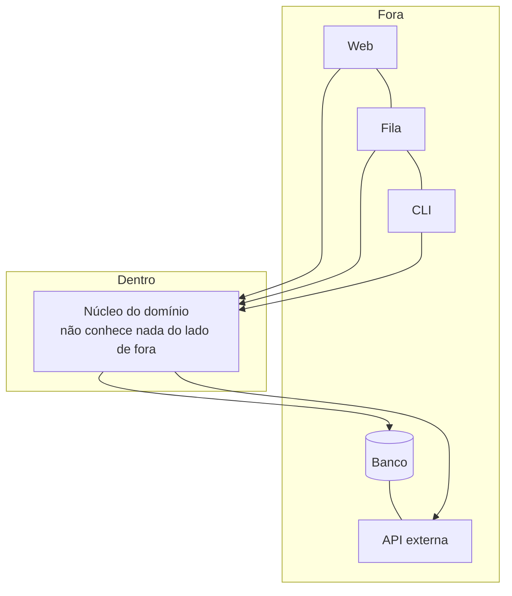

# Arquitetura Hexagonal

## Visão Geral

Arquitetura Hexagonal é o nome pelo qual [Ports and Adapters](ports-and-adapters.md)
se popularizou. **É o mesmo padrão** — Cockburn adotou os dois nomes, e o segundo
é o que ele passou a preferir por ser mais descritivo.

Este documento existe porque o nome "hexagonal" é o mais usado na prática e
produz mal-entendidos próprios, que vale desfazer.

## Problema

O hexágono é uma escolha de desenho, não uma prescrição. Cockburn explicou que
escolheu seis lados por conveniência gráfica — cabem portas suficientes ao redor
sem que o desenho fique poluído — e para evitar a leitura de "cima e baixo" que a
imagem de camadas impõe.

Três mal-entendidos vêm daí.

**"São seis camadas."** Não são. O número não significa nada.

**"Cada lado é um tipo de adaptador."** Não. Um sistema pode ter dois adaptadores
ou vinte.

**"É diferente de Ports and Adapters."** Não é. Times debatem qual adotar como se
fossem alternativas.

## Conceitos Centrais

### O que o desenho comunica

Duas ideias, e só duas: existe um **dentro** e um **fora**; e todas as
dependências de código apontam para dentro.

A ausência de hierarquia entre os elementos do lado de fora é o ponto. Numa
arquitetura em camadas, a interface do usuário fica no topo e o banco na base, o
que sugere uma ordem que não existe. No hexágono, os dois são igualmente
exteriores.

### O que muda em relação a camadas

| | Camadas | Hexagonal |
|---|---|---|
| Metáfora | Pilha | Dentro e fora |
| Direção | De cima para baixo | Para dentro |
| Banco de dados | Camada inferior | Um adaptador entre outros |
| Interface do usuário | Camada superior | Um adaptador entre outros |
| Regra | Só a camada de baixo | Só o que está mais para dentro |

A mudança prática decisiva: em camadas, o domínio depende da persistência. Em
Hexagonal, a persistência depende do domínio.

## Quando Usar

As mesmas condições de [Ports and Adapters](ports-and-adapters.md): mais de um
canal, valor recorrente em testar sem infraestrutura, dependências voláteis,
domínio com lógica substancial.

Prefira este **nome** quando o time já o conhece — a familiaridade reduz atrito de
adoção.

## Quando Não Usar

As mesmas condições de Ports and Adapters. Em resumo: CRUD, canal único e estável,
sistemas pequenos, portas que espelham a infraestrutura, ou ausência de mecanismo
que imponha a regra.

Um caso adicional específico do nome: **quando o hexágono é adotado como
estrutura de diretórios sem a regra de dependência.** Times criam
`dominio/`, `aplicacao/`, `adaptadores/` e continuam importando infraestrutura no
domínio. O resultado tem a aparência do padrão e nenhuma das propriedades.

## Alternativas

As mesmas de Ports and Adapters. Vale acrescentar: **os outros três nomes**.
Onion e Clean Architecture compartilham a tese; escolher entre eles é
principalmente uma decisão de vocabulário de time.

## Trade-offs

Idênticos aos de [Ports and Adapters](ports-and-adapters.md). O nome não muda o
custo.

O único trade-off próprio do nome é de comunicação: "hexagonal" é mais
reconhecido e mais sujeito a mal-entendido; "ports and adapters" é mais preciso e
menos conhecido.

## Modos de Falha

Os mesmos de Ports and Adapters, mais dois específicos do nome:

**Hexágono decorativo.** Estrutura de diretórios sem regra de dependência
imposta.

**Discussão sobre o número de lados.** Tempo gasto debatendo se um adaptador novo
"cabe no hexágono".

## Erros Comuns

**Tratar como padrão distinto de Ports and Adapters.** É o mesmo.

**Ler os seis lados como prescrição.** São desenho.

**Adotar os diretórios sem a regra.** O mais comum e o mais caro, porque produz o
custo integral e nenhum benefício.

**Debater qual dos quatro nomes adotar.** A escolha entre Hexagonal, Onion e Clean
é de vocabulário; a decisão que importa é se a regra de direção vale e como será
imposta.

## Exemplo Real

Um time adotou "arquitetura hexagonal", criou a estrutura de diretórios e
apresentou o resultado.

Seis meses depois, uma análise de dependências mostrou dezenove imports de
`infra` dentro de `dominio`, e as entidades carregavam anotações do ORM.

O diagnóstico do time foi "falta de disciplina". O diagnóstico correto era outro:
a regra existia como acordo verbal e nada a verificava.

A correção foi um teste de arquitetura de dez linhas — nenhum pacote de domínio
importa `infra`. Falhou com as dezenove violações, que foram corrigidas em três
semanas, e nenhuma nova apareceu depois.

O padrão não estava errado, e o time não era indisciplinado. Faltava o mecanismo.
Ver
[arquitetura vs. implementação](../01-fundamentals/architecture-vs-implementation.md).

## Os quatro nomes, lado a lado

Comparação para encerrar a discussão de qual adotar:

| | Ports and Adapters | Hexagonal | Onion | Clean |
|---|---|---|---|---|
| Autor, ano | Cockburn, 2005 | Cockburn, 2005 | Palermo, 2008 | Martin, 2012 |
| Regra de direção | Para dentro | Para dentro | Para dentro | Para dentro |
| Metáfora | Dentro e fora | Hexágono | Círculos | Círculos |
| Nomeia o interior? | Não | Não | Sim: domínio, serviço de domínio, aplicação | Sim: entidades, casos de uso |
| Prescreve o que atravessa? | Não | Não | Não | Sim: estruturas simples |
| Cerimônia | Menor | Menor | Média | Maior |

A propriedade fundamental — dependências apontam para dentro — é idêntica nos
quatro. As diferenças são de vocabulário interno e de quanto o padrão prescreve.

A escolha prática: adote o nome que seu time já conhece, e decida separadamente
duas coisas que importam mais que o nome — **quanto do interior você vai nomear**
e **o que atravessa as fronteiras**. Times gastam reuniões escolhendo entre os
quatro e nenhuma decidindo essas duas.

## Conceitos Relacionados

- [Ports and Adapters](ports-and-adapters.md) — a formulação original e o
  tratamento completo.
- [Onion](onion-architecture.md) e
  [Clean Architecture](clean-architecture.md) — as variações.
- [Camadas](layering.md) — o arranjo que este padrão substitui.

## Exercício Prático

Se seu sistema declara usar arquitetura hexagonal, escreva o teste que verifica a
regra: nenhum pacote de domínio importa infraestrutura.

Rode e conte as violações antes de corrigir qualquer coisa.

## Perguntas de Entrevista

- Qual a diferença entre Hexagonal e Ports and Adapters?
- Por que seis lados?
- Como você verifica que a regra de dependência está sendo respeitada?

## Para Aprofundar

- Cockburn, Alistair. *Hexagonal Architecture*, 2005 — inclui a explicação sobre
  a escolha do nome.
- Martin, Robert C. *Clean Architecture*. Prentice Hall, 2017 — a comparação
  entre as variações.
