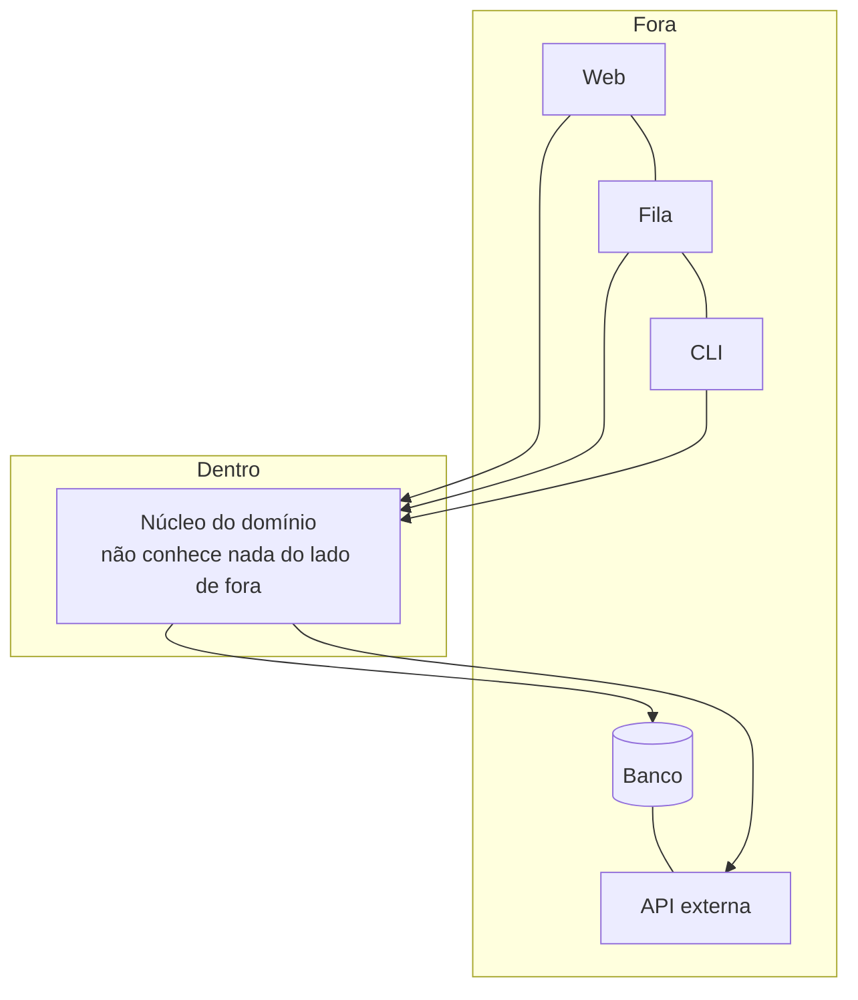

# Arquitetura Hexagonal

## Visão Geral

Arquitetura Hexagonal é o nome pelo qual [Ports and Adapters](/02-software-design/ports-and-adapters.md)
se popularizou. **É o mesmo padrão** — Cockburn adotou os dois nomes, e o segundo
é o que ele passou a preferir por ser mais descritivo.

Este documento existe porque o nome "hexagonal" é o mais usado na prática e
produz mal-entendidos próprios, que vale desfazer.

## Problema

O hexágono é uma escolha de desenho, não uma prescrição. Cockburn explicou que
escolheu seis lados por conveniência gráfica — cabem portas suficientes ao redor
sem que o desenho fique poluído — e para evitar a leitura de "cima e baixo" que a
imagem de camadas impõe.

Três mal-entendidos vêm daí.

**"São seis camadas."** Não são. O número não significa nada.

**"Cada lado é um tipo de adaptador."** Não. Um sistema pode ter dois adaptadores
ou vinte.

**"É diferente de Ports and Adapters."** Não é. Times debatem qual adotar como se
fossem alternativas.

## Conceitos Centrais

### O que o desenho comunica



Duas ideias, e só duas: existe um **dentro** e um **fora**; e todas as
dependências de código apontam para dentro.

A ausência de hierarquia entre os elementos do lado de fora é o ponto. Numa
arquitetura em camadas, a interface do usuário fica no topo e o banco na base, o
que sugere uma ordem que não existe. No hexágono, os dois são igualmente
exteriores.

### O que muda em relação a camadas

| | Camadas | Hexagonal |
|---|---|---|
| Metáfora | Pilha | Dentro e fora |
| Direção | De cima para baixo | Para dentro |
| Banco de dados | Camada inferior | Um adaptador entre outros |
| Interface do usuário | Camada superior | Um adaptador entre outros |
| Regra | Só a camada de baixo | Só o que está mais para dentro |

A mudança prática decisiva: em camadas, o domínio depende da persistência. Em
Hexagonal, a persistência depende do domínio.

## Quando Usar

As mesmas condições de [Ports and Adapters](/02-software-design/ports-and-adapters.md): mais de um
canal, valor recorrente em testar sem infraestrutura, dependências voláteis,
domínio com lógica substancial.

Prefira este **nome** quando o time já o conhece — a familiaridade reduz atrito de
adoção.

## Quando Não Usar

As mesmas condições de Ports and Adapters. Em resumo: CRUD, canal único e estável,
sistemas pequenos, portas que espelham a infraestrutura, ou ausência de mecanismo
que imponha a regra.

Um caso adicional específico do nome: **quando o hexágono é adotado como
estrutura de diretórios sem a regra de dependência.** Times criam
`dominio/`, `aplicacao/`, `adaptadores/` e continuam importando infraestrutura no
domínio. O resultado tem a aparência do padrão e nenhuma das propriedades.

## Alternativas

As mesmas de Ports and Adapters. Vale acrescentar: **os outros três nomes**.
Onion e Clean Architecture compartilham a tese; escolher entre eles é
principalmente uma decisão de vocabulário de time.

## Trade-offs

Idênticos aos de [Ports and Adapters](/02-software-design/ports-and-adapters.md). O nome não muda o
custo.

O único trade-off próprio do nome é de comunicação: "hexagonal" é mais
reconhecido e mais sujeito a mal-entendido; "ports and adapters" é mais preciso e
menos conhecido.

## Modos de Falha

Os mesmos de Ports and Adapters, mais dois específicos do nome:

**Hexágono decorativo.** Estrutura de diretórios sem regra de dependência
imposta.

**Discussão sobre o número de lados.** Tempo gasto debatendo se um adaptador novo
"cabe no hexágono".

## Erros Comuns

**Tratar como padrão distinto de Ports and Adapters.** É o mesmo.

**Ler os seis lados como prescrição.** São desenho.

**Adotar os diretórios sem a regra.** O mais comum e o mais caro, porque produz o
custo integral e nenhum benefício.

**Debater qual dos quatro nomes adotar.** A escolha entre Hexagonal, Onion e Clean
é de vocabulário; a decisão que importa é se a regra de direção vale e como será
imposta.

## Exemplo Real

Um time adotou hexagonal num serviço novo e, seis meses depois, tinha dezenove imports de `infra`
dentro de `dominio` — o caso descrito em
[arquitetura vs. implementação](/01-fundamentals/architecture-vs-implementation.md), onde a
lição é sobre a distância entre a arquitetura declarada e a implementada.

O que interessa aqui é o que veio depois, porque ele responde à pergunta específica do padrão:
**depois de corrigido, o hexagonal se pagou?**

As dezenove violações foram corrigidas em três semanas, e um teste de arquitetura passou a impedir
novas. A partir daí o serviço operou com a estrutura de fato isolada por dezoito meses, durante os
quais três trocas de infraestrutura aconteceram:

```text
troca                          arquivos tocados   duração
provedor de pagamento          adaptador + teste     6 dias
banco relacional → gerenciado  adaptador + config    2 dias
fila própria → gerenciada      adaptador + teste     4 dias
```

Nenhuma tocou o domínio. Como referência, a mesma troca de provedor de pagamento em outro serviço
da empresa — sem isolamento, com o cliente HTTP importado direto pelos casos de uso — levou sete
semanas e tocou 41 arquivos.

O custo do padrão, medido no mesmo período:

```text
arquivos a mais no serviço                    ~30%
tempo de integração de pessoa nova            +1,5 dia, estimado
casos de uso que precisaram de porta nova     4 de 23
portas com um único adaptador, após 18 meses  6 de 9
```

A última linha é a que o time considera a mais honesta: dois terços das portas nunca tiveram um
segundo adaptador, e provavelmente nunca terão. Elas são custo de indireção sem retorno de
substituição — pagas para que as três que importaram funcionassem.

Na retrospectiva: o saldo foi positivo porque o serviço era de integração intensa, com quatro
dependências externas voláteis. Num serviço de domínio estável e pouca infraestrutura, as mesmas
seis portas ociosas seriam o resultado inteiro — e a conclusão seria oposta.

Esse é o critério que o time passou a aplicar antes de adotar o padrão em serviços novos: contar
as dependências externas que podem mudar. Acima de três, o isolamento se paga; abaixo, ele
produz indireção que ninguém exerce.

E há um detalhe de sequência que a equipe considera decisivo: as três trocas foram feitas
**depois** de o teste de arquitetura existir. Sem ele, as dependências teriam voltado a vazar
entre uma troca e outra, e a segunda troca já não encontraria o isolamento que a primeira
supunha. O padrão sem mecanismo de verificação tem meia-vida de meses.

## Conceitos Relacionados

- [Ports and Adapters](/02-software-design/ports-and-adapters.md) — a formulação original e o
  tratamento completo.
- [Onion](/02-software-design/onion-architecture.md) e
  [Clean Architecture](/02-software-design/clean-architecture.md) — as variações.
- [Camadas](/02-software-design/layering.md) — o arranjo que este padrão substitui.

## Exercício Prático

Se seu sistema declara usar arquitetura hexagonal, escreva o teste que verifica a
regra: nenhum pacote de domínio importa infraestrutura.

Rode e conte as violações antes de corrigir qualquer coisa.

## Perguntas de Entrevista

- Qual a diferença entre Hexagonal e Ports and Adapters?
- Por que seis lados?
- Como você verifica que a regra de dependência está sendo respeitada?

## Para Aprofundar

- Cockburn, Alistair. *Hexagonal Architecture*, 2005 — inclui a explicação sobre
  a escolha do nome.
- Martin, Robert C. *Clean Architecture*. Prentice Hall, 2017 — a comparação
  entre as variações.
