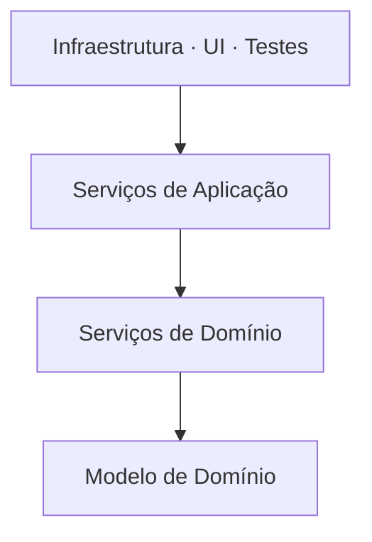

# Arquitetura Onion

## Visão Geral

Arquitetura Onion, formulada por Jeffrey Palermo em 2008, organiza o sistema em
círculos concêntricos com o modelo de domínio no centro e uma única regra de
dependência: **as setas apontam para dentro**.

Compartilha a tese de [Ports and Adapters](/02-software-design/ports-and-adapters.md). O que ela
acrescenta é **nomear as camadas internas**, distinguindo o modelo de domínio dos
serviços que o orquestram.

## Problema

Ports and Adapters diz que existe um dentro e um fora, e não diz nada sobre a
organização do dentro.

Em domínios com lógica substancial, esse silêncio produz uma pergunta recorrente:
onde mora a regra que envolve mais de uma entidade? Dentro de uma delas — o que
força uma a conhecer a outra — ou num serviço?

Onion responde nomeando os anéis internos.

## Conceitos Centrais

### Os anéis

**Modelo de domínio** — entidades e objetos de valor, com as regras que dependem
apenas de si.

**Serviços de domínio** — regras que envolvem mais de uma entidade e não
pertencem a nenhuma. Continuam sendo domínio: não conhecem infraestrutura.

**Serviços de aplicação** — orquestração de casos de uso. Coordenam, controlam
transação, e definem as interfaces que a infraestrutura implementa.

**Infraestrutura, UI e testes** — o anel externo. Todos igualmente externos, o
que é a mesma simetria do hexágono.

### A regra

Um anel pode depender dos internos, nunca dos externos. Igual à regra de
Hexagonal, com mais granularidade.

### O que muda em relação a Hexagonal

Praticamente nada na propriedade fundamental. A diferença é de **vocabulário
interno**: Onion dá nome à distinção entre serviço de domínio e serviço de
aplicação, que Hexagonal deixa em aberto.

Essa distinção é útil quando ela existe de fato — em domínios com regras que
envolvem múltiplas entidades. Em domínios simples, ela produz um anel que só
repassa.

## Quando Usar

- Quando o domínio tem regras que envolvem várias entidades e não cabem em
  nenhuma delas.
- Quando o time já usa vocabulário de [DDD](/04-domain-driven-design/index.md) —
  os anéis mapeiam diretamente em entity, domain service e application service.
- Quando distinguir orquestração de regra tem valor prático: as duas mudam por
  razões diferentes.

## Quando Não Usar

**Quando não há serviços de domínio reais.** Se todas as regras cabem nas
entidades, o anel de serviços de domínio fica vazio ou repassa. Ver
[camada anêmica](/02-software-design/layering.md).

**Em domínios simples.** As mesmas condições de
[Ports and Adapters](/02-software-design/ports-and-adapters.md): CRUD, canal único, sistemas
pequenos.

**Quando o número de anéis vira meta.** Times criam os quatro por simetria, e dois
deles apenas delegam.

**Quando a regra não é imposta.** Igual aos demais: sem verificação, os anéis são
diretórios.

## Alternativas

- **[Hexagonal](/02-software-design/hexagonal-architecture.md)** — quando a distinção entre serviço de
  domínio e de aplicação não agrega.
- **[Clean Architecture](/02-software-design/clean-architecture.md)** — vocabulário diferente para a
  mesma estrutura, com ênfase em casos de uso.
- **Camadas com inversão na persistência** — captura a maior parte do benefício
  com menos estrutura.

## Trade-offs

| Onion | Hexagonal |
|---|---|
| Vocabulário interno definido | Interior livre |
| Distinção explícita entre regra e orquestração | A cargo do time |
| Mais anéis a justificar | Menos estrutura prescrita |
| Risco de anel anêmico | Sem esse risco |

Em relação a não usar nenhum dos dois, os trade-offs são os de
[Ports and Adapters](/02-software-design/ports-and-adapters.md).

## Modos de Falha

**Anel de serviços de domínio anêmico.** Existe por simetria e apenas repassa
para as entidades.

**Serviço de aplicação com regra de negócio.** A regra migra para a orquestração
porque é mais fácil escrevê-la ali, e o modelo de domínio vira estrutura de
dados.

**Modelo de domínio anêmico.** O modo de falha mais comum de todos os quatro
padrões: entidades sem comportamento, toda a lógica nos serviços. Ver
[encapsulamento](/02-software-design/encapsulation.md).

**Anéis como diretórios sem regra imposta.**

## Erros Comuns

**Criar todos os anéis por default.** Crie o que tiver conteúdo.

**Confundir serviço de domínio com serviço de aplicação.** O primeiro contém
regra; o segundo, coordenação. Se o serviço de aplicação decide algo do negócio,
a regra está no lugar errado.

**Tratar como padrão distinto de Hexagonal.** A propriedade fundamental é a
mesma.

**Deixar a entidade anêmica.** Anula boa parte do valor de ter um modelo de
domínio no centro.

## Exemplo Real

Um sistema de seguros tinha a regra de elegibilidade dependendo de três
agregados: apólice, histórico de sinistros e perfil do segurado.

Sob Hexagonal, sem vocabulário para isso, a regra foi parar no serviço de
aplicação — junto com o controle de transação e a orquestração de chamadas.

O efeito: testar a elegibilidade exigia montar o cenário de orquestração inteiro,
e uma mudança na regra de negócio ficava misturada a mudanças de coordenação no
mesmo arquivo.

A reorganização em Onion extraiu `AvaliadorDeElegibilidade` como serviço de
domínio — sem dependência de infraestrutura, testável com três objetos em memória.

O serviço de aplicação ficou com o que lhe cabe: buscar os três agregados,
chamar o avaliador, persistir o resultado.

O detalhe honesto: o anel de serviços de domínio deste sistema tem duas classes.
Criar um anel para duas classes é defensável aqui porque essas duas concentram a
regra que mais muda. Em outro sistema, com o anel vazio, ele não se justificaria.

## Conceitos Relacionados

- [Ports and Adapters](/02-software-design/ports-and-adapters.md) — a formulação base.
- [Hexagonal](/02-software-design/hexagonal-architecture.md) — o mesmo padrão, sem vocabulário
  interno.
- [Clean Architecture](/02-software-design/clean-architecture.md) — a variação com ênfase em casos de
  uso.
- [DDD tático](/04-domain-driven-design/index.md) — de onde vem o vocabulário
  dos anéis.

## Exercício Prático

Liste as regras de negócio do seu domínio que envolvem mais de uma entidade.

Para cada uma, verifique onde ela mora hoje: numa das entidades, num serviço de
domínio, ou misturada à orquestração?

As que estão misturadas à orquestração são as que Onion nomeia e separa.

## Perguntas de Entrevista

- O que Onion acrescenta em relação a Hexagonal?
- Qual a diferença entre serviço de domínio e serviço de aplicação?
- Quando o anel de serviços de domínio não se justifica?

## Para Aprofundar

- Palermo, Jeffrey. *The Onion Architecture*, 2008.
- Evans, Eric. *Domain-Driven Design*. Addison-Wesley, 2003 — serviços de domínio.
- Vernon, Vaughn. *Implementing Domain-Driven Design*. Addison-Wesley, 2013.
