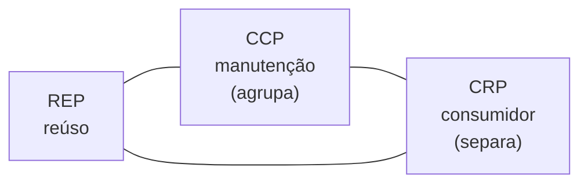

# Design de Pacotes

## Visão Geral

Um pacote é a menor unidade que se publica e se versiona. Design de pacotes é
decidir quais classes ficam juntas nessa unidade.

Robert Martin formulou três princípios de coesão para essa decisão. O que os
torna interessantes não é cada um isoladamente — é que **eles se contradizem**, e
a tensão entre eles é a decisão real.

## Problema

Agrupar por conveniência produz duas patologias.

**Pacotes grandes demais.** Quem depende de uma classe recebe o pacote inteiro,
com todas as suas dependências transitivas. Uma mudança em qualquer parte força
nova versão para todos os consumidores.

**Pacotes pequenos demais.** Cada mudança relevante exige publicar cinco pacotes
em ordem, com versões compatíveis entre si. A coordenação vira o custo dominante.

Nenhum dos dois extremos é resolvido por uma regra simples, porque os princípios
que evitam um agravam o outro.

## Conceitos Centrais

### Os três princípios de coesão

**REP — Equivalência entre release e reúso.**
> A unidade de reúso é a unidade de release.

O que se reusa precisa ser versionado. Classes que consumidores usam juntas
devem ser publicadas juntas, com um número de versão e notas de mudança.

**CCP — Fechamento comum.**
> Classes que mudam pelas mesmas razões, no mesmo momento, ficam no mesmo pacote.

É [coesão](../01-fundamentals/cohesion.md) aplicada a pacotes. Minimiza o número
de pacotes que precisam ser publicados por causa de uma mudança.

**CRP — Reúso comum.**
> Classes que não são usadas juntas não devem ficar no mesmo pacote.

O inverso do anterior, visto pelo consumidor: não force ninguém a depender do que
não usa. É o **I** do [SOLID](solid.md) em escala de pacote.

### A tensão

CCP quer agrupar — menos pacotes a publicar. CRP quer separar — menos dependência
desnecessária.

Martin descreve isso como um triângulo em que se escolhe dois lados. Sacrificar
CRP produz consumidores com dependências demais. Sacrificar CCP produz muitas
publicações por mudança.

A posição correta muda com a maturidade: **projetos jovens tendem para CCP**
(agrupar, para publicar menos), **projetos maduros tendem para CRP** (separar,
porque há mais consumidores incomodados).

### Pacote não é diretório

Em várias linguagens, pacote e diretório coincidem. Onde não coincidem — ou onde
o diretório não impõe nada — o que define o pacote é a unidade de publicação:
o artefato, o módulo declarado, a biblioteca.

Se tudo é publicado junto, há um pacote só, independentemente de quantos
diretórios existam.

## Modelo Mental

**Pacote é o que você versiona.** Se dois grupos de classes precisam de números
de versão independentes, são dois pacotes. Se sempre são publicados juntos, são
um.

## Quando Usar

- Quando o sistema publica bibliotecas consumidas por outros times.
- Quando partes precisam de ciclos de release independentes.
- Quando o tempo de build cresce e a compilação incremental depende da divisão.
- Ao preparar a extração de um módulo para serviço.

## Quando Não Usar

**Quando tudo é publicado junto.** Num monolito com um artefato, os princípios de
release não se aplicam. Ali a divisão relevante é de
[módulo](modular-design.md), não de pacote.

**Como meta de pureza.** Perseguir CRP num sistema com dois consumidores internos
produz fragmentação e coordenação sem benefício.

**Quando o custo de coordenação supera o de dependência.** Se separar produz
cinco pacotes que sempre sobem juntos com versões casadas, a separação piorou o
sistema.

**Antes de haver consumidores reais.** Os princípios são sobre servir
consumidores. Sem eles, é especulação — ver [YAGNI](yagni.md).

## Alternativas

- **Artefato único com módulos internos** — resolve a maioria dos casos sem custo
  de versionamento.
- **Monorepo com build por alvo** — separação lógica com publicação conjunta.
- **Separação só onde há consumidor externo** — publicar o que atravessa a
  fronteira organizacional e manter o resto interno.

## Trade-offs

| Mais pacotes (CRP) | Menos pacotes (CCP) |
|---|---|
| Consumidor depende só do que usa | Depende de mais que o necessário |
| Build incremental mais fino | Build mais grosso |
| Mais publicações por mudança | Uma publicação |
| Coordenação de versões compatíveis | Sem coordenação |
| Grafo de dependências maior | Grafo simples |

## Modos de Falha

**Pacote monolítico.** Tudo num artefato; qualquer mudança versiona tudo.

**Inferno de versões.** Pacotes demais, com restrições de compatibilidade que se
contradizem.

**Pacote `common` na zona da dor.** Concreto, estável e do qual tudo depende. Ver
[direção de dependência](dependency-direction.md).

**Ciclo entre pacotes.** Impede ordem de build e extração.

## Erros Comuns

**Aplicar os princípios sem consumidores.** Eles existem para servir quem
consome.

**Ignorar a tensão entre CCP e CRP.** Tratar os três como compatíveis leva a
oscilar entre agrupar e separar sem critério.

**Confundir pacote com diretório.** O que importa é a unidade de publicação.

**Criar pacote por camada técnica.** Reproduz o problema de
[camadas](layering.md) no nível de release.

## Exemplo Real

Uma empresa publicava uma biblioteca `plataforma-comum` usada por sete times.
Continha utilitários de data, cliente HTTP, tipos de domínio compartilhados,
configuração de log e helpers de teste.

Consequências observadas em um ano: 34 publicações, das quais 31 por mudanças que
afetavam um único consumidor; todos os sete times obrigados a atualizar a cada
uma; e dois times que congelaram a versão para parar de acompanhar — passando a
não receber correções.

A divisão por CRP — quem usa o quê, medido pelos imports reais — produziu quatro
pacotes: `tipos-dominio` (usado por sete), `http` (usado por quatro), `datas`
(dois) e `teste` (cinco, mas só em escopo de teste).

Depois: `tipos-dominio` teve 4 publicações no ano seguinte; `datas`, 11 — que
agora afetam dois times em vez de sete.

O que a divisão custou: quatro artefatos a manter, e uma decisão a mais em cada
mudança. O que comprou: os dois times destravaram e voltaram a acompanhar.

## Monorepo não dispensa design de pacotes

Uma confusão comum: adotar monorepo é tratado como se eliminasse a questão de
pacotes, já que tudo é versionado junto.

Elimina o problema de **coordenação de versões** — nunca há incompatibilidade
entre duas partes do mesmo commit. Não elimina os outros dois.

**CCP continua valendo.** O que muda junto deve ficar junto, porque isso governa
o escopo de build e de teste. Num monorepo com build incremental, a divisão
determina o que precisa ser recompilado e reexecutado a cada mudança — e essa é a
diferença entre um ciclo de dois minutos e um de quarenta.

**CRP continua valendo.** Um alvo de build que depende de mais do que usa
recompila sem necessidade e amplia o raio de qualquer quebra.

O que o monorepo muda é o custo do erro: separar mal é corrigível num commit, em
vez de exigir uma migração de versões coordenada entre times. Isso permite ser
mais agressivo na divisão — e é a razão pela qual monorepos costumam ter mais
alvos de build do que polirepos têm artefatos.

## Conceitos Relacionados

- [Design Modular](modular-design.md) — a divisão lógica que precede.
- [Direção de Dependência](dependency-direction.md) — o grafo entre pacotes.
- [Design de Componentes](component-design.md) — a unidade de implantação.
- [Coesão](../01-fundamentals/cohesion.md) — o princípio geral por trás do CCP.

## Exercício Prático

Se seu sistema publica bibliotecas, extraia para cada uma: quantos consumidores
tem, e qual fração das classes cada consumidor usa.

Consumidores que usam menos de um terço do pacote são evidência de violação de
CRP.

Depois conte as publicações do último ano e quantas afetaram um consumidor só.

## Perguntas de Entrevista

- Quais são os três princípios de coesão de componentes e como se contradizem?
- Como a maturidade de um projeto muda a posição entre CCP e CRP?
- Quando os princípios de pacote não se aplicam?

## Para Aprofundar

- Martin, Robert C. *Clean Architecture*. Prentice Hall, 2017 — princípios de
  coesão e acoplamento de componentes.
- Martin, Robert C. *Agile Software Development*. Prentice Hall, 2002 — a
  formulação original.
