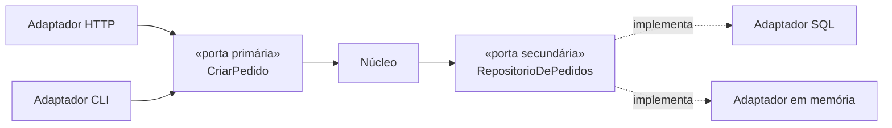

# Ports and Adapters

## Visão Geral

Ports and Adapters, formulado por Alistair Cockburn em 2005, propõe uma regra
única:

> O núcleo da aplicação não conhece nada do mundo exterior. Toda comunicação
> passa por **portas** que o núcleo define, e **adaptadores** que o mundo
> implementa.

É a formulação original da qual [Hexagonal](hexagonal-architecture.md),
[Onion](onion-architecture.md) e [Clean Architecture](clean-architecture.md) são
variações.

## Problema

O problema que Cockburn enunciou é específico: aplicações ficam amarradas ao
canal de entrada e ao mecanismo de persistência, e por isso não podem ser
testadas nem exercitadas fora deles.

A lógica de negócio vive dentro de controladores HTTP e depende de tabelas.
Testá-la exige subir um servidor e um banco. Reusá-la por outro canal — uma fila,
um comando de terminal — exige duplicá-la.

Ele descreveu isso como o sintoma de que **o dentro e o fora não estavam
separados**.

## Conceitos Centrais

### Porta é uma interface definida pelo núcleo

Uma porta declara uma necessidade ou uma capacidade, no vocabulário do domínio.
Ela pertence ao núcleo — ver
[inversão de dependência](dependency-inversion.md).

**Portas primárias** (ou de condução) são o que o mundo pode pedir ao núcleo:
casos de uso.

**Portas secundárias** (ou conduzidas) são o que o núcleo precisa do mundo:
persistir, notificar, cotar.

### Adaptador implementa a porta

Um adaptador traduz entre o protocolo do mundo e a porta.

Toda seta de dependência aponta para o núcleo. É a única regra.

### A simetria é o ponto

A imagem do hexágono existe para eliminar a noção de "cima" e "baixo". Não há
camada superior nem inferior; há dentro e fora.

Isso importa porque em camadas a interface do usuário costuma ser tratada como
mais nobre que o banco. Aqui, os dois são igualmente exteriores, e o núcleo não
conhece nenhum.

## Quando Usar

- Quando a mesma lógica precisa ser acessada por mais de um canal.
- Quando testar o núcleo sem infraestrutura tem valor real e recorrente.
- Quando dependências externas são voláteis — provedores, protocolos.
- Em domínios com lógica substancial, onde o núcleo justifica ser protegido.

## Quando Não Usar

**Em aplicações majoritariamente CRUD.** Se o núcleo é "validar e gravar", a
indireção adiciona arquivos e não protege nada. O custo é imediato e o benefício
inexistente.

**Quando há um canal e uma persistência, e continuará assim.** O padrão compra
substituibilidade. Sem ela, é custo puro.

**Em sistemas pequenos.** O número de arquivos por caso de uso cresce
consideravelmente; num sistema de poucos casos, isso domina.

**Quando as portas viram espelho da infraestrutura.** Se `RepositorioDePedidos`
tem `findByStatusIn` e devolve o tipo do ORM, o núcleo continua acoplado com
cerimônia extra. Ver [interfaces](interfaces.md).

**Quando o time não sustenta a disciplina.** Sem
[teste de arquitetura](../01-fundamentals/architecture-vs-implementation.md), a
regra é atravessada em meses e o sistema fica com o custo sem a propriedade.

## Alternativas

- **Camadas com inversão só na persistência** — captura a maior parte do benefício
  por uma fração do custo. É o arranjo mais comum e frequentemente o correto.
- **Adaptador só nas dependências voláteis** — inverter o que é instável e chamar
  direto o que é estável.
- **Transaction script** — em domínios simples, procedimento direto é mais claro.

## Trade-offs

| Ports and Adapters | Acesso direto |
|---|---|
| Núcleo testável sem infraestrutura | Teste carrega banco e servidor |
| Múltiplos canais sem duplicar lógica | Lógica acoplada ao canal |
| Provedor substituível | Troca toca o núcleo |
| Muitos arquivos por caso de uso | Poucos arquivos |
| Tradução de tipos em cada borda | Sem tradução |
| Fluxo difícil de seguir inteiro | Linear |

## Modos de Falha

**Porta espelho.** Extraída da infraestrutura, com vocabulário dela.

**Vazamento de tipo.** A porta devolve a entidade do ORM.

**Adaptadores que se conhecem.** Um adaptador chama outro diretamente,
contornando o núcleo.

**Núcleo anêmico.** Toda a lógica nos adaptadores; o núcleo só define tipos.

**Regra não imposta.** Sem verificação, o núcleo importa infraestrutura em meses.

## Erros Comuns

**Aplicar a CRUD.** O mais comum.

**Colocar as portas junto dos adaptadores.** Anula a inversão.

**Criar uma porta por método de repositório.** Portas expressam necessidades do
domínio, não operações de tabela.

**Achar que os quatro nomes são coisas diferentes.** Compartilham a mesma tese.

## Exemplo Real

Um sistema de cobrança precisava ser acionado por três caminhos: API para o
portal do cliente, evento de fila para cobrança automática, e comando de terminal
para operação manual.

Antes, a lógica estava no controlador HTTP. O caminho da fila a duplicou com
variações; o de terminal chamava a API por HTTP contra o próprio serviço.

A reorganização definiu `CobrarAssinatura` como porta primária, com três
adaptadores. A lógica passou a existir uma vez.

O ganho concreto não foi arquitetural: uma divergência de comportamento entre o
caminho HTTP e o da fila — que já tinha causado dois incidentes de cobrança
duplicada — deixou de ser possível.

O contraexemplo, no mesmo sistema: o módulo de cadastro de clientes, que é CRUD
com validação, permaneceu como controlador chamando repositório. Aplicar o padrão
ali teria triplicado o número de arquivos sem proteger nada.

## O ganho de teste, concretamente

O benefício mais citado do padrão é "testar sem infraestrutura", e ele costuma ser
enunciado de forma vaga. O que muda na prática:

**Velocidade.** Testes de domínio com adaptadores em memória rodam em
milissegundos. Uma suíte que levava dez minutos com banco passa a levar segundos,
e o efeito colateral é comportamental: uma suíte rápida é executada a cada
alteração; uma lenta é executada no CI e ignorada localmente.

**Determinismo.** Sem banco, sem rede e sem relógio real, o teste não falha por
motivo alheio à mudança. Testes que falham esporadicamente deixam de ser
consultados, e uma suíte não confiável é pior que nenhuma.

**Cenários difíceis viram triviais.** Simular o provedor de pagamento fora do ar,
a chamada que expira, o identificador duplicado — tudo isso é uma linha num
adaptador em memória e um exercício de infraestrutura sem o padrão.

O terceiro é o que mais rende e o menos mencionado. Ele é o que torna viável
testar os caminhos de falha, que são exatamente os que decidem arquitetura e os
que quase nunca são exercitados.

## Conceitos Relacionados

- [Hexagonal](hexagonal-architecture.md) — o mesmo padrão, outro nome.
- [Onion](onion-architecture.md) e
  [Clean Architecture](clean-architecture.md) — as variações.
- [Inversão de Dependência](dependency-inversion.md) — o mecanismo.

## Exercício Prático

Escolha um caso de uso do seu sistema e liste tudo que ele toca fora do domínio:
banco, fila, serviço externo, relógio, gerador de identificador.

Para cada um, escreva a porta que o núcleo definiria — no vocabulário do domínio,
não da tecnologia.

Depois estime: quantos arquivos a mais isso custaria, e o que compraria?

## Perguntas de Entrevista

- Qual a diferença entre porta primária e secundária?
- Por que a metáfora do hexágono, e não de camadas?
- Quando este padrão não se paga?

## Para Aprofundar

- Cockburn, Alistair. *Hexagonal Architecture*, 2005.
- Freeman, Steve; Pryce, Nat. *Growing Object-Oriented Software, Guided by
  Tests*. Addison-Wesley, 2009.
