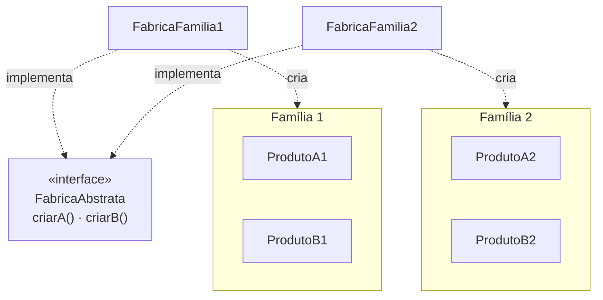

# Abstract Factory

## Visão Geral

Abstract Factory fornece uma interface para criar **famílias de objetos
relacionados**, sem especificar suas classes concretas.

A palavra que carrega o padrão é *família*: os produtos precisam ser usados
juntos e precisam ser compatíveis entre si. Sem essa restrição de compatibilidade,
o padrão é peso morto.

## Problema

Uma aplicação precisa criar vários objetos que devem pertencer ao mesmo conjunto
coerente, e misturar conjuntos produziria erro.

O exemplo original é uma biblioteca de interface gráfica: botões, janelas e menus
precisam ser todos do mesmo estilo visual. Um botão de um estilo com uma janela
de outro é um defeito.

A garantia que o padrão oferece é essa: **se você obtém tudo da mesma fábrica, os
objetos são compatíveis por construção.**

## Conceitos Centrais

### A estrutura

O cliente conhece apenas `FabricaAbstrata` e as interfaces dos produtos. Nunca as
classes concretas.

### O eixo rígido

A força do padrão é sua fraqueza: **adicionar um produto novo à família exige
alterar a interface da fábrica e todas as implementações.**

Adicionar uma família nova é barato — uma classe. Adicionar um produto é caro —
toca todas as fábricas existentes.

Isso significa que o padrão só se justifica quando o **conjunto de produtos é
estável** e o de famílias é o que varia. Se for o contrário, ele é o padrão
errado.

### Por que ele aparece pouco hoje

Três razões.

Sistemas modernos raramente têm famílias de produtos com restrição de
compatibilidade rígida. O caso de interface gráfica que motivou o padrão é
resolvido hoje por temas e folhas de estilo, não por hierarquias de classe.

Injeção de dependência resolve o problema de "não conhecer o tipo concreto" sem
agrupar em fábrica.

E linguagens com funções de primeira classe permitem passar um conjunto de
funções de criação, sem hierarquia paralela.

## Quando Usar

- Existem famílias de produtos com **restrição real de compatibilidade** entre
  eles.
- O conjunto de produtos é estável; as famílias é que variam.
- O cliente precisa ser blindado do conhecimento das classes concretas.
- Trocar a família inteira em tempo de execução ou de configuração tem valor.

## Quando Não Usar

**Quando não há restrição de compatibilidade.** Se os produtos podem ser
misturados sem erro, não há família — há objetos independentes, e cada um pode ser
obtido por injeção.

**Quando produtos novos são frequentes.** Cada um toca todas as fábricas. Se essa
é a variação esperada, o padrão está no eixo errado.

**Quando há uma família só.** Toda a estrutura para uma implementação.

**Quando injeção de dependência resolve.** Na maioria dos sistemas com um
contêiner de injeção, a garantia de coerência pode ser dada pela configuração, sem
hierarquia de fábricas.

**Como camada de configuração.** Usar Abstract Factory para escolher entre
implementações por ambiente é sobreposição a algo que o mecanismo de configuração
já faz.

## Alternativas

- **Injeção de dependência com configuração por perfil** — a resposta na maioria
  dos casos.
- **[Factory Method](/03-design-patterns/factory-method.md)** — quando é um produto, não uma família.
- **[Builder](/03-design-patterns/builder.md)** — quando o problema é montar um objeto complexo, não
  escolher entre famílias.
- **Passar um conjunto de funções de criação** — mesma coerência, sem hierarquia.

## Trade-offs

| Abstract Factory | Injeção direta |
|---|---|
| Coerência da família garantida | Coerência a cargo da configuração |
| Trocar a família é uma linha | Trocar toca vários pontos |
| Produto novo toca todas as fábricas | Produto novo é independente |
| Hierarquia paralela a manter | Sem hierarquia |
| Conhece a fábrica e as interfaces | Conhece só as interfaces |

## Modos de Falha

**Fábrica única.** Uma família só; toda a estrutura sem variação.

**Interface inchada.** Produtos acrescentados ao longo do tempo, e implementações
que devolvem nulo ou lançam exceção para os que não suportam.

**Fábrica como localizador de serviço.** O padrão degenera em um objeto que
devolve qualquer coisa, e o acoplamento volta disfarçado.

## Erros Comuns

**Aplicar sem restrição de compatibilidade.** O erro central.

**Confundir com [Factory Method](/03-design-patterns/factory-method.md).** Um cria um produto por
subclasse; o outro cria uma família por composição.

**Usar para seleção por ambiente.** Configuração resolve.

**Ignorar o custo de adicionar produto.** É o eixo caro, e precisa ser o raro.

## Exemplo Real

Um sistema de integração bancária precisava gerar, para cada banco, um conjunto
coerente: formatador de arquivo de remessa, parser de retorno, validador de conta
e calculador de dígito verificador.

Misturar bancos era um defeito real e já tinha acontecido — um retorno de um banco
processado com o parser de outro produziu conciliação errada por três dias.

`FabricaBancaria` com quatro operações de criação, uma implementação por banco.
O cliente obtém tudo de uma fábrica e não consegue misturar.

Onze bancos foram adicionados em quatro anos, cada um uma classe.

O eixo caro nunca foi exercido: nenhum produto novo foi adicionado à família em
quatro anos. Foi exatamente a condição que justificava o padrão — conjunto de
produtos estável, famílias variando — e ela se manteve.

Se um quinto produto tivesse surgido, teria tocado doze arquivos existentes — a interface da
fábrica e as onze implementações — mais as onze classes de produto novas, uma por família.
É o custo que o eixo rígido cobra, e é por isso que a estabilidade do conjunto de produtos é
pré-requisito e não detalhe.

## Onde ele aparece na prática

**APIs de parsing XML em Java.** O caso costuma ser citado aqui, e não deveria:
`DocumentBuilderFactory` declara uma operação de criação só — `newDocumentBuilder()` —, o que
pelo critério da seção anterior é [factory method](/03-design-patterns/factory-method.md), não
este padrão. A família coerente existe um nível abaixo, entre `Document`, `Element` e `Text`
de uma mesma implementação, e quem a mantém junta é o documento, não a fábrica.

**Bibliotecas de widgets multiplataforma.** O caso que originou o padrão, hoje
resolvido por temas na maior parte dos frameworks.

**Drivers de banco.** A compatibilidade é real — não se combina a conexão de um driver com o
comando de outro —, mas a forma é outra: em JDBC a cadeia é `Connection` cria `Statement` cria
`ResultSet`, factory methods encadeados, e não uma interface de fábrica com quatro operações.
Serve como ilustração da *restrição de compatibilidade*, não da estrutura do padrão.

O denominador comum é a restrição de compatibilidade: os objetos da família
foram projetados para trabalhar juntos e assumem coisas uns dos outros.

Num sistema de aplicação, essa condição é rara. Quando alguém propõe Abstract
Factory, a pergunta que decide é direta: **o que quebra concretamente se
misturarmos objetos de famílias diferentes?** Se não houver resposta específica,
não há família — há objetos independentes que podem ser injetados um a um, e o
padrão está sendo usado como agrupamento organizacional, que é uma função que ele
cumpre mal.

## Conceitos Relacionados

- [Factory Method](/03-design-patterns/factory-method.md) — um produto, variação por subclasse.
- [Builder](/03-design-patterns/builder.md) — construção em etapas.
- [Facade](/03-design-patterns/facade.md) — quando o objetivo é simplificar acesso, não garantir
  coerência.

## Exercício Prático

Procure no seu sistema conjuntos de objetos que precisam ser usados juntos e cuja
mistura seria um defeito.

Para cada conjunto, verifique como a coerência é garantida hoje. Se for por
convenção ou por revisão de código, o padrão pode se justificar. Se for por
configuração explícita, provavelmente não.

## Perguntas de Entrevista

- Qual a diferença entre Abstract Factory e Factory Method?
- Que tipo de mudança é cara neste padrão, e por quê?
- Por que ele aparece menos em sistemas modernos?

## Para Aprofundar

- Gamma, Erich et al. *Design Patterns*. Addison-Wesley, 1994.
- Fowler, Martin. *Inversion of Control Containers and the Dependency Injection
  Pattern*, 2004.
