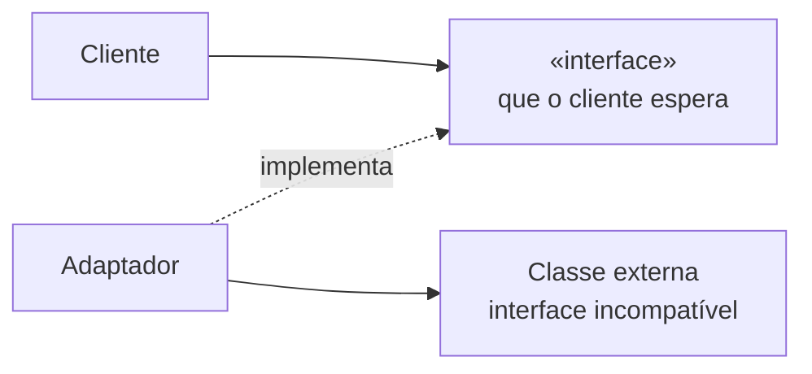

# Adapter

## Visão Geral

Adapter converte a interface de uma classe em outra que o cliente espera,
permitindo que classes com interfaces incompatíveis trabalhem juntas.

É o padrão de maior utilidade prática e menor controvérsia do catálogo. Também é
o único que é praticamente sempre correto quando aplicado na fronteira com código
que você não controla.

## Problema

Seu código espera uma interface. A biblioteca oferece outra. Você não controla
nenhuma das duas — a sua é definida pelo domínio, a dela pelo autor.

Três respostas possíveis. Mudar o seu código para falar a língua da biblioteca —
o que espalha a dependência por todo lugar e amarra o domínio a ela. Mudar a
biblioteca — normalmente impossível. Ou traduzir num ponto único.

Adapter é a terceira. Ele concentra a dependência num lugar, e é o que torna
possível trocar a biblioteca alterando um arquivo.

## Conceitos Centrais

### A estrutura

O adaptador implementa o que o cliente espera e traduz para o que a classe
externa oferece.

### Adapter é a defesa da fronteira

Este é o uso arquiteturalmente relevante, e conecta diretamente com
[Ports and Adapters](/02-software-design/ports-and-adapters.md): a porta é a
interface que o domínio define; o adaptador é quem a implementa falando com o
mundo.

A regra que dá o valor: **o tipo da biblioteca não atravessa o adaptador.** Se o
adaptador devolve `ExchangeRateResponse` da biblioteca, ele não adaptou nada —
apenas moveu a dependência de lugar.

### Adapter de objeto e de classe

O de objeto compõe: o adaptador guarda uma referência ao adaptado. O de classe
herda de ambos, e só existe em linguagens com herança múltipla.

O de objeto é preferível pelos motivos usuais de
[composição sobre herança](/02-software-design/composition-vs-inheritance.md).

### Adapter versus Facade

Confusão frequente. **Adapter** faz uma interface parecer outra — o alvo já
existe e é definido por outro. **[Facade](/03-design-patterns/facade.md)** cria uma interface nova e
mais simples sobre um subsistema — ninguém a exigia antes.

Adapter atende a um contrato existente; Facade inventa um.

## Quando Usar

- Integrar biblioteca ou serviço externo cuja interface você não controla.
- Isolar o domínio de um tipo de terceiro.
- Fazer código legado atender a uma interface nova sem alterá-lo.
- Suportar múltiplas implementações de uma mesma capacidade — vários provedores
  de pagamento, de e-mail, de armazenamento.

## Quando Não Usar

**Quando você controla os dois lados.** Se ambas as interfaces são suas, alinhe-as
em vez de traduzir. O adaptador vira dívida.

**Quando o adaptador é uma delegação um-para-um sem tradução.** Se cada método
apenas repassa com o mesmo nome e os mesmos tipos, ele não está adaptando nada.

**Quando ele deixa o tipo externo vazar.** Adaptador que devolve o tipo da
biblioteca não isolou.

**Como camada preventiva sobre tudo.** Adaptar bibliotecas estáveis da plataforma
— coleções, datas — é custo sem benefício. Ver
[YAGNI](/02-software-design/yagni.md).

**Quando a incompatibilidade é semântica, não sintática.** Se a biblioteca tem um
modelo conceitual diferente do seu, o adaptador vira um tradutor complexo que
esconde a incompatibilidade em vez de resolvê-la — e o vazamento aparece nos
casos de borda.

## Alternativas

- **Alinhar as interfaces** — quando você controla ambas.
- **Anti-corruption layer** — o mesmo conceito em escala maior, entre sistemas.
  Ver [DDD](/04-domain-driven-design/index.md).
- **Usar o tipo externo diretamente** — quando a dependência é estável e o
  isolamento não se paga.
- **[Facade](/03-design-patterns/facade.md)** — quando o objetivo é simplificar, não compatibilizar.

## Trade-offs

| Adapter | Uso direto |
|---|---|
| Dependência concentrada num arquivo | Espalhada |
| Troca de biblioteca é local | Toca todo consumidor |
| Domínio fala o próprio vocabulário | Fala o da biblioteca |
| Uma classe e uma tradução a manter | Nada a mais |
| Indireção na leitura | Direto |
| Risco de tradução incompleta nos casos de borda | Sem tradução |

## Modos de Falha

**Vazamento de tipo.** O modo dominante.

**Adaptador anêmico.** Delegação um-para-um sem tradução.

**Tradução com perda.** O modelo externo tem estados que o seu não representa, e
o adaptador os descarta silenciosamente.

**Adaptador que acumula lógica.** Regra de negócio migra para dentro dele porque é
onde os dois mundos se encontram.

## Erros Comuns

**Deixar o tipo externo passar.** Anula o padrão.

**Confundir com Facade.**

**Adaptar o que não precisa.** Bibliotecas estáveis da plataforma.

**Não tratar os casos de borda da tradução.** Nulo, ausência, erro e estados que
não existem dos dois lados.

## Onde ele aparece na prática

**Interfaces de log.** SLF4J em Java é um adaptador sobre várias implementações
concretas. O código usa uma interface; adaptadores a ligam a Logback, Log4j ou
outra.

**Drivers de banco.** JDBC e ODBC são especificações de interface, e cada driver é
um adaptador de um banco específico para ela.

**Clientes de nuvem.** Bibliotecas que oferecem uma interface única sobre
armazenamento de objetos de provedores diferentes.

Os três compartilham a característica que torna Adapter valioso: **a interface
alvo foi projetada primeiro, independentemente das implementações**. Quando a
interface é extraída de uma implementação existente, o resultado é um adaptador
que só serve àquela — ver [interfaces](/02-software-design/interfaces.md).

## Exemplo Real

Um sistema integrava com três transportadoras. Cada API tinha modelo próprio:
uma devolvia prazo em dias úteis, outra em horas corridas, a terceira uma data
absoluta.

Sem adaptadores, essa diferença estaria espalhada pela regra de negócio, com
condicionais por transportadora em vários pontos.

Com um adaptador por transportadora e um tipo `Frete` do domínio — prazo sempre
como data absoluta, calculada a partir do calendário de dias úteis quando
necessário — a regra ficou com um caso só.

O caso de borda que só apareceu depois é instrutivo: uma das transportadoras
devolvia prazo negativo em situações de erro. O primeiro adaptador propagava isso
como data no passado, e a regra de negócio calculava atraso onde havia falha de
integração.

A correção foi tratar isso **no adaptador**, traduzindo para uma ausência de
cotação. É onde deveria estar desde o início: o adaptador é responsável por
garantir que o que sai dele é válido no modelo do domínio, e não apenas por
converter formatos.

## Conceitos Relacionados

- [Facade](/03-design-patterns/facade.md) — simplificar, não compatibilizar.
- [Bridge](/03-design-patterns/bridge.md) — separar abstração de implementação por projeto.
- [Proxy](/03-design-patterns/proxy.md) — mesma interface, comportamento adicional.
- [Ports and Adapters](/02-software-design/ports-and-adapters.md).

## Exercício Prático

Liste as bibliotecas externas do seu sistema e, para cada uma, conte em quantos
arquivos os tipos dela aparecem.

As que aparecem em muitos lugares não estão adaptadas. Estime quantos arquivos
uma troca tocaria.

## Perguntas de Entrevista

- Qual a diferença entre Adapter e Facade?
- O que caracteriza um adaptador que não está adaptando?
- De quem é a responsabilidade de tratar casos de borda da tradução?

## Para Aprofundar

- Gamma, Erich et al. *Design Patterns*. Addison-Wesley, 1994.
- Evans, Eric. *Domain-Driven Design*. Addison-Wesley, 2003 — anti-corruption
  layer.
