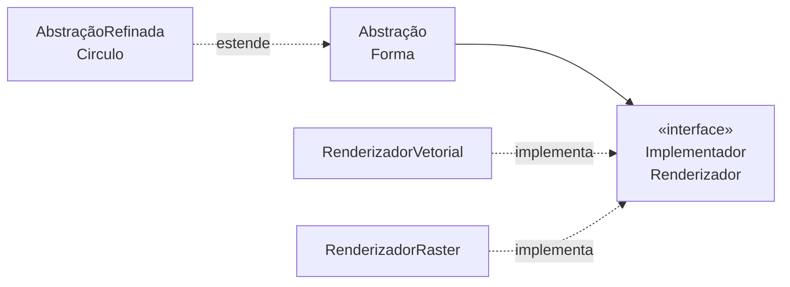

# Bridge

## Visão Geral

Bridge separa uma abstração da sua implementação, de modo que as duas possam
variar independentemente.

É o padrão que resolve a explosão combinatória de hierarquias — o problema que
aparece quando duas dimensões de variação são modeladas por herança.

## Problema

Você tem duas dimensões que variam. Modeladas por herança, o número de classes é
o produto delas.

```text
2 formas × 3 renderizadores = 6 classes

CirculoVetorial   CirculoRaster   CirculoASCII
QuadradoVetorial  QuadradoRaster  QuadradoASCII
```

Adicionar uma forma exige três classes. Adicionar um renderizador exige duas.
Com quatro formas e quatro renderizadores, dezesseis.

Bridge substitui o produto pela soma:

```text
2 formas + 3 renderizadores + 2 topos de hierarquia = 7 tipos
```

Note que nesse tamanho o padrão ainda não venceu: a herança dava 7 tipos também (a base mais
as seis concretas). O ganho é assintótico e aparece com 4×4 — 17 tipos contra 10 —, e é
exatamente por isso que "Quando Não Usar" manda esperar a terceira ou quarta classe antes de
separar as hierarquias.

A forma tem uma referência ao renderizador. As duas hierarquias existem
separadamente e se combinam por composição.

## Conceitos Centrais

### A estrutura

A única seta cheia liga o topo de uma hierarquia ao topo da outra: `Circulo` não
conhece `RenderizadorVetorial`.



A abstração delega ao implementador. Note que **implementador não é a
implementação da abstração** — é uma segunda hierarquia, com sua própria
interface, em outro nível de granularidade.

### Bridge não é Adapter

Distinção que causa confusão constante.

**[Adapter](/03-design-patterns/adapter.md)** é aplicado depois, para compatibilizar coisas que já
existem e não foram projetadas para trabalhar juntas.

**Bridge** é projetado antes, para que duas hierarquias possam evoluir separadas.

A diferença é de intenção e de momento: Adapter conserta; Bridge previne.

### Bridge não é Strategy

Também confundido, e a distinção é mais sutil.

**[Strategy](/03-design-patterns/strategy.md)** troca um algoritmo. A interface da estratégia
representa uma decisão isolada, geralmente com um método.

**Bridge** separa duas dimensões estruturais. O implementador costuma ter várias
operações primitivas que a abstração combina.

Estruturalmente parecidos; a diferença está em o que varia — algoritmo versus
dimensão de implementação — e em quantas operações a interface tem.

## Quando Usar

- Duas dimensões de variação que crescem independentemente.
- É preciso trocar a implementação em tempo de execução.
- A implementação precisa ser invisível ao cliente.
- Você está prestes a criar a terceira ou quarta classe de uma hierarquia que
  multiplica.

## Quando Não Usar

**Quando há uma dimensão só de variação.** Herança simples ou
[Strategy](/03-design-patterns/strategy.md) resolvem, e Bridge adiciona uma hierarquia sem motivo.

**Quando uma das dimensões tem uma implementação só.** O produto ainda não
explodiu; ver [YAGNI](/02-software-design/yagni.md).

**Preventivamente.** É um dos padrões mais caros de aplicar cedo, porque exige
projetar a interface do implementador — as operações primitivas certas — sem
conhecer as variações reais. Adivinhar errado ali produz uma interface que cada
implementador precisa contornar.

**Quando as duas dimensões não são independentes.** Se certas combinações não
fazem sentido, a separação é artificial e o código acaba com verificações de
compatibilidade.

## Alternativas

- **[Strategy](/03-design-patterns/strategy.md)** — quando o que varia é um algoritmo.
- **Composição simples** — passar a dependência sem hierarquia formal de
  abstração.
- **Herança** — enquanto houver uma dimensão só.
- **Funções de primeira classe** — quando o implementador tem uma operação.

## Trade-offs

| Bridge | Herança em duas dimensões |
|---|---|
| Classes somam | Classes multiplicam |
| Implementação trocável em execução | Fixa em compilação |
| Duas hierarquias a projetar | Uma |
| Interface do implementador precisa estar certa | Sem interface intermediária |
| Indireção adicional | Direto |

## Modos de Falha

**Interface do implementador mal escolhida.** As primitivas não servem a todos os
implementadores; alguns precisam de operações que não existem, outros deixam
métodos vazios.

**Dimensões não independentes.** Combinações inválidas exigem verificação em
execução.

**Bridge com um implementador.** Hierarquia sem variação.

**Vazamento da implementação.** A abstração expõe detalhes do implementador, e o
cliente passa a depender de qual está em uso.

## Erros Comuns

**Confundir com Adapter.** Momento e intenção diferentes.

**Confundir com Strategy.** Uma dimensão versus duas.

**Aplicar antes da explosão.** Espere a terceira ou quarta classe do produto.

**Projetar a interface do implementador a partir de um caso.** Ela precisa servir
a todos.

## Onde ele aparece na prática

**Drivers de banco.** A hierarquia de `Connection`, `Statement` e `ResultSet` é a
abstração; cada driver é uma implementação. As duas variam: novos tipos de
operação de um lado, novos bancos do outro.

**Bibliotecas gráficas multiplataforma.** A abstração de janela e desenho é uma
hierarquia; o sistema gráfico nativo de cada plataforma é outra.

**Abstrações de log.** A API que o código usa é a abstração; os *appenders* que
escrevem em arquivo, console ou rede são os implementadores.

O denominador comum: em todos, **quem projetou a interface do implementador tinha
várias implementações reais em mãos**. É a condição que o padrão exige e que
raramente existe quando alguém propõe aplicá-lo cedo.

## Exemplo Real

Um sistema de notificações modelava canal e formato por herança, e chegou a doze
classes: `EmailHtml`, `EmailTexto`, `SmsTexto`, `PushJson`, `PushTexto`, e assim
por diante. Metade das combinações não fazia sentido e existia como classe que
lançava exceção.

A separação em Bridge foi feita **depois** que o problema apareceu, e a interface
do implementador foi extraída a partir das seis combinações que de fato
funcionavam.

Resultado: quatro canais e três formatos, com uma tabela explícita de quais
combinações são válidas — porque elas de fato não são todas independentes.

Esse último ponto é o mais honesto do caso: Bridge pressupõe independência entre
as dimensões, e aqui a independência era parcial. A solução ficou sendo Bridge com
uma verificação de compatibilidade, que é menos elegante que o padrão puro e é o
que o domínio exigia.

## Como reconhecer que você precisa dele

O sinal mais confiável está nos nomes das classes: **dois adjetivos que vêm de
listas diferentes.**

`RelatorioMensalPDF`, `RelatorioAnualPDF`, `RelatorioMensalExcel` — "mensal" e
"anual" vêm de uma lista, "PDF" e "Excel" de outra. O produto das duas é o número
de classes.

Três verificações que confirmam:

**Conte as listas.** Se os nomes das classes podem ser gerados combinando dois ou
mais conjuntos de palavras, há mais de uma dimensão.

**Procure classes que não existem.** Se `RelatorioAnualExcel` deveria existir e
não existe, ou existe lançando exceção, a hierarquia já não comporta o produto.

**Veja o que uma dimensão nova custaria.** Adicionar um formato exige quantas
classes? Se for mais de uma, o custo é multiplicativo.

Uma ressalva importante: encontrar o padrão não significa que Bridge é a resposta.
Se uma das dimensões tem duas variantes estáveis há anos, o produto é pequeno e
gerenciável. O padrão se paga quando **ambas** as dimensões crescem — e crescer é
uma afirmação sobre o histórico, não sobre a intuição.

## Conceitos Relacionados

- [Adapter](/03-design-patterns/adapter.md) — compatibilizar o que já existe.
- [Strategy](/03-design-patterns/strategy.md) — variar um algoritmo.
- [Abstract Factory](/03-design-patterns/abstract-factory.md) — frequentemente usado para criar o par
  abstração-implementador coerente.

## Exercício Prático

Procure no seu sistema hierarquias cujo número de classes é o produto de duas
listas — dois adjetivos no nome da classe costuma denunciar.

Para cada uma, verifique se todas as combinações são válidas. Se não forem, Bridge
puro não se aplica sem tratamento adicional.

## Perguntas de Entrevista

- Qual a diferença entre Bridge e Adapter?
- E entre Bridge e Strategy?
- Por que aplicar Bridge preventivamente é arriscado?

## Para Aprofundar

- Gamma, Erich et al. *Design Patterns*. Addison-Wesley, 1994.
