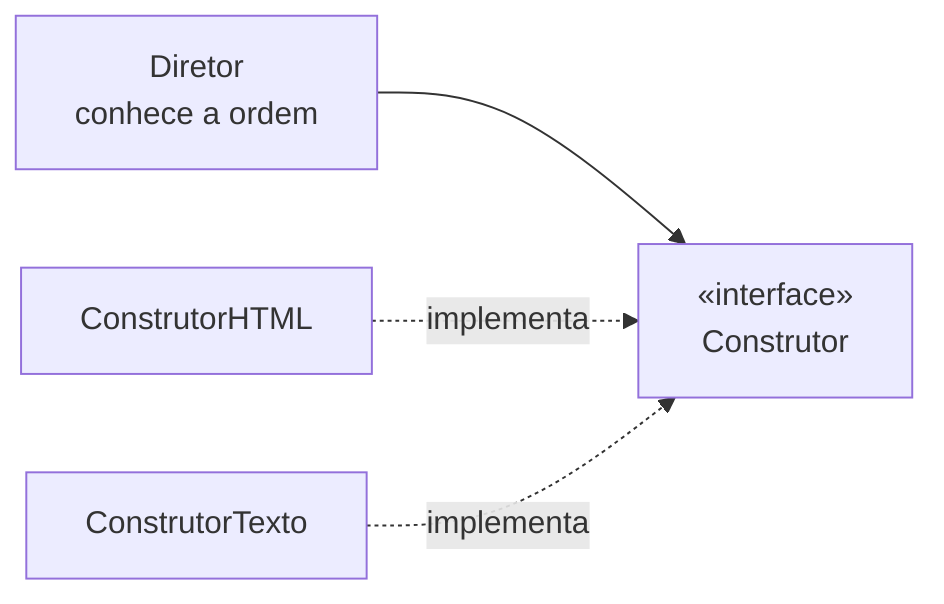

# Builder

## Visão Geral

Builder separa a construção de um objeto complexo da sua representação, de modo
que o mesmo processo de construção possa produzir representações diferentes.

Na prática, o nome cobre **dois padrões distintos**, e confundi-los é a fonte da
maior parte dos mal-entendidos.

## Problema

O padrão original do GoF resolve um caso específico: um processo de montagem em
etapas, com um **diretor** que conhece a ordem e um **construtor** que conhece a
representação. Analisar um documento e produzir HTML ou texto puro com o mesmo
percurso é o exemplo canônico.

O uso predominante hoje é outro: **construção de objetos com muitos parâmetros
opcionais**. Um objeto com doze campos, dos quais três são obrigatórios, não cabe
num construtor legível — e uma sequência de acessadores permite estados
inválidos entre chamadas.

Os dois problemas são reais. São diferentes.

## Conceitos Centrais

### Builder do GoF — processo com representações

A seta do diretor termina na interface: ele nunca alcança um construtor concreto. Os
dois construtores compartilham essa interface, enquanto os produtos que eles devolvem
não precisam ter um tipo em comum.



O diretor executa as etapas na ordem. Cada construtor decide o que fazer com
elas. Trocar o construtor muda a saída sem mudar o percurso.

### Builder de parâmetros — construção legível e segura

```text
Pedido.novo(clienteId, itens)      ← obrigatórios no início
  .comDesconto(desconto)
  .comEntregaExpressa()
  .comObservacao(texto)
  .construir()                     ← valida e constrói de uma vez
```

Duas propriedades que importam: os obrigatórios são exigidos, e o objeto só
existe depois de `construir()` — nunca há instância parcialmente montada.

Isso resolve o *telescoping constructor* (uma cascata de construtores
sobrecarregados) e o objeto mutável com acessadores. Ver
[encapsulamento](/02-software-design/encapsulation.md).

### O que decide entre os dois

Se existe **um percurso com várias saídas possíveis**, é o do GoF. Se existe **um
objeto com muitos parâmetros**, é o moderno.

Aplicar o do GoF ao segundo problema traz um diretor que não faz nada.

## Quando Usar

**Builder de parâmetros:**
- Mais de quatro ou cinco parâmetros, vários opcionais.
- O objeto deve ser imutável e válido desde a criação.
- Combinações de parâmetros com regras entre si.

**Builder do GoF:**
- O mesmo percurso de construção precisa produzir representações diferentes.
- A ordem das etapas é conhecida e estável, e a representação varia.

## Quando Não Usar

**Quando há poucos parâmetros.** Dois ou três obrigatórios cabem num construtor.
O builder adiciona código e indireção.

**Quando a linguagem tem parâmetros nomeados com valor padrão.** Em Python,
Kotlin, C# e outras, o problema que o builder de parâmetros resolve já está
resolvido pela linguagem, e o padrão vira cerimônia.

**Quando o objeto é mutável mesmo.** Se ele vai mudar depois de criado, a garantia
de validade na construção não compra o que promete.

**Quando o diretor não tem o que dirigir.** Aplicar o Builder do GoF sem
representações alternativas produz uma classe sem função.

**Para objetos de transporte.** Um DTO com dez campos que apenas carrega dados não
precisa de builder — precisa de um registro transparente.

## Alternativas

- **Parâmetros nomeados com padrão** — se a linguagem oferece, é superior.
- **Objeto de parâmetros** — agrupar os relacionados num tipo próprio.
- **Métodos de fábrica nomeados** — quando as combinações válidas são poucas e
  conhecidas: `Pedido.expressoPara(cliente)`.
- **Construtor simples** — quando os parâmetros são poucos.

## Trade-offs

| Builder | Construtor direto |
|---|---|
| Chamada legível e autoexplicativa | Ordem posicional obscura |
| Objeto válido e imutável ao final | Estados intermediários possíveis |
| Opcionais sem sobrecarga combinatória | Cascata de construtores |
| Uma classe a mais por tipo | Nada a mais |
| Erro de esquecer `construir()` | Sem essa possibilidade |

## Modos de Falha

**Builder mutável exposto.** O builder é passado adiante e alterado por vários
lugares antes de construir.

**Validação só no final, tarde demais.** O erro aparece longe da chamada que o
causou. Validar cada etapa quando possível ajuda.

**Diretor vazio.** Builder do GoF sem representações alternativas.

**Builder gerado para tudo.** Ferramentas que geram builder para cada classe
produzem código que ninguém precisa.

## Erros Comuns

**Chamar de "padrão Builder do GoF" o builder de parâmetros.** São problemas
diferentes.

**Usar em linguagem com parâmetros nomeados.** Cerimônia sobre recurso da
linguagem.

**Permitir estado parcial escapar.** O objeto só deve existir completo.

**Aplicar a DTOs.** Sem invariante a proteger, não há o que garantir.

## Exemplo Real

Uma classe `ConsultaDeRelatorio` acumulou quinze campos ao longo de dois anos:
período, filtros, agrupamentos, ordenação, formato, limites.

O construtor tinha sete sobrecargas. Três delas diferiam apenas na ordem dos
parâmetros do mesmo tipo, e um defeito em produção veio exatamente daí: alguém
trocou `dataInicio` com `dataFim` numa chamada, e o compilador não reclamou porque
ambos eram do mesmo tipo.

O builder resolveu de duas formas. Os nomes tornaram a troca visível na leitura.
E `construir()` passou a validar que o início precede o fim — validação que antes
não existia em lugar nenhum porque não havia um ponto único de construção.

O detalhe honesto: se o sistema estivesse numa linguagem com parâmetros nomeados,
a primeira metade do benefício viria de graça, e restaria só a validação central —
que não justificaria a classe extra.

## Onde ele aparece na prática

**`StringBuilder`.** Não é o padrão do GoF nem o builder de parâmetros — é
acumulação eficiente com encadeamento. O nome compartilhado confunde, e vale
saber que são três coisas distintas com a mesma palavra.

**Clientes HTTP.** `HttpRequest.newBuilder().uri(...).header(...).build()` é o
builder de parâmetros: muitos opcionais, objeto imutável ao final.

**Construtores de consulta.** Interfaces fluentes que montam SQL por etapas
são o Builder do GoF quando o mesmo percurso produz dialetos diferentes.

**Bibliotecas de teste.** Construir objetos de domínio complexos em cenários de
teste é um dos usos de melhor retorno, porque o teste fica legível: o que o
cenário tem de particular fica explícito, e o resto assume padrões.

Esse último uso costuma justificar o builder sozinho, mesmo quando o código de
produção não precisaria dele — a legibilidade do teste é o que faz alguém
consultá-lo como documentação.

## Conceitos Relacionados

- [Factory Method](/03-design-patterns/factory-method.md) — criação por subclasse.
- [Abstract Factory](/03-design-patterns/abstract-factory.md) — famílias de produtos.
- [Composite](/03-design-patterns/composite.md) — Builder é frequentemente usado para montar
  estruturas compostas.
- [Encapsulamento](/02-software-design/encapsulation.md) — a invariante que o
  builder protege.

## Exercício Prático

Encontre a classe do seu sistema com o construtor de mais parâmetros. Conte
quantos são do mesmo tipo e adjacentes — cada par assim é uma troca silenciosa
esperando acontecer.

Depois verifique se a linguagem que você usa tem parâmetros nomeados. Se tiver,
compare a solução com builder e a solução com a linguagem.

## Perguntas de Entrevista

- Quais são os dois problemas que o nome "Builder" cobre?
- Quando o builder de parâmetros é desnecessário?
- Que garantia o builder dá que uma sequência de acessadores não dá?

## Para Aprofundar

- Gamma, Erich et al. *Design Patterns*. Addison-Wesley, 1994.
- Bloch, Joshua. *Effective Java*. 3ª ed., 2018 — o builder de parâmetros.
