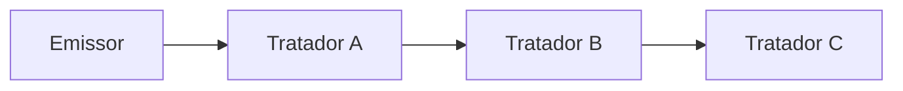

# Chain of Responsibility

## Visão Geral

Chain of Responsibility passa uma requisição ao longo de uma cadeia de
tratadores. Cada um decide se trata ou repassa ao próximo.

O ganho é desacoplar quem envia de quem trata: o emissor não sabe qual elemento da
cadeia vai responder, nem se algum vai.

Essa última parte — **nem se algum vai** — é o risco central do padrão.

## Problema

Uma requisição pode ser tratada por vários candidatos, e qual deles é o certo
depende da requisição.

Sem o padrão, quem envia precisa decidir: um condicional que conhece todos os
tratadores e as condições de cada um. Adicionar um tratador toca o emissor.

Com a cadeia, o emissor conhece apenas o primeiro elo.

## Conceitos Centrais

### A estrutura

Cada tratador tem uma referência ao próximo. Ele examina a requisição, trata se
for do seu escopo, ou repassa.

### Duas semânticas diferentes

O nome cobre dois comportamentos que valem distinguir.

**Primeiro que trata para.** A semântica clássica: a cadeia percorre até alguém
assumir. Usado em despacho de requisição e tratamento de exceção.

**Todos processam.** Cada elo faz algo e repassa; ninguém interrompe. É o modelo
de middleware — autenticação, registro, compressão. Estruturalmente idêntico a
[Decorator](/03-design-patterns/decorator.md), e a diferença de nome é histórica.

Confundir as duas produz cadeias em que alguém interrompe sem querer, ou em que
todos processam quando só um deveria.

### O problema do fim da cadeia

O que acontece se ninguém tratar?

O padrão não responde, e essa omissão é a fonte da maior parte dos defeitos: a
requisição desaparece silenciosamente.

A correção é sempre a mesma: **um tratador final que sempre trata** — mesmo que
seja para registrar e lançar erro. Uma cadeia sem esse elo tem um caminho de
falha invisível.

### Ordem é dependência oculta

A ordem dos tratadores determina o comportamento e normalmente não está declarada
em lugar nenhum além da montagem da cadeia.

O mesmo problema de [Decorator](/03-design-patterns/decorator.md), e com a mesma correção: a montagem
deve estar num lugar, não distribuída.

## Quando Usar

- Vários tratadores possíveis, com escopo determinado pela requisição.
- O conjunto de tratadores muda em execução ou por configuração.
- O emissor não deve conhecer quem trata.
- Vários passos independentes precisam processar a mesma requisição.

## Quando Não Usar

**Quando o tratador é sempre o mesmo.** Chame diretamente.

**Quando a seleção é por valor conhecido.** Uma tabela de despacho — mapa de chave
para tratador — é mais direta, mais rápida e mais fácil de auditar que percorrer
uma cadeia.

**Quando o tratamento precisa ser garantido e a cadeia não garante.** Sem elo
final, a requisição some.

**Quando a ordem tem regras complexas.** O padrão não as expressa.

**Quando o rastreamento importa.** Descobrir qual elo tratou exige instrumentação;
em fluxo crítico, isso custa.

## Alternativas

- **Tabela de despacho** — quando a seleção é por chave. Mais simples e explícita.
- **Middleware com ordem declarada** — para a semântica de "todos processam".
- **Condicional explícito** — quando há poucos tratadores estáveis, e a
  legibilidade importa mais que o desacoplamento.
- **[Mediator](/03-design-patterns/mediator.md)** — quando a coordenação é entre objetos, não uma
  cadeia linear.

## Trade-offs

| Cadeia | Condicional no emissor |
|---|---|
| Emissor não conhece os tratadores | Conhece todos |
| Tratador novo não toca o emissor | Toca |
| Ordem implícita e frágil | Explícita |
| Risco de ninguém tratar | Todos os casos cobertos ou erro claro |
| Percurso a rastrear | Fluxo direto |

## Modos de Falha

**Requisição não tratada.** O modo dominante.

**Ordem errada.** Um tratador genérico antes de um específico captura tudo.

**Cadeia quebrada.** Um elo esquece de repassar.

**Ciclo.** Um tratador aponta para um anterior; percurso infinito.

**Custo linear invisível.** Cadeia longa percorrida em caminho quente.

## Erros Comuns

**Não ter elo final.** Sempre tenha um que trata ou falha explicitamente.

**Confundir as duas semânticas.**

**Usar onde uma tabela de despacho resolve.**

**Montar a cadeia em vários lugares.** A ordem precisa estar num lugar só.

## Onde ele aparece na prática

**Middleware HTTP.** A semântica de "todos processam", com a possibilidade de
interromper — autenticação que rejeita antes de chegar ao controlador.

**Tratamento de exceção em linguagens.** O `catch` mais próximo que corresponde
trata; caso contrário sobe. É a semântica de "primeiro que trata", embutida.

**Filtros de servidor de aplicação.** Cadeia configurada declarativamente, com
ordem explícita.

**Registro de log com níveis.** Um evento passa por *appenders* que decidem se o
processam.

O caso das exceções é instrutivo: a linguagem **garante** um elo final — se
ninguém trata, o programa termina com erro visível. É exatamente a garantia que
implementações manuais costumam esquecer.

## Exemplo Real

Um sistema de aprovação de despesas usava cadeia: gerente, diretor, financeiro,
conselho, cada um com limite de alçada.

O defeito apareceu com uma despesa acima do limite do conselho — um caso que
ninguém previu. A cadeia terminou, nenhum elo tratou, e a despesa ficou num
estado sem aprovação e sem rejeição. Não havia tela que a mostrasse.

Ficou parada por cinco semanas até alguém perguntar.

A correção foi um elo final `AprovacaoNaoDefinida` que registra o caso, notifica a
administração e marca a despesa como pendente de decisão manual.

O que mudou não foi o padrão — foi admitir que a cadeia pode terminar sem
tratamento, e tornar isso um caso explícito em vez de silêncio.

## Duas formas de implementar

A estrutura clássica — cada tratador referencia o próximo — não é a única, e a
alternativa costuma ser melhor.

**Lista ligada.** Cada tratador guarda o próximo e decide repassar. É a forma do
GoF. O tratador controla o fluxo, o que permite pré e pós-processamento em volta
da chamada seguinte — necessário para middleware.

Custo: montar a cadeia exige encadear objetos, e a estrutura só é visível
percorrendo as referências.

**Coleção iterada.** Um coordenador guarda a lista de tratadores e os percorre
até um assumir. Os tratadores não se conhecem.

Custo: perde o pré e pós-processamento em volta do próximo, porque o tratador não
chama o seguinte.

| | Lista ligada | Coleção iterada |
|---|---|---|
| Tratadores se conhecem | Sim | Não |
| Envolver o próximo | Possível | Não |
| Ordem visível | Percorrendo referências | Numa lista |
| Reordenar | Reencadear | Reordenar a lista |
| Adequado a | Middleware | Despacho por tipo |

Para a semântica de "primeiro que trata para", a coleção iterada é quase sempre
mais simples e mais fácil de auditar. A lista ligada é necessária quando o
tratador precisa fazer algo depois que os seguintes terminarem.

## Conceitos Relacionados

- [Decorator](/03-design-patterns/decorator.md) — mesma estrutura, semântica de "todos processam".
- [Command](/03-design-patterns/command.md) — o que trafega pela cadeia pode ser um comando.
- [Mediator](/03-design-patterns/mediator.md) — coordenação não linear.

## Exercício Prático

Se seu sistema tem cadeias de tratamento, responda para cada uma: existe um elo
final que sempre trata? O que acontece hoje se nenhum tratador assumir? Onde a
ordem está declarada?

## Perguntas de Entrevista

- Quais são as duas semânticas que este padrão cobre?
- O que acontece se nenhum tratador assumir, e de quem é a responsabilidade?
- Quando uma tabela de despacho é preferível?

## Para Aprofundar

- Gamma, Erich et al. *Design Patterns*. Addison-Wesley, 1994.
