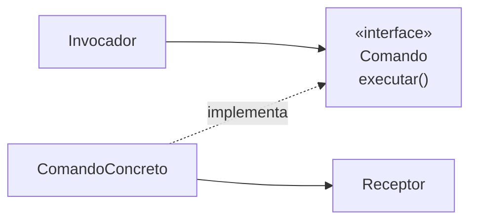

# Command

## Visão Geral

Command encapsula uma requisição como um objeto, permitindo parametrizar
clientes, enfileirar operações, registrá-las e desfazê-las.

A ideia central é **reificação**: transformar uma ação — que normalmente é uma
chamada de método, efêmera — em um dado que pode ser guardado, transmitido e
manipulado.

## Problema

Uma chamada de método acontece e desaparece. Isso é suficiente na maioria das
vezes, e insuficiente quando é preciso:

Desfazer — é necessário saber o que foi feito e como reverter.
Enfileirar — a operação precisa ser executada depois, ou por outro processo.
Registrar — para auditoria ou reprocessamento.
Compor — agrupar várias operações numa transação lógica.
Repetir — reexecutar em caso de falha.

Todas essas exigem que a operação **exista como coisa**, não como evento passado.

## Conceitos Centrais

### A estrutura

O comando guarda o receptor e os parâmetros. O invocador só conhece `executar()`
— e por isso pode enfileirar, registrar ou agendar sem saber o que o comando faz.

### Desfazer é a parte difícil

`desfazer()` parece uma adição simples e não é.

Cada comando precisa saber reverter seu efeito, e nem toda operação é reversível.
Enviar um e-mail não é. Cobrar um cartão exige um estorno, que é outra operação
com suas próprias falhas.

Duas estratégias:

**Inverso lógico** — o comando sabe a operação contrária. Compacto, e exige que
cada comando implemente corretamente o seu — inclusive nos casos de borda.

**Estado anterior** — o comando guarda o estado antes de executar e o restaura.
Ver [Memento](/03-design-patterns/memento.md). Mais simples de acertar, e mais caro em memória.

A escolha depende do tamanho do estado e de quão confiável precisa ser.

### Command e CQRS

A separação entre comandos que alteram estado sem devolver dados e consultas que devolvem
sem alterar é de Meyer (1988), e é o nível 1 de [CQRS](/03-design-patterns/cqrs.md) — não vem
deste padrão, apesar da coincidência de nome.

O que o padrão Command acrescenta é a **reificação**: transformar a operação em objeto. É por
isso que ele aparece na implementação do lado de escrita — um comando que se pode enfileirar,
registrar ou repetir —, mas a separação existiria sem ele.

Essa separação de intenção é útil mesmo sem adotar CQRS como arquitetura.

## Quando Usar

- É necessário desfazer ou refazer.
- Operações precisam ser enfileiradas ou agendadas.
- É preciso registrar operações para auditoria ou reprocessamento.
- Várias operações precisam ser tratadas como uma unidade.
- O invocador não deve conhecer o que a operação faz.

## Quando Não Usar

**Quando a operação é executada imediatamente e uma vez.** Chame o método.

**Quando não há necessidade de desfazer, fila ou registro.** São essas
necessidades que pagam o padrão.

**Quando desfazer não é implementável de forma confiável.** Um desfazer que
funciona no caso comum e falha nos de borda é pior que não ter desfazer — o
usuário confia nele.

**Quando produz uma classe por método.** Se cada operação vira um comando trivial
sem nenhuma das necessidades acima, o padrão adicionou arquivos.

**Quando a linguagem tem funções de primeira classe e não há estado a guardar.**
Uma função capturando o contexto é um comando.

## Alternativas

- **Função ou closure** — quando não é preciso mais que executar depois.
- **[Memento](/03-design-patterns/memento.md)** — para desfazer por restauração de estado.
- **Registro de eventos** — quando o objetivo é auditoria, gravar o que aconteceu
  pode ser mais simples que reificar a ação.
- **Fila de mensagens** — quando a operação precisa atravessar processos.

## Trade-offs

| Command | Chamada direta |
|---|---|
| Operação pode ser guardada e transmitida | Efêmera |
| Desfazer e refazer possíveis | Não |
| Invocador desacoplado | Conhece a operação |
| Uma classe por operação | Nenhuma |
| Estado do comando a gerenciar | Sem estado |

## Modos de Falha

**Desfazer incompleto.** Reverte o efeito principal e não os colaterais.

**Comando com referência obsoleta.** O receptor mudou entre criação e execução, e
o comando age sobre estado que não existe mais.

**Pilha de desfazer sem limite.** Vazamento de memória.

**Comando não serializável.** Guarda referências que não sobrevivem a persistência
ou transmissão.

**Composto parcialmente executado.** Um comando composto falha no meio, e o
desfazer dos anteriores também pode falhar.

## Erros Comuns

**Implementar desfazer sem cobrir os casos de borda.**

**Criar comando para toda operação.**

**Guardar referência ao objeto em vez de identificador.** Impede persistência e
causa comportamento sobre estado obsoleto.

**Não limitar a pilha de desfazer.**

## Onde ele aparece na prática

**Editores.** Desfazer e refazer é o uso canônico, e o que mais exige rigor no
inverso.

**Filas de tarefas.** Um trabalho enfileirado é um comando serializado: nome da
operação mais parâmetros.

**Menus e atalhos de teclado.** O mesmo comando acionado por caminhos diferentes,
sem que cada caminho conheça a operação.

**Transações e migrações de banco.** Uma migração com `aplicar` e `reverter` é
Command com desfazer.

O caso das filas é o mais frequente em sistemas de negócio, e é onde a
serialização vira o requisito dominante — um comando que guarda referências a
objetos vivos não pode ser enfileirado.

## Exemplo Real

Um editor de plantas arquitetônicas precisava de desfazer com profundidade
ilimitada.

A primeira implementação usou inverso lógico: cada comando sabia reverter.
Funcionou para mover e redimensionar. Quebrou em "agrupar elementos": desfazer
precisava restaurar não só a estrutura, mas a ordem de empilhamento original — que
o comando não guardava.

A segunda implementação usou estado anterior, mas guardar o documento inteiro a
cada operação consumia memória demais.

A solução final foi híbrida, e é a que interessa: comandos com inverso confiável e
barato — mover, redimensionar, alterar cor — usam inverso lógico. Comandos
estruturais — agrupar, desagrupar, colar — guardam o estado da região afetada.

A decisão passou a ser por comando, com um critério declarado: *use inverso lógico
quando ele for demonstravelmente completo; caso contrário, guarde o estado.*

Não há resposta única para o padrão inteiro.

## Conceitos Relacionados

- [Memento](/03-design-patterns/memento.md) — captura de estado para restauração.
- [State](/03-design-patterns/state.md) — comandos frequentemente disparam transições.
- [CQRS](/03-design-patterns/cqrs.md) — a separação comando/consulta em escala de arquitetura.

## Exercício Prático

Se seu sistema tem desfazer, escolha três operações e verifique se o desfazer
cobre todos os efeitos — incluindo os colaterais e os casos de borda.

Se não tem, liste as operações que se beneficiariam de fila, registro ou
composição. Só essas justificam o padrão.

## Perguntas de Entrevista

- Quais capacidades a reificação de uma operação abre?
- Quais são as duas estratégias de desfazer e como escolher?
- Por que um comando não deve guardar referência ao objeto?

## Para Aprofundar

- Gamma, Erich et al. *Design Patterns*. Addison-Wesley, 1994.
- Meyer, Bertrand. *Object-Oriented Software Construction*, 1988 — a separação
  entre comando e consulta.
