# Composite

## Visão Geral

Composite organiza objetos em estruturas de árvore e permite que o cliente trate
objetos individuais e composições de forma uniforme.

O ganho é específico: **o cliente deixa de precisar saber se está lidando com uma
folha ou com um nó.** Onde havia condicionais, passa a haver uma chamada.

## Problema

Uma estrutura hierárquica em que um elemento pode conter outros do mesmo tipo:
diretórios com arquivos e subdiretórios, grupos de elementos gráficos, itens de
menu com submenus, expressões com subexpressões.

Sem o padrão, todo código que percorre a estrutura precisa distinguir:

```text
se for arquivo:    somar tamanho
se for diretório:  para cada filho, repetir
```

Esse condicional se replica em cada operação — calcular tamanho, renderizar,
contar, buscar. Adicionar um tipo de nó exige tocar todos eles.

## Conceitos Centrais

### A estrutura

```mermaid
graph TB
  C["«interface»<br/>Componente<br/>operacao&#40;&#41;"]
  F[Folha<br/>operacao&#40;&#41;] -.implementa.-> C
  Co[Composto<br/>operacao&#40;&#41;<br/>filhos] -.implementa.-> C
  Co -->|contém| C
```



O composto implementa a mesma interface que a folha e delega aos filhos. A
recursão fica dentro da estrutura, não no cliente.

### A decisão central: uniformidade ou segurança

O GoF apresenta duas variantes, e a escolha entre elas é o trade-off do padrão.

**Transparente** — a interface `Componente` declara `adicionar` e `remover`.
Cliente trata tudo igual; a folha precisa lidar com operações que não fazem
sentido para ela, tipicamente lançando exceção.

**Segura** — apenas o composto tem `adicionar` e `remover`. Não há operação sem
sentido; o cliente precisa verificar o tipo para compor.

Transparente ganha em uniformidade e perde em segurança de tipo. Segura, o
inverso. Não há terceira opção, e escolher exige saber se o cliente compõe ou
apenas percorre.

Quando o cliente só percorre, a variante segura não custa nada e é preferível.

### Composite e recursão

A estrutura é naturalmente recursiva, e isso traz duas preocupações reais:
profundidade — pilha em árvores muito fundas — e ciclos, que produzem recursão
infinita se a estrutura permitir que um nó contenha um ancestral.

## Quando Usar

- Existe hierarquia parte-todo genuína no domínio.
- O cliente deve tratar folhas e composições igualmente.
- Operações se aplicam recursivamente a toda a estrutura.
- Novos tipos de folha aparecem com frequência.

## Quando Não Usar

**Quando a hierarquia não é parte-todo.** Herança não é composição. Se um tipo não
contém outros do mesmo tipo, o padrão não se aplica.

**Quando folha e composto têm comportamento muito diferente.** Forçar uma
interface comum produz métodos sem sentido de um dos lados, e o cliente acaba
verificando o tipo mesmo assim — perdendo o benefício e mantendo o custo.

**Quando a estrutura é rasa e fixa.** Dois níveis conhecidos não justificam a
generalidade.

**Quando a segurança de tipo importa mais que a uniformidade.** Ver a decisão
acima.

**Quando operações precisam de contexto do caminho.** Se o comportamento de um nó
depende de quem são seus ancestrais, a uniformidade quebra e o padrão passa a
atrapalhar.

## Alternativas

- **Lista simples** — quando a estrutura é rasa.
- **[Visitor](/03-design-patterns/visitor.md)** — quando as operações variam mais que os tipos de nó;
  frequentemente usado junto com Composite.
- **[Iterator](/03-design-patterns/iterator.md)** — quando o percurso é a única necessidade.
- **Estrutura de dados sem hierarquia de classes** — uma árvore genérica com
  dados nos nós.

## Trade-offs

| Composite | Condicional no cliente |
|---|---|
| Cliente uniforme | Condicional replicado |
| Tipo de folha novo não toca o cliente | Toca todos os condicionais |
| Interface com operações sem sentido para folhas | Tipos precisos |
| Recursão encapsulada | Explícita e visível |
| Percurso implícito, difícil de controlar | Controle total |

## Modos de Falha

**Folha que lança exceção.** Consequência da variante transparente, e uma
violação de [Liskov](/02-software-design/solid.md) declarada.

**Ciclo na estrutura.** Recursão infinita.

**Profundidade excessiva.** Estouro de pilha em percurso recursivo.

**Composto vazio tratado como folha.** Ambiguidade que produz defeitos sutis.

**Operação cara escondida.** Uma chamada simples percorre milhares de nós, e nada
no código sugere isso.

## Erros Comuns

**Aplicar a hierarquia de herança.** Não é o mesmo que hierarquia parte-todo.

**Escolher a variante sem pensar.** É a decisão do padrão.

**Não tratar ciclos.** Se a estrutura permite, alguém vai criar um.

**Ignorar o custo de percurso.** Uma operação uniforme pode ser O(n) sem aviso.

## Onde ele aparece na prática

**Árvores de interface gráfica.** Um contêiner é um componente que contém
componentes. Renderizar, medir e propagar eventos são operações uniformes sobre a
árvore.

**Sistemas de arquivos.** Diretórios e arquivos com operações comuns — tamanho,
permissões, caminho.

**Árvores sintáticas.** Uma expressão contém subexpressões; avaliar é recursivo.
É onde Composite e [Visitor](/03-design-patterns/visitor.md) aparecem juntos com mais frequência.

**Estruturas de documento.** DOM em navegadores: nós que contêm nós, com
operações uniformes.

Nos quatro, a hierarquia parte-todo é intrínseca ao domínio — ninguém a inventou
para aplicar o padrão. É o sinal de que Composite é adequado: a árvore já existe
no problema.

## Exemplo Real

Um sistema de permissões modelava grupos que contêm usuários e outros grupos.
Verificar se alguém tem uma permissão exigia percorrer recursivamente.

A primeira implementação usou Composite transparente: `Principal` com `adicionar`
e `remover`, e `Usuario` lançando exceção nos dois.

O problema apareceu quando a interface administrativa passou a construir a
estrutura: ela precisava verificar o tipo antes de compor, o que anulava a
uniformidade — e ainda mantinha as exceções.

A mudança para a variante segura removeu `adicionar` e `remover` de `Principal`.
O código de verificação de permissão, que só percorre, continuou uniforme. O
código administrativo, que compõe, passou a trabalhar com `Grupo` explicitamente.

Descobriu-se que os dois clientes tinham necessidades diferentes, e que a variante
transparente estava tentando servir aos dois com uma interface só.

Um ciclo também apareceu: um administrador colocou um grupo dentro de um
descendente dele. A verificação passou a rastrear os nós visitados, o que deveria
ter sido feito desde o início.

## Conceitos Relacionados

- [Decorator](/03-design-patterns/decorator.md) — estrutura parecida, propósito diferente.
- [Visitor](/03-design-patterns/visitor.md) — operações sobre a estrutura.
- [Iterator](/03-design-patterns/iterator.md) — percurso.

## Exercício Prático

Procure no seu sistema estruturas em que um elemento contém elementos do mesmo
tipo.

Para cada uma, verifique: existe condicional de tipo replicado nos percursos?
A estrutura permite ciclo? Quanto custa a operação mais comum em número de nós?

## Perguntas de Entrevista

- Quais são as duas variantes de Composite e o que se troca entre elas?
- Como Composite difere de uma hierarquia de herança comum?
- Que riscos a recursão traz neste padrão?

## Para Aprofundar

- Gamma, Erich et al. *Design Patterns*. Addison-Wesley, 1994.
