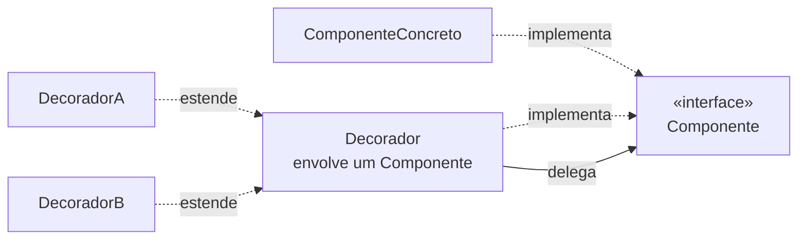

# Decorator

## Visão Geral

Decorator adiciona responsabilidades a um objeto dinamicamente, envolvendo-o em
outro objeto que implementa a mesma interface.

É a alternativa à herança para estender comportamento, e resolve o mesmo problema
de explosão combinatória que [Bridge](/03-design-patterns/bridge.md) resolve — por outro caminho.

## Problema

Um objeto precisa de comportamentos adicionais que se combinam: um fluxo de dados
que pode ser comprimido, criptografado, armazenado em buffer, ou qualquer
combinação dos três.

Por herança, três comportamentos combináveis exigem oito classes. Quatro exigem
dezesseis.

Decorator torna a combinação aditiva: um decorador por comportamento, empilhados
conforme a necessidade.

```text
new Buffer(new Compressao(new Cifra(fluxoBase)))
```

## Conceitos Centrais

### A estrutura



O decorador implementa a mesma interface e guarda uma referência ao envolvido.
Cada método delega, acrescentando comportamento antes, depois, ou ambos.

### A interface precisa ser preservada

A propriedade que faz o padrão funcionar: **o decorador é indistinguível do
objeto original para quem o usa.** Se ele adiciona métodos à interface, deixa de
poder ser empilhado transparentemente.

Isso limita o padrão a comportamentos que não mudam o contrato — registro,
cache, validação, medição, controle de acesso.

### A ordem importa

Empilhar comprimir-depois-cifrar produz resultado diferente de
cifrar-depois-comprimir — e o segundo comprime mal, porque dados cifrados são
incompressíveis.

Vale reler a pilha acima com isso em mente: na escrita, a camada **mais externa**
processa primeiro. `Buffer(Compressao(Cifra(...)))` comprime antes de cifrar, que é a
ordem certa. Trocar `Compressao` e `Cifra` de lugar não dá erro de compilação, não
quebra teste de unidade de nenhuma das duas, e produz um arquivo que ocupa o mesmo
que o original.

A ordem é uma decisão de projeto que o padrão não documenta. Quem monta a pilha
precisa saber, e nada no código força a ordem correta.

### Decorator não é Proxy

Estruturalmente idênticos; a distinção é de intenção.

**Decorator** adiciona comportamento que o cliente quer, e a composição é escolha
dele.
**[Proxy](/03-design-patterns/proxy.md)** controla acesso ao objeto, e o cliente frequentemente nem
sabe que existe.

## Quando Usar

- Comportamentos combináveis e independentes entre si.
- A combinação precisa ser decidida em tempo de execução ou de configuração.
- Estender por herança produziria explosão combinatória.
- O comportamento adicional é transversal e não altera o contrato.

## Quando Não Usar

**Quando há uma combinação só.** Um decorador sempre aplicado é um método a mais
na classe.

**Quando o comportamento adicional muda o contrato.** Se o decorador precisa
expor algo novo, ele não é transparente e a pilha quebra.

**Quando a ordem tem regras complexas.** Se certas combinações são inválidas ou
exigem ordem específica, o padrão não expressa isso e alguém vai montar errado.

**Quando a pilha fica profunda.** Depurar uma cadeia de seis decoradores é
penoso: a pilha de chamadas fica ilegível e não há um lugar onde o comportamento
completo esteja visível.

**Quando o mecanismo da plataforma resolve.** Middleware, interceptadores e
aspectos fazem o mesmo com menos código e com ordem declarada em um lugar.

## Alternativas

- **Middleware ou interceptadores** — o mesmo conceito, com a ordem declarada
  explicitamente. Preferível em frameworks que os oferecem.
- **[Strategy](/03-design-patterns/strategy.md)** — quando o que varia é o algoritmo, não uma camada
  adicional.
- **Composição direta** — passar as dependências e chamar na ordem.
- **[Proxy](/03-design-patterns/proxy.md)** — quando o objetivo é controlar acesso.

## Trade-offs

| Decorator | Herança |
|---|---|
| Combinações somam | Multiplicam |
| Decidido em execução | Fixo em compilação |
| Pilha profunda difícil de depurar | Uma classe, um lugar |
| Ordem implícita e frágil | Sem ordem a errar |
| Muitos objetos pequenos | Menos objetos |

## Modos de Falha

**Pilha profunda.** Rastreamento ilegível; nenhum lugar mostra o comportamento
completo.

**Ordem errada.** Combinação sintaticamente válida e semanticamente errada.

**Decorador que quebra a transparência.** Adiciona métodos ou altera semântica.

**Identidade perdida.** Comparação por igualdade ou verificação de tipo falha,
porque o objeto visível é o decorador e não o original.

**Custo acumulado invisível.** Cada camada adiciona uma chamada; em caminho quente
com seis camadas, isso aparece.

## Erros Comuns

**Confundir com Proxy.** Intenção diferente.

**Aplicar com uma combinação só.**

**Não documentar a ordem correta.** É a informação que o padrão não carrega.

**Usar onde middleware existe.** Reimplementar o que o framework oferece.

## Onde ele aparece na prática

**Fluxos de entrada e saída em Java.** O exemplo canônico:
`new BufferedReader(new InputStreamReader(new FileInputStream(f)))`. Também é o
exemplo que mais gera crítica — a verbosidade e a necessidade de conhecer a ordem
correta são citadas como o custo do padrão levado longe demais.

**Middleware HTTP.** Autenticação, registro, compressão e limitação de taxa
empilhados. Aqui a ordem é declarada num lugar, o que corrige a principal
fraqueza do padrão.

**Coleções sincronizadas ou imutáveis.** Envolvem uma coleção e adicionam
comportamento preservando a interface.

**Clientes HTTP com repetição e cache.** Cada preocupação é uma camada.

A lição comparativa: o padrão é o mesmo nos quatro, mas onde a ordem é declarada
centralmente — middleware — ele funciona muito melhor do que onde cada chamador a
monta.

## Exemplo Real

Um cliente de serviço externo acumulou: repetição com espera crescente, circuit
breaker, cache, registro estruturado e medição de latência.

Implementados como decoradores, cada um em sua classe, montados na configuração.

Funcionou bem por um ano. O problema surgiu quando um novo membro montou a pilha
em ordem diferente para um segundo serviço: colocou cache **depois** de repetição.

O efeito: falhas transitórias eram repetidas, e a resposta de erro final entrava
no cache. Uma indisponibilidade de dois segundos virava cinco minutos de erro
servido do cache.

A correção não foi só reordenar. Foi extrair uma função de montagem — `clientePadrao(destino)` — que constrói a pilha na ordem correta e é o único caminho suportado.

O padrão continuou; o que mudou foi tirar a decisão de ordem das mãos de quem
monta. É a mesma correção que middleware oferece por construção.

## Como manter a pilha depurável

A crítica mais válida ao padrão é o rastreamento ilegível: uma pilha de seis
decoradores produz uma cadeia de chamadas em que nada indica o que cada camada
faz.

Quatro práticas que reduzem isso significativamente:

**Nomeie os decoradores pelo comportamento, não pelo objeto.**
`ClienteComRepeticao` diz mais que `RetryDecorator` numa pilha de chamadas.

**Concentre a montagem numa função nomeada.** Uma `clientePadrao()` que constrói
a pilha correta é o único lugar onde a ordem existe, e vira documentação
executável.

**Registre a entrada e a saída de cada camada com o mesmo identificador de
correlação.** Isso reconstrói a passagem pela pilha nos registros, que é onde a
depuração de produção acontece.

**Exponha a composição.** Um método que descreve a pilha montada — os nomes das
camadas, em ordem — permite verificar em execução o que está ativo. Custa dez
linhas e responde a pergunta que mais aparece em incidente.

A alternativa estrutural continua sendo middleware, onde o framework já oferece
as quatro coisas.

## Conceitos Relacionados

- [Proxy](/03-design-patterns/proxy.md) — mesma estrutura, intenção de controle.
- [Composite](/03-design-patterns/composite.md) — estrutura recursiva parecida.
- [Chain of Responsibility](/03-design-patterns/chain-of-responsibility.md) — cadeia com semântica de
  parada.
- [Strategy](/03-design-patterns/strategy.md) — variação de algoritmo.

## Exercício Prático

Procure no seu sistema pilhas de objetos que se envolvem — clientes HTTP,
repositórios com cache, fluxos.

Para cada pilha, responda: a ordem importa? Onde ela está documentada? O que
acontece se alguém montar diferente?

## Perguntas de Entrevista

- Qual a diferença entre Decorator e Proxy?
- Por que a ordem dos decoradores é um risco?
- Quando middleware é preferível a decoradores?

## Para Aprofundar

- Gamma, Erich et al. *Design Patterns*. Addison-Wesley, 1994.
