# Facade

## Visão Geral

Facade fornece uma interface unificada e simples para um conjunto de interfaces de
um subsistema.

O critério de sucesso é único e verificável: **o cliente precisa saber menos.** Se
usar a fachada exige conhecer o subsistema por trás, ela não está cumprindo sua
função.

## Problema

Um subsistema tem muitas classes, e realizar uma operação comum exige coordenar
várias delas na ordem certa, com estado intermediário.

Cada cliente que precisa dessa operação replica a sequência. A ordem, os
parâmetros e o tratamento de erro se espalham, e mudar o subsistema toca todos os
clientes.

Facade concentra a sequência num lugar e expõe a operação como uma chamada.

## Conceitos Centrais

### A estrutura

```mermaid
graph LR
  C1[Cliente] & C2[Cliente] --> F[Fachada<br/>operacaoComum&#40;&#41;]
  F --> A[Classe A] & B[Classe B] & D[Classe C]
```

A fachada não impede o acesso direto ao subsistema — ela oferece um caminho mais
simples para o caso comum. Quem precisa de controle fino continua podendo usar as
classes por baixo.

Essa é uma propriedade importante e frequentemente perdida: **fachada é
conveniência, não bloqueio.** Uma fachada que esconde tudo e não deixa alternativa
vira gargalo quando alguém precisa do que ela não expõe.

### Facade não é Adapter

**[Adapter](adapter.md)** faz uma interface parecer outra que já existe e é
definida por terceiro. **Facade** cria uma interface nova, que ninguém exigia,
para simplificar.

Adapter atende a um contrato; Facade inventa um.

### Facade não é uma camada obrigatória

Um erro comum é transformar fachada em camada por onde tudo deve passar. Isso
muda a natureza da coisa: deixa de ser conveniência e vira controle, e a fachada
acumula métodos até virar um objeto que faz tudo.

O sintoma: uma classe `ServicoDePedidos` com quarenta métodos públicos, da qual
todo o sistema depende.

## Quando Usar

- Um subsistema exige sequências repetidas de chamadas.
- Vários clientes precisam da mesma operação composta.
- É desejável reduzir o acoplamento entre os clientes e as classes internas.
- Um subsistema legado precisa de um ponto de entrada mais simples enquanto é
  modernizado.

## Quando Não Usar

**Quando o subsistema já é simples.** Uma fachada sobre duas classes é indireção.

**Quando cada cliente precisa de algo diferente.** Se não há operação comum, a
fachada acumula métodos sem coesão — e vira um `utils` com outro nome.

**Quando ela vira o único caminho.** Bloquear o acesso direto transforma a
conveniência em gargalo.

**Quando ela acumula regra de negócio.** É a degeneração mais comum: a fachada
começa coordenando e termina decidindo. Ver
[coesão](../01-fundamentals/cohesion.md).

**Como camada obrigatória por convenção arquitetural.** Fachadas criadas por
simetria, uma por módulo, sem operação composta real, são camadas anêmicas.

## Alternativas

- **Função de conveniência** — quando é uma operação só, uma função basta.
- **Serviço de aplicação** — em arquiteturas com caso de uso explícito, ele já
  cumpre esse papel.
- **[Mediator](mediator.md)** — quando o objetivo é coordenar objetos que
  interagem entre si, não simplificar acesso.
- **Melhorar o subsistema** — se ele é complexo demais para usar, às vezes a
  resposta é corrigir isso, não envolvê-lo.

## Trade-offs

| Facade | Acesso direto |
|---|---|
| Cliente sabe menos | Cliente conhece o subsistema |
| Sequência num lugar só | Replicada |
| Mudança interna não toca clientes | Toca todos |
| Mais uma classe | Sem intermediário |
| Risco de virar objeto que faz tudo | Sem esse risco |
| Casos incomuns podem não estar cobertos | Controle total |

## Modos de Falha

**Fachada que faz tudo.** Dezenas de métodos, dependência universal, nenhuma
coesão.

**Fachada com regra de negócio.** Deixou de coordenar e passou a decidir.

**Fachada obrigatória.** Vira gargalo para casos não previstos.

**Fachada anêmica.** Cada método repassa uma chamada, sem compor nada.

**Vazamento do subsistema.** Os tipos internos aparecem na assinatura da fachada,
e o cliente continua acoplado.

## Erros Comuns

**Confundir com Adapter.**

**Criar uma por módulo, por simetria.** Sem operação composta, é camada anêmica.

**Deixar acumular métodos.** Toda fachada tende a crescer; sem revisão, vira o
objeto central do sistema.

**Bloquear o acesso direto.** Conveniência, não controle.

## Onde ele aparece na prática

**Clientes de SDK de nuvem.** Uma classe que oferece `enviarArquivo(caminho)`
sobre a sequência de credenciais, sessão, cliente, requisição de upload
multiparte e confirmação.

**APIs de alto nível de bibliotecas.** Muitas bibliotecas oferecem uma camada
simples sobre uma de baixo nível — e mantêm as duas acessíveis, que é o formato
correto.

**Serviços de aplicação.** Em Clean Architecture e Onion, o serviço de aplicação
funciona como fachada sobre o domínio para os adaptadores de entrada.

O padrão comum nos três: **a interface de baixo nível continua disponível**. As
bibliotecas que escondem completamente a camada inferior acabam gerando
solicitações de recursos que o autor precisa expor um a um — o que é o sintoma de
fachada obrigatória.

## Exemplo Real

Um sistema integrava com um ERP cuja API exigia, para consultar um pedido: abrir
sessão, autenticar, selecionar empresa, selecionar filial, montar filtro,
executar consulta, paginar, e fechar sessão.

Oito chamadas, com estado entre elas, replicadas em seis lugares — com variações,
porque cada desenvolvedor tinha copiado de um ponto diferente e adaptado.

Dois desses lugares esqueciam de fechar a sessão, o que esgotava o limite de
conexões do ERP a cada poucos dias.

A fachada expôs `consultarPedido(numero)` e concentrou a sequência. O vazamento de
sessão deixou de ser possível.

O que o time fez de certo em seguida: **manteve o cliente de baixo nível
acessível**. Seis meses depois, um relatório precisou de uma consulta em lote que
a fachada não previa, e foi implementado com o cliente direto — sem que ninguém
precisasse alterar a fachada nem esperar por isso.

## Como impedir que ela cresça

Toda fachada tende a acumular métodos. Sem contenção deliberada, ela vira o objeto
central do sistema em dois anos.

Três mecanismos que funcionam:

**Um teto declarado.** Estabeleça um número — dez, quinze métodos — e trate
ultrapassá-lo como sinal de que a fachada precisa ser dividida, não expandida. O
número é arbitrário; ter um não é.

**Divida por consumidor, não por subsistema.** Se a fachada serve a três clientes
com necessidades diferentes, três fachadas estreitas são melhores que uma larga.
É o princípio de segregação de interface aplicado. Ver
[interfaces](../02-software-design/interfaces.md).

**Verifique periodicamente se há regra de negócio dentro.** O teste: um método da
fachada contém condicional que decide algo do domínio? Se sim, a regra pertence a
outro lugar e migrou porque a fachada era o ponto de encontro conveniente.

O terceiro é o mais importante, porque a degeneração de uma fachada quase nunca é
por número de métodos — é por acúmulo de decisões que deveriam morar no domínio.

## Conceitos Relacionados

- [Adapter](adapter.md) — compatibilizar, não simplificar.
- [Mediator](mediator.md) — coordenar interação entre objetos.
- [Proxy](proxy.md) — controlar acesso.

## Exercício Prático

Procure sequências de chamadas repetidas em mais de um lugar do seu sistema.

Para cada uma, verifique se as cópias divergiram — ordem diferente, tratamento de
erro diferente, algum passo faltando. Divergência é o sinal de que a sequência
deveria estar num lugar só.

## Perguntas de Entrevista

- Qual a diferença entre Facade e Adapter?
- Por que uma fachada não deve ser o único caminho para o subsistema?
- Como você reconhece uma fachada que degenerou?

## Para Aprofundar

- Gamma, Erich et al. *Design Patterns*. Addison-Wesley, 1994.
