# Factory Method

## Visão Geral

Factory Method define uma operação de criação numa classe base e deixa as
subclasses decidirem qual objeto concreto instanciar.

O problema que ele resolve é específico: **uma classe precisa criar objetos cujo
tipo concreto ela não conhece.** Se você conhece o tipo, não precisa do padrão.

## Problema

Um framework define o esqueleto de um processo e precisa criar objetos ao longo
dele — mas os objetos concretos pertencem a quem usa o framework, e o framework
não pode conhecê-los.

O exemplo canônico é um editor de documentos que sabe abrir, salvar e fechar
documentos, sem saber se o documento é de texto, planilha ou desenho. A operação
`criarDocumento()` é abstrata; cada especialização do editor a implementa.

Note a assimetria: o padrão existe para o caso em que **quem chama a criação não
pode conhecer o que está sendo criado**. Fora dessa condição, ele é indireção.

## Conceitos Centrais

### A estrutura

```mermaid
graph TB
  C[Criador<br/>operacao&#40;&#41;<br/>criarProduto&#40;&#41; abstrato] --> P["«interface»<br/>Produto"]
  CC[CriadorConcreto<br/>criarProduto&#40;&#41;] -.estende.-> C
  PC[ProdutoConcreto] -.implementa.-> P
  CC -.cria.-> PC
```

`operacao()` usa `criarProduto()` sem saber o que ela devolve. A subclasse decide.

### A dependência da herança

Factory Method usa herança para variar a criação. Isso o amarra aos custos de
herança: um eixo de variação, acoplamento à implementação da base, e uma classe
nova para cada tipo de produto. Ver
[composição vs. herança](/02-software-design/composition-vs-inheritance.md).

Em linguagens com funções de primeira classe, passar uma função de criação
resolve o mesmo problema sem hierarquia — e é por isso que o padrão aparece com
menos frequência em código funcional e em linguagens modernas.

### Não confunda com "método estático que cria objeto"

A maior parte do que se chama de "factory" no dia a dia é uma **função de
fábrica** ou um *static factory method* — um método nomeado que constrói e
devolve um objeto.

Isso é útil e não é o padrão. A função de fábrica melhora legibilidade
(`Cor.deHex("#1f4e79")` diz mais que um construtor) e permite cache ou validação.
Factory Method resolve outro problema: variação de tipo decidida por subclasse.

Confundir os dois leva a criar hierarquias onde uma função bastaria.

## Quando Usar

- Um framework precisa criar objetos que o cliente define.
- A classe base implementa um processo e as subclasses variam apenas o que é
  criado ao longo dele.
- O conjunto de tipos de produto cresce por extensão, e você não pode alterar a
  classe base a cada novo tipo.

## Quando Não Usar

**Quando você conhece o tipo concreto.** Chame o construtor.

**Quando uma função de fábrica resolve.** Se a variação não precisa ser decidida
por subclasse, passar uma função de criação é mais simples e mais flexível — pode
mudar em execução, e não exige hierarquia.

**Quando há uma única implementação.** Ver [YAGNI](/02-software-design/yagni.md).
Uma hierarquia de criadores com um criador concreto é indireção pura.

**Quando o eixo de variação é mais de um.** Herança amarra a um; dois eixos
produzem explosão combinatória. Componha.

**Em linguagens com construtores flexíveis.** Onde é possível passar a função de
criação, o padrão perde a razão de existir.

## Alternativas

- **Função de fábrica** — a resposta na maioria dos casos.
- **Função como parâmetro** — passar `() -> Produto` em vez de herdar.
- **[Abstract Factory](/03-design-patterns/abstract-factory.md)** — quando são famílias de produtos
  relacionados, não um.
- **Injeção de dependência** — receber o objeto pronto em vez de criá-lo.

## Trade-offs

| Factory Method | Construtor direto |
|---|---|
| Cliente desacoplado do tipo concreto | Cliente conhece o tipo |
| Extensão por nova subclasse | Extensão altera o cliente |
| Uma hierarquia paralela a manter | Sem hierarquia |
| Um eixo de variação | Sem restrição |
| Fluxo indireto | Direto |

## Modos de Falha

**Hierarquia paralela.** Cada produto novo exige um criador novo. Duas
hierarquias crescendo juntas.

**Criador único.** O padrão aplicado sem segunda subclasse.

**Confusão com função de fábrica.** Hierarquia criada onde um método estático
bastava.

## Erros Comuns

**Chamar qualquer método de criação de "factory method".** A maior parte não é o
padrão.

**Aplicar quando o tipo é conhecido.** Indireção sem ganho.

**Usar herança onde uma função resolveria.**

**Criar a hierarquia antes do segundo produto.** Espere a variação existir.

## Exemplo Real

Uma biblioteca de exportação de relatórios definia `Exportador` com o processo —
validar, transformar, escrever, finalizar — e `criarEscritor()` abstrato. Cada
formato tinha sua subclasse.

Funcionou bem enquanto havia três formatos.

O problema apareceu quando surgiu um segundo eixo: destino. O mesmo formato podia
ir para arquivo local, armazenamento de objetos ou fluxo de resposta HTTP. A
hierarquia teria nove classes.

A reformulação substituiu a herança por composição: `Exportador(formatador,
destino)`. Três formatadores e três destinos, combináveis.

O que vale reter: Factory Method estava correto para o problema original. Ele
deixou de servir quando um segundo eixo apareceu — que é exatamente a limitação
declarada em "quando não usar".

## Onde ele aparece na prática

Reconhecer o padrão em bibliotecas conhecidas ajuda mais que qualquer diagrama.

**Coleções de Java.** `Collection.iterator()` é Factory Method: a interface
declara a operação, cada implementação concreta decide qual iterador devolver, e
quem consome não sabe nem precisa saber.

**Frameworks de teste.** O ciclo de vida define quando criar a instância de
teste; a subclasse ou a anotação decide qual.

**Conexões de banco.** `DriverManager.getConnection` seleciona a implementação
concreta a partir da URL — variação de tipo decidida em outro lugar que não o
chamador.

O que esses três compartilham: quem chama está dentro de uma biblioteca que não
pode conhecer as classes concretas de quem a usa. É a condição que justifica o
padrão, e a ausência dela num sistema de aplicação é a razão pela qual ele
raramente se justifica ali.

Num sistema de negócio típico, você conhece os tipos concretos. É a diferença
entre escrever um framework e escrever uma aplicação — e boa parte do uso
indevido de padrões vem de aplicar a segunda o que foi projetado para a primeira.

## Conceitos Relacionados

- [Abstract Factory](/03-design-patterns/abstract-factory.md) — famílias de produtos.
- [Builder](/03-design-patterns/builder.md) — construção em etapas.
- [Template Method](/03-design-patterns/template-method.md) — a mesma mecânica de herança aplicada ao
  processo inteiro.
- [Composição vs. Herança](/02-software-design/composition-vs-inheritance.md).

## Exercício Prático

Procure no seu sistema classes cujo nome termina em `Factory`. Para cada uma,
verifique: ela usa herança para variar o tipo criado, ou é um método nomeado que
constrói?

As do segundo tipo são funções de fábrica. Confirme se alguém as chama de padrão
sem que sejam.

## Perguntas de Entrevista

- Qual a diferença entre Factory Method e uma função de fábrica?
- Que limitação a dependência de herança impõe a este padrão?
- Quando uma função passada como parâmetro é preferível?

## Para Aprofundar

- Gamma, Erich et al. *Design Patterns*. Addison-Wesley, 1994.
- Bloch, Joshua. *Effective Java*. 3ª ed., 2018 — sobre static factory methods,
  que não são este padrão.
