# Iterator

## Visão Geral

Iterator fornece uma forma de percorrer os elementos de uma coleção sem expor sua
representação interna.

É o padrão mais bem-sucedido do catálogo, no sentido específico de que **deixou de
ser um padrão e virou recurso de linguagem**. Praticamente toda linguagem moderna
tem laço de iteração, geradores, ou ambos.

Isso torna o padrão interessante por outra razão: ele é o melhor exemplo do que
acontece quando uma solução recorrente é absorvida pela plataforma.

## Problema

O cliente precisa percorrer uma coleção. Sem abstração, ele precisa saber se é um
array, uma lista ligada, uma árvore ou um mapa — e cada percurso é diferente.

Isso amarra o cliente à estrutura escolhida. Trocar de lista para árvore toca
todo código que percorre.

Iterator separa **o quê** — os elementos, em sequência — de **como** — a
estrutura por trás.

## Conceitos Centrais

### A estrutura

```mermaid
graph LR
  C[Cliente] --> I["«interface»<br/>Iterador<br/>temProximo&#40;&#41; · proximo&#40;&#41;"]
  Col[Coleção] -->|cria| I
  IC[IteradorConcreto] -.implementa.-> I
```

O cliente conhece apenas a interface. A coleção sabe criar o iterador adequado à
sua estrutura.

### Interno e externo

**Externo** — o cliente controla o avanço. É a forma clássica e a que as
linguagens adotaram.

**Interno** — a coleção controla e chama uma função para cada elemento.
`forEach`, `map`, `filter` são iteração interna.

A externa permite parar no meio e percorrer duas coleções em paralelo. A interna
é mais compacta e menos sujeita a erro.

### Iteração preguiçosa

A evolução moderna do padrão. Um iterador não precisa ter todos os elementos —
pode gerá-los sob demanda.

Isso permite sequências infinitas, leitura de arquivos maiores que a memória, e
composição de operações sem materializar resultados intermediários.

Geradores e fluxos são essa ideia com sintaxe da linguagem.

### O contrato de modificação concorrente

A parte do contrato que mais causa defeito: **o que acontece se a coleção for
modificada durante a iteração?**

Três semânticas possíveis, e a diferença importa: falhar rápido (detectar e
lançar), operar sobre um instantâneo, ou comportamento indefinido.

Um iterador que não declara qual delas oferece é um contrato incompleto.

## Quando Usar

- É preciso percorrer uma estrutura própria, não coberta pela biblioteca padrão.
- A estrutura interna deve permanecer escondida.
- Há mais de uma forma de percurso — em árvores, ordem prévia, posterior, em
  largura.
- A geração dos elementos é cara e deve ser preguiçosa.

## Quando Não Usar

**Quando a linguagem já oferece.** Que é quase sempre. Implementar iterador para
uma lista simples é reinventar.

**Quando a estrutura é exposta de qualquer forma.** Se o cliente já conhece a
representação, o iterador não esconde nada.

**Quando índices são mais claros.** Percursos com salto, com passo ou em ordem
reversa às vezes ficam mais legíveis com índice.

**Quando o percurso precisa de contexto de posição.** Se o cliente precisa saber
onde está na estrutura — profundidade, caminho, ancestrais — a abstração de
sequência plana não serve. Ver [Visitor](visitor.md).

## Alternativas

- **Recursos da linguagem** — geradores, fluxos, laços de iteração.
- **[Visitor](visitor.md)** — quando o percurso precisa distinguir tipos de nó.
- **Devolver uma coleção imutável** — mais simples quando o conjunto é pequeno e
  cabe em memória.
- **Callback** — iteração interna sem hierarquia.

## Trade-offs

| Iterator | Expor a estrutura |
|---|---|
| Cliente independe da representação | Amarrado a ela |
| Vários percursos possíveis | Um, o que a estrutura permite |
| Preguiça e sequências infinitas | Tudo materializado |
| Uma abstração a manter | Nenhuma |
| Contrato de modificação a definir | Sem contrato |

## Modos de Falha

**Modificação concorrente.** Comportamento indefinido ou exceção, dependendo da
implementação.

**Iterador que não libera recurso.** Um iterador sobre arquivo ou conexão precisa
ser fechado; a interface clássica não obriga.

**Percurso caro escondido.** `temProximo()` que dispara consulta ao banco.

**Estado compartilhado entre iteradores.** Dois percursos simultâneos interferindo.

## Erros Comuns

**Implementar quando a linguagem oferece.**

**Não definir o contrato de modificação.**

**Esquecer de fechar iteradores sobre recursos.**

**Assumir que a iteração é barata.** Um iterador preguiçoso sobre banco pode
disparar uma consulta por elemento — o mesmo N+1 de [Proxy](proxy.md).

## Onde ele aparece na prática

**Coleções de qualquer linguagem.** `Iterable` em Java, protocolo de iteração em
Python, `IEnumerable` em C#. O padrão virou interface da plataforma.

**Geradores.** `yield` implementa iteração preguiçosa com sintaxe direta, sem
classe de iterador.

**Fluxos e sequências.** Composição de operações sobre iteradores preguiçosos.

**Cursores de banco.** Percorrer um resultado grande sem carregá-lo inteiro.

O último é onde implementar à mão ainda faz sentido em código de aplicação: um
cursor que busca em lotes e expõe uma sequência plana esconde a paginação do
consumidor — e é o caso em que o contrato de fechamento importa de verdade.

## Exemplo Real

Um sistema precisava processar um relatório de dez milhões de registros vindos do
banco.

A primeira versão carregava tudo em uma lista. Consumia 8 GB e falhava.

A segunda paginava explicitamente, e o código de negócio ficou com a lógica de
paginação misturada: buscar página, processar, verificar se há mais, incrementar.

A terceira encapsulou a paginação num iterador preguiçoso. O código de negócio
voltou a ser um laço simples sobre uma sequência, e a memória ficou constante.

Dois detalhes que só apareceram na implementação. O iterador precisava fechar a
conexão ao terminar **e** ao ser abandonado no meio — o que exigiu que ele fosse
usado dentro de um bloco com fechamento garantido.

E a modificação concorrente: registros inseridos durante o processamento apareciam
ou não conforme a ordenação. O contrato adotado foi instantâneo por consulta
ordenada por identificador, declarado na documentação do método — porque sem
declarar, cada consumidor assumiria uma coisa.

## Conceitos Relacionados

- [Composite](composite.md) — iterar sobre estrutura em árvore.
- [Visitor](visitor.md) — percurso com distinção de tipo.
- [Proxy](proxy.md) — o risco de percurso que dispara consultas.

## Exercício Prático

Procure no seu sistema pontos que carregam coleções grandes em memória.

Para cada um, verifique se o processamento é sequencial. Se for, o iterador
preguiçoso troca memória proporcional por memória constante.

## Perguntas de Entrevista

- Qual a diferença entre iteração interna e externa?
- O que deve acontecer se a coleção for modificada durante a iteração?
- Quando ainda faz sentido implementar um iterador à mão?

## Para Aprofundar

- Gamma, Erich et al. *Design Patterns*. Addison-Wesley, 1994.
- Documentação de geradores em Python e de `Stream` em Java.
