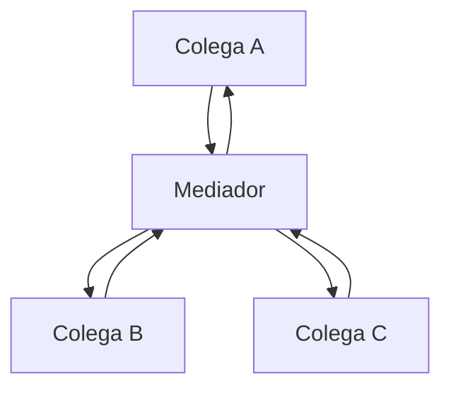

# Mediator

## Visão Geral

Mediator define um objeto que encapsula como um conjunto de objetos interage.
Eles deixam de se referenciar diretamente e passam a se comunicar pelo mediador.

O padrão troca uma teia de relacionamentos por uma estrela — e a pergunta que
decide se isso é bom é se o centro da estrela se mantém compreensível.

## Problema

Vários objetos precisam coordenar entre si. Sem mediador, cada um conhece os
outros: N objetos produzem até N×(N−1) relacionamentos possíveis.

O exemplo clássico é um formulário: habilitar o botão de envio depende de três
campos, um campo depende do valor de outro, uma seleção altera as opções de uma
terceira. Cada componente conhece vários outros, e adicionar um exige tocar
metade deles.

Com mediador, cada componente conhece apenas o mediador. As regras de interação
ficam num lugar.

## Conceitos Centrais

### A estrutura

Cada colega notifica o mediador; ele decide o que fazer e aciona os outros.

### Mediator não é Observer

Confusão frequente, e a distinção é prática.

**[Observer](/03-design-patterns/observer.md)** — o sujeito anuncia e não sabe quem reage. As reações
são independentes e a ordem não importa.

**Mediator** — conhece todos e coordena. A ordem e as dependências entre as
reações são exatamente o que ele encapsula.

Quando a ordem importa e há dependência entre as reações, Observer é a estrutura errada —
ele não tem onde guardar a sequência. Qual coordenador entra no lugar depende da natureza da
coordenação, e as Alternativas tratam disso: mediador quando é interação entre pares, máquina
de estados quando é transição, serviço de aplicação quando é caso de uso.

### O risco central

**O mediador acumula.** Ele começa com três regras e termina com trezentas linhas
de condicionais que conhecem cada colega.

Isso é uma troca, não uma solução: o acoplamento saiu dos colegas e foi para o
centro. Se o mediador vira incompreensível, o sistema piorou — antes o
acoplamento era distribuído e localmente entendível; agora está concentrado num
objeto que ninguém consegue ler inteiro.

O sinal de degeneração é o mediador conhecer detalhes internos dos colegas em vez
de apenas seus eventos e operações públicas.

### Como manter o mediador sob controle

Três práticas.

Manter o mediador **declarativo** quando possível — uma tabela de "evento X aciona
Y e Z" é auditável; uma cadeia de condicionais não.

Dividir por área de coordenação quando ele cresce — dois mediadores com escopos
distintos são melhores que um que sabe tudo.

Não deixar regra de negócio migrar para lá. O mediador coordena; a regra pertence
ao domínio.

## Quando Usar

- Muitos objetos com interações complexas entre si.
- As interações têm ordem ou dependência.
- Os objetos são reutilizáveis e não devem conhecer o contexto específico.
- A lógica de coordenação precisa ser alterada sem tocar os participantes.

## Quando Não Usar

**Quando há poucos objetos.** Três componentes com duas regras não precisam de
mediador.

**Quando as reações são independentes.** Use [Observer](/03-design-patterns/observer.md), que é mais
simples.

**Quando o mediador conheceria detalhes internos dos colegas.** Isso não reduz
acoplamento — concentra.

**Quando a coordenação é de fato regra de negócio.** Ela pertence ao domínio, não
a um coordenador de interface.

**Quando o mediador já é grande.** Adicionar mais um caso a um mediador de
trezentas linhas é agravar o problema, não usar o padrão.

## Alternativas

- **[Observer](/03-design-patterns/observer.md)** — reações independentes.
- **[Facade](/03-design-patterns/facade.md)** — quando o objetivo é simplificar acesso, não coordenar
  interação.
- **Máquina de estados** — quando a coordenação é sobre transições. Ver
  [State](/03-design-patterns/state.md).
- **Serviço de aplicação** — quando a coordenação é de caso de uso, o lugar dela é
  ali.

## Trade-offs

| Mediator | Referências diretas |
|---|---|
| Colegas desacoplados entre si | Teia de referências |
| Regras de interação num lugar | Distribuídas |
| Colegas reutilizáveis | Amarrados ao contexto |
| Mediador tende a crescer | Complexidade distribuída |
| Um ponto de falha e de leitura | Sem ponto central |

## Modos de Falha

**Mediador que faz tudo.** O modo dominante.

**Mediador com regra de negócio.** Deixou de coordenar.

**Colegas que ainda se conhecem.** O padrão foi adotado parcialmente e o
acoplamento antigo permanece.

**Cascata pelo mediador.** Um colega notifica, o mediador aciona outro, que
notifica de volta.

**Ordem implícita.** As regras dependem da ordem dos condicionais no mediador.

## Erros Comuns

**Confundir com Observer.**

**Deixar crescer sem dividir.**

**Colocar regra de negócio no mediador.**

**Adotar parcialmente.** Se alguns colegas ainda se referenciam, o benefício não
se materializa e o custo é pago.

## Onde ele aparece na prática

**Diálogos e formulários complexos.** O uso original: um controlador de tela que
coordena habilitação, visibilidade e validação entre campos.

**Barramentos de mensagem em processo.** Bibliotecas de mediador em .NET e
equivalentes despacham requisições a manipuladores — que é Mediator como
mecanismo de desacoplamento, não de coordenação.

**Controladores de tráfego aéreo.** A analogia clássica: aeronaves não coordenam
entre si; falam com a torre.

**Orquestradores de fluxo.** Um coordenador que aciona serviços na ordem e trata
falhas — é Mediator em escala de sistema, e a alternativa é coreografia. Ver
[arquitetura orientada a eventos](/03-design-patterns/event-driven.md).

O último traz a distinção mais importante do padrão em escala: **orquestração
versus coreografia**. Mediator é orquestração — um centro que sabe. Observer é
coreografia — cada parte reage ao que vê. A escolha entre as duas reaparece em
sagas e em integração de serviços.

## Exemplo Real

Uma tela de configuração de plano de saúde tinha nove campos com dependências:
faixa etária alterava coberturas disponíveis, cobertura alterava valores,
dependentes alteravam faixa aplicável, e coparticipação desabilitava três outros.

A implementação inicial tinha cada campo conhecendo os que dependiam dele.
Adicionar um campo exigia tocar quatro outros, e uma alteração produziu um laço:
dois campos se atualizavam mutuamente, e a tela travava.

O mediador concentrou as regras numa tabela declarativa: para cada campo, quais
outros recalcular quando ele muda. O laço deixou de ser possível porque a tabela
é acíclica e isso é verificado.

Dezoito meses depois, o mediador tinha crescido para 280 linhas e voltou a ser
difícil de ler — porque regras de elegibilidade tinham migrado para lá.

A segunda correção extraiu a elegibilidade para o domínio. O mediador voltou a
fazer só coordenação de interface, e ficou em 90 linhas.

O padrão funcionou nas duas vezes. O que falhou no meio foi deixar regra de
negócio migrar para o coordenador — que é o modo de degeneração previsto.

## Conceitos Relacionados

- [Observer](/03-design-patterns/observer.md) — coreografia em vez de orquestração.
- [Facade](/03-design-patterns/facade.md) — simplificar acesso, não coordenar.
- [State](/03-design-patterns/state.md) — quando a coordenação é sobre transições.

## Exercício Prático

Desenhe o grafo de quem conhece quem entre os componentes de uma tela ou módulo do
seu sistema.

Se o número de arestas se aproxima do quadrado do número de nós, há teia. Se já
existe um mediador, conte suas linhas e verifique quantas são coordenação e
quantas são regra de negócio.

## Perguntas de Entrevista

- Qual a diferença entre Mediator e Observer?
- Qual o risco central deste padrão e como mitigá-lo?
- O que distingue orquestração de coreografia?

## Para Aprofundar

- Gamma, Erich et al. *Design Patterns*. Addison-Wesley, 1994.
- Hohpe, Gregor; Woolf, Bobby. *Enterprise Integration Patterns*.
  Addison-Wesley, 2003 — orquestração e coreografia em escala de sistema.
