# Observer

## Visão Geral

Observer define uma dependência um-para-muitos: quando um objeto muda de estado,
todos os que dependem dele são notificados automaticamente.

É a base conceitual de sistemas orientados a eventos, de interfaces reativas e de
publicar-assinar. Os problemas que ele introduz — vazamento por registro não cancelado, dependência de ordem
e cascata de notificações — são pouco discutidos no ensino do padrão, que costuma parar na
inversão de dependência.

## Problema

Vários objetos precisam reagir a mudanças em outro, e o objeto observado não
deveria conhecê-los.

Sem o padrão, quem muda precisa chamar cada interessado explicitamente — o que o
acopla a todos e obriga a alterá-lo a cada novo interessado.

Observer inverte: os interessados se registram, e o observado apenas anuncia.

## Conceitos Centrais

### A estrutura

```mermaid
graph LR
  S[Sujeito<br/>registrar&#40;&#41; · notificar&#40;&#41;] --> O["«interface»<br/>Observador<br/>atualizar&#40;&#41;"]
  O1[ObservadorA] -.implementa.-> O
  O2[ObservadorB] -.implementa.-> O
```

O sujeito conhece a interface, nunca as implementações.

### Modelo push e pull

**Push** — a notificação carrega os dados da mudança. Simples, e força o sujeito
a decidir o que interessa a todos.

**Pull** — a notificação avisa que algo mudou; o observador consulta o que
precisa. Mais flexível, e cada observador faz uma consulta.

A escolha afeta acoplamento: push acopla o sujeito ao que os observadores
precisam; pull acopla os observadores à interface do sujeito.

### Os problemas que ele traz

Esta é a parte que o ensino do padrão costuma omitir, e é o que mais importa.

**Vazamento de memória.** Um observador registrado e nunca removido mantém uma
referência viva. O sujeito segura o observador, que segura o que quer que ele
referencie. É a causa mais comum de vazamento em interfaces gráficas.

**Ordem indefinida.** A ordem de notificação normalmente não é especificada. Se
dois observadores têm dependência entre si, o comportamento varia com a ordem de
registro — que é acidental.

**Cascata.** Um observador que altera o sujeito dispara nova notificação. Sem
cuidado, isso vira recursão ou laço infinito.

**Falha em um afeta os outros.** Se a notificação é síncrona e um observador
lança exceção, os seguintes podem não ser notificados. E o sujeito, que não os
conhece, não tem como decidir o que fazer.

**Depuração difícil.** O fluxo de controle se fragmenta. Rastrear o que acontece
após uma mudança exige encontrar todos os registrados, em runtime.

## Quando Usar

- Vários interessados independentes em uma mudança.
- O conjunto de interessados varia em execução.
- O sujeito não deve conhecer quem reage.
- Reações são independentes entre si e podem falhar isoladamente.

## Quando Não Usar

**Quando há um observador só e ele é fixo.** Chame diretamente.

**Quando a ordem importa.** O padrão não a garante. Se existe dependência entre
reações, elas não são independentes e Observer é a estrutura errada — considere
uma sequência explícita.

**Quando a reação precisa ser transacional com a mudança.** Notificação síncrona
dentro de transação acopla o sucesso do sujeito ao dos observadores.

**Quando o ciclo de vida dos observadores não é controlado.** Se ninguém garante o
cancelamento do registro, haverá vazamento.

**Quando o fluxo precisa ser rastreável.** Em código de negócio crítico, a
fragmentação do fluxo custa mais que o desacoplamento rende.

## Alternativas

- **Chamada direta** — quando há um interessado fixo.
- **Fila de mensagens** — quando as reações devem ser assíncronas, duráveis e
  isoladas. Ver
  [arquitetura orientada a eventos](/03-design-patterns/event-driven.md).
- **[Mediator](/03-design-patterns/mediator.md)** — quando a coordenação entre vários objetos é o
  problema, e a ordem importa.
- **Fluxos reativos** — bibliotecas que resolvem backpressure, erro e composição,
  que o Observer cru não trata.

## Trade-offs

| Observer | Chamada direta |
|---|---|
| Sujeito não conhece os interessados | Conhece todos |
| Interessados variam em execução | Fixos no código |
| Fluxo fragmentado, difícil de rastrear | Explícito |
| Ordem indefinida | Ordem explícita |
| Risco de vazamento e cascata | Sem esses riscos |

## Modos de Falha

**Vazamento por registro não cancelado.** O observador registrado mantém viva a referência a
si mesmo, e com ela tudo que ele alcança — o objeto some da tela e não sai da memória.

**Cascata infinita.** Observador que modifica o sujeito.

**Ordem acidental virando dependência.** Funciona até alguém mudar a ordem de
registro.

**Exceção interrompendo a notificação.** Observadores posteriores não são
avisados.

**Notificação durante iteração.** Um observador se registra ou cancela durante a
notificação, e a coleção é modificada enquanto é percorrida.

## Erros Comuns

**Não cancelar o registro.**

**Assumir ordem.**

**Notificar dentro de transação.** Acopla o que deveria estar desacoplado.

**Usar para fluxo de negócio crítico.** O rastreamento fica caro justamente onde
mais se precisa dele.

## Onde ele aparece na prática

**Interfaces gráficas.** Ouvintes de evento em botões e campos. É o uso original e
onde o vazamento por registro não cancelado é mais frequente.

**Bibliotecas reativas.** RxJava, Reactor e equivalentes são Observer com
tratamento de erro, composição e backpressure adicionados — precisamente as
lacunas do padrão cru.

**Frameworks de interface declarativa.** O modelo de reatividade de bibliotecas
modernas de interface é Observer sob o capô, com o ciclo de vida do registro gerenciado
pelo framework — o que elimina o vazamento **nas assinaturas que ele mesmo cria**. A
assinatura manual a uma fonte externa, feita dentro de um componente, continua exigindo
cancelamento no descarte, e é justamente ela o vazamento descrito acima.

**Eventos de domínio dentro de um processo.** Um agregado publica; assinantes
reagem. Ver [DDD](/04-domain-driven-design/index.md).

O ponto que os três primeiros ilustram: as soluções maduras não abandonaram o
padrão — elas **adicionaram o que falta nele**, e o que falta é ciclo de vida,
erro e ordem.

## Exemplo Real

Um sistema de pedidos usava eventos internos: ao confirmar um pedido, notificava
observadores que reservavam estoque, iniciavam cobrança e enviavam e-mail.

Funcionou até um incidente. O observador de estoque lançou exceção por
indisponibilidade momentânea do banco. A notificação parou ali — cobrança e
e-mail não aconteceram. O pedido ficou confirmado, sem reserva e sem cobrança.

Ninguém percebeu por dois dias.

A correção teve três partes. Cada observador passou a ter tratamento de erro
próprio, e a falha de um deixou de interromper os demais. As reações que precisam
acontecer — estoque e cobrança — saíram de Observer e viraram passos explícitos e
transacionais no caso de uso. Só o e-mail, que pode falhar sem consequência
grave, permaneceu como observador.

A lição não é que Observer é ruim. É que ele modela **reações independentes e
não críticas**. Estoque e cobrança nunca foram nenhuma das duas coisas.

## Conceitos Relacionados

- [Mediator](/03-design-patterns/mediator.md) — coordenação com ordem.
- [Command](/03-design-patterns/command.md) — encapsular a reação como objeto.
- [Arquitetura Orientada a Eventos](/03-design-patterns/event-driven.md) — o padrão em escala de
  sistema, com durabilidade.

## Exercício Prático

Encontre no seu sistema um ponto que notifica observadores. Responda: quem cancela
o registro, e quando? O que acontece se o terceiro observador lançar exceção? A
ordem importa para alguém?

## Perguntas de Entrevista

- Quais problemas Observer introduz?
- Qual a diferença entre push e pull?
- Quando uma fila de mensagens é preferível a Observer?

## Para Aprofundar

- Gamma, Erich et al. *Design Patterns*. Addison-Wesley, 1994.
- Meijer, Erik. *Your Mouse Is a Database*. ACM Queue, 2012 — a linhagem entre
  Observer e programação reativa.
