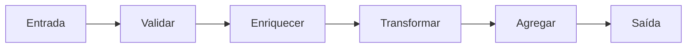

# Pipes and Filters

## Visão Geral

Pipes and Filters decompõe o processamento em uma sequência de etapas
independentes — os filtros — conectadas por canais que transportam dados — os
tubos.

Cada filtro não sabe o que veio antes nem o que vem depois. Isso é o que torna as
etapas recombináveis.

## Problema

Um processamento com várias transformações sucessivas, implementado como um bloco
único, tem três problemas.

Não é possível testar uma etapa isoladamente. Não é possível reordenar ou
reutilizar etapas em outro fluxo. E não é possível paralelizar ou escalar uma
etapa que é o gargalo.

O estilo resolve os três com uma restrição: **cada filtro tem uma entrada, uma
saída, e nenhum conhecimento do contexto.**

## Conceitos Centrais

### A estrutura

O contrato entre filtros é o formato do dado no tubo. Enquanto ele for
respeitado, qualquer filtro pode ser inserido, removido ou reordenado.

### Filtros sem estado são recombináveis

A propriedade que dá valor ao estilo: um filtro sem estado entre invocações pode
ser executado em paralelo, repetido em caso de falha, e reutilizado em outro
fluxo.

Um filtro com estado — que acumula, que depende da ordem, que mantém contexto
entre itens — perde essas três propriedades. É legítimo e precisa ser reconhecido
como diferente.

### O formato do tubo é o acoplamento

O estilo não elimina acoplamento; ele o concentra no formato do dado.

Um formato muito específico torna os filtros pouco recombináveis. Um formato muito
genérico — um mapa de chaves, por exemplo — permite recombinação e elimina
verificação: um filtro que espera um campo que o anterior não produziu falha em
execução.

O compromisso entre os dois é a decisão de projeto do estilo.

### Sincronia e assincronia

**Síncrono, em processo** — os filtros são funções compostas. Simples, e o fluxo
inteiro falha junto.

**Assíncrono, com filas** — cada filtro é um consumidor. Absorve picos, escala
por etapa, e traz duplicação, ordem e mensagens envenenadas. Ver
[Nível 04](/06-distributed-systems/index.md).

A escolha muda a natureza do que se está construindo.

## Quando Usar

- O processamento é naturalmente sequencial, com etapas distintas.
- As etapas precisam ser testadas isoladamente.
- Etapas precisam ser recombinadas em fluxos diferentes.
- Uma etapa é o gargalo e precisa escalar sozinha.
- Novas etapas são inseridas com frequência.

## Quando Não Usar

**Quando o processamento não é sequencial.** Fluxos com ramificação condicional,
junções e ciclos ficam artificiais como pipeline — e a modelagem correta é um
grafo, não uma linha.

**Quando os filtros precisam de contexto compartilhado.** Se cada etapa precisa
saber o que aconteceu nas anteriores, o desacoplamento é ilusório.

**Quando a latência de ponta a ponta importa e o pipeline é assíncrono.** Cada
tubo adiciona latência; um pipeline de sete etapas em filas separadas não serve a
requisição interativa.

**Quando o volume não justifica.** Um processamento de dezenas de itens por dia
não precisa de pipeline distribuído.

**Quando é preciso transação sobre o conjunto.** O estilo processa item a item;
garantir atomicidade sobre um lote atravessa a estrutura.

## Alternativas

- **Função composta** — pipeline síncrono sem infraestrutura, quando não há
  requisito de escala por etapa.
- **[Chain of Responsibility](/03-design-patterns/chain-of-responsibility.md)** — quando a semântica é
  "primeiro que trata para", não "todos transformam".
- **Grafo de tarefas** — quando há ramificação e junção.
- **Processamento em lote monolítico** — quando as etapas nunca são recombinadas.

## Trade-offs

| Pipes and Filters | Bloco único |
|---|---|
| Etapas testáveis isoladas | Teste do todo |
| Recombináveis e reordenáveis | Fixas |
| Escala por etapa | Escala em bloco |
| Formato do tubo a manter | Sem contrato interno |
| Latência acumulada por etapa | Uma passagem |
| Depuração atravessa etapas | Fluxo linear visível |

## Modos de Falha

**Formato genérico sem verificação.** Um filtro espera um campo ausente e falha em
execução, longe da causa.

**Filtro com estado tratado como sem estado.** Paralelizado, produz resultado
errado.

**Backpressure ausente.** Um filtro lento acumula fila indefinidamente até
esgotar recurso. Ver
[backpressure](/06-distributed-systems/index.md).

**Item envenenado travando o pipeline.** Sem dead-letter, um item que sempre falha
bloqueia os seguintes.

**Reprocessamento sem idempotência.** Repetir uma etapa duplica efeito.

## Erros Comuns

**Modelar fluxo ramificado como pipeline.**

**Formato de tubo excessivamente genérico.**

**Não tratar backpressure em pipeline assíncrono.**

**Filtros com efeitos colaterais não idempotentes.**

## Onde ele aparece na prática

**Tubos de linha de comando do Unix.** A origem e o exemplo mais puro: `grep | sort
| uniq`. Filtros sem estado, formato de texto, recombináveis por qualquer usuário.

**Pipelines de dados.** Ingestão, limpeza, enriquecimento e carga. É o uso
dominante hoje.

**Compiladores.** Análise léxica, sintática, semântica, otimização, geração — cada
fase consome a saída da anterior.

**Processamento de mídia.** Decodificar, redimensionar, marcar, codificar.

O Unix é instrutivo por uma razão específica: o formato do tubo é texto simples, o
mais genérico possível. Isso deu recombinação universal e nenhuma verificação — a
troca que o estilo faz, levada ao extremo, com sucesso duradouro em um domínio e
consequências ruins em outros.

## Exemplo Real

Um sistema de importação de notas fiscais processava arquivos com até 200 mil
registros. O código era um método de 400 linhas: ler, validar, enriquecer com
cadastro, calcular impostos, gravar, notificar.

Dois problemas. O cálculo de impostos era 80% do tempo, e escalar exigia escalar
tudo. E testar a regra fiscal exigia um arquivo de entrada completo.

A decomposição em pipeline assíncrono, com fila entre etapas, resolveu os dois: o
filtro de impostos passou a ter dez instâncias, os demais uma; e cada filtro
ganhou testes próprios com entrada sintética.

Dois problemas apareceram e valem mais que o ganho.

O primeiro: o filtro de enriquecimento consultava o cadastro por registro, e
paralelizado produziu carga que derrubou o serviço de cadastro. A correção foi
processar em lotes e adicionar limitação de taxa.

O segundo: um registro malformado fazia o filtro de validação lançar exceção, e a
mensagem voltava para a fila indefinidamente — bloqueando a fila inteira. Dead-letter
queue e alerta corrigiram, e deveriam estar lá desde o início.

Ambos são consequências previsíveis de tornar o pipeline assíncrono, e ambos
foram descobertos em produção.

## Conceitos Relacionados

- [Chain of Responsibility](/03-design-patterns/chain-of-responsibility.md) — cadeia com semântica de
  parada.
- [Decorator](/03-design-patterns/decorator.md) — camadas que envolvem, não etapas que transformam.
- [Arquitetura Orientada a Eventos](/03-design-patterns/event-driven.md) — quando os tubos são filas.
- [Integração](/08-integration-architecture/index.md).

## Exercício Prático

Escolha um processamento em lote do seu sistema e identifique as etapas
sequenciais.

Meça o tempo de cada uma. Se uma consome a maior parte, ela é candidata a escalar
sozinha — e esse é o argumento concreto para decompor.

## Perguntas de Entrevista

- O que torna um filtro recombinável?
- Onde está o acoplamento neste estilo?
- Que problemas a versão assíncrona introduz?

## Para Aprofundar

- Hohpe, Gregor; Woolf, Bobby. *Enterprise Integration Patterns*.
  Addison-Wesley, 2003.
- Garlan, David; Shaw, Mary. *An Introduction to Software Architecture*, 1993.
