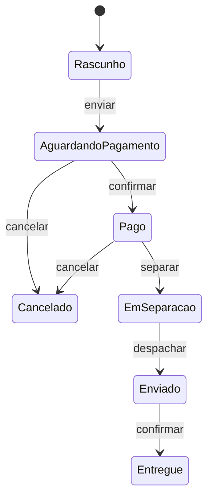

# State

## Visão Geral

State permite que um objeto altere seu comportamento quando seu estado interno
muda, de modo que ele pareça mudar de classe.

Estruturalmente é quase idêntico a [Strategy](/03-design-patterns/strategy.md). A diferença que
importa: **em Strategy, quem escolhe é o cliente; em State, a transição acontece
dentro, em resposta a eventos.**

## Problema

Um objeto tem estados, e o que ele pode fazer depende do estado atual.

Um pedido: rascunho, aguardando pagamento, pago, em separação, enviado,
entregue, cancelado. Cancelar é válido em alguns estados e não em outros.
Faturar exige que esteja pago.

Sem o padrão, isso vira verificação de estado espalhada:

```text
cancelar():
  se estado == ENVIADO ou estado == ENTREGUE:
     lançar erro
  se estado == PAGO:
     estornar
  estado = CANCELADO
```

E a mesma família de verificações se repete em cada operação. O resultado é que
**as regras de transição não estão em lugar nenhum** — estão distribuídas por
condicionais, e ninguém consegue responder "quais transições são válidas?" sem
ler o sistema inteiro.

## Conceitos Centrais

### A estrutura

Cancelar sai de dois estados apenas — o condicional do Problema nomeia dois proibidos e
cala sobre os outros quatro. A regra só fica visível quando desenhada.



Cada estado vira um objeto que implementa as operações e decide as transições
válidas. O contexto delega ao estado atual.

### O ganho real é a máquina explícita

O valor do padrão não é polimorfismo — é que as regras de transição passam a
existir num lugar identificável.

Isso permite responder perguntas que antes exigiam leitura completa: quais
transições existem? Que estados são terminais? Como se chega daqui até ali?

E permite verificação automática de parte disso: percorrer a máquina acha estado
inalcançável, estado sem saída e transição duplicada. O que ela **não** acha é transição
faltando — para isso é preciso confrontar a máquina com o negócio, porque o código não sabe
o que deveria existir e não está lá. É o que o Exemplo Real descobre, por leitura humana.

### Quem faz a transição

Duas variantes, com consequências.

**O estado decide.** Cada estado sabe para onde pode ir. Distribui o conhecimento
e acopla os estados entre si.

**O contexto decide.** A tabela de transições fica num lugar. Mais fácil de
auditar e de visualizar; o contexto cresce.

Para máquinas de negócio auditáveis, a segunda costuma ser preferível — porque a
pergunta "quais transições são permitidas?" tem uma resposta em um arquivo.

## Quando Usar

- O objeto tem estados bem definidos com comportamento diferente em cada um.
- As transições têm regras que importam ao negócio.
- Verificações de estado se repetem em várias operações.
- Estados novos aparecem com frequência.
- É preciso auditar ou visualizar o ciclo de vida.

## Quando Não Usar

**Quando há dois estados.** Um booleano e um `if` resolvem.

**Quando o comportamento não muda com o estado.** Se o estado é só um rótulo, não
há polimorfismo a explorar — é um campo.

**Quando as transições são triviais e lineares.** Um fluxo sem ramificação nem
regra não precisa de máquina.

**Quando a complexidade está nos dados, não no comportamento.** Se cada estado
tem os mesmos métodos com validações diferentes, uma tabela de regras pode ser
mais clara que uma hierarquia.

**Quando uma biblioteca de máquina de estados resolve melhor.** Para máquinas
grandes, uma declaração em dados com verificação e visualização vence a
implementação manual em classes.

## Alternativas

- **Enum com comportamento** — em linguagens que permitem, o enum carrega a
  transição e é mais compacto.
- **Tabela de transições** — um mapa de (estado, evento) para estado, verificável e
  visualizável.
- **Biblioteca de máquina de estados** — para máquinas grandes ou com
  persistência.
- **Condicional** — para dois ou três estados estáveis.

## Trade-offs

| State | Condicional espalhado |
|---|---|
| Transições num lugar identificável | Distribuídas |
| Estado novo não toca os existentes | Toca todas as verificações |
| Auditável e visualizável | Precisa ser reconstruída por leitura |
| Uma classe por estado | Nenhuma classe extra |
| Indireção na leitura | Fluxo direto |

## Modos de Falha

**Estados que se conhecem demais.** Na variante em que o estado decide, a teia de
referências entre eles fica tão acoplada quanto o condicional que substituiu.

**Estado inalcançável.** Existe na hierarquia e nenhuma transição leva a ele.

**Transição faltando.** Uma combinação válida no negócio não existe no código, e
descobre-se em produção.

**Estado persistido divergindo do código.** O banco tem valores que a máquina
atual não conhece — o modo de falha mais caro, porque aparece em dados antigos.

**Explosão de estados.** Combinações de duas dimensões modeladas como estados
distintos.

## Erros Comuns

**Confundir com Strategy.** A transição interna é a distinção.

**Aplicar com dois estados.**

**Não tratar estados persistidos legados.** Toda mudança na máquina precisa
considerar o que já está gravado.

**Modelar duas dimensões como um conjunto de estados.** Produz explosão
combinatória; use dois campos.

## Onde ele aparece na prática

**Analisadores léxicos e de protocolo.** Estado é intrínseco ao problema.

**Fluxos de pedido, assinatura e sinistro.** O uso mais comum em sistemas de
negócio, e onde a auditabilidade da máquina tem valor regulatório.

**Conexões de rede.** Aberta, conectando, conectada, fechando, fechada — com
transições que o protocolo define.

**Interfaces de usuário com fluxos por etapas.** Cada etapa habilita ações
diferentes.

Nos casos de negócio, a razão dominante para adotar o padrão não é organização de
código — é que alguém precisa **responder por escrito** quais transições são
possíveis, e essa resposta precisa estar em um lugar.

## Exemplo Real

Um sistema de sinistros de seguro tinha nove estados e verificações espalhadas
por doze serviços.

O problema que forçou a mudança foi de auditoria, não técnico: o regulador pediu a
documentação das transições possíveis, e o time levou três semanas para
reconstruí-la lendo o código — e a versão reconstruída tinha erros.

A extração para máquina de estados explícita, com a tabela de transições em um
arquivo, tornou a resposta imediata. Um teste passou a gerar o diagrama a partir
da tabela.

Dois achados apareceram durante a extração. Uma transição existia no código e não
deveria — um sinistro negado podia voltar a "em análise" por um caminho que
ninguém conhecia. E duas transições que o negócio esperava não existiam.

O padrão não corrigiu essas coisas. Ele as tornou visíveis, que é o que a
condição espalhada impedia.

## Conceitos Relacionados

- [Strategy](/03-design-patterns/strategy.md) — mesma estrutura, escolha externa.
- [Command](/03-design-patterns/command.md) — encapsular a transição como objeto.
- [Memento](/03-design-patterns/memento.md) — capturar e restaurar estado.

## Exercício Prático

Escolha uma entidade do seu sistema que tenha um campo de status.

Liste todos os valores possíveis e, para cada par, verifique se a transição é
permitida. Depois procure no código onde cada verificação acontece.

O número de lugares e a dificuldade de montar a tabela dizem se o padrão se paga.

## Perguntas de Entrevista

- Qual a diferença entre State e Strategy?
- Qual o ganho real de uma máquina de estados explícita?
- O que fazer com estados já persistidos ao alterar a máquina?

## Para Aprofundar

- Gamma, Erich et al. *Design Patterns*. Addison-Wesley, 1994.
- Harel, David. *Statecharts: A Visual Formalism for Complex Systems*, 1987.
