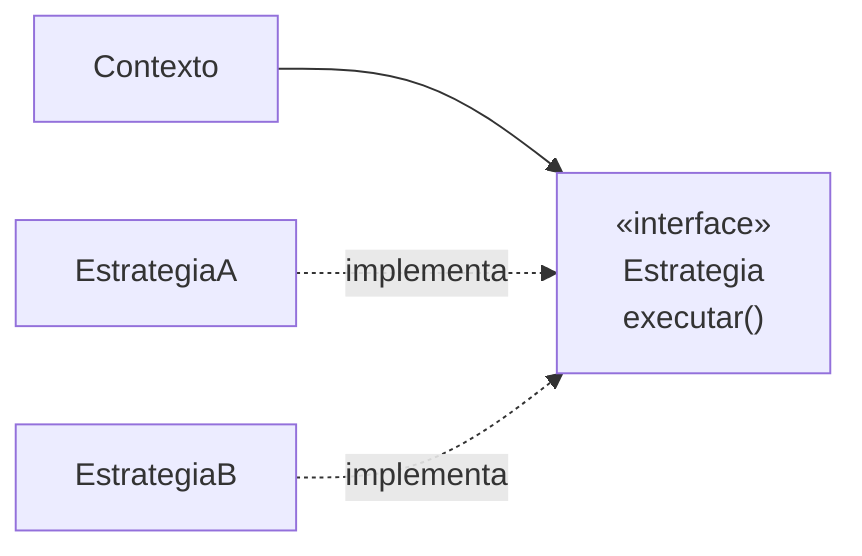

# Strategy

## Visão Geral

Strategy define uma família de algoritmos, encapsula cada um, e os torna
intercambiáveis.

É o padrão que aparece em mais lugares do código de aplicação, quase sempre na forma
degenerada de uma função passada como argumento. E é onde a cerimônia da versão completa —
interface, implementações, seleção — mais frequentemente cobra sem entregar: com duas
variantes que ninguém vai estender, um `if` diz a mesma coisa em menos linhas.

## Problema

Uma operação tem várias formas de ser executada, e a escolha depende de contexto.

Sem o padrão, isso vira um condicional que cresce:

```text
se tipo == A:  algoritmo A
senão se B:    algoritmo B
senão se C:    algoritmo C
```

Três problemas aparecem quando esse condicional cresce.

Ele se replica: outras operações precisam da mesma distinção, e o `switch`
aparece em vários lugares. Adicionar um caso toca todos.

Ele mistura níveis: a lógica de seleção e as implementações moram juntas, e o
método fica longo.

E ele impede variação em execução: a escolha está no código, não nos dados.

## Conceitos Centrais

### A estrutura



O contexto guarda uma estratégia e delega. Trocar a estratégia troca o
comportamento sem tocar o contexto.

### Strategy é composição sobre herança aplicada

O que [Template Method](/03-design-patterns/template-method.md) faz com herança, Strategy faz com
composição — e por isso herda as vantagens: variação em execução, sem
acoplamento à implementação da base, e múltiplos eixos combináveis.

### Em linguagens com funções de primeira classe, é uma função

Quando a estratégia tem um método só, a interface é cerimônia. Passar uma função
resolve o mesmo com menos código:

```text
calcular(valor, taxa -> valor * taxa)
```

Isso não é uma simplificação menor — é a forma que o padrão assume na maior parte
do código moderno, e a razão pela qual "Strategy" aparece menos como nome
explícito mesmo sendo usado o tempo todo.

### Onde a seleção mora

O padrão não diz quem escolhe a estratégia. Três opções, com consequências
diferentes: o cliente escolhe e injeta; uma fábrica escolhe a partir de um dado;
ou a configuração define.

A segunda apenas move o `switch` para a fábrica — o que é uma melhoria real
(ele existe uma vez, não em cada operação), mas não o elimina.

## Quando Usar

- Existem variantes reais de um algoritmo, com mais de uma implementação em uso.
- A escolha precisa acontecer em execução ou por configuração.
- O condicional se replica em mais de um lugar.
- Novas variantes aparecem com frequência.
- É preciso testar cada variante isoladamente.

## Quando Não Usar

**Quando há duas variantes estáveis.** Um `if` é mais legível que uma interface e
duas classes. O padrão se paga a partir de três, e principalmente quando o número
cresce.

**Quando as variantes nunca mudam.** Sem variação futura, a flexibilidade não é
exercida.

**Quando o condicional aparece uma vez só.** Não há replicação a eliminar.

**Quando a linguagem oferece função de primeira classe e a estratégia tem um
método.** Use a função.

**Quando as estratégias precisam de dados diferentes.** Se cada uma exige
parâmetros distintos, a interface comum vira um conjunto de parâmetros opcionais
— e o padrão está forçando uma uniformidade que não existe.

## Alternativas

- **Função como parâmetro** — a forma moderna do mesmo padrão.
- **Condicional simples** — para duas variantes estáveis.
- **Tabela de despacho** — um mapa de chave para função, quando a seleção é por
  valor.
- **Polimorfismo no próprio objeto** — se a variação acompanha o tipo do dado, o
  método pode morar nele.

## Trade-offs

| Strategy | Condicional |
|---|---|
| Variante nova não toca o existente | Toca o condicional |
| Cada variante testável isolada | Teste passa pelo condicional |
| Escolha em execução | Fixa no código |
| Mais tipos e mais arquivos | Tudo num lugar |
| Fluxo indireto | Legível linearmente |
| Seleção ainda precisa morar em algum lugar | A seleção é o próprio condicional |

## Modos de Falha

**Interface com parâmetros opcionais.** Sinal de que as estratégias não são
uniformes.

**Estratégia com estado.** Se ela guarda estado entre chamadas, compartilhá-la
entre contextos produz defeito.

**Explosão de classes triviais.** Vinte estratégias de uma linha cada.

**Seleção espalhada.** O `switch` que se queria eliminar reaparece em vários
lugares que escolhem a estratégia.

## Erros Comuns

**Aplicar com duas variantes.** Três arquivos para substituir um `if` de duas linhas, e a
terceira variante que justificaria a estrutura nunca chega.

**Criar interface onde uma função basta.**

**Achar que elimina o condicional.** Ele é movido para a seleção; o ganho é
existir uma vez.

**Confundir com [State](/03-design-patterns/state.md).** Strategy é escolhida de fora; State muda
sozinho conforme o objeto evolui.

## Onde ele aparece na prática

**Comparadores de ordenação.** `sort(lista, comparador)` é Strategy: o algoritmo
de comparação é passado. Em linguagens modernas, uma função.

**Codificação e compressão.** Bibliotecas que aceitam o algoritmo como parâmetro.

**Políticas de repetição.** Espera fixa, exponencial, com variação aleatória —
cada uma uma estratégia, escolhida por configuração.

**Cálculo de frete, imposto e desconto.** O uso mais comum em sistemas de
negócio, e o que costuma justificar o padrão: as variantes são muitas, mudam por
decisão externa, e precisam ser testadas isoladamente.

Nos três primeiros, a forma predominante hoje é a função. No quarto, a interface
se justifica porque cada estratégia costuma precisar de mais de uma operação e de
dependências próprias.

## Exemplo Real

Um sistema de assinaturas calculava desconto com um método de 200 linhas e sete
ramos: primeiro mês, anual, cupom, indicação, parceria, funcionário, reativação.

O condicional existia em três lugares: cálculo do valor, exibição da simulação e
relatório financeiro. Os três tinham divergido — o relatório não conhecia
"reativação", adicionada seis meses antes.

A extração em estratégias resolveu a divergência por construção: passou a existir
um lugar por tipo de desconto, e os três consumidores usam os mesmos objetos.

O que o time fez de errado no início e corrigiu depois: criou também
`EstrategiaSemDesconto` para "eliminar o nulo". Ela nunca fez nada e adicionava
um caso a cada leitura do código. Foi removida, e a ausência de desconto voltou a
ser representada pela ausência de estratégia.

Nem todo caso precisa de uma classe.

## Conceitos Relacionados

- [State](/03-design-patterns/state.md) — parecido, com transição interna.
- [Template Method](/03-design-patterns/template-method.md) — a versão com herança.
- [Bridge](/03-design-patterns/bridge.md) — duas dimensões, não uma.
- [Composição vs. Herança](/02-software-design/composition-vs-inheritance.md).

## Exercício Prático

Procure o `switch` ou a cadeia de `if` mais longa do seu sistema.

Verifique: ela aparece em mais de um lugar? As cópias divergiram? Quantos ramos
foram adicionados no último ano?

As três respostas juntas dizem se Strategy se paga ali.

## Perguntas de Entrevista

- Qual a diferença entre Strategy e State?
- Strategy elimina o condicional?
- Quando uma função é preferível à interface?

## Para Aprofundar

- Gamma, Erich et al. *Design Patterns*. Addison-Wesley, 1994.
