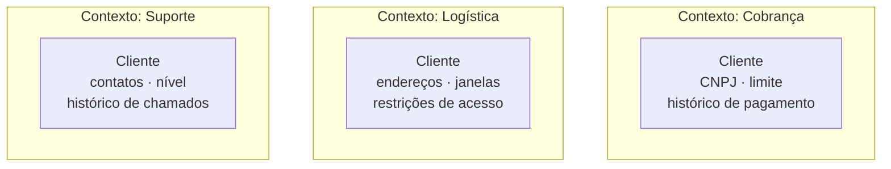

# Bounded Context

## Visão Geral

Um bounded context é a fronteira dentro da qual um modelo e sua linguagem têm
significado único e consistente.

É o conceito mais consequente do DDD, porque é o único que decide arquitetura
diretamente: as fronteiras de contexto são as melhores candidatas a fronteiras de
módulo e, mais tarde, de serviço.

## Problema

A ambição natural ao modelar uma empresa é um modelo único: uma definição de
"cliente", uma de "produto", uma de "pedido", compartilhadas por todos os
sistemas.

Isso é atraente e impossível.

"Cliente" em cobrança é uma entidade fiscal com CNPJ, condições de pagamento e
histórico de inadimplência. Em logística, é um conjunto de endereços com
restrições de entrega e janelas de recebimento. Em suporte, é uma pessoa com
histórico de interações e nível de contrato.

Forçar um modelo comum produz um dos dois resultados, e ambos são ruins.

**O modelo inchado** — uma classe `Cliente` com sessenta campos, dos quais cada
contexto usa oito, e ninguém sabe quais são obrigatórios em qual situação.

**O modelo mínimo** — só o que é comum aos três, o que deixa cada contexto
implementando o que falta por fora, com duplicação e divergência.

Bounded context aceita o que a realidade impõe: **modelos diferentes, com
fronteiras explícitas e tradução entre eles.**

## Conceitos Centrais

### A mesma palavra, significados diferentes

O sinal mais confiável de que há uma fronteira: um termo muda de significado.

Os três se referem à mesma entidade do mundo real. São três modelos, e devem
permanecer três.

O que os liga é um identificador compartilhado, não uma classe compartilhada.

### Contexto é solução; subdomínio é problema

Ver [subdomínio](/04-domain-driven-design/subdomain.md). O ideal é um contexto por subdomínio, e a
realidade diverge:

Um subdomínio atendido por dois contextos — frequentemente por razão histórica.

Um contexto cobrindo três subdomínios — o caso típico de sistema legado.

Quando divergem, isso é informação sobre onde o software não acompanha o negócio.

### O contexto define o limite do modelo

Dentro da fronteira, o modelo é consistente e a linguagem é única. Fora, nada é
garantido.

Isso significa que a fronteira precisa ser real — imposta por módulo, por
processo, ou por sistema. Uma fronteira que só existe no diagrama não delimita
nada, e o modelo vaza. Ver
[arquitetura vs. implementação](/01-fundamentals/architecture-vs-implementation.md).

### Contextos se comunicam por tradução

Nenhum contexto expõe seu modelo interno. A comunicação acontece por contratos
próprios da fronteira, com tradução dos dois lados.

As formas de relacionamento entre contextos — parceria, cliente-fornecedor,
conformista, e outras — são o assunto de
[context mapping](/04-domain-driven-design/context-mapping.md). A defesa contra o modelo alheio é a
[anti-corruption layer](/04-domain-driven-design/anti-corruption-layer.md).

## Modelo Mental

**Onde o vocabulário muda de significado, há uma fronteira.**

É um teste que se aplica ouvindo as pessoas trabalharem. Quando duas áreas usam a
mesma palavra e precisam esclarecer o que querem dizer, a fronteira está ali.

## Quando Usar

- Áreas diferentes do negócio usam os mesmos termos com significados distintos.
- Times diferentes trabalham em partes diferentes do domínio.
- Um modelo único está ficando inchado ou cheio de casos condicionais.
- Partes do sistema evoluem em ritmos diferentes.
- É preciso integrar com um sistema externo que tem seu próprio modelo.

## Quando Não Usar

**Quando há um modelo e ele serve bem.** Num sistema pequeno, com um time e um
domínio coeso, criar fronteiras adiciona tradução sem resolver nada.

**Quando as fronteiras propostas não correspondem a mudança de significado.**
Contextos criados por simetria organizacional ou por camada técnica não capturam
nada.

**Antes de entender o domínio.** Fronteira de contexto errada é cara: ela dita
onde a tradução acontece e, mais tarde, onde os serviços são extraídos. Comece com
fronteiras internas fracas.

**Quando o custo de tradução supera o de um modelo compartilhado.** Dois contextos
com noventa por cento de sobreposição e tradução constante provavelmente eram um.

## Alternativas

- **Modelo compartilhado (*shared kernel*)** — dois contextos compartilham
  deliberadamente uma parte pequena do modelo. Reduz tradução e acopla os dois
  times; exige acordo explícito sobre mudanças.
- **Um contexto só** — legítimo em sistemas pequenos.
- **Contexto por sistema externo** — cada integração ganha o seu, com tradução na
  fronteira.

## Trade-offs

| Contextos separados | Modelo unificado |
|---|---|
| Cada modelo serve bem ao seu problema | Serve mal a todos |
| Times evoluem independentemente | Coordenação a cada mudança |
| Vocabulário preciso em cada área | Termos ambíguos |
| Tradução em cada fronteira | Sem tradução |
| Dado duplicado entre contextos | Uma fonte |
| Consistência eventual entre eles | Transacional |

A quinta linha é a que mais gera resistência: duplicar dados de cliente em três
contextos parece errado. É o preço de cada contexto ter o modelo que precisa, e
costuma ser menor que o custo do modelo inchado.

## Modos de Falha

**Contexto que vaza o modelo.** Expõe suas entidades; os vizinhos passam a
depender da estrutura interna.

**Fronteira nominal.** Existe no diagrama e nada a impõe.

**Modelo canônico corporativo.** A tentativa de definir "o cliente da empresa"
consome anos e não converge — porque a premissa está errada.

**Contextos demais.** Fronteiras onde não há mudança de significado produzem
tradução constante.

**Banco compartilhado entre contextos.** Anula a fronteira: os dois passam a
depender do mesmo esquema.

## Erros Comuns

**Buscar um modelo único para a empresa.** O erro que o conceito existe para
corrigir.

**Confundir com subdomínio.** Solução versus problema.

**Traçar fronteiras por estrutura organizacional sem verificar o vocabulário.** A
organização é uma pista, não a resposta.

**Não impor a fronteira.**

**Compartilhar entidades entre contextos "para não duplicar".** É o caminho de
volta ao modelo unificado.

## Exemplo Real

Uma rede de farmácias tinha um sistema com uma entidade `Produto` de 84 campos.

A análise do uso mostrou três agrupamentos de campos que nunca eram usados juntos:

**Comercial** usava preço, margem, fornecedor, condição de compra, curva ABC.
**Regulatório** usava princípio ativo, tarja, registro na agência, exigência de
receita, controle especial.
**Logística** usava dimensões, peso, condição de armazenamento, validade,
lote.

Nenhum dos três usava mais de 30 dos 84 campos. E havia 19 campos que só faziam
sentido para alguns tipos de produto, produzindo validações condicionais
espalhadas.

A separação em três contextos, ligados pelo código do produto, resolveu três
problemas de uma vez.

As validações condicionais desapareceram: no contexto regulatório, `Medicamento`
tem tarja obrigatória, e `ProdutoDeHigiene` é outra coisa. No comercial, essa
distinção não existe.

O time regulatório passou a alterar suas regras sem coordenar com o comercial.

E o cadastro de produto deixou de exigir 84 campos: cada contexto pede o que
precisa, no momento em que precisa.

O que gerou mais resistência foi a duplicação do nome do produto nos três
contextos. Levou tempo aceitar que o nome comercial, o nome regulatório e a
descrição de embalagem eram de fato três coisas — e que o sistema antigo as
forçava a ser uma, com um campo que ninguém sabia qual dos três significava.

## Conceitos Relacionados

- [Ubiquitous Language](/04-domain-driven-design/ubiquitous-language.md) — a linguagem dentro da fronteira.
- [Context Mapping](/04-domain-driven-design/context-mapping.md) — como os contextos se relacionam.
- [Anti-Corruption Layer](/04-domain-driven-design/anti-corruption-layer.md) — a defesa na fronteira.
- [Design Modular](/02-software-design/modular-design.md) — a fronteira em
  código.

## Exercício Prático

Escolha três termos centrais do seu domínio. Para cada um, pergunte a pessoas de
áreas diferentes o que ele significa.

Onde as respostas divergirem — mesmo sutilmente — há uma fronteira de contexto que
o modelo provavelmente não representa.

## Perguntas de Entrevista

- Qual a diferença entre bounded context e subdomínio?
- Por que o modelo canônico corporativo costuma falhar?
- O que liga dois contextos que se referem à mesma entidade do mundo real?

## Para Aprofundar

- Evans, Eric. *Domain-Driven Design*. Addison-Wesley, 2003.
- Vernon, Vaughn. *Implementing Domain-Driven Design*. Addison-Wesley, 2013.
- Fowler, Martin. *BoundedContext*, 2014.
