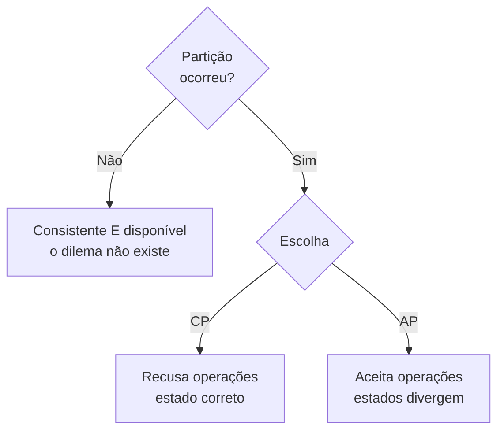

# CAP

## Visão Geral

O teorema CAP, formulado por Eric Brewer e provado por Gilbert e Lynch, afirma:

> Um sistema distribuído não pode simultaneamente garantir **consistência** e
> **disponibilidade** quando ocorre uma **partição de rede**.

A leitura popular — "escolha dois entre os três" — está errada, e o erro tem
consequência prática: ela sugere uma decisão permanente de arquitetura, quando o
teorema descreve o comportamento durante um evento raro.

## O Problema

CAP é o resultado teórico mais citado e mais mal citado da área.

Três equívocos comuns:

**"Escolha dois entre três."** Partição não é uma escolha — é algo que acontece
com você. Você não decide "não ter partição"; você decide o que fazer quando ela
ocorrer.

**"Somos AP" ou "somos CP" como identidade do sistema.** A escolha é por operação,
não por sistema. O mesmo banco pode responder de formas diferentes conforme a
configuração da operação.

**"CAP explica por que abrimos mão de consistência."** Fora de partição, não há
dilema CAP. O sistema pode ser consistente **e** disponível. Se ele não é, a razão
é outra — tipicamente latência, que é o que [PACELC](/06-distributed-systems/pacelc.md) trata.

## Conceitos Centrais

### O que cada letra significa aqui

**C — Consistência.** Especificamente **linearizabilidade**: toda leitura observa
a escrita mais recente. É uma definição mais estreita que o "C" de ACID.

**A — Disponibilidade.** Toda requisição a um nó não falho recebe resposta. Uma
resposta de erro não conta como disponível.

**P — Tolerância a partição.** O sistema continua operando apesar de mensagens
perdidas entre nós.

### A formulação correta

**Durante uma partição**, um sistema distribuído escolhe entre:

**CP** — recusar operações que não podem garantir consistência. O sistema fica
indisponível para parte dos clientes, e o estado permanece correto.

**AP** — continuar aceitando operações. O sistema permanece disponível, e os
estados divergem — o que exige
[resolução de conflito](/06-distributed-systems/conflict-resolution.md) depois.

Note que o ramo esquerdo é onde o sistema passa 99,99% do tempo — e CAP não diz
nada sobre ele.

### A escolha é por operação

Um sistema de comércio pode razoavelmente decidir:

| Operação | Sob partição |
|---|---|
| Ver catálogo | AP — servir dado possivelmente velho |
| Adicionar ao carrinho | AP — reconciliar depois |
| Finalizar compra com estoque único | CP — recusar |
| Consultar pedido anterior | AP |

Tratar isso como decisão de sistema força a operação mais crítica a definir o
comportamento de todas.

### Partição é rara; o dilema também

Partições acontecem — e são raras em relação ao tempo de operação. Um sistema pode
passar meses sem uma.

Isso significa que **CAP não é o trade-off dominante do dia a dia**. O dominante é
latência versus consistência, que vale sempre. Ver [PACELC](/06-distributed-systems/pacelc.md).

Times que decidem a arquitetura inteira com base em CAP estão otimizando para o
caso raro e ignorando o permanente.

## Por Que Isso Importa

**Porque a decisão sob partição precisa ser deliberada.** Se ninguém decidiu, o
comportamento é o que a configuração padrão do banco fizer — e frequentemente não
é o que o negócio aceitaria.

**Porque a escolha é do negócio.** "Sob partição, preferimos recusar vendas ou
aceitar risco de venda dupla?" é pergunta de negócio, e a resposta varia por
domínio.

**Porque a citação errada leva à decisão errada.** Concluir "somos AP, logo
abrimos mão de consistência sempre" troca uma garantia permanente por um evento
raro.

## Erros Comuns

**"Escolha dois entre três".** Partição não é opcional num sistema distribuído.

**Tratar como propriedade do sistema.** É por operação.

**Usar CAP para justificar consistência eventual fora de partição.** Ali o
argumento correto é latência.

**Confundir o C de CAP com o C de ACID.** São coisas diferentes: um é
linearizabilidade, o outro é preservação de invariantes.

**Achar que sistemas de nó único têm dilema CAP.** Sem distribuição, não há
partição.

**Não configurar o comportamento sob partição.** O padrão decide por você.

## Exemplo Real

Uma rede de farmácias tinha o sistema de vendas replicado entre a matriz e cada
loja, para que as lojas continuassem vendendo se a conexão caísse.

A conexão caía com frequência — internet de loja, em cidades pequenas.

A configuração original era AP para tudo: a loja continuava operando com a réplica
local e sincronizava ao reconectar.

Funcionou para a maior parte das operações e produziu dois problemas graves.

**Medicamentos controlados.** A venda exige registro em sistema nacional com
verificação de receita já utilizada. Duas lojas venderam contra a mesma receita
durante uma partição de 40 minutos. Isso é infração regulatória com consequência
para a licença de funcionamento.

**Estoque de item escasso.** Durante campanhas, itens com poucas unidades eram
vendidos além do disponível, gerando cancelamento e reclamação.

A revisão separou as operações.

**CP** — venda de controlados e reserva de item com estoque abaixo de um limiar.
Sem conexão com a matriz, a operação é recusada com mensagem explícita ao
balconista. Uma venda perdida é preferível a uma infração regulatória.

**AP** — venda de item comum, consulta de preço, cadastro de cliente, programa de
fidelidade. Tudo continua funcionando com a réplica local e reconcilia depois.

O que tornou a decisão possível foi trazer a farmacêutica responsável técnica para
a conversa. A pergunta — "sob partição, preferimos recusar a venda ou aceitar o
risco de duplicar receita?" — não é técnica, e a resposta dela foi imediata e
inequívoca.

## Conceitos Relacionados

- [PACELC](/06-distributed-systems/pacelc.md) — a extensão que cobre o caso comum.
- [Consistência](/06-distributed-systems/consistency.md) — o espectro de garantias.
- [Disponibilidade](/06-distributed-systems/availability.md).
- [Falha de Rede](/06-distributed-systems/network-failure.md) — de onde vem a partição.

## Exercício Prático

Para as três operações mais críticas do seu sistema, responda: se a rede entre a
aplicação e o banco ficar partida, o que deve acontecer — recusar ou aceitar e
reconciliar?

Depois verifique o que o sistema faz hoje. Se ninguém decidiu, o padrão da
configuração decidiu.

## Perguntas de Entrevista

- Enuncie CAP corretamente. Por que "escolha dois entre três" é impreciso?
- Por que CAP não descreve o comportamento normal do sistema?
- A escolha entre CP e AP é do sistema ou da operação?

## Para Aprofundar

- Gilbert, Seth; Lynch, Nancy. *Brewer's Conjecture and the Feasibility of
  Consistent, Available, Partition-Tolerant Web Services*. SIGACT News, 2002.
- Brewer, Eric. *CAP Twelve Years Later: How the "Rules" Have Changed*. IEEE
  Computer, 2012 — o próprio autor corrigindo as más leituras.
- Kleppmann, Martin. *A Critique of the CAP Theorem*, 2015.
