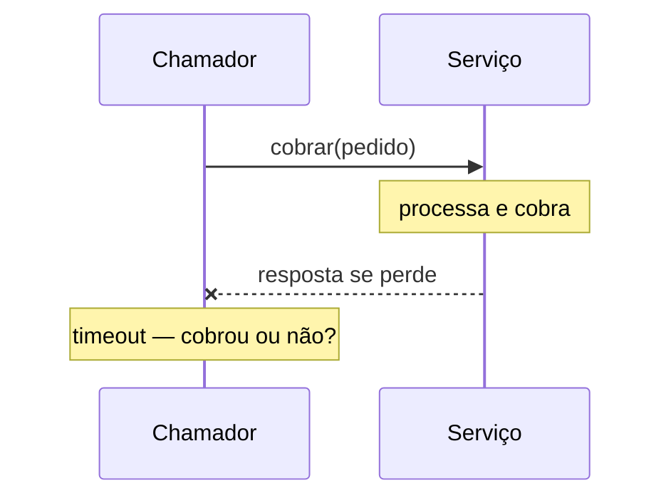

# Fundamentos de Sistemas Distribuídos

## Visão Geral

Um sistema é distribuído quando componentes em máquinas diferentes se coordenam
pela rede.

A definição é banal. A consequência não: **atravessar a rede muda a natureza da
chamada**, e praticamente toda dificuldade dos níveis seguintes deriva disso.

## O Problema

Numa chamada de função, três coisas são verdadeiras e ninguém precisa pensar
nelas. A chamada acontece ou não acontece. Se o processo morre, morre inteiro. E o
tempo entre chamar e receber é desprezível.

Numa chamada de rede, as três deixam de valer.

A chamada tem **três resultados**, não dois: sucesso, falha, e *não sei*. O
terceiro é o que torna tudo difícil — quando o timeout estoura, você não sabe se
a operação aconteceu.

O processo do outro lado pode morrer sem que o seu morra. Isso é
[falha parcial](partial-failure.md), e é a diferença estrutural.

E o tempo deixa de ser desprezível: ele varia, e a variação é maior que a média.

A tentação é tratar a chamada remota como uma chamada local mais lenta. Ela não é.
É uma operação com semântica diferente, e projetar como se não fosse produz
sistemas que funcionam em teste e falham em produção de formas que ninguém
consegue reproduzir.

## Conceitos Centrais

### As oito falácias

Peter Deutsch e colegas nomearam as premissas que todo mundo assume sem perceber:

| Falácia | O que de fato ocorre |
|---|---|
| A rede é confiável | Pacotes se perdem, conexões caem |
| A latência é zero | Varia de microssegundos a centenas de milissegundos |
| A banda é infinita | É finita e compartilhada |
| A rede é segura | Tráfego é interceptável e forjável |
| A topologia não muda | Instâncias entram e saem o tempo todo |
| Há um administrador | Há vários, com políticas diferentes |
| O custo de transporte é zero | Serialização e banda custam |
| A rede é homogênea | Protocolos, versões e capacidades diferem |

A lista tem quase três décadas e continua descrevendo os defeitos que aparecem em
sistemas novos. Vale como diagnóstico: diante de um comportamento inexplicável,
frequentemente uma dessas premissas foi assumida.

### O terceiro resultado

A ambiguidade do timeout é o conceito mais consequente deste nível.

Do lado do chamador, "a resposta não chegou" é indistinguível de "a requisição não
chegou". Repetir pode duplicar; não repetir pode perder.

A única saída é tornar a operação repetível sem efeito adicional — que é
[idempotência](idempotency.md), e é por isso que ela é o conceito central desta
seção, não um detalhe.

### Não há tempo global

Relógios de máquinas diferentes divergem. Isso significa que "aconteceu antes"
não é decidível comparando marcas de tempo de máquinas distintas.

A consequência prática aparece em ordenação, em expiração de credencial e em
resolução de conflito. Ver [relógio e tempo](clock-and-time.md).

### Não há conhecimento perfeito

Um nó não consegue distinguir com certeza entre "o outro caiu" e "o outro está
lento". Essa impossibilidade é o que torna
[detecção de falha](failure-detection.md) um problema de heurística, não de
verdade — e o que fundamenta os limites de
[CAP](cap.md) e [consenso](consensus.md).

### A recomendação que precede tudo

**Não distribua sem necessidade.** Cada fronteira de rede adiciona falha parcial,
latência, ordenação e duplicação ao seu sistema.

Um monolito bem modularizado não tem nenhum desses problemas. Ver
[monolito modular](../03-design-patterns/modular-monolith.md).

## Por Que Isso Importa

**Porque as premissas erradas produzem defeitos irreproduzíveis.** Um sistema
projetado como se a rede fosse confiável funciona 99% das vezes e falha de formas
que só aparecem sob carga, e que nenhum teste local reproduz.

**Porque o custo é assumido no primeiro dia.** Ao distribuir, você adquire
permanentemente os problemas desta seção. Reconhecê-los antes é o que permite
decidir se vale.

**Porque idempotência precisa entrar cedo.** Ela é barata de projetar e cara de
retrofitar — exige mudar o modelo de dados.

## Erros Comuns

**Tratar chamada remota como local mais lenta.** Ver
[Proxy](../03-design-patterns/proxy.md): a transparência convida ao erro.

**Assumir que o timeout significa que não aconteceu.**

**Comparar marcas de tempo de máquinas diferentes.**

**Repetir sem idempotência.**

**Distribuir por reputação.** O custo é permanente.

**Testar apenas o caminho feliz.** Os defeitos deste nível vivem nos caminhos de
falha, e eles precisam ser exercitados deliberadamente.

## Exemplo Real

Uma integração de cobrança funcionava havia dois anos. Numa terça-feira, 340
clientes foram cobrados duas vezes.

A causa: o provedor de pagamento teve um pico de latência. As respostas passaram a
levar mais que o timeout de 10 segundos configurado. O cliente HTTP repetia
automaticamente após timeout — comportamento padrão da biblioteca, que ninguém
tinha revisado.

Cada repetição criava uma cobrança nova, porque o endpoint não era idempotente.

Três premissas erradas ao mesmo tempo. Que a latência é estável — ela variou por
uma ordem de grandeza. Que timeout significa que não aconteceu — significava que
não se sabia. E que repetir é seguro — só é, se a operação for idempotente.

A correção teve três partes, e a ordem importa.

A repetição automática foi desabilitada para operações não idempotentes — medida
imediata, aplicada no mesmo dia.

O endpoint ganhou chave de idempotência: o cliente envia um identificador único
por tentativa de cobrança, e o provedor devolve o resultado original se a chave já
foi vista.

E o timeout foi recalibrado a partir do percentil 99 medido, não do valor redondo
que alguém escolheu.

O detalhe que a equipe destaca: nada disso era conhecimento novo. As três correções estão
na documentação do provedor. O que faltou foi tratar a integração como
distribuída, e não como uma chamada de função que às vezes demora.

## Conceitos Relacionados

- [Falha Parcial](partial-failure.md) — a diferença estrutural.
- [Idempotência](idempotency.md) — a resposta ao terceiro resultado.
- [Timeouts](timeouts.md) e [Retries](retries.md) — o que fazer com a ambiguidade.
- [Monolito Modular](../03-design-patterns/modular-monolith.md) — a alternativa a
  distribuir.

## Exercício Prático

Escolha uma integração externa do seu sistema e responda: o que acontece se o
timeout estourar? Existe repetição automática? A operação é idempotente?

Se houver repetição sem idempotência, você tem o mesmo incidente do exemplo
esperando um pico de latência.

## Perguntas de Entrevista

- Por que uma chamada remota não é uma chamada local mais lenta?
- Quais são os três resultados de uma chamada de rede?
- Cite três falácias da computação distribuída e o defeito que cada uma produz.

## Para Aprofundar

- Deutsch, Peter; Gosling, James. *The Fallacies of Distributed Computing*,
  1994–1997.
- Kleppmann, Martin. *Designing Data-Intensive Applications*. O'Reilly, 2017 —
  capítulo 8, sobre os problemas de sistemas distribuídos.
- Waldo, Jim et al. *A Note on Distributed Computing*, 1994 — o argumento clássico
  contra transparência remota.
