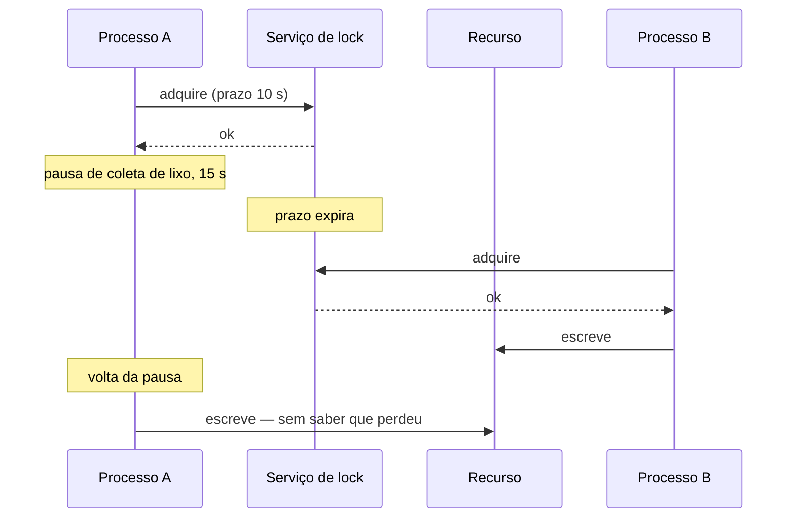

# Locks Distribuídos

## Visão Geral

Um lock distribuído coordena acesso exclusivo a um recurso entre processos em
máquinas diferentes.

A afirmação central deste documento, e a que mais surpreende: **um lock
distribuído com prazo não garante exclusão mútua.** Ele reduz a probabilidade de
concorrência; não a elimina.

## Problema

Um lock local funciona porque o sistema operacional garante que apenas uma thread o
detenha, e porque a thread que o detém está viva por definição — se ela morrer, o
processo morre e o lock é liberado.

Distribuído, nenhuma das duas coisas vale.

O detentor pode ficar incomunicável sem morrer. Se o lock não expira, ele fica
preso indefinidamente. Se expira, outro processo o adquire — e o primeiro **pode
continuar operando**, sem saber que perdeu.



As duas escritas acontecem. O lock funcionou como especificado e a exclusão mútua
não foi obtida.

## Conceitos Centrais

### Prazo é obrigatório e insuficiente

Sem prazo, um detentor que morre trava o recurso para sempre. Com prazo, existe a
janela acima.

Não há valor de prazo que elimine o problema — apenas valores que tornam a janela
mais ou menos provável. Pausas de coleta de lixo, suspensão de máquina virtual,
lentidão de disco e partição de rede produzem atrasos que qualquer prazo razoável
não cobre.

### Fencing é o que de fato protege

A solução correta não está no lock: está no **recurso**.

Cada aquisição recebe um número crescente. O recurso protegido registra o maior
número que já viu e **rejeita operações com número menor**.

```text
A adquire → token 33 → pausa
B adquire → token 34 → escreve, recurso registra 34
A volta   → escreve com token 33 → recurso rejeita
```

Isso funciona mesmo quando A não sabe que perdeu, porque a verificação não depende
de A.

O requisito é que o recurso participe — que ele saiba comparar tokens. Um
armazenamento que aceita qualquer escrita não pode ser protegido dessa forma, e aí
o lock é apenas uma otimização probabilística.

### Lock por desempenho versus por correção

A distinção que decide quanto rigor é necessário:

**Por eficiência.** Evitar trabalho duplicado. Se dois processos executarem, o
resultado é desperdício — não incorreção. Aqui um lock simples com prazo basta, e
fencing é desnecessário.

**Por correção.** Duas execuções produzem estado inválido. Aqui o lock com prazo
**não é suficiente**, e é preciso fencing ou outra garantia.

A maioria dos usos reais é por eficiência, e tratá-los com rigor de correção é
desperdício. O erro caro é o inverso: usar um lock simples onde a correção depende
dele.

### Frequentemente o lock é evitável

Antes de coordenar, três perguntas:

**A operação pode ser idempotente?** Se executar duas vezes é inofensivo, não há o
que coordenar. Ver [idempotência](idempotency.md).

**O recurso pode impor a exclusão?** Uma restrição de unicidade no banco, ou uma
atualização condicional, garante correção sem lock externo — e o banco já resolve
concorrência muito bem.

**A operação pode ser particionada?** Se cada processo cuida de um subconjunto
disjunto, não há concorrência.

A terceira é a mais elegante e a menos considerada.

### Onde o lock mora importa

Um lock num sistema sem consenso — cache distribuído de nó único, por exemplo —
pode ser perdido numa falha do nó, permitindo dois detentores.

Um lock num sistema com consenso é confiável quanto à aquisição, e continua sujeito
ao problema do prazo.

## Modelo Mental

**O lock diz quem deveria estar operando. O fencing garante quem consegue.**

## Quando Usar

- Coordenação por eficiência, evitando trabalho duplicado.
- O recurso não oferece mecanismo próprio de exclusão.
- A operação é pontual, não uma liderança contínua — para essa, ver
  [eleição de líder](leader-election.md).

## Quando Não Usar

**Para correção, sem fencing.** É o erro central.

**Quando o banco pode impor.** Uma restrição de unicidade ou uma atualização
condicional é mais simples e mais confiável.

**Quando idempotência resolve.**

**Quando a operação pode ser particionada.**

**Com prazo longo.** Se o detentor morrer, o recurso fica preso pelo prazo inteiro.

**Como substituto de transação.** Se as operações cabem num banco, a transação dá
garantias melhores.

## Alternativas

- **Restrição de unicidade** — o banco impõe.
- **Atualização condicional** — "atualize se a versão for X", que é bloqueio
  otimista.
- **Idempotência** — permitir execução múltipla.
- **Particionamento** — eliminar a concorrência.
- **[Eleição de líder](leader-election.md)** — para coordenação contínua em vez de
  pontual.

## Trade-offs

| Com lock | Sem |
|---|---|
| Trabalho duplicado evitado | Possível |
| Coordenação explícita | Nenhuma |
| Ponto de falha adicional | Sem dependência |
| Latência de aquisição | Nenhuma |
| Falsa sensação de exclusão sem fencing | Sem ilusão |

## Modos de Falha

**Detentor pausado.** O caso do diagrama.

**Prazo expirado durante operação longa.** A operação continua sem o lock.

**Lock não liberado.** Falha antes de liberar; recurso preso até o prazo.

**Serviço de lock indisponível.** Ninguém adquire; ou pior, o sistema decide
prosseguir sem coordenação.

**Relógios divergentes.** O prazo é interpretado de formas diferentes.

## Erros Comuns

**Usar para correção sem fencing.**

**Não renovar o prazo em operação longa.** Ou renovar sem verificar que ainda se
detém o lock.

**Prazo mal dimensionado.** Curto demais expira no meio; longo demais trava.

**Não considerar as alternativas.** A maioria dos casos não precisa de lock.

**Assumir que o serviço de lock é sempre confiável.**

## Exemplo Real

Um sistema de importação usava lock distribuído para garantir que apenas um
processo importasse cada arquivo.

O lock era um registro em cache distribuído com prazo de 60 segundos, renovado a
cada 30.

Um arquivo grande levou 4 minutos. Durante o processamento, houve uma pausa de
coleta de lixo de 70 segundos na instância. O prazo expirou e a renovação não
aconteceu.

Outra instância adquiriu o lock e começou a importar o mesmo arquivo.

A primeira voltou da pausa, renovou o lock — o serviço aceitou, porque a renovação
não verificava se ela ainda era a detentora — e continuou.

Duas instâncias importaram o mesmo arquivo. 12 mil registros duplicados.

Três correções, e a ordem revela o raciocínio.

**A primeira tentativa** foi aumentar o prazo para 5 minutos. Isso reduziu a
probabilidade e não eliminou o problema — apenas exigiu uma pausa maior.

**A segunda** foi corrigir a renovação: passar a verificar a posse antes de
renovar, com operação atômica. Isso impediu o caso específico e não impede que a
instância continue escrevendo após perder o lock.

**A terceira** foi a que resolveu, e não envolveu o lock: **idempotência na
importação**. Cada registro passou a ter uma chave derivada do arquivo e da linha,
com restrição de unicidade no banco. Importar duas vezes passa a inserir uma vez.

O lock permaneceu, agora explicitamente como otimização de eficiência — evitar
trabalho duplicado — e não como garantia de correção.

O que a equipe registrou: passaram duas semanas ajustando prazos para um problema
que não tinha solução por prazo. A pergunta certa — "o que acontece se importar
duas vezes?" — veio depois, e a resposta levou três dias.

## Conceitos Relacionados

- [Eleição de Líder](leader-election.md) — o mesmo problema, com fencing.
- [Consenso](consensus.md) — o que torna a aquisição confiável.
- [Idempotência](idempotency.md) — a alternativa que costuma vencer.
- [Falha Parcial](partial-failure.md).

## Exercício Prático

Se seu sistema usa lock distribuído, classifique cada uso: é por eficiência ou por
correção?

Para os de correção, verifique se existe fencing. Se não existir, a exclusão não
está garantida — e vale perguntar se idempotência resolveria.

## Perguntas de Entrevista

- Por que um lock com prazo não garante exclusão mútua?
- O que é fencing e por que ele precisa estar no recurso?
- Qual a diferença entre lock por eficiência e por correção?

## Para Aprofundar

- Kleppmann, Martin. *How to do distributed locking*, 2016 — o artigo de
  referência sobre o problema.
- Burrows, Mike. *The Chubby Lock Service*. OSDI, 2006.
