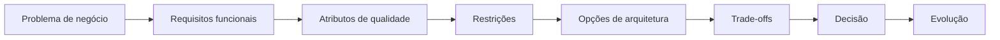

# Software Architecture Mastery

Um percurso para Engenheiros de Software que querem pensar como Arquitetos de Software.

O objetivo não é ensinar padrões, frameworks ou serviços de nuvem. É desenvolver
raciocínio arquitetural: entender o problema, identificar restrições, avaliar
alternativas, raciocinar sobre trade-offs, decidir, comunicar e evoluir.

:::info Em construção

<!-- PROGRESS:INTRO -->
Este site está sendo escrito. São **334 de 437 documentos** (76%), com **16 de 23 seções** completas.
<!-- /PROGRESS:INTRO -->

A tradução para inglês é progressiva: páginas ainda não traduzidas aparecem em
português. O plano completo está na
[especificação do projeto](https://github.com/oadcavalcante/software-architecture-mastery/blob/main/SPEC.md)
e o estado detalhado, no [roadmap](https://github.com/oadcavalcante/software-architecture-mastery/blob/main/ROADMAP.md).

:::

## Os sete níveis

```text
NÍVEL 01 — Fundamentos
        ↓
NÍVEL 02 — Design de Software
        ↓
NÍVEL 03 — Design de Sistemas
        ↓
NÍVEL 04 — Sistemas Distribuídos
        ↓
NÍVEL 05 — Arquitetura
        ↓
NÍVEL 06 — Arquitetura Corporativa
        ↓
NÍVEL 07 — Liderança em Arquitetura
```

A progressão de competência correspondente:

```text
código → design → sistemas → sistemas distribuídos → arquitetura → corporativo → estratégia
```

## Teste de aceitação

O material cumpre seu objetivo quando você, ao receber *"Projete a arquitetura de
uma plataforma de pagamentos de alto volume"*, não começa desenhando caixas —
começa perguntando qual é o problema de negócio, quais atributos de qualidade
importam e quais restrições existem.


