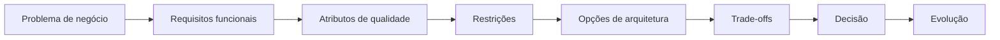

# Software Architecture Mastery

Um percurso para Engenheiros de Software que querem pensar como Arquitetos de Software.

O objetivo não é ensinar padrões, frameworks ou serviços de nuvem. É desenvolver
raciocínio arquitetural: entender o problema, identificar restrições, avaliar
alternativas, raciocinar sobre trade-offs, decidir, comunicar e evoluir.

:::info Estado do percurso

<!-- PROGRESS:INTRO -->
O percurso em português está completo: **446 de 446 documentos**, nas **23 seções**.
<!-- /PROGRESS:INTRO -->

A tradução para inglês é progressiva e está no início: páginas ainda não
traduzidas aparecem em português. O plano completo está na
[especificação do projeto](https://github.com/oadcavalcante/software-architecture-mastery/blob/main/SPEC.md)
e o estado detalhado, no [roadmap](https://github.com/oadcavalcante/software-architecture-mastery/blob/main/ROADMAP.md).

:::

## Os sete níveis

```text
NÍVEL 01 — Fundamentos
        ↓
NÍVEL 02 — Design de Software
        ↓
NÍVEL 03 — Design de Sistemas
        ↓
NÍVEL 04 — Sistemas Distribuídos
        ↓
NÍVEL 05 — Arquitetura
        ↓
NÍVEL 06 — Arquitetura Corporativa
        ↓
NÍVEL 07 — Liderança em Arquitetura
```

A progressão de competência correspondente:

```text
código → design → sistemas → sistemas distribuídos → arquitetura → corporativo → estratégia
```

Cada nível pressupõe o anterior, e a dificuldade muda de natureza no caminho. Nos
primeiros quatro, ela é técnica: entender consistência, latência, acoplamento,
falha parcial. Do quinto em diante, a parte difícil deixa de ser saber a resposta
certa e passa a ser fazê-la acontecer numa organização — com orçamento, com times
que discordam, e com uma estrutura que sempre vence quando a arquitetura a
contraria.

## O que há aqui

Vinte e três seções, organizadas em sete níveis e três blocos transversais.

**Níveis 01 a 04 — a base técnica.** Fundamentos, design de software, padrões de
projeto, DDD, design de sistemas e sistemas distribuídos. É onde os conceitos são
construídos um sobre o outro.

**Níveis 05 e 06 — arquitetura e escala organizacional.** Dados, integração,
nuvem, segurança, escalabilidade, confiabilidade, observabilidade, plataforma,
arquitetura corporativa, modernização de legado, documentação, decisões e
governança.

**Nível 07 — liderança.** Decisão, influência, comunicação, organização, risco,
custo e medição de resultado arquitetural.

**Transversais.** Uma seção inteira sobre **trade-offs** — quinze pares
recorrentes, cada um com o eixo real de comparação e as condições sob as quais
cada lado vence. Catorze **case studies** completos, do contexto de negócio à
estratégia de evolução, cada um com opções descartadas e a condição que as faria
vencer. E o método de **entrevistas de system design**, que é o mesmo raciocínio
sob pressão de tempo.

## Uma regra de conteúdo

Nenhum padrão é apresentado sem a discussão de quando **não** usá-lo.

Isso não é uma preferência editorial. Um padrão sem limite de aplicação é uma
receita, e receitas não sobrevivem ao primeiro contexto que não foi previsto —
que é justamente o contexto em que arquitetura importa.

Pelo mesmo motivo, todo case study apresenta mais de uma arquitetura viável, e
toda opção descartada declara sob qual mudança de restrição ela passaria a
vencer. Sem isso, o material seria justificativa retroativa de escolhas já
feitas.

## Por onde começar

Se você constrói software e quer entender arquitetura, comece pelo
[Nível 01](/01-fundamentals/index.md) e siga a ordem.

Se você já é arquiteto e quer material específico, os
[Trade-offs](/20-trade-offs/index.md) e os [Case Studies](/21-case-studies/index.md)
são consultáveis isoladamente.

Se você está se preparando para entrevistas,
[System Design Interviews](/22-system-design-interviews/index.md) é o método, e
os case studies são a versão sem pressão de tempo.

E [Como usar](/how-to-use.md) explica a estrutura fixa de cada documento, que é a
mesma em todos eles — o que permite ler por consulta sem perder o contexto.

## Teste de aceitação

O material cumpre seu objetivo quando você, ao receber *"Projete a arquitetura de
uma plataforma de pagamentos de alto volume"*, não começa desenhando caixas —
começa perguntando qual é o problema de negócio, quais atributos de qualidade
importam e quais restrições existem.


