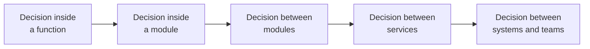

# Architecture vs. Design

## Overview

Architecture and design are the same activity — structuring software — operating
at different scales of consequence.

The useful distinction is not about subject matter or artefact. It is about
**reach**: how many parts of the system a decision constrains, and who has to
agree with it for it to work.

## The Problem

The separation is usually taught as though it were categorical: architecture
deals with components and the communication between them; design deals with the
inside of each component. Architecture is the drawing; design is the code.

That boundary breaks on first contact with a real application.

Deciding that a repository returns a materialized collection rather than a lazy
stream looks like design — it sits entirely inside one component. But if that
collection can hold ten million records, the choice determines the memory profile
of the whole service, and therefore its deployment topology. It behaves like an
architectural decision.

Conversely: in a system with thirty internal users, choosing between two separate
services and a single module — which looks like the archetypal architectural
decision — is reversed in a week. It behaves like design.

Treating the boundary as categorical leads to two symmetric mistakes: escalating
to the architect decisions the team resolves better, and letting through
unreviewed local decisions with global consequence.

## Core Concepts

### The axis is reach, not subject

A decision is more architectural the more parts of the system it constrains.

There is no objective cut-off point on that gradient. There is a direction: the
further right, the earlier the decision must be made, the more people must agree,
and the more expensive it is to reverse.

### Bad design is local; bad architecture is systemic

That is the practical difference that matters most.

A poorly designed class is a contained problem: whoever touches it suffers, and
refactoring affects nobody else. A poorly drawn boundary between modules is a
distributed problem: every change that crosses it pays a tax, and the cost shows
up far from where the decision was made.

That is why architecture gets more ceremony. Not because it is more important in
the abstract — because being wrong is harder to contain.

### The boundary moves with context

The same type of decision changes sides depending on the system.

| Decision | Small system | Large system |
|---|---|---|
| Choice of ORM | Design — swapped in days | Architectural — permeates thousands of queries |
| Splitting into two services | Design — merged back in a week | Architectural — two teams, two deploys, one contract |
| Date format in an internal API | Design | Architectural if there are external consumers |

What changes is not the nature of the decision. It is how many things came to
depend on it.

### Architecture constrains design; design realizes architecture

The relationship between the two is one of constraint, not sequence.

Architecture establishes the boundaries within which design operates freely. If
the architecture established that the billing module does not access the user
database directly, design decides everything else about how billing works — but
not that.

And design is what makes architecture real. A boundary that exists in the diagram
and is not enforced in the code does not exist. That is why
[architecture without good design is fiction](../02-software-design/index.md).

## Mental Model

Ask: **who needs to know about this decision in order to do their own work?**

- Only whoever touches this function → design.
- Whoever touches this module → design with reach.
- Whoever touches any module that talks to this one → architectural.
- Another team → architectural, and it needs a contract.

The question works because it captures what actually distinguishes the two: the
number of people whose freedom the decision constrains.

## Why This Matters

**It determines what needs prior agreement.** Design decisions can be made and
revised inside the team, at the team's pace. Architectural decisions need
agreement beforehand, because reversing them later means renegotiating with
everyone who already depends on them. Confusing the two produces either paralysis
— everything becomes a committee — or surprise — decisions with broad reach show
up already made.

**It determines what gets recorded.** A design decision lives in the code: an
attentive reader reconstructs the reasoning. An architectural decision needs an
explicit record, because the context that justified it is visible nowhere in the
code. That is the basis of [ADRs](../18-architecture-decisions/index.md).

**It determines where review is worth it.** Reviewing all design exhaustively
does not scale. Reviewing architecture always pays, because the mistake spreads.

## Common Mistakes

**Treating the boundary as fixed.** This is the mistake that generates the next
two.

**Escalating design to architecture.** When every structural decision needs
approval, the team stops deciding and starts asking. The cost shows up as
slowness, and the cause is rarely diagnosed as excess ceremony.

**Demoting architecture to design.** Quieter and more expensive. A decision with
broad reach is made locally, by someone with local context, and the cost appears
months later in another module — where nobody connects effect to cause.

**Believing architecture is done by architects and design by developers.** That
describes a division of job titles, not a division of decisions. Whoever writes
the code makes architectural decisions constantly; what varies is whether they
know it.

**Using "that's design, not architecture" to end a discussion.** It almost always
means "I don't want to discuss this now". If the decision constrains others, it is
architectural regardless of the label it gets.

## Real-World Example

A team debates whether the orders service should expose status as a closed enum
(`created`, `paid`, `shipped`, `delivered`) or as a free string.

Framed as design, the argument is about validation and code readability, and the
enum wins easily.

Framed by the reach question — who needs to know about this? — the picture
changes. Three external consumers will read that field. A closed enum means that
adding `in_picking` is a contract change: every consumer has to handle a value
that did not exist before, and some will break when they encounter it.

The decision is not about typing. It is about who pays the cost of the business
inventing a new order state — which will happen, because businesses invent
states.

The team did choose the enum, but with two decisions that only surfaced because
the framing changed: documenting explicitly that consumers must tolerate unknown
values, and versioning the contract.

The framing did not change the choice. It changed what came with it.

## Related Concepts

- [What Software Architecture Is](what-is-software-architecture.md) — the
  cost-of-reversal criterion, which is the other side of this distinction.
- [Architecture vs. Implementation](architecture-vs-implementation.md) — the
  other boundary, and the more misunderstood of the two.
- [Coupling](coupling.md) — the measure by which reach is assessed in practice.

## Practical Exercise

In the last code review you took part in, pick three comments that proposed a
structural change.

For each, answer: who would need to know about that decision in order to do their
own work? Only the author? The team? Another team?

Then compare that with how much discussion each one received. The mismatch
between reach and attention is what this document exists to correct.

## Interview Questions

- Where does architecture end and design begin?
- Give an example of a decision that is design in one system and architecture in
  another.
- How do you decide whether a choice needs agreement before being implemented?

## Further Exploration

- Fowler, Martin. *Who Needs an Architect?* IEEE Software, 2003.
- Martin, Robert C. *Clean Architecture*. Prentice Hall, 2017 — the chapter on the
  relationship between policies and details.
