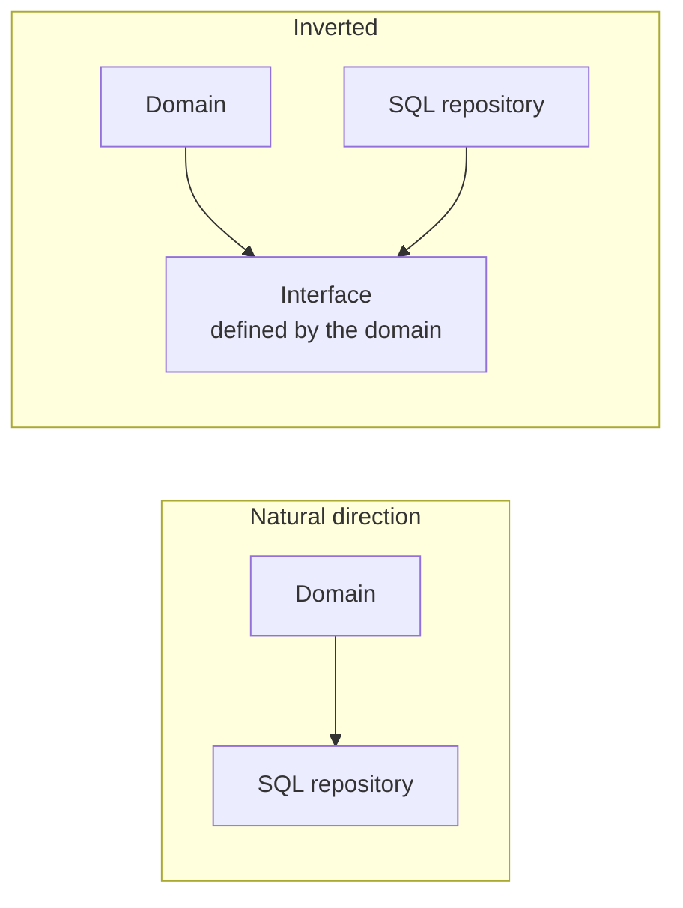

# Dependency Management

## Overview

A dependency is a direction: A depends on B means changes in B can break A, and not
the other way around.

Managing dependencies is deciding those directions deliberately. The central claim:
**the direction dependencies point in determines what you can change without
breaking the rest.**

## Problem

Dependencies accumulate without anyone deciding. Each import is a small decision,
made by whoever is solving an immediate problem, and the resulting graph is the sum
of hundreds of those local decisions.

The typical result has three pathologies. A business rule depending on an
infrastructure detail, which means swapping the database touches the domain. Cycles
between modules, which means neither can be understood, tested or deployed without
the other. And a module everything depends on, which becomes the bottleneck every
change passes through.

None of those was decided. All are expensive to undo.

## Core Concepts

### Stability and direction

The rule that organizes the subject:

> **Depend in the direction of stability.**

A component is stable when it changes little — because many things depend on it, or
because it represents something that does not vary. An unstable component changes
frequently.

If the stable one depends on the unstable one, every change in the unstable one
breaks the stable one. The arrow has to point the other way.

A business rule is stable — it changes by company decision, which is rare. An
infrastructure detail is unstable — versions, providers, protocols change.
Therefore the detail should depend on the rule, not the reverse.

### Dependency inversion

When the natural direction of flow is opposite to the desired direction of the
dependency, you invert it with an abstraction.

The crucial detail, and the one most often got wrong: **the interface belongs to
the stable side**. If the `OrderRepository` interface lives in the infrastructure
package, nothing was inverted — the domain still depends on infrastructure, just
through one extra file.

### Cycles

A dependency cycle means the modules involved are, in practice, one: they cannot be
compiled, tested, understood or deployed separately.

Cycles are rarely created on purpose. They appear by accumulation, and stay
invisible because no tool complains by default.

Detecting them is cheap — static analysis handles it — and the value is high,
because a cycle is always a sign that a boundary is in the wrong place.

### External dependencies

Third-party libraries are dependencies with an additional property: you control
neither when they change nor when they stop being maintained.

The real cost of an external dependency is not what it does; it is the surface your
code exposes to it. A library used inside one adapter is replaceable. The same
library with its types spread across the whole codebase is a permanent architectural
decision.

## Mental Model

**Follow the arrow and ask who breaks.**

If A depends on B, changes in B can break A. Walk the graph asking that at each
edge. Where the answer is "something stable and important breaks because of
something volatile", the arrow is wrong.

## When to Use

Inverting a dependency is worth it when:

- The side that changes more is being depended on by the side that changes less.
- You need to test the stable side without the unstable one.
- There is a real expectation of replacing the implementation.
- The dependency crosses a boundary you want to keep — of module, of team, of
  system.

## When Not to Use

**When both sides are equally stable.** Inverting a dependency between two domain
modules that change at the same cadence adds indirection and buys nothing.

**When the inversion requires an abstraction that does not hold up.** See
[abstraction](abstraction.md). If the interface has to expose the implementer's
details to be useful, the inversion is nominal.

**When the dependency is trivially replaceable.** A date-formatting library used in
three places does not need an isolation layer; the cost of swapping it directly is
lower than the cost of keeping it abstracted.

**In small systems with a single implementation.** Dependency inversion is an
investment in change. Where change is not expected and the system is small, it is
pure cost.

## Alternatives

- **Accept the direction and isolate the contact point** — leave the dependency
  direct, but concentrate it in one place. Cheaper than inverting and it solves the
  common case.
- **An adapter at the boundary** — translate on the way in rather than abstracting
  in the middle.
- **Duplicate the type** — define your own type instead of depending on the
  library's. Cheap, and it keeps the external type from spreading.

## Trade-offs

The axis is **freedom to change one side versus indirection to maintain**.

| Invert the dependency | Keep the natural direction |
|---|---|
| The stable side is protected | A change in the detail reaches the core |
| Testable without the real implementation | Tests carry infrastructure |
| The implementation is replaceable | Replacing touches consumers |
| One interface to maintain and evolve | No intermediate contract |
| Flow harder to follow | Direct flow |

## Failure Modes

**Nominal inversion.** The interface exists, but lives on the wrong side, or exposes
the implementer's types. The domain stays coupled.

**Undetected cycle.** Two modules referencing each other. Testing one requires the
other; no extraction is possible.

**Pivot module.** A module with very high incoming dependency. Every change to it
affects the system, which freezes its evolution and makes it a source of conflict.

**Spread external type.** A library's type appears in signatures across the whole
codebase. The library became part of the architecture with no decision.

**Surprise transitive dependency.** Module A does not depend on C directly, but a
change in C breaks it through B. Without visibility into the transitive closure,
that is impossible to anticipate.

## Common Mistakes

**Putting the interface on the implementer's side.** The most frequent mistake when
applying dependency inversion, and the one that makes it useless.

**Confusing dependency inversion with dependency injection.** Injection is a supply
mechanism; inversion is a decision about direction. It is perfectly possible to
inject while keeping the wrong direction.

**Not measuring the graph.** Most teams do not know the real dependency graph of
their own system. It is measurable in minutes with a tool and is rarely measured.

**Treating an external dependency as a library decision.** A dependency whose types
spread is an architectural decision, with a high cost of reversal.

**Inverting everything.** Applying inversion on principle, without asking which side
is stable, produces a system of interfaces where nobody can find the code that
runs.

## Real-World Example

A pricing service had its business rule depending directly on the exchange-rate
provider's client — the library's `ExchangeRateResponse` type appeared in fifteen
method signatures in the domain.

When the provider was discontinued, the migration touched all fifteen points, the
tests for all of them, and revealed that part of the rounding rule was implicit in
the old provider's format.

The subsequent fix was not to create a generic exchange-rate provider interface. It
was simpler: define an own type, `Quote`, in the domain, and an adapter that
translates the provider's response into it.

Two observations. The abstraction ended up at the contact point — one file — rather
than as an interface running through the system. And the domain came to depend on a
concept of its own, not on a third party's format.

At the next migration, two years later, one file changed.

## Related Concepts

- [Coupling](coupling.md) — what dependencies are made of.
- [Abstraction](abstraction.md) — the mechanism of inversion, and its cost.
- [Architecture vs. Implementation](architecture-vs-implementation.md) — how to
  enforce the decided direction.

## Practical Exercise

Run a dependency analysis tool on your system and answer: are there cycles? Which
module has the most incoming dependencies? Which third-party type appears in the
most signatures?

For the most widespread external type, estimate how many files a library swap would
touch.

## Interview Questions

- What does "depend in the direction of stability" mean?
- What is the difference between dependency inversion and dependency injection?
- Why is a dependency cycle a problem, and how does one appear?

## Further Exploration

- Martin, Robert C. *Clean Architecture*. Prentice Hall, 2017 — component coupling
  and stability principles.
- Documentation for `jdeps`, `dependency-cruiser`, `import-linter` — graph analysis
  tools by language.
