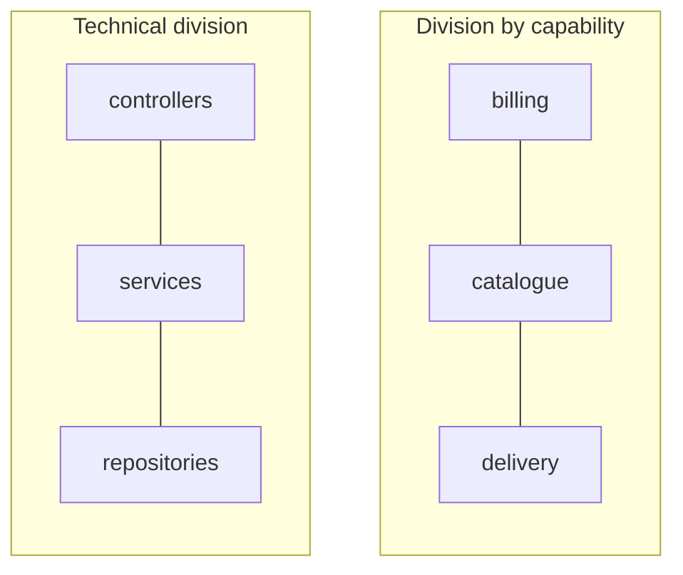

# Modularity

## Overview

Modularity is the division of a system into parts with explicit boundaries, each
understandable and changeable without needing to understand the others.

It is the property nearly all the others depend on. Without it, there is no way to
reason about one part of the system in isolation — and a system you cannot reason
about in parts is a system that only fits whole in somebody's head.

## Problem

Systems grow. Human capacity to hold context does not.

Without division, the cost of change grows faster than linearly with size: every
alteration requires checking more places, and the chance of a side effect
increases with every line added. There comes a point where simple changes take
weeks because nobody can state what else will be affected.

Modularity limits the reach of a change. The goal is not to have small parts — it
is for a typical change to fit inside one of them.

That formulation is the one that matters, and it differs from the usual one. The
question is not "is this module small enough?", but "do the changes that actually
happen fit inside one module?".

## Core Concepts

### A module has an interface and a secret

A module is defined by two things: what it exposes and what it hides.

What it exposes is the contract — other modules may depend on it. What it hides is
what can change without anyone needing to know. A module that exposes everything
is not a module; it is a grouping of files.

The central idea, formulated by Parnas in 1972 and still poorly applied:
**modules should be divided by what they hide, not by the steps of the
processing.**

### The axis of division

The question that decides where to draw the boundary: **what changes together?**

Things that change for the same reason belong to the same module. Things that
change for independent reasons belong to different modules.

That leads to a counter-intuitive result. The common technical division —
controllers in one place, services in another, repositories in a third — groups
things that change for different reasons and separates things that change
together. Adding a field to a registration touches all three directories.

A division by business capability — billing, catalogue, delivery — groups what
changes together. The same alteration touches one place.

### A nominal boundary is not a boundary

A directory called `billing` prevents nothing. Real modularity requires the
boundary to be enforced — by a language module, static analysis or an architecture
test. See
[architecture vs. implementation](/01-fundamentals/architecture-vs-implementation.md).

### Modularity has levels

Function, class, module, package, service, system. The same reasoning applies at
each level, with increasing boundary costs: separating two classes is cheap;
separating two services costs network, deployment and operations.

Moving up a level without need is the origin of much of the accidental complexity
in distributed systems.

## Mental Model

**A module is a promise: you do not need to look in here.**

If using a module requires understanding its implementation, the promise was
broken and the module is not delivering what modules exist to deliver.

## When to Use

- When parts of the system change for independent reasons and at different paces.
- When the system no longer fits in one person's context.
- When different people or teams work on different parts and conflict.
- When a part needs to be replaced or tested in isolation.
- When a part has a distinct quality requirement — something that must scale or
  fail separately.

## When Not to Use

**When the system is small enough to fit whole in your head.** Modules have a cost
in navigation and indirection. In a two-thousand-line system, that cost exceeds
the benefit.

**When you do not yet know where the boundaries are.** Modularizing too early,
before understanding the domain, freezes the wrong boundaries — and a wrong
boundary is more expensive than an absent one, because every change pays a tax to
cross it.

The safest path in a new domain is to start with weak internal boundaries and
harden them as the axes of change reveal themselves.

**When the proposed division corresponds to no real axis of change.** Modules
created out of aesthetic symmetry — "we have one per layer" — add indirection
without limiting the reach of change.

**When the cost of the boundary exceeds the benefit at that level.** Separating
into two services what could be two modules of the same process trades a function
call for network, serialization, partial failure handling and one more deployment
pipeline.

## Alternatives

- **A cohesive monolith without internal modules** — viable in small systems and
  teams of up to three or four people.
- **Modularity by convention** — cheaper, and it holds while the team is stable
  and small; it degrades with turnover.
- **Separation by process** — maximum modularity, maximum cost. See
  [microservices](/03-design-patterns/microservices.md).

## Trade-offs

The real axis is **cost of local change versus cost of navigation and
indirection**.

| More modularity | Less modularity |
|---|---|
| Change stays contained | Change spreads |
| Parts testable in isolation | Testing requires the system |
| Teams work in parallel | Constant conflict |
| More indirection to follow a flow | Direct, readable flow |
| A wrong boundary is expensive | No boundary to get wrong |
| Cost of maintaining internal contracts | No contracts to maintain |

The optimum depends on system size, domain stability and number of people. It is
not a constant.

## Failure Modes

**A leaking module.** It exposes internal structure in the contract — returns the
persistence object, accepts the framework's type. Consumers end up depending on
the secret, and the boundary stops protecting.

**A module everyone depends on.** Frequently called `common`, `utils` or `shared`.
It becomes a universal coupling point: changing it affects everything.

**Boundary on the wrong axis.** Every business change crosses three modules. The
symptom is the pull request that always touches the same three directories
together.

**Too many modules.** Following a simple flow requires opening nine files. The
indirection stopped hiding complexity and became the complexity.

## Common Mistakes

**Dividing by technical layer rather than by axis of change.** The most common
mistake, and the one that most quietly degrades maintainability.

**Confusing a directory with a module.** Without enforcement, it is visual
organization.

**Creating `shared` as a dumping ground.** Whatever has no clear owner goes there,
and the module becomes everyone's dependency.

**Modularizing before understanding the domain.** See "when not to use".

**Believing a small module is a good module.** Size is a consequence, not a goal.
A large cohesive module is better than five small ones that always change
together.

## Real-World Example

An e-commerce system organized into `controllers`, `services`, `repositories` and
`models`. Four directories, forty files each.

An analysis of commits over six months showed that 80% of them touched three of
the four directories. The modularity was nominal: no change fitted inside one
module, because the modules corresponded to no axis of change.

The reorganization by capability — `catalogue`, `cart`, `order`, `payment`,
`delivery`, each with its own internal structure — brought 70% of commits down to
touching a single directory.

Two observations about the result. First: not one line of business logic changed;
only the distribution of files and the enforced boundaries. Second: the remaining
30% revealed real coupling between `order` and `payment` that the old structure
had hidden — and which became an explicit decision to make, rather than noise.

## Related Concepts

- [Coupling](/01-fundamentals/coupling.md) and [Cohesion](/01-fundamentals/cohesion.md) — how you measure whether
  the division is good.
- [Separation of Concerns](/01-fundamentals/separation-of-concerns.md) — the principle that guides
  where to divide.
- [Modular Design](/02-software-design/modular-design.md) — the practical application.

## Practical Exercise

Run `git log` over the past six months of your system and count, for each commit,
how many top-level directories it touched.

If most touch more than one, your modules are not on the axis of change. The
directories that frequently appear together are candidates for being a single
module.

## Interview Questions

- How do you decide where to draw a module boundary?
- Why is dividing by technical layer usually a mistake?
- When does more modularity make the system worse?

## Further Exploration

- Parnas, David. *On the Criteria To Be Used in Decomposing Systems into
  Modules*. CACM, 1972 — the founding paper, still the best text on the subject.
- Martin, Robert C. *Clean Architecture*. Prentice Hall, 2017 — component cohesion
  principles.
