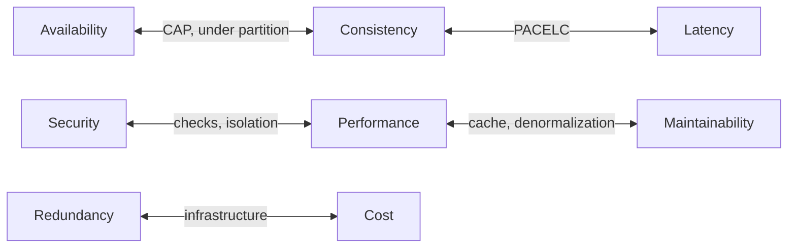

# Quality Attributes

## Overview

Quality attributes are the properties by which a system is judged beyond doing
what it should: availability, performance, security, maintainability,
scalability, operational cost, and others.

Their central property, and the reason they exist as a concept: **they compete
with one another**. No system maximizes all of them. Architecting is choosing
which to prioritize and accepting what that costs on the rest.

## The Problem

Teams list quality attributes as if they were a shopping list — all desirable, all
worth pursuing. The document says the system must be highly available, strongly
consistent, low-latency, secure, cheap and easy to maintain.

No architecture satisfies that set, because several of the items are directly
opposed. Strong consistency costs latency and availability during a partition.
Security costs performance and convenience. Low cost costs redundancy.

The result of not prioritizing is not getting everything. It is that the
prioritization happens implicitly, made by whoever implements, with nobody knowing
what it was.

## Core Concepts

### The main attributes and what each one costs

| Attribute | What it is | Typically costs |
|---|---|---|
| Availability | Fraction of time responding correctly | Redundancy, operational complexity, cost |
| Performance | Response time under a given load | Cache and denormalization, at the cost of consistency and maintainability |
| Scalability | Absorbing growth by adding resources | Statelessness, partitioning, distributed complexity |
| Consistency | Every read observes the most recent write | Latency and availability under partition |
| Security | Resistance to misuse | Performance, convenience, operational friction |
| Maintainability | Cost of change | Indirection, which costs performance and immediate simplicity |
| Observability | Ability to answer new questions | Storage and processing cost for telemetry |
| Operational cost | What it costs to keep running | All of the above, directly or indirectly |

The last row is the one most frequently missing from documents and the one that
most frequently decides.

### The conflicts that show up most

Some pairs are opposed structurally, not circumstantially:



Recognizing that a pair is structurally opposed changes the conversation: it stops
being "how do we get both?" and becomes "how much of one do we trade for how much
of the other?".

### Scenarios make an attribute verifiable

A named attribute is vague. An attribute in a scenario is testable. The scenario
structure — from the practice of architectural analysis — has six parts:

```text
Source        An authenticated user
Stimulus      requests their order history
Environment   during a Black Friday peak
Artifact      in the order service
Response      the system returns the first page
Measure       in under 800 ms at the 95th percentile
```

Writing five or six scenarios like that for the prioritized attributes produces
more architectural clarity than ten pages of prose about quality.

### Not every attribute matters in every system

An internal reporting system does not need low latency. A clinical
decision-support system cannot trade consistency for availability. A throwaway
prototype does not need maintainability — and investing in it is waste.

The question is not which attribute is more important in the abstract. It is
which, if it fails in this system, does the most damage.

## Mental Model

**Quality attributes are a budget, not a wish list.**

You have a finite amount of complexity, money and time to allocate. Spending on
availability means not spending on something else. A document that prioritizes
everything allocated nothing.

## Why This Matters

**Because they are the criterion for choosing between architectures.** Two
architectures meeting the same functional requirements are distinguished exactly by
the attribute profile they offer. With no stated priority, there is no way to
compare them.

**Because they make the conflict explicit before it gets expensive.** Discovering
in production that choosing strong consistency cost the promised latency is the
expensive route. The conflict table costs one meeting.

**Because the prioritization is a business decision.** Engineering informs the cost
of each option; the business decides what is worth it. When engineering decides
alone, it typically picks technical purity — which is rarely what the company
needed.

## Common Mistakes

**Prioritizing everything.** Equivalent to prioritizing nothing. The test: if you
had to sacrifice one attribute on the list to gain on another, which would you
sacrifice? If there is no answer, the list is not a prioritization.

**Ignoring operational cost as an attribute.** It is what eliminates the most
architectures in practice and appears the least in documents.

**Confusing performance with scalability.** They are distinct attributes and
sometimes opposed. A system can be fast and not scale; optimizations that raise
single-instance performance sometimes prevent distribution.

**Pursuing an attribute nobody measures.** If there is no instrumentation to verify
it, the attribute is aspirational. And aspirational attributes degrade without
anyone noticing.

**Leaving the prioritization implicit.** It always happens. The choice is between
it being decided by whoever has business context or by whoever is writing the
function at that moment.

## Real-World Example

Two teams at the same company build services that record sensor data.

**Team A — industrial monitoring.** Losing one reading means failing to detect a
fault condition in equipment. Priority: durability and consistency above latency
and cost. Architecture: synchronous replicated writes, acknowledgement only after
persistence in two zones, higher cost per reading.

**Team B — application telemetry.** Losing a few readings out of millions changes
no conclusion. Priority: cost and throughput above durability. Architecture:
batched writes, an in-memory buffer that drops under pressure, cost per reading an
order of magnitude lower.

The functional requirements are almost identical: receive a reading, store it,
query by period. The architectures share no significant decision.

Had team B copied team A's architecture — which was proposed, for internal
consistency — the cost would have made the product unviable. Had A copied B, the
system would have lost readings nobody can lose.

What separates the two appears in no functional requirements document.

## Related Concepts

- [Non-Functional Requirements](/01-fundamentals/non-functional-requirements.md) — how to express
  them verifiably.
- [Architecture Characteristics](/01-fundamentals/architecture-characteristics.md) — the alternative
  formulation of the same concept.
- [Trade-offs](/20-trade-offs/index.md) — the analysis of the conflicts, in
  detail.

## Practical Exercise

List your system's quality attributes and rank them. A strict ranking: no ties.

Then, for the top three, write a six-part scenario.

Finally, for each of the three, answer: what in the current system measures this
today? The ones with no answer are aspirational attributes.

## Interview Questions

- Which quality attributes compete with each other, and why?
- How do you run the prioritization with stakeholders who want everything?
- Give an example of a system where optimizing one attribute degraded another.

## Further Exploration

- Bass, Len; Clements, Paul; Kazman, Rick. *Software Architecture in Practice*.
  4th ed., Addison-Wesley, 2021 — the reference on attribute scenarios.
- Ford, Neal; Richards, Mark. *Fundamentals of Software Architecture*. O'Reilly,
  2020 — architecture characteristics and their prioritization.
