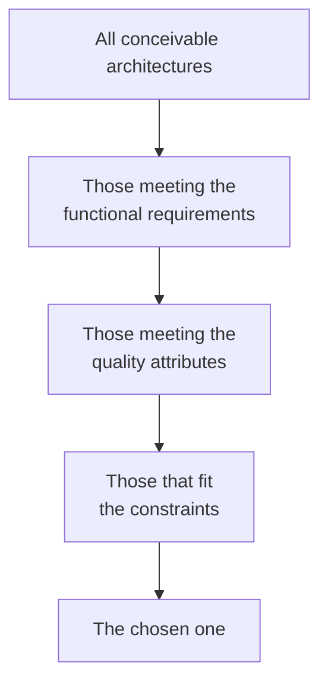

# Solution Space

## Overview

The solution space is the set of architectures that would solve the stated
problem. Architecting is traversing that space, shrinking it with constraints and
choosing a point — knowing what the other points offered.

The quality of an architectural decision depends less on the option chosen than on
how many options were genuinely considered.

## The Problem

In practice, the solution space is almost never traversed. The first plausible
alternative becomes the chosen one, and the rest of the work is justifying it.

That does not happen out of laziness. It happens because the first solution is
easy to generate and the others require deliberate effort, and because once an
option is on the table it becomes the default that the others have to prove
themselves against — instead of being compared on equal terms.

The cost is invisible: nobody knows what the unconsidered alternative would have
offered. The delivered system works, so the decision looks good. What does not
show up is that an option nobody enumerated would have cost half.

## Core Concepts

### Constraints shrink the space; requirements define it

The space starts wide. Requirements say what has to be true; constraints eliminate
entire regions.

The useful work is in the first three filters. If the last set has a single option,
the problem was over-constrained — and it is worth checking whether some
constraint was in fact negotiable.

### An option only counts if it is viable

Listing alternatives nobody would consider is theatre. A document with three
options, two of which are straw men, is worse than one with a single honest
option, because it simulates rigour.

The test: **for each discarded option, under what change of constraint would it
win?** If no such change exists, it was not an option.

That requirement appears as a rule in this material's
[case studies](/21-case-studies/index.md) precisely because it is what separates
analysis from retroactive justification.

### The cost of abandoning breaks the ties

Two options rarely tie on every criterion. When they tie on the ones that matter,
the most useful tiebreaker is asymmetric: **which is cheaper to abandon?**

You are going to get some of these decisions wrong. What distinguishes a
recoverable system from a stuck one is not getting it right more often — it is
that the mistakes cost less.

### Enumerate before evaluating

Generating and judging at the same time kills the space. The first option with a
visible flaw is discarded before the second exists, and the process converges on
the first one without an obvious flaw — which is rarely the best.

The order that works: enumerate everything plausible, without judging; only then
evaluate against the criteria.

## Mental Model

**You do not choose an architecture. You eliminate the ones that do not fit and
choose among what remains.**

That repositions the work. The question stops being "which is best?" — which has
no answer — and becomes "what eliminates options here?", which does.

## Why This Matters

**Because it makes the decision defensible.** A choice presented with its
alternatives and criterion can be contested point by point. A choice presented
alone can only be accepted or rejected wholesale — which is how architectural
discussions turn into disputes about authority.

**Because it preserves the information for later.** When the context changes,
someone will want to reassess. If the alternatives and their conditions were
recorded, the reassessment is cheap. If not, it starts from zero — and frequently
reproduces the same analysis with the same result, months later.

**Because it exposes false constraints.** Traversing the space frequently reveals
that a constraint taken as fixed was a preference. "We can't use a managed
service" usually turns out to be "nobody asked".

## Common Mistakes

**Stopping at the first viable option.** The central mistake. Viable is not a
synonym for adequate, and the first one to appear is the most available in the
memory of whoever proposed it — not the best.

**Listing straw men.** Alternatives included to fill the section, with no stated
winning condition.

**Confusing familiarity with fit.** The technology the team knows has a legitimate
advantage — it reduces execution risk. But that advantage has to be stated as a
criterion, not silently folded into the evaluation.

**Not including "do nothing".** It is a real option, with a cost and a benefit, and
it frequently wins on problems whose consequence is smaller than the solution.

**Reopening the space indefinitely.** The opposite mistake. There is a point at
which more analysis costs more than the error it would avoid — especially for
decisions that are cheap to reverse. Reversible decisions deserve less
deliberation, not the same amount.

## Real-World Example

Stated problem: heavy reports degrade the transactional database during business
hours.

The space enumerated before any evaluation:

| Option | Wins when |
|---|---|
| Read replica | The report volume fits one replica and a few seconds of lag is acceptable |
| Separate data warehouse | There is multi-source analysis or long history |
| Materialize aggregates in the transactional store | The reports are few, known and stable |
| Restrict execution to off-hours | The reports are not urgent and operations accepts a window |
| Optimize the existing queries | The problem is one specific query, not aggregate load |
| Do nothing | The degradation is tolerable and no option pays for itself |

The fifth and sixth are the ones that usually do not appear, and they are the
cheapest. In this case, investigation showed that two queries accounted for 80% of
the load, both without an adequate index.

The solution was the fifth. The others stay recorded with their conditions — and
the first was in fact adopted two years later, when volume changed and the stated
condition came to hold.

That is the return on enumerating: the later decision cost an afternoon instead of
a month of re-analysis.

## Related Concepts

- [Problem Space](problem-space.md) — what comes first.
- [Constraints](constraints.md) — what shrinks the space.
- [Trade-offs](/20-trade-offs/index.md) — the comparison criterion.

## Practical Exercise

Take an architectural decision made in your system over the last year.

Reconstruct the solution space as it was at the time: list four alternatives,
including "do nothing". For each discarded one, state under what change of
constraint it would win.

Then ask: has any of those conditions come to hold since?

## Interview Questions

- How do you make sure you considered enough alternatives?
- What makes an alternative a real option rather than a straw man?
- How do you decide between two options that tie on the criteria that matter?

## Further Exploration

- Ford, Neal; Richards, Mark. *Fundamentals of Software Architecture*. O'Reilly,
  2020 — the chapter on trade-off analysis.
- Nygard, Michael. *Documenting Architecture Decisions*, 2011 — the format that
  makes the solution space recordable.
