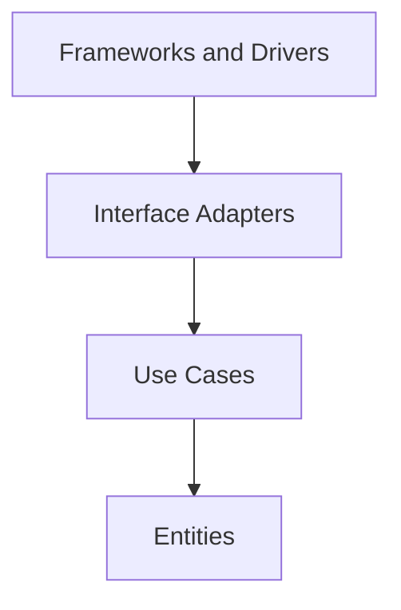

# Clean Architecture

## Overview

Clean Architecture, by Robert Martin, is the synthesis of Ports and Adapters, Onion
and other formulations into a single statement — the **Dependency Rule**:

> Code dependencies point only inward, in the direction of higher-level policies.

What it adds to the earlier ones is emphasis: the **use cases** get a place of their
own, and the guidance about what crosses the boundaries is explicit.

## Problem

The four patterns answer the same problem — a core tied to details. Clean
Architecture specifically attacks the formulation that **the architecture should
shout the domain, not the framework**.

Martin observes that the directory structure of most systems reveals the tool used,
not the business. Opening the repository shows `controllers`, `models`,
`migrations` — and nothing about what the company does.

## Core Concepts

### The circles

Look at the top arrow: it is Frameworks and Drivers that depends on the adapters,
reversing the direction this relationship has in most systems.

**Entities** — enterprise business rules, the ones that would hold even without
software.

**Use cases** — application-specific rules. They orchestrate entities to carry out
an operation.

**Interface adapters** — controllers, presenters, gateways. They translate between
the format convenient for the use cases and the external format.

**Frameworks and drivers** — web, database, UI. Martin insists this ring is
"detail".

The number of circles is not prescribed; the rule is.

### What crosses the boundary

Clean Architecture's most specific guidance, and the one that generates the most
ceremony: **simple data structures**, defined by the inner circle.

Not the entity. Not the ORM object. A simple type the use case defines.

That means mapping at every crossing. It is where the pattern charges most, and
where most adoptions deviate.

### The dependency points against the flow of control

When the flow goes from inside out — the use case needs to present a result — the
dependency still has to point inward. The solution is the same
[dependency inversion](/02-software-design/dependency-inversion.md): the use case
defines the output interface, and the presenter implements it.

It is the most elaborate point of the pattern and the least adopted in practice.

## When to Use

- In systems with substantial business logic and a long life.
- When the domain needs to survive framework changes.
- When testing rules without infrastructure has recurring value.
- When the structure needs to communicate the business to whoever arrives.

## When Not to Use

**In CRUD applications.** The ceremony — use cases, input and output types, mapping
at every edge — completely dominates the value.

**When the framework is the application.** Some systems are, honestly, framework
configuration with little logic. Isolating it costs a lot and protects little.

**When most of the use cases are CRUD.** It is six artifacts per case, and in CRUD five of
them only forward — as in the Real-World Example, where nine of the eleven cases had no
rule to protect.

**When adopted partially without deciding what is left out.** This is the most
common case: teams adopt the directories and the vocabulary, and keep ORM entities
crossing boundaries. Cost paid, property not obtained.

**When the team cannot sustain the mapping.** Without discipline and verification,
the internal types leak within months.

## Alternatives

- **[Hexagonal](/02-software-design/hexagonal-architecture.md) or
  [Onion](/02-software-design/onion-architecture.md)** — the same thesis with less
  prescription about what crosses.
- **Layers with inversion only at persistence** — the pragmatic arrangement that
  captures most of the value.
- **Declared partial adoption** — apply the Dependency Rule and skip the strict
  type separation, knowing what is being given up.

## Trade-offs

| Full Clean Architecture | Partial adoption | No pattern |
|---|---|---|
| Domain isolated from everything | Isolated from persistence | Coupled |
| Framework replaceable | Persistence replaceable | Swapping touches everything |
| Many artifacts per use case | A few more | Minimum |
| Mapping at every edge | Only at persistence | None |
| Structure communicates the business | Partially | Communicates the framework |

The middle column is where most systems should be, and it is the least discussed —
because it has no name of its own.

## Failure Modes

**Decorative adoption.** Directories and vocabulary, with no enforced rule: the cost of the
structure without the guarantee it was supposed to buy.

**ORM entity crossing.** The persistence annotation on the domain entity is the
sign.

**Artifact explosion.** Six per use case, and in CRUD five of them only forward — the
repository is what is left.

**Presenter ignored.** The use case returns the type directly, without inverting the output.
It only charges a price when the same output has more than one format, when the presentation
has rules of its own, or when it is progressive — in those cases the formatting migrates into
the use case and takes the rule with it. Outside them it is legitimate partial adoption, not
a defect.

**Rule with no verification.** See
[architecture vs. implementation](/01-fundamentals/architecture-vs-implementation.md).

## Common Mistakes

**Applying it in full by default.** The question is how much of the pattern the
system justifies.

**Adopting the directories without the rule.** Cost with no benefit.

**Treating it as distinct from Hexagonal and Onion.** The thesis is the same; the
difference is emphasis and prescription.

**Confusing it with [layering](/02-software-design/layering.md).** Layers do not
have the Dependency Rule.

**Not deciding explicitly what is left out.** Partial adoption is legitimate — as
long as it is declared, and not the result of erosion.

## Real-World Example

A team adopted Clean Architecture in full in a scheduling system with eleven use
cases. Each one got: an input interface, a request type, an interactor, a response
type, an output interface and a presenter. Six artifacts per use case, plus the
adapters.

Nine of the eleven use cases were CRUD over appointments.

After a year, the team simplified selectively. The two cases with substantial rules
— availability calculation with resource constraints, and cascading reallocation —
kept the full structure. The nine CRUD ones became a controller calling a
repository directly.

The Dependency Rule still held for the two complex cases, enforced by an
architecture test.

The result is not pure Clean Architecture, and the team recorded that in an ADR with
the reason. What matters is that the decision became deliberate: the ceremony exists
where it protects something, and does not exist where it protected nothing.

## Related Concepts

- [Ports and Adapters](/02-software-design/ports-and-adapters.md) — the original
  formulation.
- [Hexagonal](/02-software-design/hexagonal-architecture.md) and
  [Onion](/02-software-design/onion-architecture.md) — the variations.
- [Layering](/02-software-design/layering.md) — the contrast.
- [Dependency Inversion](/02-software-design/dependency-inversion.md) — the central
  mechanism.

## Practical Exercise

List your system's use cases and classify each: does it have substantial business
rules, or is it CRUD with validation?

For the CRUD ones, count how many artifacts the current structure requires. Estimate
what it would cost to keep them simple and apply the full structure only to the
rest.

## Interview Questions

- What is the Dependency Rule?
- What should cross the boundaries between circles, and why?
- When is applying Clean Architecture in full a mistake?

## Further Exploration

- Martin, Robert C. *Clean Architecture*. Prentice Hall, 2017.
- Martin, Robert C. *The Clean Architecture*, 2012 — the original article.
- Cockburn, Alistair. *Hexagonal Architecture*, 2005 — the earlier formulation.
