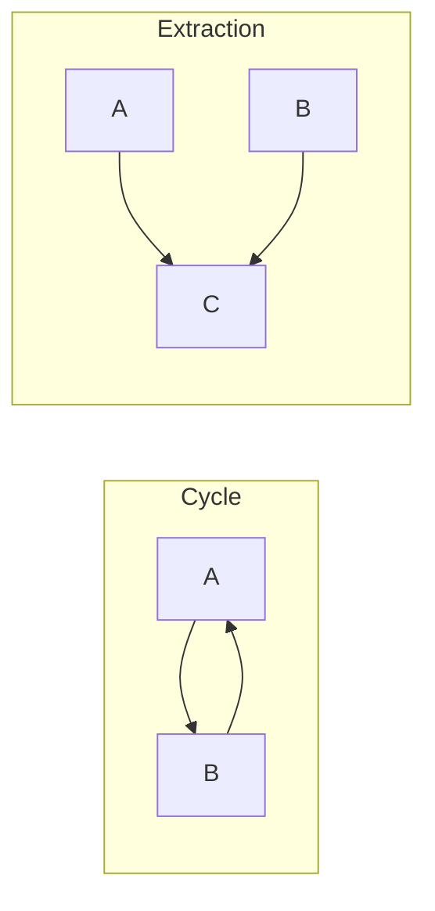

# Dependency Direction

> Prerequisite: [Dependency Management](/01-fundamentals/dependency-management.md)
> establishes the rule of depending in the direction of stability. Here the focus
> is applying it at package level: how to detect cycles, how to break them, and
> the metrics that say whether the direction is right.

## Overview

In a system with many packages, the dependency graph between them has to satisfy
two properties: it must be acyclic, and the arrows must point from volatile
packages to stable ones.

The first is binary — either there is a cycle or there is not. The second is
gradual and measurable.

## Problem

The package graph of a mid-sized system has dozens of nodes and hundreds of edges,
and hardly any team knows it.

That produces two problems that only surface when someone tries to change
something.

**Cycles.** Packages that reference each other cannot be compiled, tested,
versioned or extracted separately. A cycle between three packages turns the three
into one, and nobody decided that.

**Inverted direction.** A stable package — one many depend on — that depends on a
volatile one inherits its instability. Every change in the volatile one propagates
to everything depending on the stable one, in an effect nobody anticipates because
the path is transitive.

## Core Concepts

### The acyclic dependencies principle

> The dependency graph between packages must contain no cycles.

A cycle means the packages involved are, in practice, a single component. There is
no possible build order, no way to test one without the other, and no way to
extract any of them.

Cycles are rarely created on purpose. They appear one edge at a time, and stay
invisible because nothing complains by default.

### How to break a cycle

Two techniques, and the choice between them reveals what was wrong.

**Inversion.** Introduce an abstraction in one of the packages and have the other
implement it. See [dependency inversion](/02-software-design/dependency-inversion.md).

**Extraction.** If A and B depend on each other because of a set of common
elements, extract those elements into a package C that both depend on.

Extraction is usually the right answer, because a cycle generally means there is a
common concept that had no name.

### Stability and abstractness

Two of Martin's metrics, useful as diagnostics:

**Instability** `I = Ce / (Ca + Ce)`, between 0 and 1. A package many depend on and
that depends on few has I close to 0 — it is stable, and changing it is expensive.
The inverse has I close to 1 — it is volatile, and changing it is cheap.

**Abstractness** `A = abstract classes / total classes`, between 0 and 1.

The rule linking the two: **a stable package should be abstract.** If a lot depends
on it, it has to be hard to make obsolete — and abstractions are more stable than
implementations.

That defines two problem zones:

| Zone | Profile | Problem |
|---|---|---|
| Pain | Stable and concrete | Many depend on it, hard to change, full of detail |
| Uselessness | Unstable and abstract | Abstractions nobody uses |

The zone of pain is where the concrete utility everything depends on lives. The
zone of uselessness, the speculatively created interface hierarchy.

These metrics are diagnostic instruments, not targets. Chasing a number produces
abstraction for its own sake.

## Mental Model

**Draw the graph and look for arrows pointing upward.** If a high-level package
points at a low-level one, or if two arrows form a cycle, there is work to do.

## When to Use

- Whenever the system has more than half a dozen packages.
- When integrating new code, so as not to introduce a cycle.
- Before attempting to extract a module into a service — a cycle prevents it.
- When build time grows without the code growing in the same proportion.

## When Not to Use

**As a numeric target.** Chasing a value of instability or abstractness produces
worse code. The metrics diagnose; they do not prescribe.

**In systems with few packages.** With three or four, the graph fits in your head
and formalizing is ceremony.

**When breaking the cycle costs more than living with it.** A cycle between two
packages that are always deployed together and will never be separated is a
theoretical problem. Worth recording and moving on.

**When the inversion produces an artificial abstraction.** Breaking a cycle by
creating an interface nobody else will implement trades a structural problem for
indirection.

## Alternatives

- **Merge the packages** — if two packages form a cycle and always change together,
  they were one.
- **Extract the common concept** — usually the right answer.
- **Accept and document** — when the cost of fixing does not pay off.

## Trade-offs

| Acyclic, ordered graph | Free graph |
|---|---|
| Incremental build possible | Everything recompiles |
| Test one package in isolation | Tests carry the cycle |
| Extraction into a service viable | Extraction impossible |
| Requires discipline and verification | No friction when adding an import |
| Sometimes requires an extra abstraction | No indirection |

## Failure Modes

**Transitive cycle.** A→B→C→A. No single edge looks wrong on its own.

**Package in the zone of pain.** A concrete `core` or `common` everything depends
on. Every change to it affects the system.

**Upward dependency.** A domain package importing from infrastructure.

**Unknown graph.** The most common failure mode: nobody knows what it is.

## Common Mistakes

**Not measuring.** The graph can be extracted in minutes and almost never is.

**Breaking a cycle with an interface without thinking.** Sometimes merging is the
answer.

**Treating the metrics as targets.** Diagnosis, not prescription.

**Ignoring transitive dependencies.** The propagation path is not visible in the
direct edges.

**Creating `common` as the easy way out.** It is how packages enter the zone of
pain.

## Real-World Example

A system with eighteen packages had a cycle between `order`, `customer` and
`billing`. Nobody knew — the build was monolithic and nothing complained.

The cycle prevented extracting `billing` into a service, which was the quarter's
stated goal.

Analysing the edges: `order` needed `Customer` to validate; `customer` needed
`InvoiceHistory` to compute a credit limit; `billing` needed `Order` to issue.

The answer was not to invert any of the three. It was noticing that all three
depended on a concept with no name: the customer's identity and basic data,
distinct from the credit logic.

With `customer-identity` extracted, and all three depending on it, the cycle
disappeared — and `customer` was left with what actually belonged to it, the credit
logic.

The cycle was a symptom of a missing concept, not of a wrong arrow. That is the
most common case, and the one the inversion technique alone would not have solved
well.

## How to introduce this into an existing system

A system with years of accumulation has cycles and wrong directions that will not
be fixed in a single effort. The sequence that works:

**Measure and publish.** Extract the graph and make it visible. A diagram of cycles
on the wall changes more behaviour than any written policy.

**Freeze the degradation before improving.** Add a check that fails only for
**new** cycles, accepting the existing ones as a baseline. That stops the situation
from getting worse while the fix is planned, and costs an afternoon.

**Fix in the order of what is blocking.** Not every cycle — the ones preventing
something concrete: extracting a module, parallelizing the build, testing a package
in isolation.

**Lower the baseline with each fix.** The check tightens on its own, and the
improvement stays recorded.

Teams that try the reverse order — fix everything before verifying — fix half, stop
for priority reasons, and the fixed half degrades back within a year.

## Related Concepts

- [Dependency Management](/01-fundamentals/dependency-management.md) — the general
  rule of direction.
- [Package Design](/02-software-design/package-design.md) — how to group before
  connecting.
- [Dependency Inversion](/02-software-design/dependency-inversion.md) — one of the
  techniques.
- [Boundaries](/02-software-design/boundaries.md) — what the direction crosses.

## Practical Exercise

Extract your system's package dependency graph with a static analysis tool.

Answer: are there cycles? Which package has the most incoming dependencies? Is it
abstract or concrete?

For each cycle found, ask before inverting: is there a concept here that has no
name?

## Interview Questions

- Why are cycles between packages a concrete problem?
- What are the ways to break a cycle, and how do you choose?
- What does a stable, concrete package mean?

## Further Exploration

- Martin, Robert C. *Clean Architecture*. Prentice Hall, 2017 — component coupling
  principles and the metrics.
- Documentation for `jdeps`, `dependency-cruiser`, `import-linter`, `ArchUnit`.
