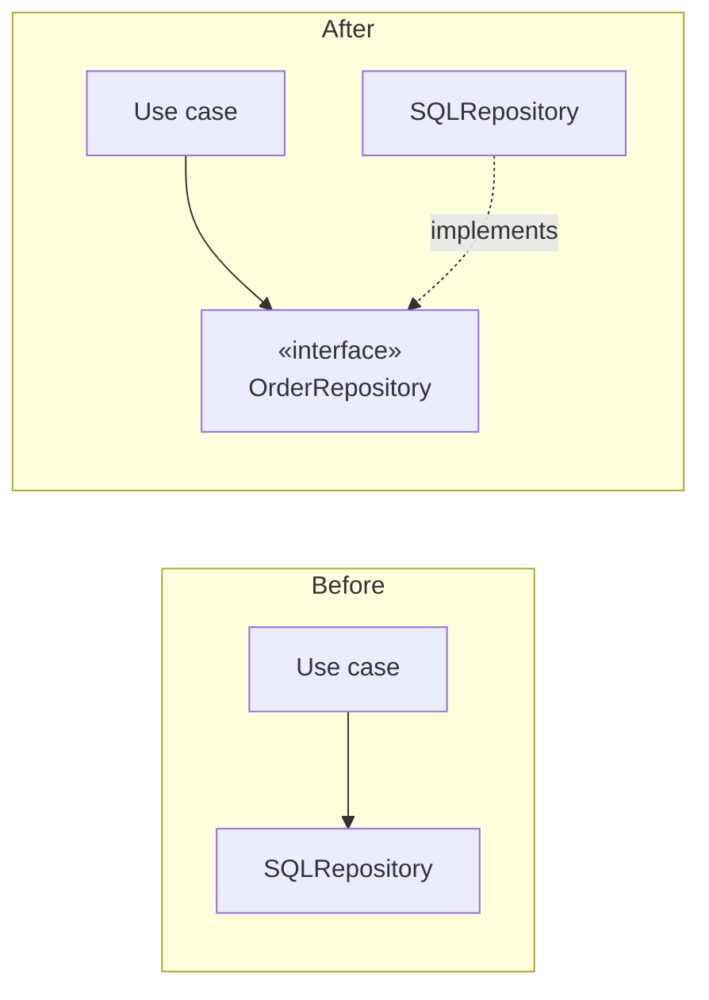

# Dependency Inversion

## Overview

Dependency inversion is the technique of making the arrow point against the flow of
control, using an abstraction.

The classic statement:

> High-level modules should not depend on low-level modules. Both should depend on
> abstractions.
>
> Abstractions should not depend on details. Details should depend on abstractions.

The detail that decides whether the technique works: **the abstraction belongs to
the high-level side.** If the interface lives with the implementer, nothing was
inverted.

## Problem

The natural flow of control goes from policy to detail. The "create order" use case
needs to store the order, so it calls the repository, which talks to the database.

If that call is direct, the dependency follows the flow: the business rule depends
on the repository, which depends on the driver, which depends on the database.

The consequences are well known. Testing the rule requires a database. Changing
databases touches the rule. And the most unstable thing — the technology — is
depended on by the most stable — the policy.

That inverts the rule
[dependency management](/01-fundamentals/dependency-management.md) establishes:
depend in the direction of stability.

## Core Concepts

### The mechanics

Compare the two subgraphs by where the arrows land: in Before the single arrow ends at
SQLRepository; in After, both end at the interface.



The flow of control still goes from the use case to SQL. The **code dependency**
now goes from SQL to the interface. That inversion is what gives the technique its
name.

### Where the interface lives

The point most often got wrong.

```text
❌  domain/UseCase.java
    infra/OrderRepository.java   ← interface
    infra/SQLRepository.java

    The domain imports from infra. Nothing was inverted.

✅  domain/UseCase.java
    domain/OrderRepository.java   ← interface
    infra/SQLRepository.java

    Infra imports from the domain. The arrow points inward.
```

The check is objective: **does the high-level package import anything from the
low-level one?** If so, the inversion is nominal.

### The interface speaks the consumer's vocabulary

If the interface has `findByStatusIn` and returns the ORM's type, it is the
repository under another name. The domain remains coupled to the persistence
decisions, now with one more file.

See [interfaces](/02-software-design/interfaces.md): the consumer is the one who
defines it.

### Inversion is not injection

A frequent and consequential confusion.

**Dependency injection** is a supply mechanism: the dependency is passed in rather
than constructed internally. It is possible to inject while keeping the wrong
direction — injecting a concrete `SQLRepository` into the use case is injection
without inversion.

**Inversion** is a decision about direction. Injection is a common way to implement
it, not its definition.

## Mental Model

**Point the arrow at what changes less.** The abstraction stays with whoever is
stable; whoever is volatile implements it.

## When to Use

- When policy has to be tested without infrastructure.
- When the detail is volatile — an external provider, a library, a protocol.
- When the dependency crosses a boundary you want to keep.
- When there is more than one real implementation, now or on a known horizon.

## When Not to Use

**When both sides are equally stable.** Inverting between two domain modules that
change at the same cadence adds indirection and buys nothing.

**When the abstraction does not hold up.** If the interface has to expose the
implementer's details to be useful, the inversion is nominal and the cost is real.

**When the detail is trivially replaceable.** A formatting library in three places
does not need a layer; swapping it directly costs less than keeping it abstracted.

**In small systems with a single implementation.** See
[YAGNI](/02-software-design/yagni.md) and
[abstraction](/01-fundamentals/abstraction.md).

**When applied indiscriminately.** A system where everything is an interface is a
system where nobody can find the code that runs.

## Alternatives

- **An adapter at the boundary** — translate on the way in, with no interface
  running through the system. Frequently sufficient and cheaper.
- **An own type in the domain** — define `Quote` instead of depending on the
  provider's type. Solves the leak without creating a hierarchy.
- **Accept and concentrate** — keep the dependency direct, at a single point.
- **Structural typing or a function** — in languages that offer it, no declared
  interface is needed.

## Trade-offs

| Invert | Keep the natural direction |
|---|---|
| Policy testable without infrastructure | Tests carry the database |
| Detail replaceable | Swapping touches the core |
| Core protected from what is volatile | Instability reaches the stable side |
| An interface to design and maintain | No intermediate contract |
| Flow harder to follow | Direct |
| Risk of an abstraction of one | No risk |

## Failure Modes

**Nominal inversion.** Interface in the wrong package. It is the dominant failure
mode.

**Mirror interface.** Extracted from the implementation, with the technology's
vocabulary.

**Type leak.** The signature returns the ORM's or the HTTP client's type.

**Permanent interface of one.** Created to swap something that will never be
swapped.

**Universal inversion.** Applied to everything, the system becomes a catalogue of
interfaces.

## Common Mistakes

**Putting the interface next to the implementer.** It cancels the technique out.

**Confusing it with injection.** They are different things.

**Extracting the interface from the implementation.** It produces a mirror.

**Inverting without asking which side is stable.** Sometimes the "detail" is more
stable than the "policy".

**Thinking inversion eliminates coupling.** It redirects it. The use case is still
coupled to the concept of a repository — just not to the technology.

## Real-World Example

A shipping calculation service depended directly on the carrier's HTTP client. The
`CarrierQuoteDTO` type appeared in nine domain signatures.

First attempt at a fix: extract `CarrierClient` as an interface, placed in the
`infra` package, with the same methods and the same DTO.

That solved nothing. The domain still imported `infra` and still spoke the
carrier's vocabulary. When the second carrier came in, it did not fit — the
interface modelled the first one's protocol.

Second attempt, which worked:

```text
domain/ShippingCalculator.java
domain/ShippingQuoter.java       ← interface: quote(origin, destination, weight) → Shipping
domain/Shipping.java             ← domain type
infra/CarrierA.java              ← implements ShippingQuoter
infra/CarrierB.java              ← implements ShippingQuoter
```

Three differences from the first attempt: the interface changed package, changed
vocabulary, and now returns a domain type.

The third carrier, six months later, was one new file and zero changes in the
domain.

## When the detail is more stable than the policy

The rule "depend in the direction of stability" presupposes that policy is stable
and detail is volatile. That is not always the case, and inverting by reflex
produces the problem in reverse.

Examples where the detail is the stable side:

**Mature platform libraries.** The language's collections API is more stable than
any rule in your business. Abstracting it is pure indirection.

**Standardized protocols.** HTTP, standard SQL, date formats. They change less than
the rules that use them.

**Volatile domains.** Promotional pricing rules may change every week, while
persistence has not changed in three years. There, the "policy" is the unstable
side.

The test stays the same: **which of the two changes more?** The answer is usually
the policy, and that is why the rule works in most cases. When it is not, inverting
creates an abstraction that absorbs changes that do not come, and does not absorb
the ones that do.

## Related Concepts

- [Interfaces](/02-software-design/interfaces.md) — who defines them and with what
  vocabulary.
- [Dependency Direction](/02-software-design/dependency-direction.md) — the general
  rule.
- [Hexagonal Architecture](/02-software-design/hexagonal-architecture.md) — the
  systematic application.
- [SOLID](/02-software-design/solid.md) — the D principle.

## Practical Exercise

List the interfaces in your system that represent external dependencies. For each:
which package does it live in? Does the consumer import the implementer's package?

Then check the vocabulary: do the method names and return types come from the
domain or from the technology?

The ones failing either test are nominal inversions.

## Interview Questions

- Where should the interface live in a dependency inversion, and why?
- What is the difference between dependency inversion and dependency injection?
- How do you verify that an inversion is real?

## Further Exploration

- Martin, Robert C. *Clean Architecture*. Prentice Hall, 2017.
- Cockburn, Alistair. *Hexagonal Architecture*, 2005.
- Freeman, Steve; Pryce, Nat. *Growing Object-Oriented Software, Guided by Tests*.
  Addison-Wesley, 2009 — consumer-defined interfaces.
