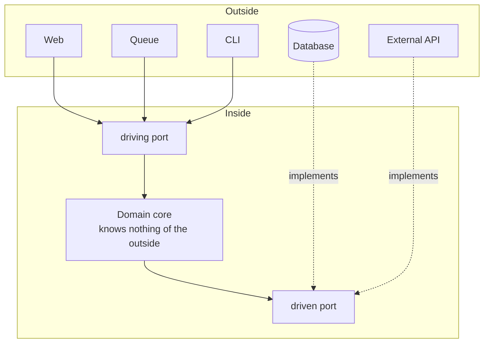

# Hexagonal Architecture

## Overview

Hexagonal Architecture is the name under which
[Ports and Adapters](/02-software-design/ports-and-adapters.md) became popular.
**It is the same pattern** — Cockburn adopted both names, and the second is the one
he came to prefer for being more descriptive.

This document exists because "hexagonal" is the name most used in practice and
produces misunderstandings of its own, worth clearing up.

## Problem

The hexagon is a drawing choice, not a prescription. Cockburn explained that he
chose six sides for graphical convenience — enough ports fit around it without the
drawing getting cluttered — and to avoid the "up and down" reading that the layer
image imposes.

Three misunderstandings come from that.

**"There are six layers."** There are not. The number means nothing.

**"Each side is a kind of adapter."** No. A system may have two adapters or twenty.

**"It is different from Ports and Adapters."** It is not. Teams debate which to
adopt as though they were alternatives.

## Core Concepts

### What the drawing communicates

Follow the arrows: none of them goes from the inside out. The database and the external API
point at the core just as much as the Web does — that symmetry is what the drawing exists to
show.



Two ideas, and only two: there is an **inside** and an **outside**; and all code
dependencies point inward. The driven side is the deceptive one: the core *uses* the
database, but *depends* on the port it declares itself — and what depends on the database is
the adapter.

The absence of hierarchy among the elements on the outside is the point. In a
layered architecture, the user interface sits at the top and the database at the
bottom, which suggests an ordering that does not exist. In the hexagon, both are
equally external.

### What changes relative to layers

| | Layers | Hexagonal |
|---|---|---|
| Metaphor | Stack | Inside and outside |
| Direction | Top to bottom | Inward |
| Database | Bottom layer | One adapter among others |
| User interface | Top layer | One adapter among others |
| Rule | Only the layer below | Only what is further inside |

The decisive practical change: in layers, the domain depends on persistence. In
Hexagonal, persistence depends on the domain.

## When to Use

The same conditions as
[Ports and Adapters](/02-software-design/ports-and-adapters.md): more than one
channel, recurring value in testing without infrastructure, volatile dependencies, a
domain with substantial logic.

Prefer this **name** when the team already knows it — familiarity reduces adoption
friction.

## When Not to Use

The same conditions as Ports and Adapters. In short: CRUD, a single stable channel,
small systems, ports that mirror the infrastructure, or the absence of a mechanism
enforcing the rule.

One additional case specific to the name: **when the hexagon is adopted as a
directory structure without the dependency rule.** Teams create `domain/`,
`application/`, `adapters/` and go on importing infrastructure into the domain. The
result has the appearance of the pattern and none of its properties.

## Alternatives

The same as Ports and Adapters. Worth adding: **the other three names**. Onion and
Clean Architecture share the thesis; choosing between them is mainly a decision
about the team's vocabulary.

## Trade-offs

Identical to those of
[Ports and Adapters](/02-software-design/ports-and-adapters.md). The name does not
change the cost.

The only trade-off proper to the name is one of communication: "hexagonal" is more
recognized and more prone to misunderstanding; "ports and adapters" is more precise
and less known.

## Failure Modes

The same as Ports and Adapters, plus two specific to the name:

**Decorative hexagon.** A directory structure with no enforced dependency rule.

**Debate about the number of sides.** Time spent arguing whether a new adapter
"fits in the hexagon".

## Common Mistakes

**Treating it as a pattern distinct from Ports and Adapters.** It is the same one.

**Reading the six sides as prescription.** They are drawing.

**Adopting the directories without the rule.** The most expensive mistake on this list,
because it produces the full cost and no benefit: the structure suggests an isolation the
compiler does not enforce.

**Debating which of the four names to adopt.** The choice between Hexagonal, Onion
and Clean is one of vocabulary; the decision that matters is whether the direction
rule holds and how it will be enforced.

## Real-World Example

A team adopted hexagonal in a new service and, six months later, two architecture tests
written in an afternoon reported nineteen violations — the domain importing `infra` and an
adapter importing an adapter. It is the case described in
[architecture vs. implementation](/01-fundamentals/architecture-vs-implementation.md), where
the lesson is about the distance between the declared and the implemented architecture.

What matters here is what came afterwards, because it answers the pattern's
specific question: **once fixed, did hexagonal pay off?**

The nineteen violations were fixed in three weeks, and the two tests began preventing new
ones. From then on the service operated with the structure actually isolated for eighteen
months, during which three infrastructure swaps happened:

```text
swap                              files touched      duration
payment provider                  adapter + test      6 days
relational DB → managed           adapter + config    2 days
own queue → managed               adapter + test      4 days
```

None touched the domain. For reference, the same payment provider swap in another
service at the company — with no isolation, the HTTP client imported directly by
the use cases — took seven weeks and touched 41 files.

The cost of the pattern, measured over the same period:

```text
extra files in the service                    ~30%
onboarding time for a new person              +1.5 days, estimated
use cases that needed a new port              4 of 23
ports that never had a second adapter
  at any point in the 18 months                 6 of 9
```

The last line is the one the team considers most honest, and its criterion matters: it counts
the ports that never had a second adapter **at any point** in the period. The other three did
— not simultaneously, but in sequence, when the infrastructure was swapped. Counted at any
given instant, all nine would have a single adapter, and the metric would say nothing. Two
thirds of them never exercised the indirection, and probably never will. They are indirection
cost with no substitution return — paid so that the three that mattered would work.

In retrospect: the balance was positive because the service was integration-heavy,
with four volatile external dependencies. In a service with a stable domain and
little infrastructure, the same six idle ports would be the entire result — and the
conclusion would be the opposite.

That is the criterion the team came to apply before adopting the pattern in new
services: count the external dependencies that can change. Above three, the
isolation pays off; below, it produces indirection nobody exercises.

And there is a detail of sequence the team considers decisive: the three swaps were
made **after** the architecture test existed. Without it, the dependencies would have leaked
again between one swap and the next, and the second swap would no longer have found the
isolation the first assumed. In this service, six months without verification were enough for
nineteen violations — and there is no reason to treat that number as law, but there is reason
to treat the direction as expected: with no mechanism enforcing the rule, the erosion starts
before anyone notices.

## Related Concepts

- [Ports and Adapters](/02-software-design/ports-and-adapters.md) — the original
  formulation and the full treatment.
- [Onion](/02-software-design/onion-architecture.md) and
  [Clean Architecture](/02-software-design/clean-architecture.md) — the variations.
- [Layering](/02-software-design/layering.md) — the arrangement this pattern
  replaces.

## Practical Exercise

If your system declares that it uses hexagonal architecture, write the test that
verifies the rule: no domain package imports infrastructure.

Run it and count the violations before fixing anything.

## Interview Questions

- What is the difference between Hexagonal and Ports and Adapters?
- Why six sides?
- How do you verify that the dependency rule is being respected?

## Further Exploration

- Cockburn, Alistair. *Hexagonal Architecture*, 2005 — includes the explanation of
  the name choice.
- Martin, Robert C. *Clean Architecture*. Prentice Hall, 2017 — the comparison
  between the variations.
