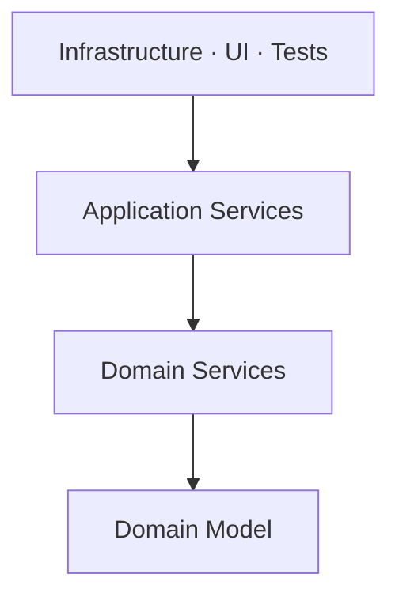

# Onion Architecture

## Overview

Onion Architecture, formulated by Jeffrey Palermo in 2008, organizes the system
into concentric circles with the domain model at the centre and a single dependency
rule: **the arrows point inward**.

It shares the thesis of
[Ports and Adapters](/02-software-design/ports-and-adapters.md). What it adds is
**naming the inner layers**, distinguishing the domain model from the services that
orchestrate it.

## Problem

Ports and Adapters says there is an inside and an outside, and says nothing about
the organization of the inside.

In domains with substantial logic, that silence produces a recurring question: where
does the rule that involves more than one entity live? Inside one of them — which
forces one to know the other — or in a service?

Onion answers by naming the inner rings.

## Core Concepts

### The rings

**Domain model** — entities and value objects, with the rules that depend only on
themselves.

**Domain services** — rules that involve more than one entity and belong to none.
They are still domain: they know nothing of infrastructure.

**Application services** — use case orchestration. They coordinate, control the
transaction, and define the interfaces that infrastructure implements.

**Infrastructure, UI and tests** — the outer ring. All equally external, which is
the same symmetry as the hexagon.

### The rule

A ring may depend on inner ones, never on outer ones. Same as the Hexagonal rule,
with more granularity.

### What changes relative to Hexagonal

Practically nothing in the fundamental property. The difference is one of **internal
vocabulary**: Onion names the distinction between domain service and application
service, which Hexagonal leaves open.

That distinction is useful when it genuinely exists — in domains with rules
involving several entities. In simple domains, it produces a ring that merely
forwards.

## When to Use

- When the domain has rules involving several entities that fit in none of them.
- When the team already uses [DDD](/04-domain-driven-design/index.md) vocabulary —
  the rings map directly onto entity, domain service and application service.
- When distinguishing orchestration from rule has practical value: the two change
  for different reasons.

## When Not to Use

**When there are no real domain services.** If every rule fits in the entities, the
domain services ring is empty or forwards. See
[anemic layer](/02-software-design/layering.md).

**In simple domains.** The same conditions as
[Ports and Adapters](/02-software-design/ports-and-adapters.md): CRUD, a single
channel, small systems.

**When the number of rings becomes a goal.** Teams create all four out of symmetry,
and two of them merely delegate.

**When the rule is not enforced.** Same as the others: without verification, the
rings are directories.

## Alternatives

- **[Hexagonal](/02-software-design/hexagonal-architecture.md)** — when the
  distinction between domain and application service adds nothing.
- **[Clean Architecture](/02-software-design/clean-architecture.md)** — different
  vocabulary for the same structure, with an emphasis on use cases.
- **Layers with inversion at persistence** — captures most of the benefit with less
  structure.

## Trade-offs

| Onion | Hexagonal |
|---|---|
| Defined internal vocabulary | Interior left free |
| Explicit distinction between rule and orchestration | Left to the team |
| More rings to justify | Less prescribed structure |
| Risk of an anemic ring | No such risk |

Relative to using neither, the trade-offs are those of
[Ports and Adapters](/02-software-design/ports-and-adapters.md).

## Failure Modes

**Anemic domain services ring.** It exists out of symmetry and merely forwards to
the entities.

**Application service holding business rules.** The rule migrates into the
orchestration because it is easier to write it there, and the domain model becomes
a data structure.

**Anemic domain model.** The most common failure mode of all four patterns:
entities with no behaviour, all the logic in services. See
[encapsulation](/02-software-design/encapsulation.md).

**Rings as directories with no enforced rule.**

## Common Mistakes

**Creating all the rings by default.** Create the ones that have content.

**Confusing domain service with application service.** The first holds a rule; the
second, coordination. If the application service decides something about the
business, the rule is in the wrong place.

**Treating it as a pattern distinct from Hexagonal.** The fundamental property is
the same.

**Leaving the entity anemic.** It nullifies much of the value of having a domain
model at the centre.

## Real-World Example

An insurance system had its eligibility rule depending on three aggregates: the
policy, the claims history and the insured party's profile.

Under Hexagonal, with no vocabulary for it, the rule ended up in the application
service — alongside transaction control and call orchestration.

The effect: testing eligibility required setting up the whole orchestration
scenario, and a change to the business rule got mixed with coordination changes in
the same file.

The reorganization into Onion extracted `EligibilityAssessor` as a domain service —
with no infrastructure dependency, testable with three in-memory objects.

The application service was left with what belongs to it: fetch the three
aggregates, call the assessor, persist the result.

The honest detail: this system's domain services ring has two classes. Creating a
ring for two classes is defensible here because those two concentrate the rule that
changes most. In another system, with the ring empty, it would not be justified.

## Related Concepts

- [Ports and Adapters](/02-software-design/ports-and-adapters.md) — the base
  formulation.
- [Hexagonal](/02-software-design/hexagonal-architecture.md) — the same pattern,
  without internal vocabulary.
- [Clean Architecture](/02-software-design/clean-architecture.md) — the variation
  emphasizing use cases.
- [Tactical DDD](/04-domain-driven-design/index.md) — where the rings' vocabulary
  comes from.

## Practical Exercise

List the business rules in your domain that involve more than one entity.

For each, check where it lives today: in one of the entities, in a domain service,
or mixed into the orchestration?

The ones mixed into the orchestration are what Onion names and separates.

## Interview Questions

- What does Onion add relative to Hexagonal?
- What is the difference between a domain service and an application service?
- When is the domain services ring not justified?

## Further Exploration

- Palermo, Jeffrey. *The Onion Architecture*, 2008.
- Evans, Eric. *Domain-Driven Design*. Addison-Wesley, 2003 — domain services.
- Vernon, Vaughn. *Implementing Domain-Driven Design*. Addison-Wesley, 2013.
