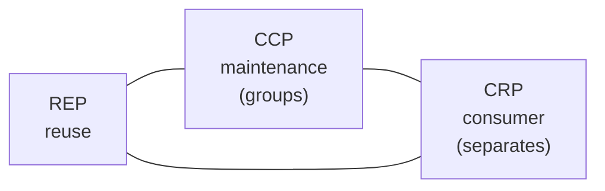

# Package Design

## Overview

A package is the smallest unit that is published and versioned. Package design is
deciding which classes stay together in that unit.

Robert Martin formulated three cohesion principles for that decision. What makes
them interesting is not each one in isolation — it is that **they contradict each
other**, and the tension between them is the real decision.

## Problem

Grouping by convenience produces two pathologies.

**Packages that are too big.** Whoever depends on one class receives the whole
package, with all its transitive dependencies. A change anywhere in it forces a new
version on every consumer.

**Packages that are too small.** Every meaningful change requires publishing five
packages in order, with versions compatible with each other. Coordination becomes
the dominant cost.

Neither extreme is solved by a simple rule, because the principles that avoid one
aggravate the other.

## Core Concepts

### The three cohesion principles

**REP — Release-reuse equivalence.**
> The unit of reuse is the unit of release.

What is reused has to be versioned. Classes that consumers use together should be
published together, with a version number and change notes.

**CCP — Common closure.**
> Classes that change for the same reasons, at the same time, belong in the same
> package.

It is [cohesion](/01-fundamentals/cohesion.md) applied to packages. It minimizes
the number of packages that have to be published because of one change.

**CRP — Common reuse.**
> Classes that are not used together should not be in the same package.

The inverse of the previous one, seen from the consumer: do not force anyone to
depend on what they do not use. It is the **I** of
[SOLID](/02-software-design/solid.md) at package scale.

### The tension

CCP wants to group — fewer packages to publish. CRP wants to separate — less
unnecessary dependency.

Martin describes this as a triangle where you pick two sides. Sacrificing CRP
produces consumers with too many dependencies. Sacrificing CCP produces many
publications per change.

The right position shifts with maturity: **young projects lean towards CCP**
(group, to publish less), **mature projects lean towards CRP** (separate, because
there are more consumers being bothered).

### A package is not a directory

In several languages, package and directory coincide. Where they do not — or where
the directory enforces nothing — what defines the package is the unit of
publication: the artifact, the declared module, the library.

If everything is published together, there is one package, no matter how many
directories exist.

## Mental Model

**A package is what you version.** If two groups of classes need independent
version numbers, they are two packages. If they are always published together, they
are one.

## When to Use

- When the system publishes libraries consumed by other teams.
- When parts need independent release cycles.
- When build time grows and incremental compilation depends on the division.
- When preparing to extract a module into a service.

## When Not to Use

**When everything is published together.** In a monolith with a single artifact,
the release principles do not apply. There the relevant division is
[module](/02-software-design/modular-design.md), not package.

**As a purity goal.** Chasing CRP in a system with two internal consumers produces
fragmentation and coordination with no benefit.

**When the coordination cost exceeds the dependency cost.** If separating produces
five packages that always go up together with matched versions, the separation made
the system worse.

**Before there are real consumers.** The principles are about serving consumers.
Without them, it is speculation — see [YAGNI](/02-software-design/yagni.md).

## Alternatives

- **A single artifact with internal modules** — solves most cases with no
  versioning cost.
- **Monorepo with per-target builds** — logical separation with joint publication.
- **Separation only where there is an external consumer** — publish what crosses
  the organizational boundary and keep the rest internal.

## Trade-offs

| More packages (CRP) | Fewer packages (CCP) |
|---|---|
| Consumer depends only on what it uses | Depends on more than necessary |
| Finer incremental build | Coarser build |
| More publications per change | One publication |
| Coordination of compatible versions | No coordination |
| Larger dependency graph | Simple graph |

## Failure Modes

**Monolithic package.** Everything in one artifact; any change versions everything.

**Version hell.** Too many packages, with compatibility constraints that contradict
each other.

**A `common` package in the zone of pain.** Concrete, stable and depended on by
everything. See
[dependency direction](/02-software-design/dependency-direction.md).

**Cycle between packages.** Prevents build ordering and extraction.

## Common Mistakes

**Applying the principles with no consumers.** They exist to serve whoever
consumes.

**Ignoring the tension between CCP and CRP.** Treating the three as compatible
leads to oscillating between grouping and separating with no criterion.

**Confusing package with directory.** What matters is the unit of publication.

**Creating a package per technical layer.** Reproduces the
[layering](/02-software-design/layering.md) problem at release level.

## Real-World Example

A company published a `platform-common` library used by seven teams. It contained
date utilities, an HTTP client, shared domain types, logging configuration and test
helpers.

Consequences observed over a year: 34 publications, of which 31 were for changes
affecting a single consumer; all seven teams obliged to update on each one; and two
teams that froze the version to stop keeping up — and thereby stopped receiving
fixes.

The CRP-driven division — who uses what, measured by the real imports — produced
four packages: `domain-types` (used by seven), `http` (four), `dates` (two) and
`test` (five, but only in test scope).

After: `domain-types` had 4 publications the following year; `dates`, 11 — which
now affect two teams instead of seven.

What the division cost: four artifacts to maintain, and one more decision per
change. What it bought: the two frozen teams unblocked and went back to keeping up.

## A monorepo does not remove the need for package design

A common confusion: adopting a monorepo is treated as if it eliminated the package
question, since everything is versioned together.

It eliminates the **version coordination** problem — there is never an
incompatibility between two parts of the same commit. It does not eliminate the
other two.

**CCP still holds.** What changes together should stay together, because that
governs build and test scope. In a monorepo with incremental builds, the division
determines what has to be recompiled and rerun on each change — and that is the
difference between a two-minute cycle and a forty-minute one.

**CRP still holds.** A build target that depends on more than it uses recompiles
unnecessarily and widens the blast radius of any breakage.

What the monorepo changes is the cost of the mistake: a bad split is fixable in one
commit, instead of requiring a version migration coordinated across teams. That
allows being more aggressive in the division — and is why monorepos tend to have
more build targets than polyrepos have artifacts.

## Related Concepts

- [Modular Design](/02-software-design/modular-design.md) — the logical division
  that precedes this.
- [Dependency Direction](/02-software-design/dependency-direction.md) — the graph
  between packages.
- [Component Design](/02-software-design/component-design.md) — the deployment
  unit.
- [Cohesion](/01-fundamentals/cohesion.md) — the general principle behind CCP.

## Practical Exercise

If your system publishes libraries, extract for each one: how many consumers it
has, and what fraction of the classes each consumer uses.

Consumers that use less than a third of the package are evidence of a CRP
violation.

Then count last year's publications and how many affected a single consumer.

## Interview Questions

- What are the three component cohesion principles and how do they contradict each
  other?
- How does a project's maturity shift the position between CCP and CRP?
- When do the package principles not apply?

## Further Exploration

- Martin, Robert C. *Clean Architecture*. Prentice Hall, 2017 — component cohesion
  and coupling principles.
- Martin, Robert C. *Agile Software Development*. Prentice Hall, 2002 — the
  original formulation.
