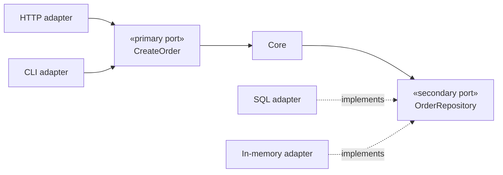

# Ports and Adapters

## Overview

Ports and Adapters, formulated by Alistair Cockburn in 2005, proposes a single
rule:

> The application core knows nothing of the outside world. All communication goes
> through **ports** that the core defines, and **adapters** that the world
> implements.

It is the original formulation. [Hexagonal](/02-software-design/hexagonal-architecture.md) **is not
a variation**: it is the other name for the same pattern, and changing the name changes no rule.
[Onion](/02-software-design/onion-architecture.md) and
[Clean Architecture](/02-software-design/clean-architecture.md), on the other hand, are variations in
fact — they add rings and vocabulary on top of the same direction rule.

## Problem

The problem Cockburn stated is specific: applications get tied to the input channel
and the persistence mechanism, and so cannot be tested or exercised outside them.

The business logic lives inside HTTP controllers and depends on tables. Testing it
requires starting a server and a database. Reusing it through another channel — a
queue, a terminal command — requires duplicating it.

He described that as the symptom that **the inside and the outside were not
separated**.

## Core Concepts

### A port is an interface defined by the core

A port declares a need or a capability, in the domain's vocabulary. It belongs to
the core — see
[dependency inversion](/02-software-design/dependency-inversion.md).

**Primary ports** (or driving ports) are what the world can ask of the core: use
cases.

**Secondary ports** (or driven ports) are what the core needs from the world:
persist, notify, quote.

### An adapter implements the port

An adapter translates between the world's protocol and the port.

Note the direction of the dashed arrows: it is the adapters that point at the port, not the
other way around. That is what distinguishes this drawing from a layered architecture.

Every dependency arrow points at the core. That is the only rule — and it is why the SQL
adapter depends on the port, and not the port on the adapter.

### The symmetry is the point

The hexagon image exists to eliminate the notion of "up" and "down". There is no
upper or lower layer; there is inside and outside.

That matters because in layering the user interface tends to be treated as nobler
than the database. Here, both are equally external, and the core knows neither.

## When to Use

- When the same logic has to be reached through more than one channel.
- When testing the core without infrastructure has real, recurring value.
- When external dependencies are volatile — providers, protocols.
- In domains with substantial logic, where the core justifies being protected.

## When Not to Use

**In mostly CRUD applications.** If the core is "validate and save", the
indirection adds files and protects nothing. The cost is immediate and the benefit
nonexistent.

**When there is one channel and one persistence, and that will remain so.** The
pattern buys substitutability. Without it, it is pure cost.

**When there are fewer than three external dependencies that can change.** It is the same
threshold measured in [Hexagonal](/02-software-design/hexagonal-architecture.md): below it, the
indirection costs about 30% more files to protect a swap that never comes.

**When the ports become mirrors of the infrastructure.** If `OrderRepository` has
`findByStatusIn` and returns the ORM's type, the core stays coupled with extra
ceremony. See [interfaces](/02-software-design/interfaces.md).

**When the team cannot sustain the discipline.** Without an
[architecture test](/01-fundamentals/architecture-vs-implementation.md), the rule
is crossed within months and the system is left with the cost and not the property.

## Alternatives

- **Layers with inversion only at persistence** — captures most of the benefit for a
  fraction of the cost, and it is the right arrangement when the only volatile dependency is
  the database.
- **Adapters only for volatile dependencies** — invert what is unstable and call
  what is stable directly.
- **Transaction script** — in simple domains, a direct procedure is clearer.

## Trade-offs

| Ports and Adapters | Direct access |
|---|---|
| Core testable without infrastructure | Tests carry database and server |
| Multiple channels without duplicating logic | Logic coupled to the channel |
| Provider replaceable | Swapping touches the core |
| Many files per use case | Few files |
| Type translation at every edge | No translation |
| Flow hard to follow end to end | Linear |

## Failure Modes

**Mirror port.** Extracted from the infrastructure, with its vocabulary.

**Type leak.** The port returns the ORM's entity.

**Adapters that know each other.** One adapter calls another directly, bypassing
the core.

**Anemic core.** All the logic in the adapters; the core only defines types.

**Unenforced rule.** Without verification, the core goes back to importing infrastructure —
and the first violation usually arrives before anyone thinks to look for it.

## Common Mistakes

**Applying it to CRUD.** A port, an adapter and a test double for an operation that only
moves fields between the form and the table: the cost is paid in full and there is no rule to
protect.

**Putting the ports next to the adapters.** It cancels the inversion.

**Creating one port per repository method.** Ports express domain needs, not table
operations.

**Thinking the four names are different things.** They share the same thesis.

## Real-World Example

A billing system had to be triggered through three paths: an API for the customer
portal, a queue event for automatic billing, and a terminal command for manual
operation.

Before, the logic lived in the HTTP controller. The queue path duplicated it with
variations; the terminal path called the API over HTTP against its own service.

The reorganization defined `ChargeSubscription` as a primary port, with three
adapters. The logic came to exist once.

The concrete gain was not architectural: a behavioural divergence between the HTTP
path and the queue path — which had already caused two double-charging incidents —
became impossible.

The counterexample, in the same system: the customer registration module, which is
CRUD with validation, stayed as a controller calling a repository. Applying the
pattern there would have tripled the number of files and protected nothing.

## The testing gain, concretely

The most cited benefit of the pattern is "testing without infrastructure", and it
is usually stated vaguely. What changes in practice:

**Speed.** Domain tests with in-memory adapters run in milliseconds. A suite that
took ten minutes with a database comes to take seconds, and the side effect is
behavioural: a fast suite is run on every change; a slow one is run in CI and
ignored locally.

**Determinism.** With no database, no network and no real clock, the test does not
fail for reasons unrelated to the change. Tests that fail for reasons unrelated to the change
stop serving as a merge criterion — and the damage is not being left without a signal, it is
being left with a signal nobody trusts and that still consumes time on every run.

**Difficult scenarios become trivial.** Simulating the payment provider being down,
the call that times out, the duplicate identifier — all of that is one line in an
in-memory adapter, and an infrastructure exercise without the pattern.

The third is the one that pays most and is mentioned least. It is what makes it
viable to test the failure paths, which are exactly the ones that decide
architecture and almost never get exercised.

## Related Concepts

- [Hexagonal](/02-software-design/hexagonal-architecture.md) — the same pattern,
  another name.
- [Onion](/02-software-design/onion-architecture.md) and
  [Clean Architecture](/02-software-design/clean-architecture.md) — the variations.
- [Dependency Inversion](/02-software-design/dependency-inversion.md) — the
  mechanism.

## Practical Exercise

Pick a use case in your system and list everything it touches outside the domain:
database, queue, external service, clock, identifier generator.

For each, write the port the core would define — in the domain's vocabulary, not
the technology's.

Then estimate: how many extra files would that cost, and what would it buy?

## Interview Questions

- What is the difference between a primary and a secondary port?
- Why the hexagon metaphor rather than layers?
- When does this pattern not pay off?

## Further Exploration

- Cockburn, Alistair. *Hexagonal Architecture*, 2005.
- Freeman, Steve; Pryce, Nat. *Growing Object-Oriented Software, Guided by Tests*.
  Addison-Wesley, 2009.
